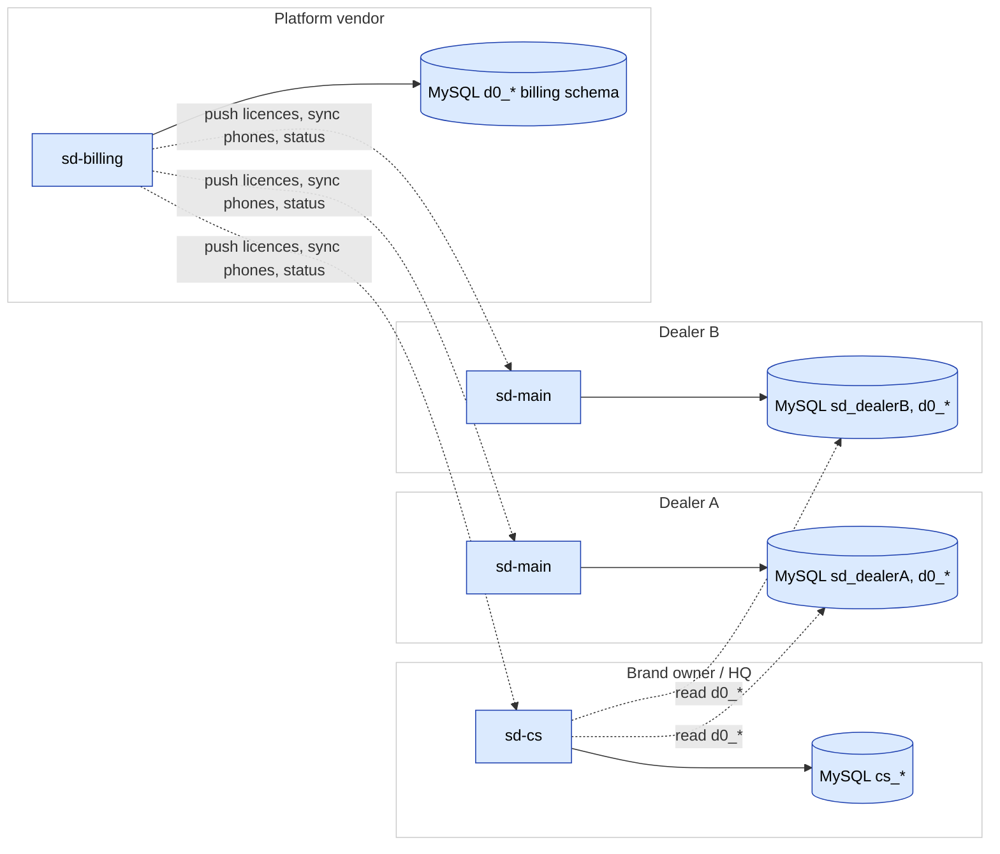
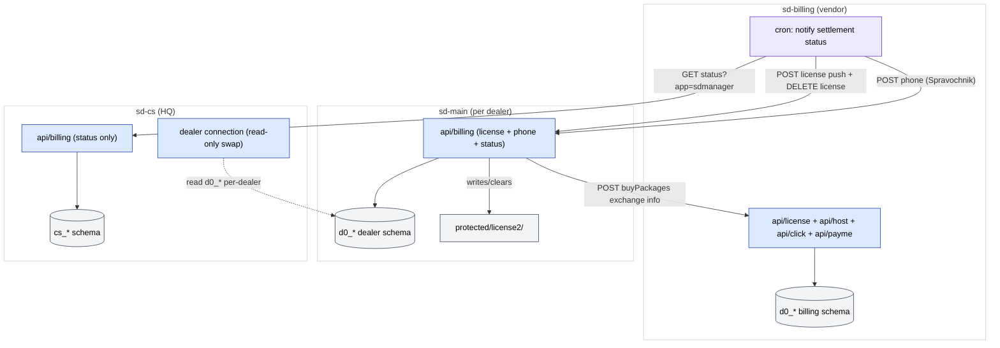

# Экосистема — галерея диаграмм

Карта трёх проектов платформы SalesDoctor. Используйте эти диаграммы, чтобы сориентировать новых сотрудников до погружения в любой отдельный проект.

Все 3 диаграммы группы, отрисованные inline.

## Указатель

| # | Заголовок | Тип | Исходная страница |
|---|-------|------|-------------|
| 01 | [Экосистема SalesDoctor](#d-01) | `flowchart` | [ecosystem](/docs/ecosystem) |
| 02 | [Карта межпроектной интеграции](#d-02) | `flowchart` | [ecosystem](/docs/ecosystem) |
| 03 | [Каталог ключевых фич по проектам](#d-03) | `flowchart` | [ecosystem](/docs/ecosystem) |

## 01. Экосистема SalesDoctor {#d-01}

- **Тип**: `flowchart`
- **Исходная страница**: [ecosystem](/docs/ecosystem)
- **Раздел-источник**: Экосистема SalesDoctor

## 02. Карта межпроектной интеграции {#d-02}

- **Тип**: `flowchart`
- **Исходная страница**: [ecosystem](/docs/ecosystem)
- **Раздел-источник**: Карта межпроектной интеграции

## 03. Каталог ключевых фич по проектам {#d-03}

- **Тип**: `flowchart`
- **Исходная страница**: [ecosystem](/docs/ecosystem)
- **Раздел-источник**: Каталог ключевых фич по проектам

```mermaid
flowchart TB
  subgraph SDMain["sd-main · Dealer CRM"]
    direction TB
    M_ORD["Orders (web + mobile + B2B online)"]
    M_AGT["Agents · routes · KPI · vehicles"]
    M_CLI["Clients · contracts · segments · debt"]
    M_WHS["Warehouse · stock · inventory · transfers"]
    M_PAY["Payments · cashier approval · cashbox"]
    M_AUD["Audits · facing · photo reports"]
    M_GPS["GPS tracking · geofence · trip playback"]
    M_INT["Integrations 1C · Didox · Faktura.uz · Smartup"]
    M_RPT["80+ reports · Excel export · pivots"]
    M_OO["B2B online store · Telegram bot · WebApp"]
  end

  subgraph SDCs["sd-cs · HQ Country Sales"]
    direction TB
    CS_RPT["Consolidated reports across all dealers"]
    CS_PIV["Pivots · RFM · SKU · expeditor"]
    CS_DIR["HQ directory · brands · segments · plans"]
    CS_MDB["Multi-DB read of dealer DBs (read-only)"]
  end

  subgraph SDBilling["sd-billing · Subscriptions and licensing"]
    direction TB
    B_SUB["Subscriptions · packages · tariffs · bonus"]
    B_LIC["Licence files · feature gating per system"]
    B_PAY["Click · Payme · Paynet · MBANK · P2P · cash"]
    B_SET["Daily settlement distributor / dealer"]
    B_NOT["Telegram + SMS notifications · expiry reminders"]
    B_PRT["Partner portal · self-service"]
  end

  classDef action fill:#dbeafe,stroke:#1e40af,color:#000
  class M_ORD,M_AGT,M_CLI,M_WHS,M_PAY,M_AUD,M_GPS,M_INT,M_RPT,M_OO action
  class CS_RPT,CS_PIV,CS_DIR,CS_MDB action
  class B_SUB,B_LIC,B_PAY,B_SET,B_NOT,B_PRT action

  style SDMain fill:#ffffff,stroke:#cccccc
  style SDCs fill:#ffffff,stroke:#cccccc
  style SDBilling fill:#ffffff,stroke:#cccccc
```

