# sd-cs (HQ) — галерея диаграмм

Приложение головного офиса, читающее из множества баз дилеров, чтобы строить консолидированные отчёты.

Все 11 диаграмм группы, отрисованные inline.

## Указатель

| # | Заголовок | Тип | Исходная страница |
|---|-------|------|-------------|
| 01 | [Карта Two-DB соединений](#d-01) | `flowchart` | [sd-cs/architecture](/docs/sd-cs/architecture) |
| 02 | [Кросс-DB связи (filial bridge)](#d-02) | `er` | [sd-cs/architecture](/docs/sd-cs/architecture) |
| 03 | [Multi-tenant раскладка внутри `b_demo`](#d-03) | `flowchart` | [sd-cs/architecture](/docs/sd-cs/architecture) |
| 04 | [`setFilial()` rewriting таблиц](#d-04) | `flowchart` | [sd-cs/architecture](/docs/sd-cs/architecture) |
| 05 | [Login → filial scoping → query](#d-05) | `sequence` | [sd-cs/architecture](/docs/sd-cs/architecture) |
| 06 | [Модуль → матрица соединений](#d-06) | `flowchart` | [sd-cs/architecture](/docs/sd-cs/architecture) |
| 07 | [Архитектура (диаграмма)](#d-07) | `flowchart` | [sd-cs/overview](/docs/sd-cs/overview) |
| 08 | [Онбординг нового дилера](#d-08) | `flowchart` | [sd-cs/sd-main-integration](/docs/sd-cs/sd-main-integration) |
| 09 | [Воркфлоу](#d-09) | `sequence` | [sd-cs/workflows/report-inventory](/docs/sd-cs/workflows/report-inventory) |
| 10 | [Воркфлоу](#d-10) | `sequence` | [sd-cs/workflows/report-sale](/docs/sd-cs/workflows/report-sale) |
| 11 | [Воркфлоу](#d-11) | `sequence` | [sd-cs/workflows/pivot-akb](/docs/sd-cs/workflows/pivot-akb) |

## 01. Карта Two-DB соединений {#d-01}

- **Тип**: `flowchart`
- **Исходная страница**: [sd-cs/architecture](/docs/sd-cs/architecture)
- **Раздел-источник**: Карта Two-DB соединений

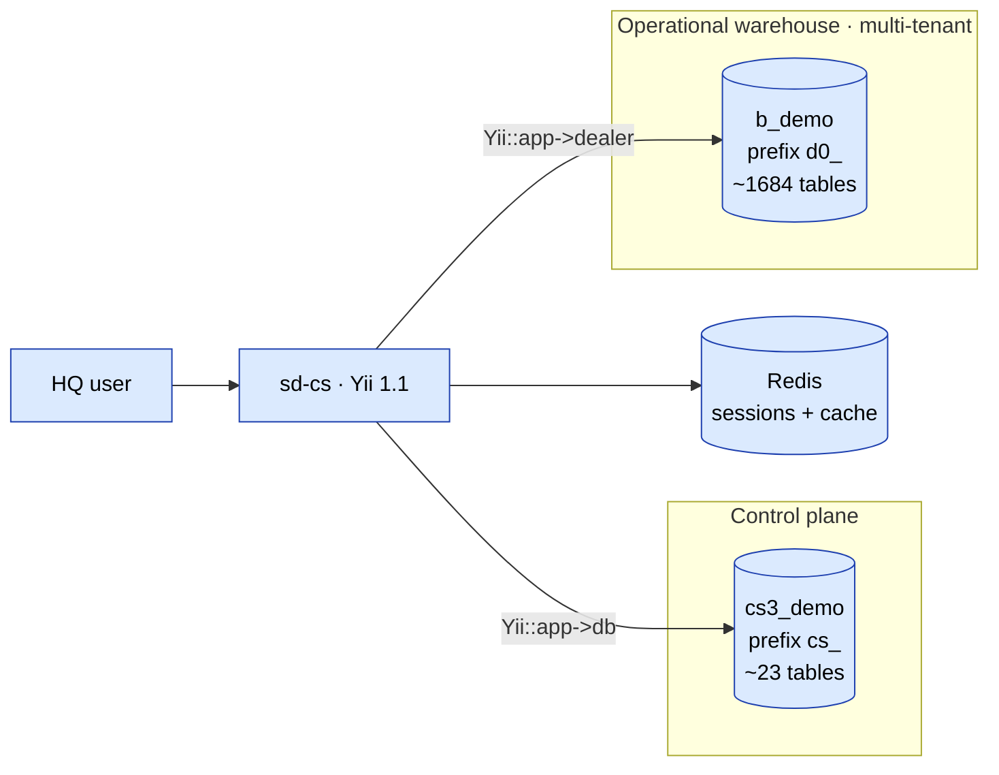

## 02. Кросс-DB связи (filial bridge) {#d-02}

- **Тип**: `er`
- **Исходная страница**: [sd-cs/architecture](/docs/sd-cs/architecture)
- **Раздел-источник**: Кросс-DB связи (filial bridge)

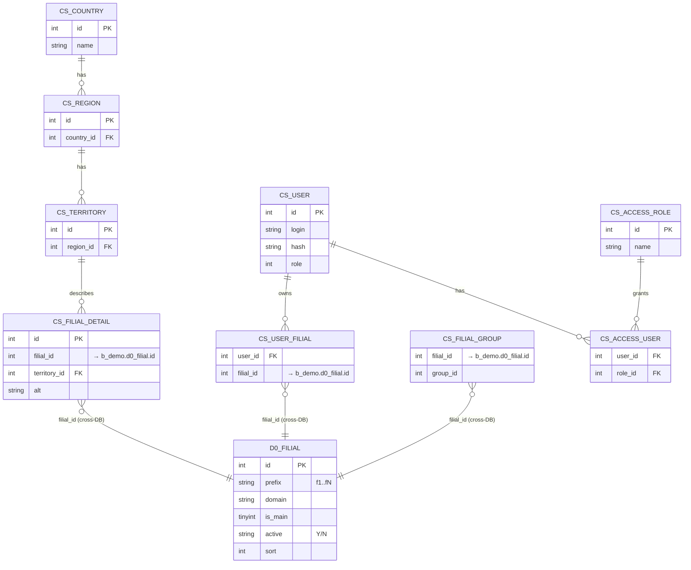

## 03. Multi-tenant раскладка внутри `b_demo` {#d-03}

- **Тип**: `flowchart`
- **Исходная страница**: [sd-cs/architecture](/docs/sd-cs/architecture)
- **Раздел-источник**: Multi-tenant раскладка внутри `b_demo`

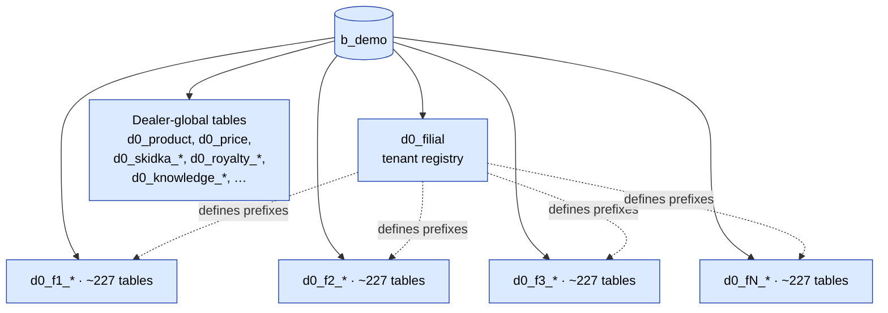

## 04. `setFilial()` rewriting таблиц {#d-04}

- **Тип**: `flowchart`
- **Исходная страница**: [sd-cs/architecture](/docs/sd-cs/architecture)
- **Раздел-источник**: `setFilial()` rewriting таблиц

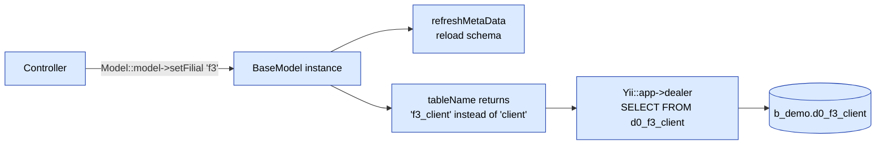

## 05. Login → filial scoping → query {#d-05}

- **Тип**: `sequence`
- **Исходная страница**: [sd-cs/architecture](/docs/sd-cs/architecture)
- **Раздел-источник**: Login → filial scoping → query

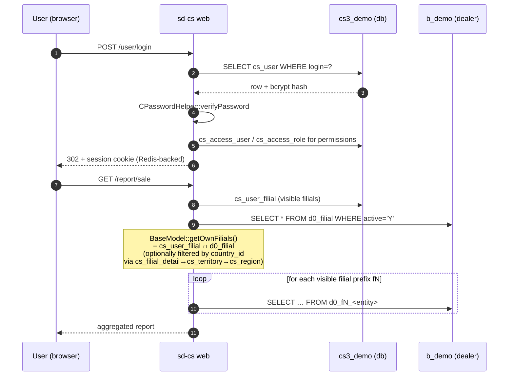

## 06. Модуль → матрица соединений {#d-06}

- **Тип**: `flowchart`
- **Исходная страница**: [sd-cs/architecture](/docs/sd-cs/architecture)
- **Раздел-источник**: Модуль → матрица соединений

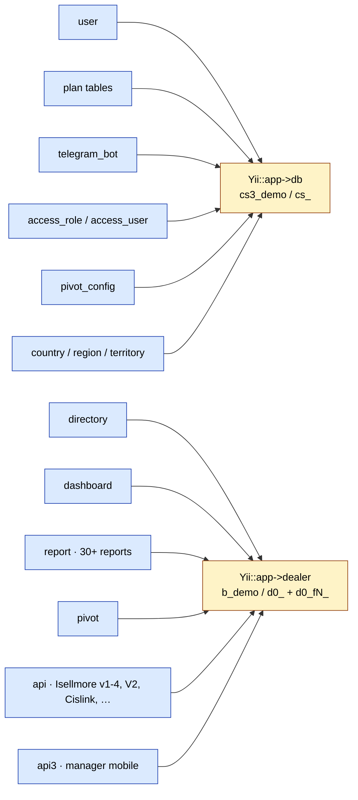

## 07. Архитектура (диаграмма) {#d-07}

- **Тип**: `flowchart`
- **Исходная страница**: [sd-cs/overview](/docs/sd-cs/overview)
- **Раздел-источник**: Архитектура (диаграмма)

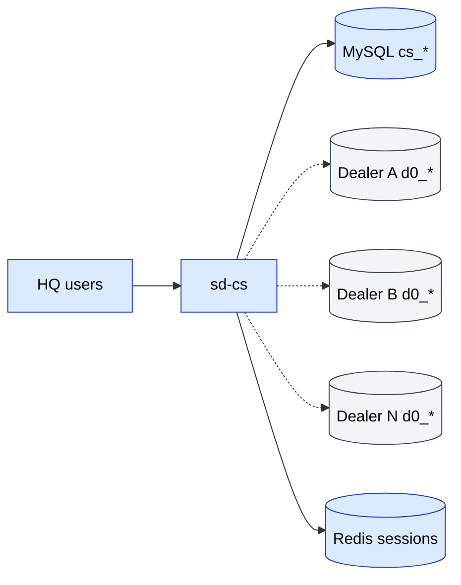

## 08. Онбординг нового дилера {#d-08}

- **Тип**: `flowchart`
- **Исходная страница**: [sd-cs/sd-main-integration](/docs/sd-cs/sd-main-integration)
- **Раздел-источник**: Онбординг нового дилера

```mermaid
flowchart LR
  A(["New dealer signs contract"]) --> B["sd-billing creates Diler row"]
  B --> C["sd-billing pushes licence file"]
  C --> D["Dealer's sd-main is provisioned"]
  D --> E["Dealer DB credentials registered in HQ"]
  E --> F["DealerRegistry row inserted in cs_*"]
  F --> G["Test report against new dealer"]
  G --> H["Capability flags filled in registry"]
  H --> I(["Dealer included in default HQ reports"])

  class A action
  class B,C,D,E,F,G,H action
  class I success
  classDef action   fill:#dbeafe,stroke:#1e40af,color:#000
  classDef approval fill:#fef3c7,stroke:#92400e,color:#000
  classDef success  fill:#dcfce7,stroke:#166534,color:#000
  classDef reject   fill:#fee2e2,stroke:#991b1b,color:#000
  classDef external fill:#f3f4f6,stroke:#374151,color:#000
  classDef cron     fill:#ede9fe,stroke:#6d28d9,color:#000
```

## 09. Воркфлоу {#d-09}

- **Тип**: `sequence`
- **Исходная страница**: [sd-cs/workflows/report-inventory](/docs/sd-cs/workflows/report-inventory)
- **Раздел-источник**: Воркфлоу

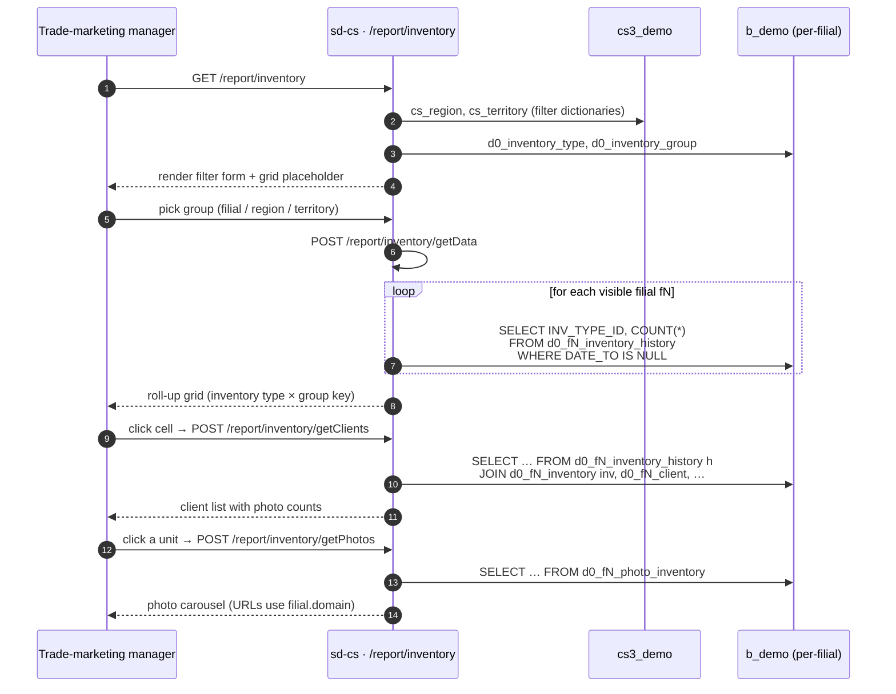

## 10. Воркфлоу {#d-10}

- **Тип**: `sequence`
- **Исходная страница**: [sd-cs/workflows/report-sale](/docs/sd-cs/workflows/report-sale)
- **Раздел-источник**: Воркфлоу

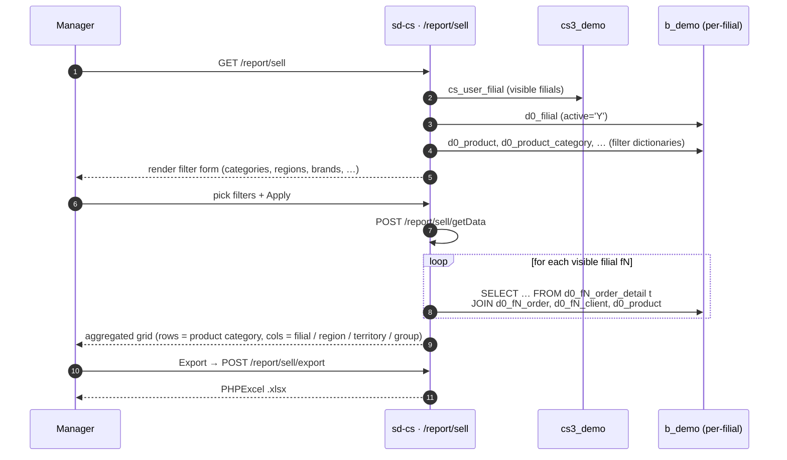

## 11. Воркфлоу {#d-11}

- **Тип**: `sequence`
- **Исходная страница**: [sd-cs/workflows/pivot-akb](/docs/sd-cs/workflows/pivot-akb)
- **Раздел-источник**: Воркфлоу

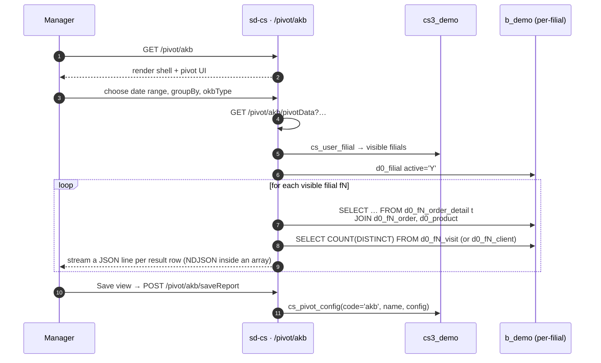

