# sd-main · Потоки фич — галерея диаграмм

Потоки фич по модулям для повседневных операций в sd-main.

Все 16 диаграмм группы, отрисованные inline.

## Указатель

| # | Заголовок | Тип | Исходная страница |
|---|-------|------|-------------|
| 01 | [Воркфлоу одобрения](#d-01) | `flowchart` | [modules/clients](/docs/modules/clients) |
| 02 | [Поток ключевой фичи — выгрузка заказа](#d-02) | `flowchart` | [modules/integration](/docs/modules/integration) |
| 03 | [Поток ключевой фичи — запуск отчёта](#d-03) | `flowchart` | [modules/report](/docs/modules/report) |
| 04 | [Поток одобрения](#d-04) | `flowchart` | [modules/payment](/docs/modules/payment) |
| 05 | [Поток ключевой фичи — отправка SMS](#d-05) | `sequence` | [modules/sms](/docs/modules/sms) |
| 06 | [Поток ключевой фичи — инвентаризация](#d-06) | `flowchart` | [modules/inventory](/docs/modules/inventory) |
| 07 | [Поток ключевой фичи — отправка результата](#d-07) | `flowchart` | [modules/audit-adt](/docs/modules/audit-adt) |
| 08 | [Доменные сущности](#d-08) | `er` | [modules/audit-adt](/docs/modules/audit-adt) |
| 09 | [Воркфлоу 1.1 — захват и ревью фотоотчёта](#d-09) | `sequence` | [modules/audit-adt](/docs/modules/audit-adt) |
| 10 | [Воркфлоу 1.2 — проверка соответствия Storecheck (MML)](#d-10) | `flowchart` | [modules/audit-adt](/docs/modules/audit-adt) |
| 11 | [Поток ключевой фичи — приёмка товара](#d-11) | `flowchart` | [modules/warehouse](/docs/modules/warehouse) |
| 12 | [Поток ключевой фичи — онлайн-заказ](#d-12) | `flowchart` | [modules/onlineOrder](/docs/modules/onlineOrder) |
| 13 | [Машина состояний](#d-13) | `state` | [modules/orders](/docs/modules/orders) |
| 14 | [Поток ключевой фичи — создание заказа](#d-14) | `sequence` | [modules/orders](/docs/modules/orders) |
| 15 | [Поток ключевой фичи — Visit & GPS](#d-15) | `flowchart` | [modules/agents](/docs/modules/agents) |
| 16 | [Поток ключевой фичи — дефект и возврат](#d-16) | `flowchart` | [modules/stock](/docs/modules/stock) |

## 01. Воркфлоу одобрения {#d-01}

- **Тип**: `flowchart`
- **Исходная страница**: [modules/clients](/docs/modules/clients)
- **Раздел-источник**: Воркфлоу одобрения

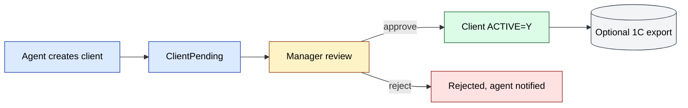

## 02. Поток ключевой фичи — выгрузка заказа {#d-02}

- **Тип**: `flowchart`
- **Исходная страница**: [modules/integration](/docs/modules/integration)
- **Раздел-источник**: Поток ключевой фичи — выгрузка заказа

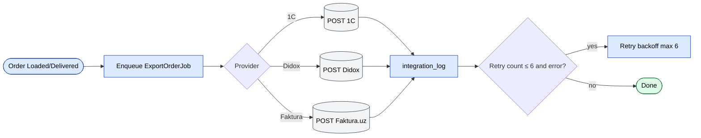

## 03. Поток ключевой фичи — запуск отчёта {#d-03}

- **Тип**: `flowchart`
- **Исходная страница**: [modules/report](/docs/modules/report)
- **Раздел-источник**: Поток ключевой фичи — запуск отчёта

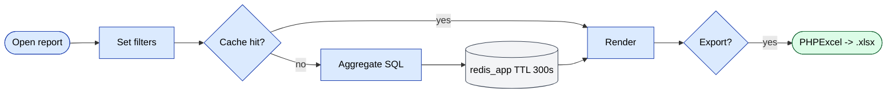

## 04. Поток одобрения {#d-04}

- **Тип**: `flowchart`
- **Исходная страница**: [modules/payment](/docs/modules/payment)
- **Раздел-источник**: Поток одобрения

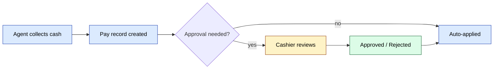

## 05. Поток ключевой фичи — отправка SMS {#d-05}

- **Тип**: `sequence`
- **Исходная страница**: [modules/sms](/docs/modules/sms)
- **Раздел-источник**: Поток ключевой фичи — отправка SMS

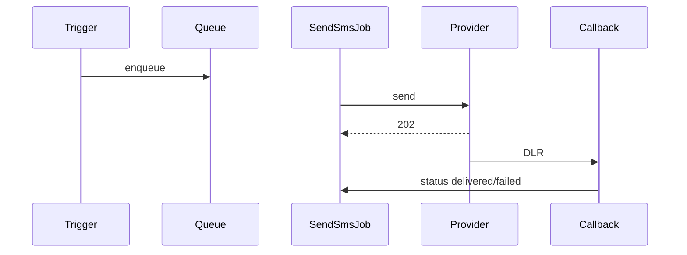

## 06. Поток ключевой фичи — инвентаризация {#d-06}

- **Тип**: `flowchart`
- **Исходная страница**: [modules/inventory](/docs/modules/inventory)
- **Раздел-источник**: Поток ключевой фичи — инвентаризация

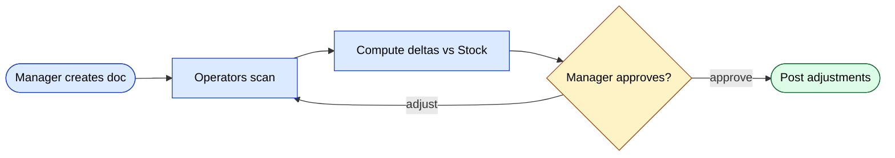

## 07. Поток ключевой фичи — отправка результата {#d-07}

- **Тип**: `flowchart`
- **Исходная страница**: [modules/audit-adt](/docs/modules/audit-adt)
- **Раздел-источник**: Поток ключевой фичи — отправка результата

```mermaid
flowchart LR
  V(["At client"]) --> Q["Answer poll"]
  Q --> F["Mark facing"]
  F --> P["Photos"]
  P --> SUB["POST /api3/auditor/index"]
  SUB --> AR["AuditResult rows"]
  AR --> RV["Supervisor review"]
  RV --> KPI(["Compliance KPI"])

  classDef action   fill:#dbeafe,stroke:#1e40af,color:#000
  classDef approval fill:#fef3c7,stroke:#92400e,color:#000
  classDef success  fill:#dcfce7,stroke:#166534,color:#000
  classDef reject   fill:#fee2e2,stroke:#991b1b,color:#000
  classDef external fill:#f3f4f6,stroke:#374151,color:#000
  classDef cron     fill:#ede9fe,stroke:#6d28d9,color:#000

  class V,Q,F,P,SUB,AR action
  class RV approval
  class KPI success
```

## 08. Доменные сущности {#d-08}

- **Тип**: `er`
- **Исходная страница**: [modules/audit-adt](/docs/modules/audit-adt)
- **Раздел-источник**: Доменные сущности

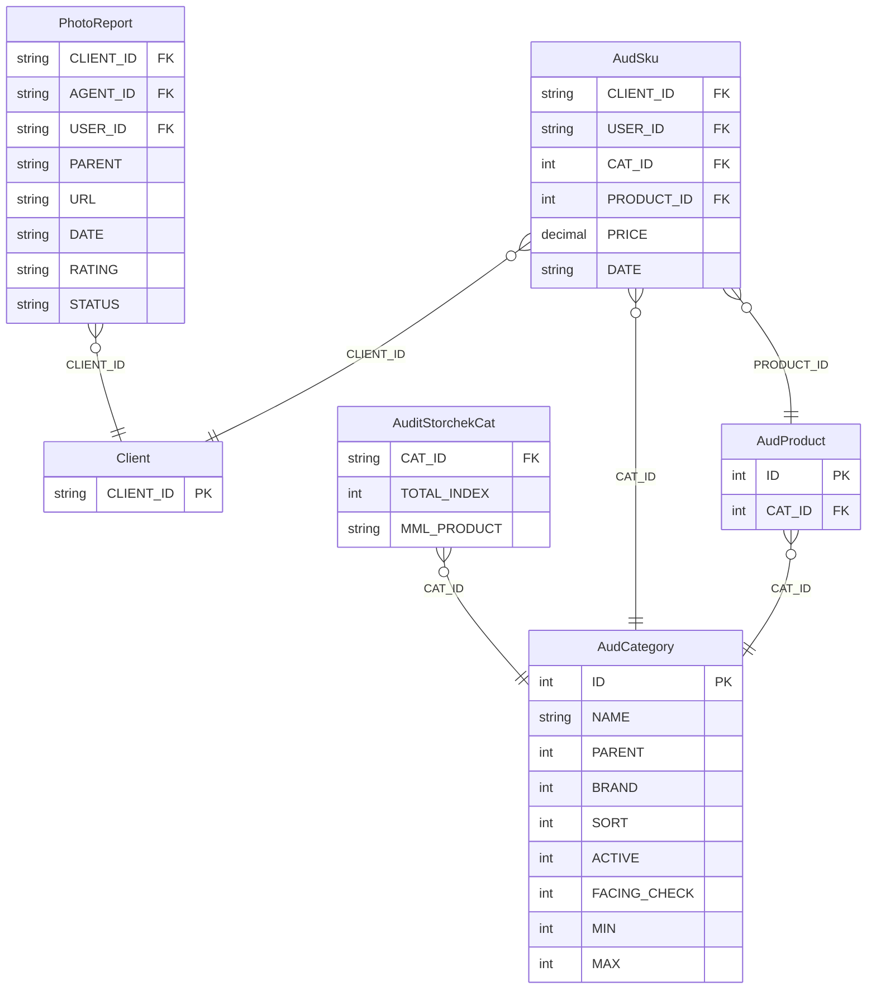

## 09. Воркфлоу 1.1 — захват и ревью фотоотчёта {#d-09}

- **Тип**: `sequence`
- **Исходная страница**: [modules/audit-adt](/docs/modules/audit-adt)
- **Раздел-источник**: Воркфлоу 1.1 — захват и ревью фотоотчёта

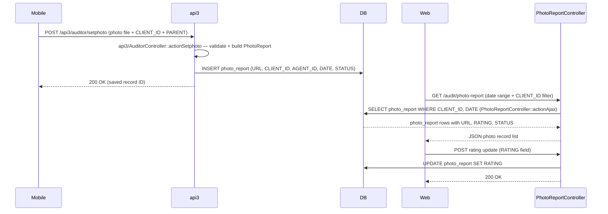

## 10. Воркфлоу 1.2 — проверка соответствия Storecheck (MML) {#d-10}

- **Тип**: `flowchart`
- **Исходная страница**: [modules/audit-adt](/docs/modules/audit-adt)
- **Раздел-источник**: Воркфлоу 1.2 — проверка соответствия Storecheck (MML)

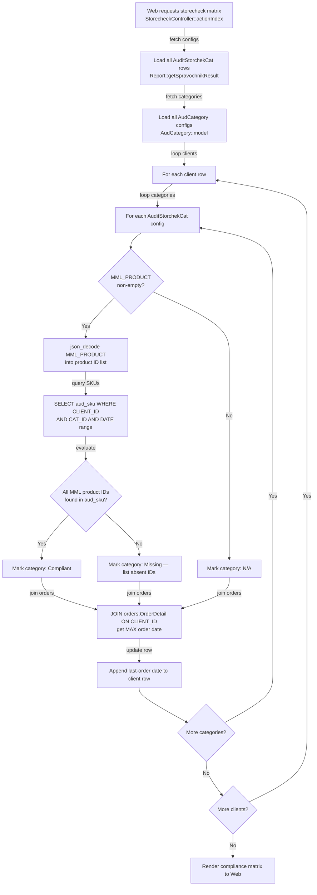

## 11. Поток ключевой фичи — приёмка товара {#d-11}

- **Тип**: `flowchart`
- **Исходная страница**: [modules/warehouse](/docs/modules/warehouse)
- **Раздел-источник**: Поток ключевой фичи — приёмка товара

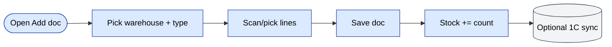

## 12. Поток ключевой фичи — онлайн-заказ {#d-12}

- **Тип**: `flowchart`
- **Исходная страница**: [modules/onlineOrder](/docs/modules/onlineOrder)
- **Раздел-источник**: Поток ключевой фичи — онлайн-заказ

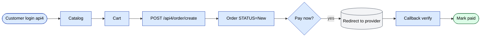

## 13. Машина состояний {#d-13}

- **Тип**: `state`
- **Исходная страница**: [modules/orders](/docs/modules/orders)
- **Раздел-источник**: Машина состояний

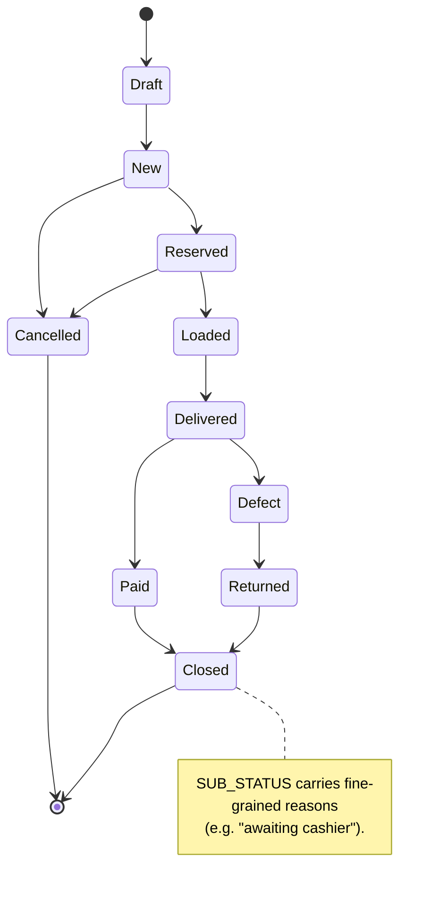

## 14. Поток ключевой фичи — создание заказа {#d-14}

- **Тип**: `sequence`
- **Исходная страница**: [modules/orders](/docs/modules/orders)
- **Раздел-источник**: Поток ключевой фичи — создание заказа

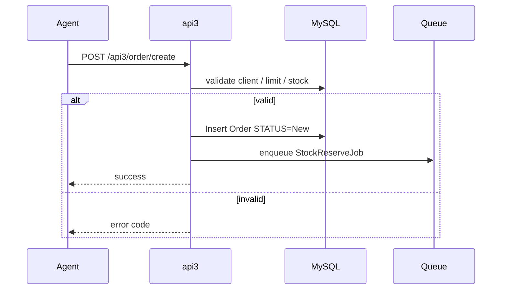

## 15. Поток ключевой фичи — Visit & GPS {#d-15}

- **Тип**: `flowchart`
- **Исходная страница**: [modules/agents](/docs/modules/agents)
- **Раздел-источник**: Поток ключевой фичи — Visit & GPS

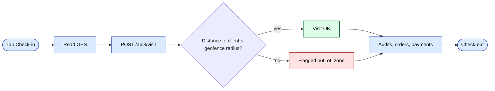

## 16. Поток ключевой фичи — дефект и возврат {#d-16}

- **Тип**: `flowchart`
- **Исходная страница**: [modules/stock](/docs/modules/stock)
- **Раздел-источник**: Поток ключевой фичи — дефект и возврат

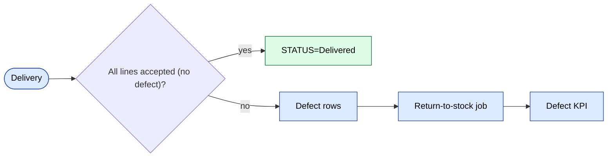

