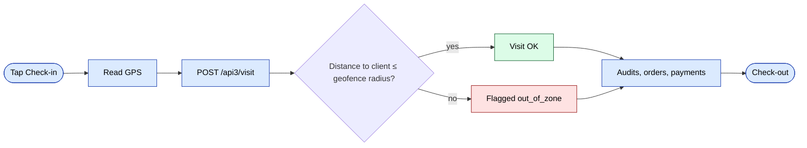
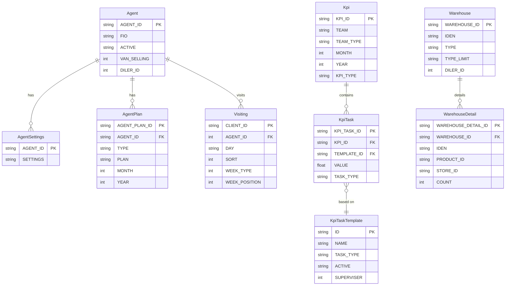
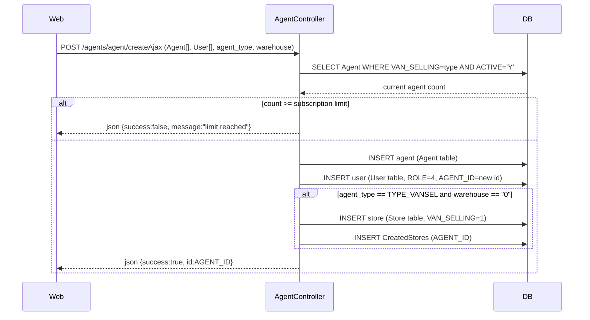
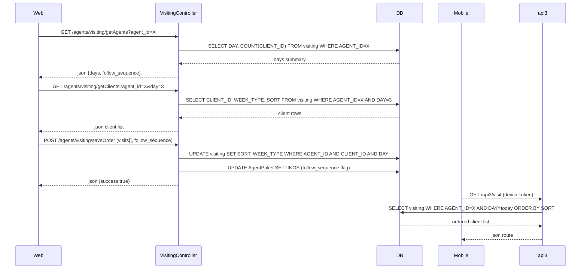
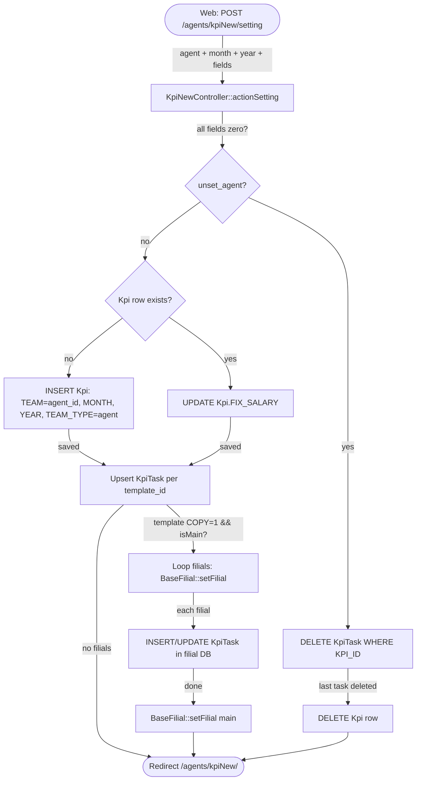
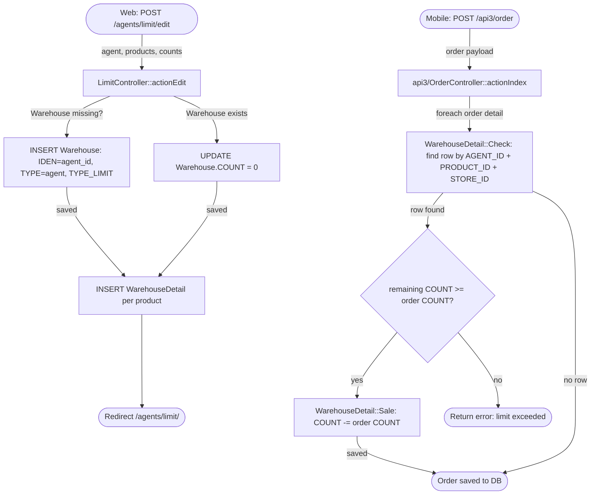

# Модуль `agents`

Торговые агенты (полевая команда) плюс их планы, KPI, транспорт и
лимиты. Web-админ управляет тем, как структурирована полевая команда;
сами агенты работают из мобильного приложения через api3.

## Ключевые возможности

| Возможность | Что делает | Роль(и) владельца |
|---------|--------------|---------------|
| CRUD агента | Создание / редактирование / деактивация агентов | 1 / 2 / 9 |
| Настройки агента | Переключатели по агенту (сбор наличных, лимиты скидок и т. д.) | 1 / 9 |
| Месячный план | Целевые объёмы / количества за период | 1 / 9 |
| KPI v1 / v2 | Отчёты план-факт по агентам | 8 / 9 |
| Кредитный лимит | Максимальный долг, который агент может принять по заказу | 1 / 9 |
| Лимит скидки | Максимальная скидка, которую агент может применить | 1 / 9 |
| Назначение транспорта | Каждый агент привязан к `Car` | 1 / 9 |
| Пакеты / бандлы | Предопределённые бандлы товаров, которые агенты могут продавать | 1 / 9 |
| Назначение маршрутов | Маршруты по дням недели, привязанные к клиентам | 8 / 9 |

## Папка

```
protected/modules/agents/
├── controllers/
│   ├── AgentController.php
│   ├── CarController.php
│   ├── KpiController.php
│   ├── KpiNewController.php   # v2 — prefer for new screens
│   └── LimitController.php
└── views/
```

## Ключевые сущности

| Сущность | Модель |
|--------|-------|
| Агент | `Agent` |
| Настройки агента | `AgentSettings` |
| План агента | `AgentPlan` |
| Пакет агента | `AgentPaket` |
| Транспорт | `Car` |
| KPI | различные модели `Kpi*` |

## Планы и KPI

Планы агентов управляются помесячно. `KpiController` отчитывается о фактических
числах в сравнении с планом; `KpiNewController` — переписанная версия, в новых проектах
следует предпочесть её.

## Лимиты

`LimitController` обеспечивает соблюдение кредитных лимитов и лимитов скидок. Лимиты
проверяются **при создании заказа** и **при утверждении**. Агент, который
превышает любой из лимитов, переводит заказ в состояние утверждения менеджером.

## Мобильный (api3)

Мобильное приложение агента вызывает api3:

- [`POST /api3/login/index`](../api/api-v3-mobile.md#login)
- [`POST /api3/visit/index`](../api/api-v3-mobile.md#visits)
- `GET /api3/agent/route` — клиенты на сегодня
- `GET /api3/kpi/index` — собственная плитка KPI агента

## Ключевой поток функционала — визит и GPS

См. **Feature · Visit & GPS geofence** в
[FigJam · sd-main · Feature Flows](https://www.figma.com/board/MyvyaeEluqvHofH4E2qIoU).



## Права доступа

| Действие | Роли |
|--------|-------|
| Создание / редактирование | 1 / 2 / 9 |
| Просмотр KPI | 1 / 2 / 8 / 9 (только собственный для 4) |
| Установка лимитов | 1 / 2 / 9 |

## Воркфлоу

### Точки входа

| Триггер | Контроллер / Действие / Задача | Замечания |
|---|---|---|
| Web (admin) | `AgentController::actionCreateAjax` | Создаёт `Agent` + связанного `User` (роль 4); проверяет лимиты подписки |
| Web (admin) | `AgentController::actionUpdateAjax` | Обновляет профиль агента и учётные данные `User` |
| Web (admin) | `LimitController::actionEdit` | Сохраняет лимиты на количество товара в `Warehouse` / `WarehouseDetail` |
| Web (admin) | `LimitController::actionChangeType` | Переключает `TYPE_LIMIT` лимита (дневной / месячный / 30-дневный) |
| Web (admin) | `VisitingController::actionSaveOrder` | Сохраняет порядок маршрута по дням недели для агента в `Visiting` |
| Web (admin) | `KpiNewController::actionSetting` | Создаёт или обновляет записи `Kpi` + `KpiTask` за период |
| Web (admin) | `KpiNewController::actionTemplate` | Создаёт или обновляет `KpiTaskTemplate` (опционально с репликацией в филиалы) |
| Mobile (api3) | `api3/KpiController::actionIndex` | Возвращает данные плитки KPI текущего месяца в мобильное приложение |
| Mobile (api3) | `api3/VisitController` | Возвращает маршрут клиентов на сегодня через строки `Visiting` |

---

### Доменные сущности



---

### Воркфлоу 1.1 — Создание агента с проверкой подписки

Когда админ создаёт нового агента, `AgentController::actionCreateAjax` проверяет лимит подписки арендатора для типа агента (полевой, van-selling или продавец) перед сохранением `Agent` и связанного с ним аккаунта `User`. Van-selling агенты также получают выделенный склад, создаваемый или прикрепляемый на этом этапе.



---

### Воркфлоу 1.2 — Назначение маршрута по дням недели

Админ назначает клиентов на маршрут агента по дням недели через `VisitingController`. Контроллер читает существующие строки `Visiting`, сгруппированные по дню, позволяет drag-and-drop переупорядочивание и сбрасывает значения `SORT` и `WEEK_TYPE` обратно в БД. Мобильное приложение впоследствии читает клиентов на сегодня через `api3/VisitController`.



---

### Воркфлоу 1.3 — Назначение месячного плана KPI v2

Каждый месяц админ выбирает агентов, период (месяц/год) и целевые значения по `KpiTaskTemplate`. `KpiNewController::actionSetting` создаёт одну строку `Kpi` на агент-период (или переиспользует существующую) и upsert-ит дочерние строки `KpiTask`. Если у аккаунта есть филиалы, и шаблон помечен для кросс-филиальной копии, контроллер итерирует по каждому префиксу филиала и сохраняет зеркальную запись перед возвратом в основную БД.



---

### Воркфлоу 1.4 — Применение лимита по количеству продукта при оформлении заказа

Админ определяет, сколько единиц каждого продукта агент может продать за период через `LimitController`. Тип лимита (дневной `"1"`, месячный `"2"` или скользящий 30-дневный `"3"`) хранится в `Warehouse.TYPE_LIMIT`. Когда мобильное приложение синхронизирует заказ, `api3/OrderController` вызывает `WarehouseDetail::Sale`, который уменьшает оставшийся счётчик для соответствующей строки `(AGENT_ID, PRODUCT_ID, STORE_ID)`. Если счётчик уйдёт в минус, продажа блокируется.



---

### Межмодульные точки соприкосновения

- Чтения: `planning.Planning` (месячные итоги агента, потребляемые `api3/KpiController::version2`)
- Чтения: `orders.Order` / `orders.OrderDetail` (сравнение план-факт при расчёте KPI)
- Записи: `warehouse.Warehouse` / `warehouse.WarehouseDetail` (бакеты лимитов, записываемые `LimitController`)
- Записи: `users.User` (запись пользователя роли 4, создаваемая/обновляемая вместе с каждым сохранением `Agent` в `AgentController`)
- API: `api3/kpi/index` — собственная месячная плитка KPI агента
- API: `api3/visit/*` — упорядоченный маршрут клиентов на сегодня, построенный из строк `Visiting`

---

### Подводные камни

- `AgentController::actionIndex` сразу делает редирект на `/staff/view/agent`; список агентов рендерится модулем `staff`, а не здесь.
- `KpiNewController` хранит команду как простую строку, разделённую запятыми, в `Kpi.TEAM`, а не как join-таблицу с внешним ключом, поэтому массовые удаления требуют логики сопоставления строк.
- Значения `Warehouse.TYPE_LIMIT` `"1"`, `"2"`, `"3"` — это сбрасываемые отображаемые метки ("За день", "За месяц", "За 30 дней") без enum-защиты; передача неизвестного значения молча сохранит его без ошибки.
- `AgentPaket.SETTINGS` — это большой JSON-блоб (до 100 000 символов согласно правилам), который содержит и конфиг `follow_sequence` маршрута, и другие переключатели уровня приложения; правки с разных экранов перетирают друг друга, если не делать read-modify-write всего блоба.
- `KpiTaskTemplate` мягко удаляется через установку `ACTIVE = "N"` (`KpiNewController::actionDelete`); код жёсткого удаления закомментирован, поэтому могут накапливаться сиротские строки `KpiTask`.
