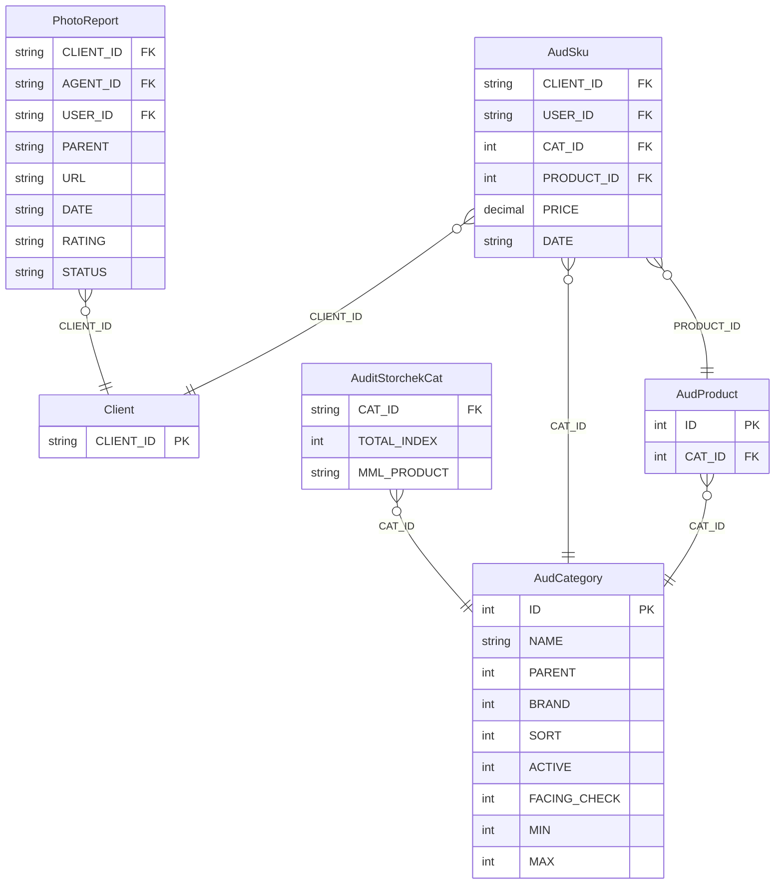
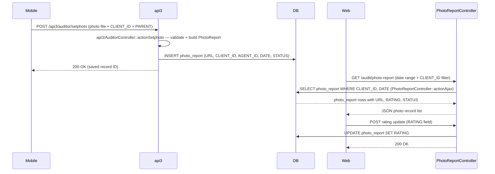
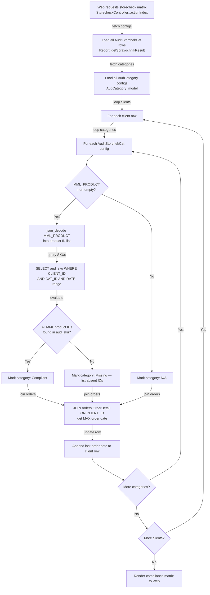

# Модули `audit` и `adt`

Мерчандайзинг и трейд-маркетинг. Агенты и выделенные аудиторы проводят
структурированные опросы в точках клиентов.

| Модуль | Назначение |
|--------|---------|
| `audit` | Стандартные аудиты, опросы, фотоотчёты, фейсинг |
| `adt` | Расширенный набор инструментов аудита (настраиваемые опросы, бренд / сегмент) |

## Ключевые возможности

| Возможность | Что делает | Роль(и) владельца |
|---------|--------------|---------------|
| Определение формы аудита | Построение опроса: вопросы, варианты, продукты для фейсинга | 1 / 9 |
| Назначение точкам / сегментам | Таргетирование аудита на конкретных клиентов | 1 / 9 |
| Запуск аудита (мобильный) | Агент отвечает на опрос, отмечает фейсинг, делает фото | Агент |
| Фотоотчёт | Только фото-аудит (легче полного опроса) | Агент |
| Фейсинг по SKU | Отслеживание выкладки на полке для каждого SKU | Агент |
| Скоринг соответствия | Авто-скоринг по точке из ответов опроса | system |
| Проверка супервайзером | Дашборд показывает точки с низким соответствием | Супервайзер / Менеджер |
| ADT — свойства / бренды / сегменты | Многомерная аналитика данных аудита | 1 / 9 |
| ADT — настраиваемые отчёты | Параметризованная библиотека отчётов поверх данных аудита | 1 / 9 |

## Контроллеры модуля audit

`AuditController`, `AuditorController`, `AuditsController`,
`DashboardController`, `FacingController`, `PhotoReportController`,
`PollController`, `PollResultController`.

## Модель данных аудита

| Сущность | Модель |
|--------|-------|
| Аудит | `Audit` |
| Результат аудита | `AuditResult` |
| Вопрос опроса | `AuditPollQuestion` |
| Вариант опроса | `AuditPollVariant` |
| Результат опроса | `AuditPollResult`, `AuditPollResultData` |
| Фейсинг | `AFacing` |
| Фотоотчёт | `PhotoReport` |

## ADT (расширенный)

`adt` поддерживает настраиваемые опросы (`AdtPoll`, `AdtPollQuestion`,
`AdtPollResult`), измерения свойств (`AdtProperty1`, `AdtProperty2`),
группировку по брендам и сегментам и параметризованные отчёты (`AdtReports`).

Вкладка "audit" в мобильном приложении вызывает api3-эндпоинты, которые
проксируют в эти модели.

## Ключевой поток функционала — отправка

См. **Feature · Audit submission** в
[FigJam · sd-main · Feature Flows](https://www.figma.com/board/MyvyaeEluqvHofH4E2qIoU).

```mermaid
flowchart LR
  V(["At client"]) --> Q["Answer poll"]
  Q --> F["Mark facing"]
  F --> P["Photos"]
  P --> SUB["POST /api3/auditor/index"]
  SUB --> AR["AuditResult rows"]
  AR --> RV["Supervisor review"]
  RV --> KPI(["Compliance KPI"])

  classDef action   fill:#dbeafe,stroke:#1e40af,color:#000
  classDef approval fill:#fef3c7,stroke:#92400e,color:#000
  classDef success  fill:#dcfce7,stroke:#166534,color:#000
  classDef reject   fill:#fee2e2,stroke:#991b1b,color:#000
  classDef external fill:#f3f4f6,stroke:#374151,color:#000
  classDef cron     fill:#ede9fe,stroke:#6d28d9,color:#000

  class V,Q,F,P,SUB,AR action
  class RV approval
  class KPI success
```

## Права доступа

| Действие | Роли |
|--------|-------|
| Настройка аудита | 1 / 9 |
| Запуск аудита | 4 (агент) / выделенные аудиторы |
| Проверка | 8 / 9 |

## Воркфлоу

### Точки входа

| Триггер | Контроллер / Действие / Задача | Замечания |
|---|---|---|
| Web — список запланированных визитов | `AuditController::actionPlannedVisits` | JSON: запланированные визиты, ещё не завершённые |
| Web — список не посещённых | `AuditController::actionNotVisited` | JSON: запланированные визиты без зафиксированного исхода |
| Web — сетка истории визитов | `AuditController::actionVisits` | JSON: записи завершённых визитов |
| Web — причины отклонений | `AuditController::actionAjaxRejects` | JSON: визиты, отклонённые с причиной |
| Web — фотоотчёт (современный) | `AuditController::actionPhotoReport` | JSON: фото-записи по клиенту/агенту |
| Web — индекс CRUD аудитора | `AuditorController::actionIndex` | Рендерит сетку управления аудиторами |
| Web — создание аудитора | `AuditorController::actionCreateAjax` | Создаёт `Auditor` + парный `User` (роль 11) |
| Web — обновление аудитора | `AuditorController::actionUpdateAjax` | Обновляет запись `Auditor` |
| Web — сетка сводки визитов | `AuditsController::actionIndex` | Агрегированная сетка визитов |
| Web — деталь визита | `AuditsController::actionViewDetail` | Разбор отдельного визита |
| Web — ежедневный дашборд | `DashboardController::actionDaily` | Счётчики визитов и агрегации по аудитору |
| Web — отчёт по доле полки | `FacingController::actionIndex` | % доли полки по бренду/категории |
| Web — представление фотоотчёта | `PhotoReportController::actionIndex` | Современная страница фотоотчёта |
| Web — JSON фотоотчёта (по клиенту/агенту) | `PhotoReportController::actionAjax` | JSON: фото-записи, отфильтрованные по клиенту/агенту |
| Web — JSON фотоотчёта (по пользователю) | `PhotoReportController::actionAjax2` | JSON: фото-записи, отфильтрованные по USER_ID |
| Web — список URL фото | `PhotoReportController::actionAjax3` | JSON: сырые URL-ы фото |
| Web — управление опросами | `PollController::actionIndex` | CRUD опросов/вопросов/вариантов |
| Web — агрегированные результаты опросов | `PollResultController::actionIndex` | Агрегированная сетка результатов опроса |
| Web — деталь результата опроса | `PollResultController::actionDetail` | Разбор по каждому вопросу опроса |
| Web — отчёт по ценам | `PriceController::actionIndex` | Отчёт мин/макс/среднее цены |
| Web — JSON цен | `PriceController::actionAjaxPrice` | JSON: данные цен по клиенту/продукту |
| Web — деталь по клиентам цен | `PriceController::actionDetailClients` | Разбор цен по каждому клиенту |
| Web — конфиг настроек | `SettingsController::actionIndex` | CRUD `AudBrands`/`AudCategory`/`AudProduct`/`AudPlaceType` |
| Web — матрица storecheck | `StorecheckController::actionIndex` | Матрица соответствия MML по клиенту/категории |
| Web — сохранение настроек storecheck | `StorecheckController::actionSetting` | Сохраняет список MML-продуктов на категорию в `audit_storchek_cat` |
| Web — отчёт о наличии SKU | `SkuController::actionIndex` | Отчёт о наличии SKU по клиенту/категории |
| Mobile POST | `api3/AuditorController::actionSetphoto` | Записывает новую запись `PhotoReport` во время визита к клиенту |

### Доменные сущности

### Воркфлоу 1.1 — Захват и проверка фотоотчёта

Мобильный аудитор загружает фото состояния полок клиента во время визита через `api3`-эндпоинт; web-проверяющий позже загружает сетку фотоотчёта и оценивает каждую фотографию. Web-контроллеры модуля audit чисто read-side — они никогда не пишут в `photo_report` напрямую.

### Воркфлоу 1.2 — Проверка соответствия Storecheck (MML)

Админ настраивает минимальный must-have список товаров (MML) на категорию через `StorecheckController::actionSetting`, который сохраняет список как JSON-массив в `audit_storchek_cat.MML_PRODUCT`. При загрузке отчёта storecheck `StorecheckController::actionIndex` оценивает каждого клиента по MML каждой категории и join-ит `orders.OrderDetail`, чтобы показать дату последнего заказа рядом с результатом соответствия.

### Межмодульные точки соприкосновения

- Чтения: `clients.Client` (поиск CLIENT_ID в запросах фотоотчёта, SKU и фейсинга), `agents.Agent` / `staff.User` (join USER_ID и AGENT_ID для идентичности аудитора), `orders.OrderDetail` (JOIN даты последнего заказа в `StorecheckController::actionIndex`).
- Записи: `photo_report` из `api3/AuditorController::actionSetphoto`. НИКАКИХ записей из собственных контроллеров модуля audit — модуль audit read-only поверх таблиц данных; только `SettingsController` пишет в `AudBrands`/`AudCategory`/`AudProduct`/`AudPlaceType`, а `StorecheckController::actionSetting` пишет в `audit_storchek_cat`.
- API: `POST /api3/auditor/setphoto` → INSERT в `photo_report`. (Эндпоинты `actionAudit`, `actionAuditResult` и `actionPollResult` в `api3/AuditorController` относятся к потоку данных модуля `adt` — вне области рассмотрения здесь.)

### Подводные камни

- Web-отчёты модуля audit читают `aud_sku`, `aud_facing` и `poll_result`, но современный путь записи через мобильный (`api3`) пишет в `AdtAuditResult` / `AdtPollResult` (в модуле `adt`). Фактический писатель `aud_sku` / `aud_facing` — **не api3 AuditorController** — проверяйте, прежде чем предполагать end-to-end пайплайн.
- `AuditStorchekCat.MML_PRODUCT` хранится как JSON-массив ID продуктов (колонка varchar/text). Декодируется inline в `StorecheckController::actionIndex` через `json_decode` — не через типизированный аксессор. Изменения схемы здесь молча сломают отчёт о соответствии.
- Строки `Auditor` парятся 1:1 со строкой `User` роли 11 (создаются в `AuditorController::actionCreateAjax`). Деактивация только записи `Auditor` без деактивации парного `User` оставляет неактивный логин.
- Никакие фоновые задачи не касаются этого модуля — все данные движутся по запросу.
