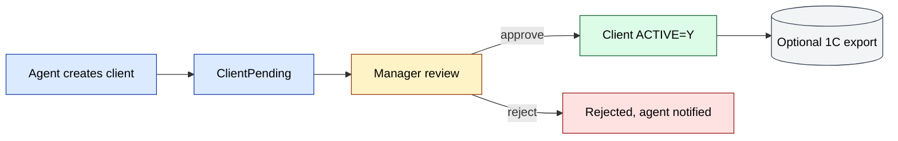
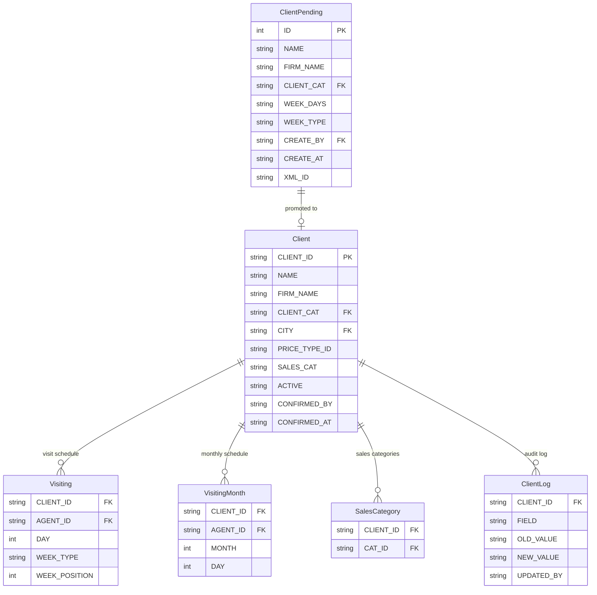
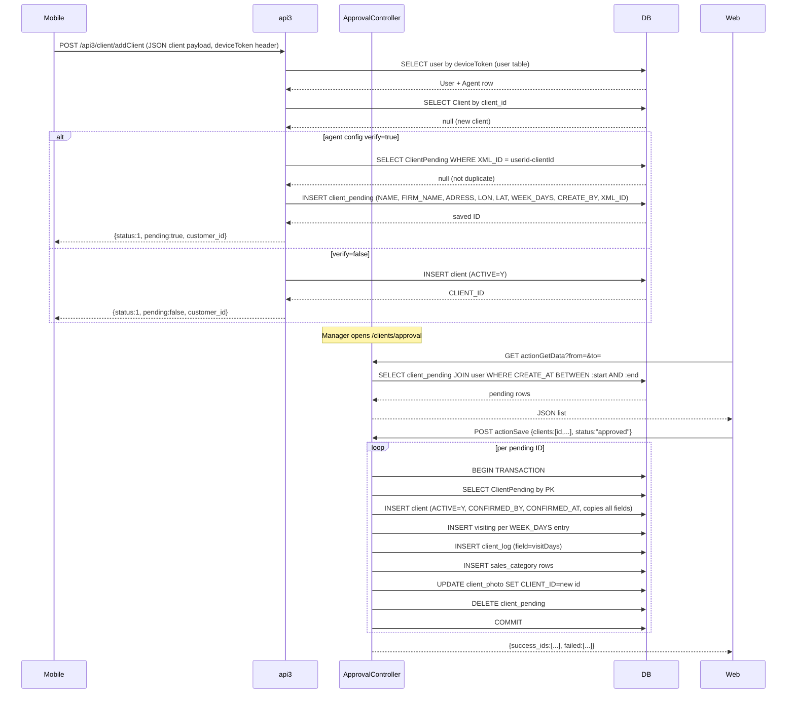
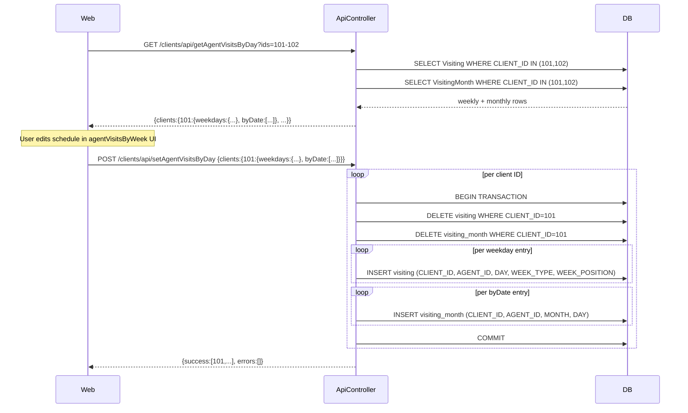
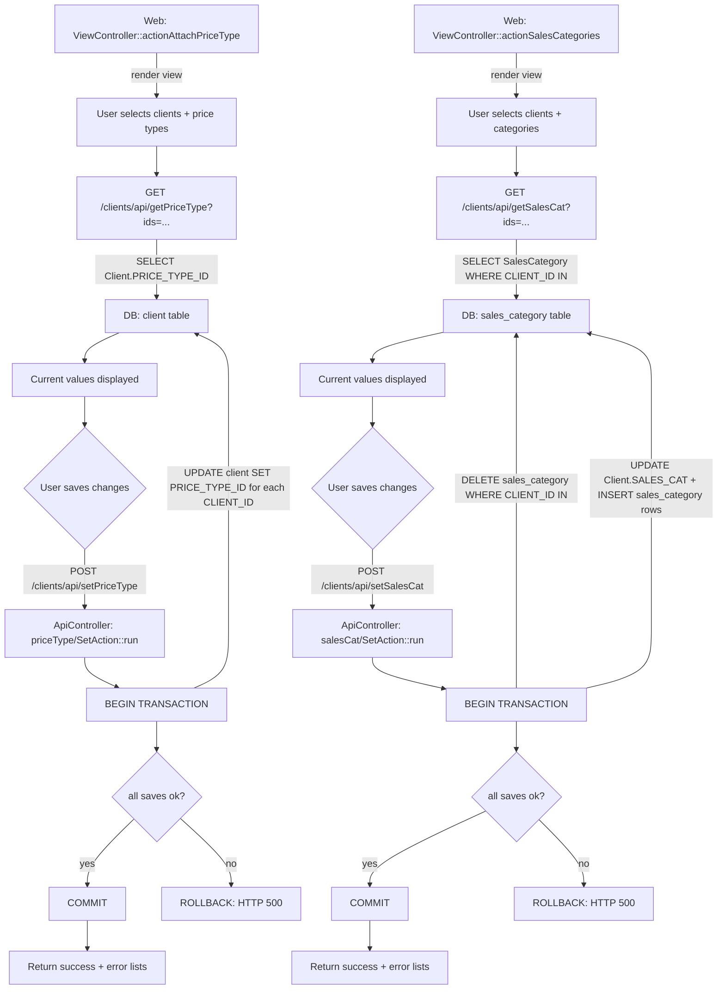

# Модуль `clients`

Управляет **базой клиентов** в sd-main: B2B-точки, ритейлеры,
HoReCa, плюс вспомогательные доменные объекты — договоры, сегменты, долг,
гео-локация и членство в маршрутах.

## Ключевые возможности

| Возможность | Что делает | Роль(и) владельца |
|---------|--------------|---------------|
| CRUD клиента | Создание / редактирование / архивация записей клиента | 1 / 2 / 5 / 9 |
| Клиенты, созданные в поле (мобильный) | Агент отправляет нового клиента во время визита; запись попадает в *Pending* | 4 |
| Утверждение клиента | Менеджер просматривает ожидающие записи; утвердить / отредактировать / отклонить | 1 / 2 / 9 |
| Категории и сегменты | Уровни клиентов по сегменту продаж; влияет на тип цены и скидку | 1 / 9 |
| Договоры | Опциональные коммерческие договоры на клиента (условия, дни оплаты) | 1 / 9 |
| Гео-координаты | `LAT` / `LNG` у каждого клиента; используется `gps` для геофенсинга | 1 / 4 |
| Членство в маршрутах | Клиенты группируются в маршруты, назначенные агентам | 8 / 9 |
| Снимок долга | Расчётное старение дебиторки в отчётах | 6 / 9 |
| Массовый импорт | Импорт CSV / Excel для миграции | 1 |
| Round-trip 1С / Faktura.uz | `XML_ID` + `INN` для исходящего EDI | system |

## Папка

```
protected/modules/clients/
├── controllers/
│   ├── ClientController.php
│   ├── ApiController.php
│   ├── ApprovalController.php
│   ├── AgentRouteController.php
│   ├── ComputationController.php
│   └── …
└── views/
```

## Ключевые сущности

| Сущность | Модель | Замечания |
|--------|-------|-------|
| Клиент | `Client` | Активные точки/клиенты |
| Ожидающий клиент | `ClientPending` | Создан в поле, ожидает утверждения |
| Категория клиента | `ClientCategory` | Ценовой уровень / сегментация |
| Договор | `ContractClient` | Коммерческий договор |
| Маршрут | `Route`, `RouteClient` | Маршруты агентов |
| Снимок долга | `ClientDebt` | Расчётное старение |

## Воркфлоу утверждения

См. **Feature · Client Approval** в
[FigJam · sd-main · Feature Flows](https://www.figma.com/board/MyvyaeEluqvHofH4E2qIoU).



## API

| Эндпоинт | Назначение |
|----------|---------|
| `GET /api3/client/list` | Синхронизация клиентов маршрута на мобильный |
| `POST /api3/client/create` | Клиенты, созданные в поле (ожидающие) |
| `GET /api4/client/list` | Листинг для B2B-портала |

## Права доступа

| Действие | Роли |
|--------|-------|
| Создание | 1 / 2 / 4 (только pending) / 5 |
| Утверждение | 1 / 2 / 9 |
| Редактирование | 1 / 2 / 5 / 9 |
| Архивация | 1 / 2 |

## См. также

- [`agents`](./agents.md) (назначение маршрутов)
- [`gps`](./gps.md) (геофенсинг)
- [`orders`](./orders.md) (клиенты — это покупатели)

## Воркфлоу

### Точки входа

| Триггер | Контроллер / Действие / Задача | Замечания |
|---|---|---|
| Web | `ApprovalController::actionIndex` | Менеджер открывает список проверки ожидающих клиентов |
| Web | `ApprovalController::actionGetData` | Получает строки `client_pending` за диапазон дат |
| Web | `ApprovalController::actionSave` | Массово утверждает ожидающих клиентов, создаёт записи `Client` |
| Web | `ApprovalController::actionDelete` | Отклоняет (удаляет) ожидающих клиентов |
| Web | `ViewController::actionAgentVisitsByWeek` | UI для расписания привязки/отвязки агента |
| Web | `ViewController::actionAttachPriceType` | UI для назначения типа цены клиентам |
| Web | `ViewController::actionSalesCategories` | UI для назначения категории продаж |
| Web API | `ApiController::getAgentVisitsByDay` | Читает `Visiting` + `VisitingMonth` для выбранных клиентов |
| Web API | `ApiController::setAgentVisitsByDay` | Заменяет записи `Visiting` + `VisitingMonth` в транзакции |
| Web API | `ApiController::getPriceType` | Читает `Client.PRICE_TYPE_ID` для выбранных клиентов |
| Web API | `ApiController::setPriceType` | Записывает `Client.PRICE_TYPE_ID` для выбранных клиентов |
| Web API | `ApiController::getSalesCat` | Читает строки `SalesCategory` для выбранных клиентов |
| Web API | `ApiController::setSalesCat` | Заменяет строки `SalesCategory` для выбранных клиентов |
| Mobile (`api3`) | `api3/ClientController::actionAddClient` | Агент отправляет нового клиента; сохраняется как `ClientPending`, когда `verify=true` |
| Mobile (`api3`) | `api3/ClientController::actionPending` | Агент опрашивает свои собственные ожидающие отправки |

### Доменные сущности



### Воркфлоу 1.1 — Проверка клиента, созданного в поле

Агент создаёт нового клиента в мобильном приложении. Если в конфиге дистрибьютора `client.verify = true`, запись хранится в `ClientPending`, пока менеджер не утвердит или не отклонит её через web-бэкофис.



### Воркфлоу 1.2 — Привязка / отвязка расписания визитов агента

Менеджер назначает или удаляет слоты визитов агент-клиент (еженедельно по дню недели или ежемесячно по дате). Операция — полная замена: существующие строки `Visiting` и `VisitingMonth` для клиента удаляются и затем вставляются заново внутри транзакции.



### Воркфлоу 1.3 — Назначение типа цены и категории продаж

Менеджер массово назначает типы цен или категории продаж одному или нескольким клиентам. Обе операции следуют одному паттерну через действия `ApiController`: получить текущие значения, отредактировать в UI, затем сохранить одной транзакционной записью.



### Межмодульные точки соприкосновения

- Чтения: `agents.Agent` (резолв AGENT_ID из User при утверждении; фильтрация расписания визитов по агенту)
- Чтения: `agents.Visiting` / `VisitingMonth` (отображение расписания в `AgentRouteController::actionGetClients`)
- Записи: `agents.Visiting` / `VisitingMonth` (заменяются при каждом вызове `setAgentVisitsByDay`)
- Записи: `clients.SalesCategory` (заменяются при каждом вызове `setSalesCat`; также пишутся при утверждении)
- Записи: `clients.ClientLog` (запись аудита для поля `visitDays` пишется при `ApprovalController::actionSave`)
- API: `api3/client/addClient` (мобильное создание клиента → `ClientPending`)
- API: `api3/client/pending` (мобильный агент опрашивает свои pending-отправки)
- API: `api4/client/sales-category-list` (B2B-портал читает категории продаж)

### Подводные камни

- `ApprovalController::actionSave` копирует значения полей из `ClientPending` в `Client` через жёстко заданный список атрибутов. Любая новая колонка `ClientPending`, добавленная в будущем, должна также быть добавлена в массив `$attributes` в этом методе, иначе она будет молча отброшена при утверждении.
- `agentVisitsByDay/SetAction` выполняет полное удаление с последующей вставкой. Вызов с пустым `weekdays` и пустым `byDate` для клиента удаляет все назначения визитов для этого клиента без подтверждающего prompt.
- `Client.PRICE_TYPE_ID` и `Client.SALES_CAT` хранятся как строки, разделённые запятыми, в строке `client` в дополнение к нормализованной таблице `sales_category`. Они могут разойтись, если `sales_category` пишется без обновления `Client.SALES_CAT`. `salesCat/SetAction` обновляет оба; прямые правки в БД могут не делать этого.
- Путь `api3/ClientController::actionAddClient` разделяется на две версии кода (`addClientVersion1` / `addClientVersion2`) на основе `$_REQUEST['u'] === 'merch'`. Только версия 1 пишет в `ClientPending`; вариант merch (`addClientVersion2`) имеет свой собственный поток.
- `ApprovalController::actionDelete` требует право `operation.clients.approval.delete`, которое отличается от права на утверждение (`operation.clients.approval`). Неправильно настроенные роли с правом утверждения, но без права удаления, не могут отклонять записи.
