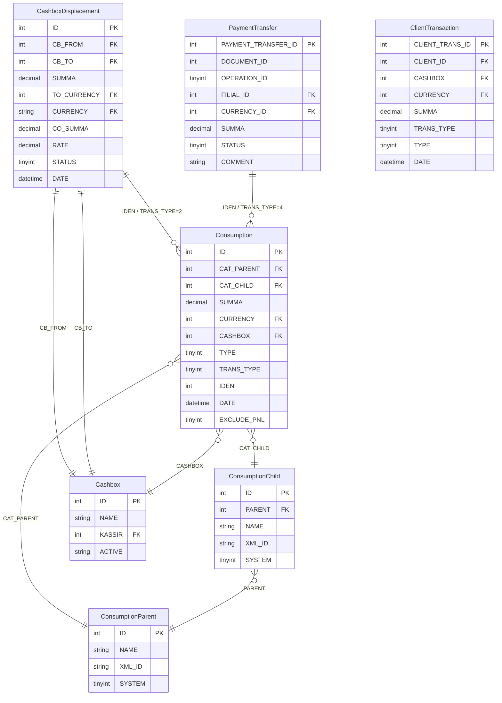
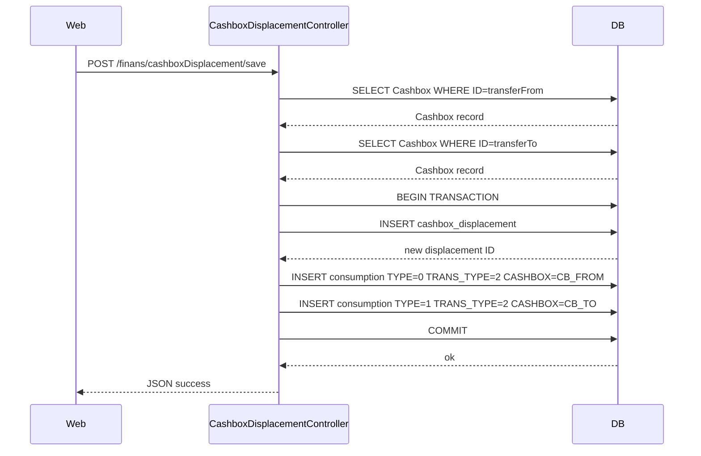
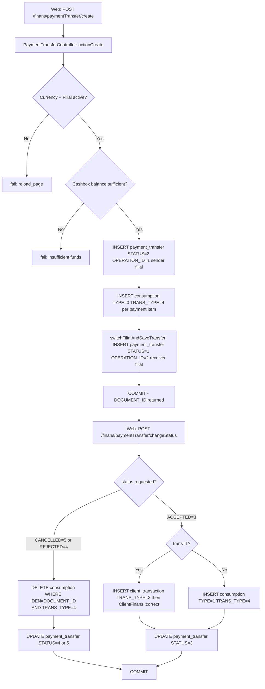
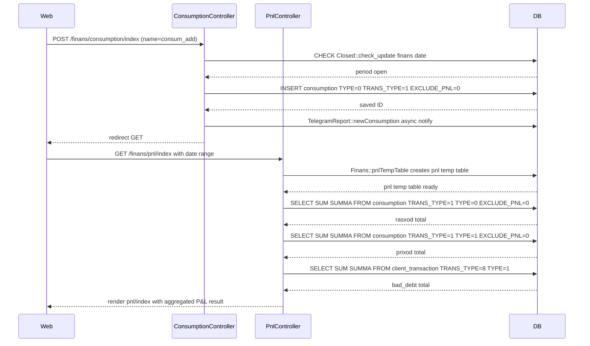

# Модуль `finans`

Финансовый учётный слой для sd-main. Агрегирует денежную сторону
бизнеса: P&L, P&L по агентам, движения по кассам, расходы.

## Ключевые возможности

| Возможность | Что делает | Роль(и) владельца |
|---------|--------------|---------------|
| P&L по периодам | Доходы / расходы / маржа за период | 1 / 9 / Finance |
| Сводный P&L | Срезы P&L | 1 / 9 / Finance |
| P&L по агентам | Прибыльность по каждому агенту | 1 / 8 / 9 |
| Перемещение между кассами | Перемещение денег между кассами (например, агент → главная) | 6 / Finance |
| Перенос платежа | Переназначение платежа в другую кассу / заказ | 1 / 6 |
| Учёт расходов / трат | Операционные расходы относительно бюджета | 1 / Finance |

## Папка

```
protected/modules/finans/
└── controllers/
    ├── PnlController.php
    ├── PivotPnlController.php
    ├── AgentPnlController.php
    ├── CashboxDisplacementController.php
    ├── PaymentTransferController.php
    └── ConsumptionController.php
```

## См. также

- [`pay`](./payment.md) — регистрация платежей
- [`payment`](./payment.md) — воркфлоу утверждения платежей

## Воркфлоу

### Точки входа

| Триггер | Контроллер / Действие / Задача | Замечания |
|---|---|---|
| Web — сетка P&L по агентам | `AgentPnlController::actionIndex` | Представление P&L по агенту, отдельно от PnL по филиалу |
| Web | `CashboxDisplacementController::actionIndex` | Рендерит представление списка перемещений между кассами |
| Web (GET) | `CashboxDisplacementController::actionGetDisplacement` | Возвращает отфильтрованные записи перемещений как JSON |
| Web (POST) | `CashboxDisplacementController::actionSave` | Создаёт новое перемещение между кассами + парные строки Consumption |
| Web (GET) | `CashboxDisplacementController::actionCancelDisplacement` | Устанавливает `STATUS=2`, удаляет парные строки Consumption |
| Web (POST) | `PaymentTransferController::actionCreate` | Создаёт документ межфилиального переноса платежа + дебетовый Consumption |
| Web (POST) | `PaymentTransferController::actionChangeStatus` | Продвигает статус PaymentTransfer; при ACCEPTED пишет ClientTransaction или Consumption |
| Web — сетка сводного P&L | `PivotPnlController::actionIndex` | Кросс-таб представление сводного P&L |
| Web (POST) | `ConsumptionController::actionIndex` (POST-ветка) | Добавление, редактирование или удаление строки расходов Consumption |
| Web (POST) | `ConsumptionController::actionCredit` (POST-ветка) | Добавление, редактирование или удаление строки кредита (дохода) Consumption |
| Web | `PnlController::actionIndex` | Строит временную таблицу `pnl` через `Finans::pnlTempTable`, агрегирует в представление P&L |

---

### Доменные сущности



---

### Воркфлоу 1.1 — Перемещение между кассами (внутренний перенос между кассами)

Кассир или финансовый менеджер перемещает средства из одной кассы в другую внутри одного филиала. Контроллер пишет запись `cashbox_displacement` и две парные строки `consumption` — дебет (TYPE=0) из исходной кассы и кредит (TYPE=1) в кассу-получатель — внутри одной DB-транзакции. Отмена удаляет обе строки consumption и помечает перемещение STATUS=2.



---

### Воркфлоу 1.2 — Межфилиальный перенос платежа (жизненный цикл send → receive)

Филиал-отправитель инициирует перенос платежа в другой филиал. Документ путешествует по статусам (PENDING=2 → ACCEPTED=3 или REJECTED=4 / CANCELLED=5). При создании балансы кассы отправителя дебетуются через `consumption` (TRANS_TYPE=4, TYPE=0). При приёмке получателем средства зачисляются либо как `ClientTransaction` (TRANS_TYPE=3, когда `trans=1`), либо как `consumption` (TYPE=1, TRANS_TYPE=4). Отказ или отмена удаляет дебетовые строки consumption.



---

### Воркфлоу 1.3 — Запись расхода / дохода и включение в P&L

Финансовый персонал записывает операционные расходы (TYPE=0) или доходы кассы (TYPE=1) напрямую через `ConsumptionController`. Каждая строка тегируется фондом (`ConsumptionParent`) и категорией (`ConsumptionChild`). `PnlController::actionIndex` читает `consumption` WHERE `TRANS_TYPE=1 AND EXCLUDE_PNL=0`, чтобы добавить операционные расходы и прочие доходы в итоги P&L после того, как `Finans::pnlTempTable` заполнит временную таблицу `pnl` из данных продаж.



---

### Межмодульные точки соприкосновения

- Чтения: `pay.ClientTransaction` (TRANS_TYPE IN(3,4,5) — используется для расчёта баланса кассы в `CashboxDisplacementController::getCashboxBalance` и `PaymentTransferController::getCashboxBalance`)
- Записи: `pay.ClientTransaction` (INSERT TRANS_TYPE=3, TYPE=1, когда платёжный перенос принят с флагом `trans=1` — через `PaymentTransferController::savePaymentAsTransaction`)
- Записи: `pay.ClientFinans` (`ClientFinans::correct` вызывается после записи ClientTransaction при приёмке переноса)
- Чтения: `settings.Closed` (проверка блокировки периода через `Closed::model()->check_update('finans', date)` перед любой записью расхода в `ConsumptionController`)
- Чтения: `warehouse.LotDistribution` / `orders.Order` (используется `Finans::pnlTempTable`, когда `ServerSettings::enableLotManagement()` равно true)

---

### Подводные камни

- `CashboxDisplacement` и `PaymentTransfer` оба наследуют `BaseFilial`, поэтому их имена таблиц получают филиальный префикс во время выполнения. Кросс-филиальные запросы в `PaymentTransferController::actionChangeStatus` переключают активный контекст филиала через `BaseFilial::setFilial($prefix)` перед запросом таблицы получателя `payment_transfer` — отказ от обратного переключения может испортить контекст филиала в сессии.
- `Consumption.TRANS_TYPE` критичен для P&L: только строки с `TRANS_TYPE=1` идут в `PnlController`. Строки, написанные перемещением (`TRANS_TYPE=2`) и переносом платежа (`TRANS_TYPE=4`), молча исключаются из агрегации P&L.
- `Consumption.EXCLUDE_PNL=1` — это ручное переопределение, которое удаляет строку из P&L, даже если `TRANS_TYPE=1`. Может быть установлено в путях добавления и редактирования в `ConsumptionController`.
- `PaymentTransferController::actionChangeStatus` пишет в контексты БД и отправителя, и получателя в одном HTTP-запросе. DB-транзакция (`$safeTrans`) покрывает только текущее соединение филиала; вставка в удалённый филиал в `switchFilialAndSaveTransfer` находится вне транзакции и не откатывается при ошибке.
- `ConsumptionController::actionCredit` (доход кассы, TYPE=1) **не** вызывает `TelegramReport::newConsumption`; только записи расходов (TYPE=0 в `actionIndex`) триггерят Telegram-уведомление.
- Расчёт P&L имеет два пути кода, защищённых `ServerSettings::enableLotManagement()`. При включении `Finans::pnlTempTable` использует SQL на основе `LotDistribution`; при отключении откатывается к легаси `Finans::pnlSql`. Оба заполняют одну и ту же временную таблицу `pnl`, но дают **разные числа P&L** на тех же данных. Проверьте, в каком режиме работает целевой инстанс, прежде чем доверять историческим сравнениям.
- `PaymentTransferController::actionChangeStatus` запускает `allowedStatus` дважды — один раз в контексте филиала отправителя (строки ~229–231), один раз в получателе после `BaseFilial::setFilial` (строки ~293–297). Обновление STATUS и удаления Consumption между ними (строки ~237–247) выполняются **до** второй проверки, поэтому может произойти частичная мутация, если проверка на стороне получателя не пройдёт. Воспринимайте две половины как неатомарные.
