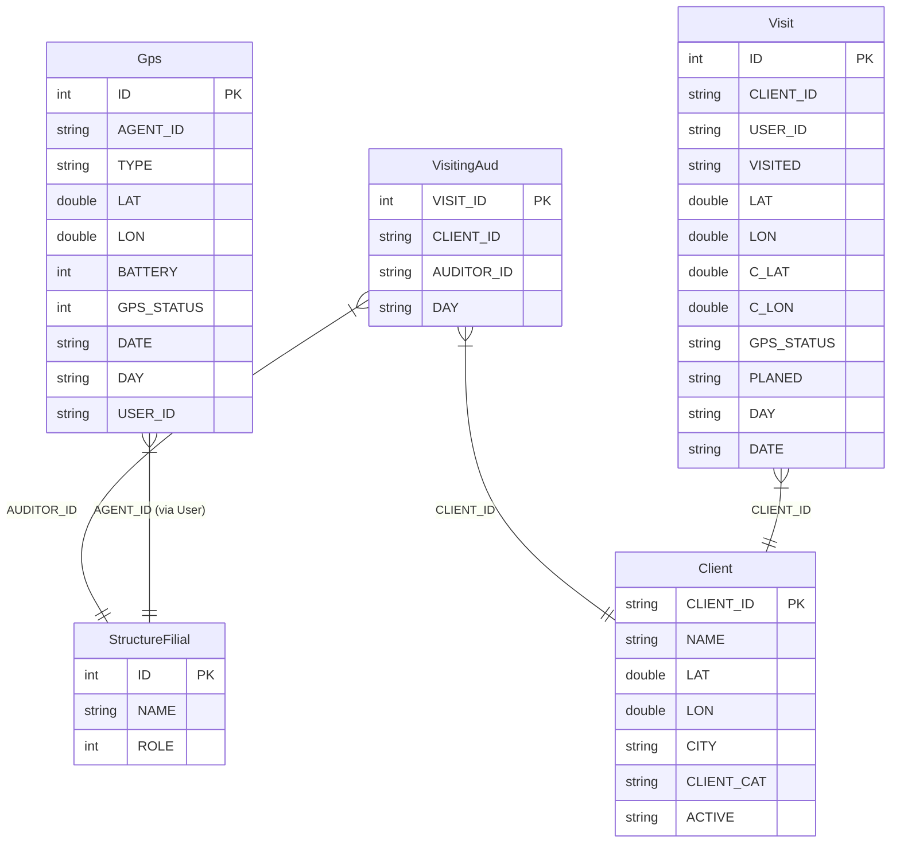
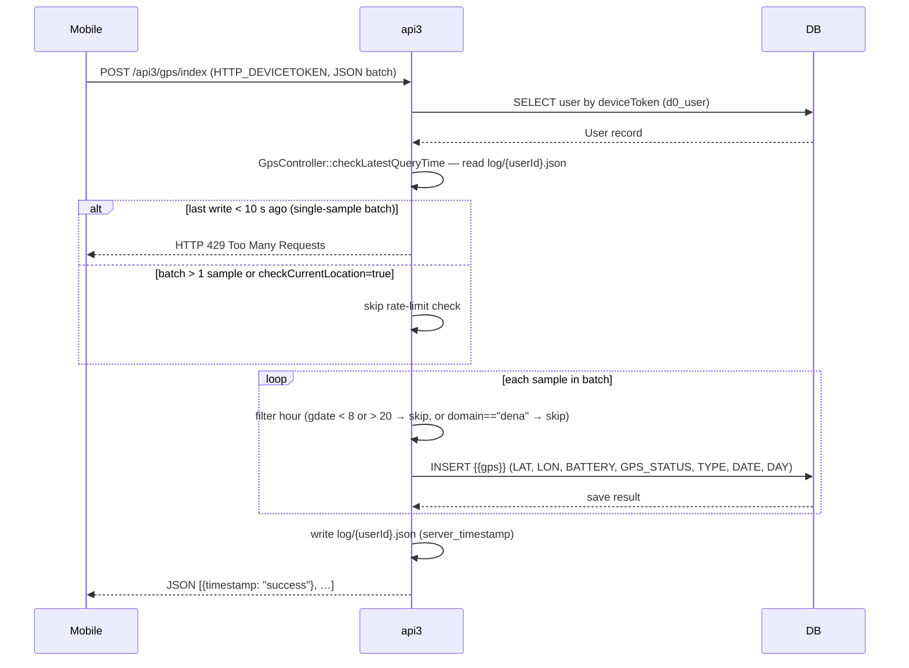
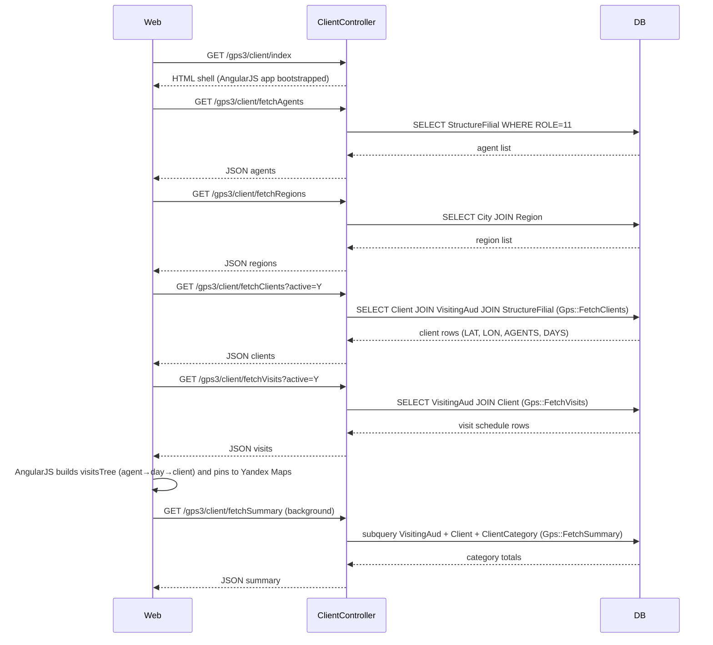
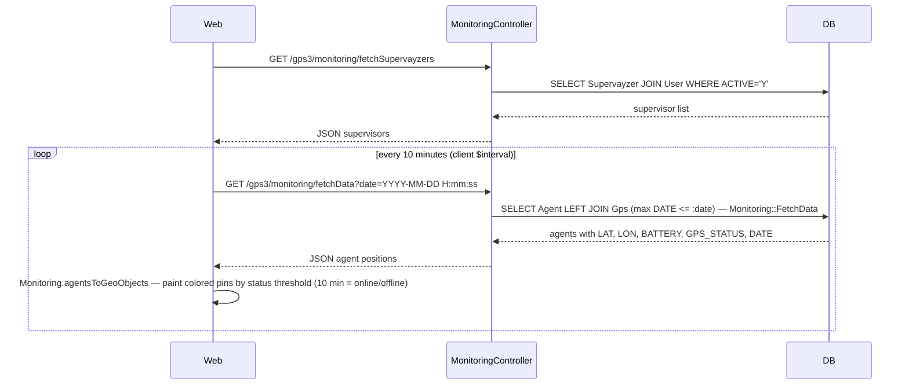
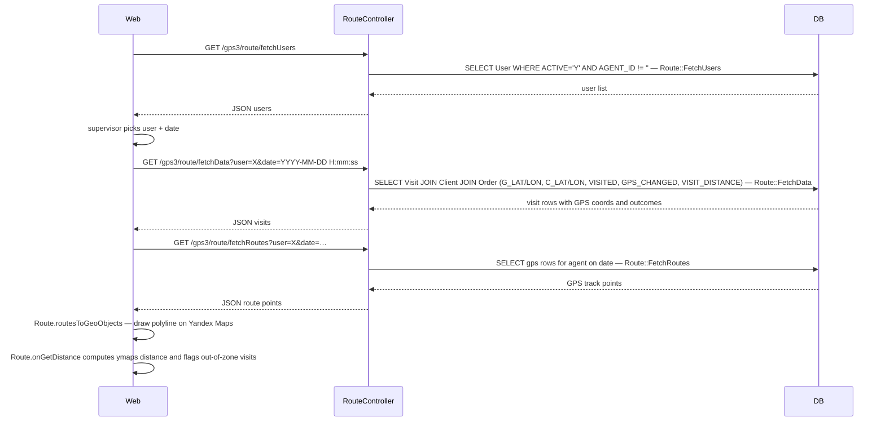

# Модули `gps`, `gps2`, `gps3`

GPS-трекинг. Существуют три поколения; новые разработки следует вести
в актуальном (`gps3`).

| Модуль | Статус | Замечания |
|--------|--------|-------|
| `gps` | Поддержка | Первое поколение; используется старыми клиентами |
| `gps2` | Заморожено | Легаси |
| `gps3` | **Текущий** | Сюда идут новые функции |

## Ключевые возможности

| Возможность | Что делает | Роль(и) владельца |
|---------|--------------|---------------|
| Живой мониторинг | Карта всех агентов филиала в реальном времени | 8 / 9 |
| Проигрывание поездки | Воспроизведение дня агента на карте | 8 / 9 |
| Геофенс на каждый визит | Валидация, что check-in агента внутри радиуса клиента | system |
| Приём GPS с мобильного | Мобильное приложение шлёт сэмплы каждые ~30 с | system |
| Приём от внешнего провайдера | Универсальные JSON / Wialon-style эндпоинты | system |
| Флаг out-of-zone | Визиты вне радиуса помечаются для проверки | 8 / 9 |
| KPI: GPS-покрытие | Процент плановых визитов с реальным GPS check-in | 8 / 9 |

## Возможности

- Живой трекинг агентов на карте (`MonitoringController`)
- Геофенс-верификация на каждый визит (`OrdersGpsController`)
- Проигрывание поездки (`TrackingController`)
- Фоновый приём от мобильных клиентов (`BackendController`,
  `GetController`)
- Дашборд для супервайзеров (`FrontendController`)

## Angular-модуль

Современный UI карты живёт в `ng-modules/gps/` — самостоятельный Angular-
модуль, загружаемый в Yii-представление. Собирайте его отдельно и копируйте `dist/`
в `ng-modules/gps/`.

## Ключевой поток функционала — визит и GPS

См. **Feature · Visit & GPS geofence** в
[FigJam · sd-main · Feature Flows](https://www.figma.com/board/MyvyaeEluqvHofH4E2qIoU).

## Воркфлоу

### Точки входа

| Триггер | Контроллер / Действие / Задача | Замечания |
|---|---|---|
| Mobile HTTP POST `POST /api3/gps/index` | `GpsController::actionIndex` | Пакет GPS-сэмплов из мобильного приложения; авторизация через заголовок `HTTP_DEVICETOKEN` |
| Mobile HTTP POST `POST /api3/gps/offline` | `GpsController::actionOffline` | Эндпоинт сброса offline-буфера (заглушка — пока без записи в БД) |
| Web загрузка страницы `GET /gps3/client/index` | `ClientController::actionIndex` | Рендерит оболочку SPA AngularJS "Clients on map" |
| Web AJAX `GET /gps3/client/fetchClients` | `ClientController::actionFetchClients` | JSON-список клиентов с LAT/LON для пинов Yandex Maps |
| Web AJAX `GET /gps3/client/fetchVisits` | `ClientController::actionFetchVisits` | Расписание агент × день недели для дерева сайдбара |
| Web AJAX `GET /gps3/client/fetchSummary` | `ClientController::actionFetchSummary` | Итоги визитов по категории для статистической панели |
| Web AJAX `GET /gps3/client/fetchAgents` | `ClientController::actionFetchAgents` | Выпадающий список мерчандайзеров (ROLE = 11) |
| Web AJAX `GET /gps3/client/fetchRegions` | `ClientController::actionFetchRegions` | Выпадающий список городов/регионов |
| Web AJAX `GET /gps3/client/fetchCategories` | `ClientController::actionFetchCategories` | Выпадающий список категорий клиентов |
| Web печать `GET /gps3/client/print` | `ClientController::actionPrint` | Печатный список клиентов с координатами |
| Web AJAX `GET /gps3/monitoring/fetchData` | `MonitoringController::actionFetchData` (gps2) | Последние известные позиции агентов для живой карты; контроллер живёт в модуле `gps2` |
| Web AJAX `GET /gps3/monitoring/fetchSupervayzers` | `MonitoringController::actionFetchSupervayzers` (gps2) | Список фильтра супервайзеров для представления мониторинга |
| Web AJAX `GET /gps3/route/fetchData` | `RouteController::actionFetchData` (gps2) | Список визитов по агенту с GPS-координатами для карты проигрывания поездки |
| Web AJAX `GET /gps3/route/fetchRoutes` | `RouteController::actionFetchRoutes` (gps2) | Упорядоченный GPS-трек для полилинии маршрута |
| Web AJAX `GET /gps3/route/fetchReport` | `RouteController::actionFetchReport` (gps2) | Таблица дневной сводки визитов |
| Web AJAX `GET /gps3/route/fetchUsers` | `RouteController::actionFetchUsers` (gps2) | Выбор пользователя для представления маршрута |
| Angular UI | AngularJS-приложение `ng-modules/gps/` (контроллеры: `Client`, `Monitoring`, `Route`) | Активный браузерный UI; загружается в Yii-оболочку через регистрацию ассетов в `Gps3Module::registerAssets` |

---

### Доменные сущности

---

### Воркфлоу 1.1 — Приём мобильного GPS-сэмпла

Мобильное приложение постит JSON-пакет GPS-сэмплов в `api3/gps/index`. Каждый
сэмпл аутентифицируется по device token, ограничивается одной записью в 10 с
и сохраняется в `{{gps}}` только в рабочие часы (08:00–20:00).

---

### Воркфлоу 1.2 — Загрузка карты клиентов и фильтрация

Когда супервайзер открывает `/gps3/client/index`, AngularJS-контроллер `Client`
бутстрапится, получая справочные данные, а затем полный список клиентов +
расписание визитов; последующие изменения фильтра запрашивают только затронутые эндпоинты.

---

### Воркфлоу 1.3 — Живой мониторинг агентов

Супервайзер открывает вкладку мониторинга; AngularJS-контроллер `Monitoring`
опрашивает последние известные позиции агентов через `MonitoringController` модуля `gps2`, затем
автоматически продвигает временную метку с интервалом 10 минут, чтобы карта оставалась живой.

---

### Воркфлоу 1.4 — Проигрывание поездки (представление маршрута)

Супервайзер выбирает агента и дату; AngularJS-контроллер `Route`
загружает все чекпоинты визитов и полилинию GPS-трека, чтобы супервайзер мог
воспроизвести день агента, проверить расстояния геофенса и просмотреть исходы
заказа/отказа.

---

### Межмодульные точки соприкосновения

- Чтения: `application.Gps` (`{{gps}}` table) — общая модель AR, используемая `api3/GpsController` для приёма и `gps2/Monitoring::FetchData` для запросов мониторинга
- Чтения: `application.VisitingAud` (`{{visiting_aud}}`) — расписание визитов, потребляемое `gps3/Gps::FetchClients`, `FetchVisits`, `FetchSummary`
- Чтения: `application.Visit` (`{{visit}}`) — строки чекпоинтов GPS на каждый визит, потребляемые `gps2/Route::FetchData` и `FetchRoutes`
- Чтения: `application.Client` (`{{client}}`) — координаты клиентов (LAT/LON) сверяются с GPS визита в `Route::FetchData`
- Чтения: `application.ServerSettings::visitDistance` — настраиваемый радиус геофенса (по умолчанию ~100 м), внедряемый как `VISIT_DISTANCE` в SQL данных маршрута
- Записи: `application.Gps` (`{{gps}}`) — пишется `api3/GpsController::actionIndex` на каждый входящий мобильный сэмпл
- API: `api3/gps/index` — единственный мобильный эндпоинт приёма; `api3/gps/offline` — заглушка offline-сброса

---

### Подводные камни

- **MonitoringController и RouteController не в gps3.** AngularJS `config.js` маршрутизирует `/gps3/monitoring/*` и `/gps3/route/*`, но эти PHP-контроллеры живут в модуле `gps2`. URL-маршрутизация Yii, должно быть, мапит эти пути на `gps2`; добавление новых действий мониторинга/маршрута должно делаться в `protected/modules/gps2/controllers/`, а не `gps3/`.
- **Rate-limiting файловый.** `GpsController::checkLatestQueryTime` пишет JSON-файлы на каждого пользователя в `webroot/log/gps/{userId}.json`. Этот каталог должен быть доступен на запись и не очищается автоматически; использование диска неограниченно растёт на больших инсталляциях.
- **Фильтр рабочих часов молча отбрасывает сэмплы.** Любой GPS-сэмпл с временной меткой устройства вне 08:00–20:00 подтверждается как `"success"`, но никогда не пишется в БД. Это намеренно, но невидимо мобильному клиенту — отладка пропавших треков требует проверки серверных логов, а не ответа API.
- **`actionOffline` — заглушка.** Она пишет сырой текстовый файл (`Gps_Offline-<time>.txt`) в рабочий каталог и не возвращает данных — это не функциональный offline-буфер.
- **Флаг `GPS_CHANGED` влияет на вердикт геофенса.** Если LAT/LON клиента редактировались в тот же день, что и визит (`ClientLog` фиксирует изменение LON/LAT), `Route::FetchData` устанавливает `GPS_CHANGED=1`, и `onGetDistance` сообщает о визите как "unknown" независимо от вычисленного расстояния. Супервайзеры должны учитывать, что коррекция координат инвалидирует вердикты того же дня.
- **Легаси-модули gps/gps2.** Не добавляйте новые функции в `gps` или `gps2`. Оба остаются живыми для существующих клиентов; ломающие изменения там — высокий риск.
