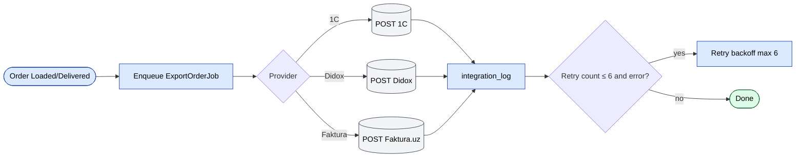
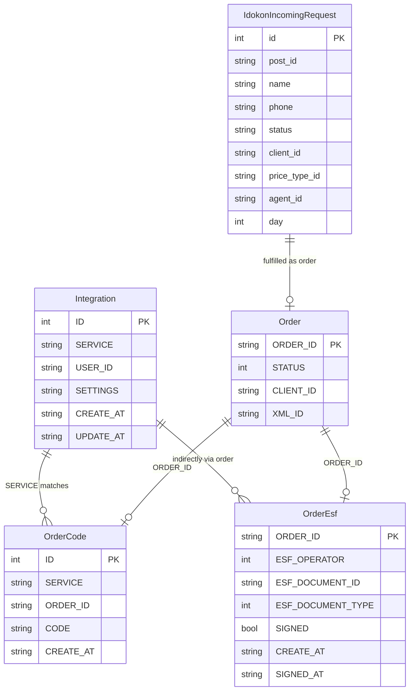
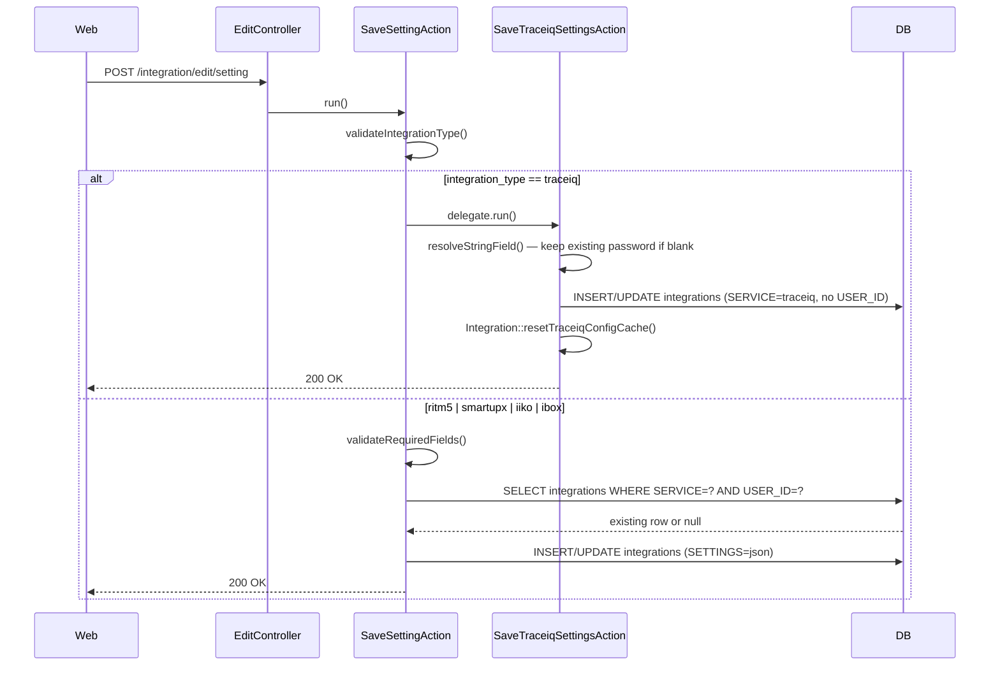
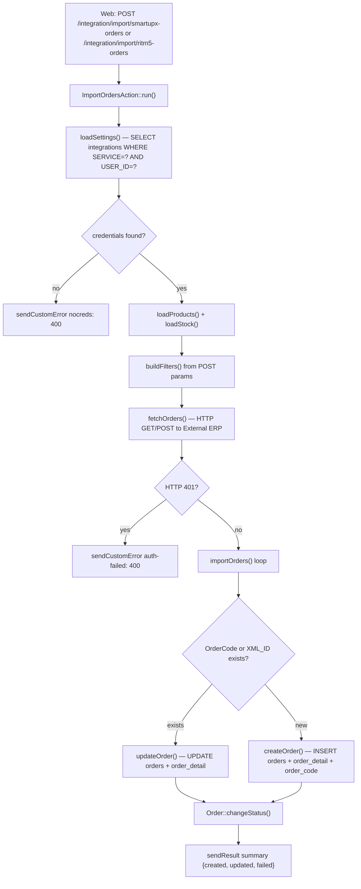
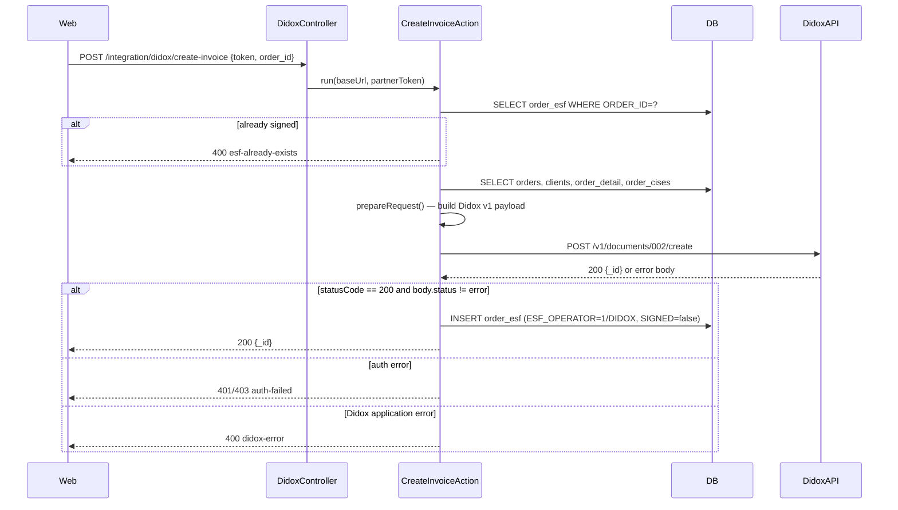
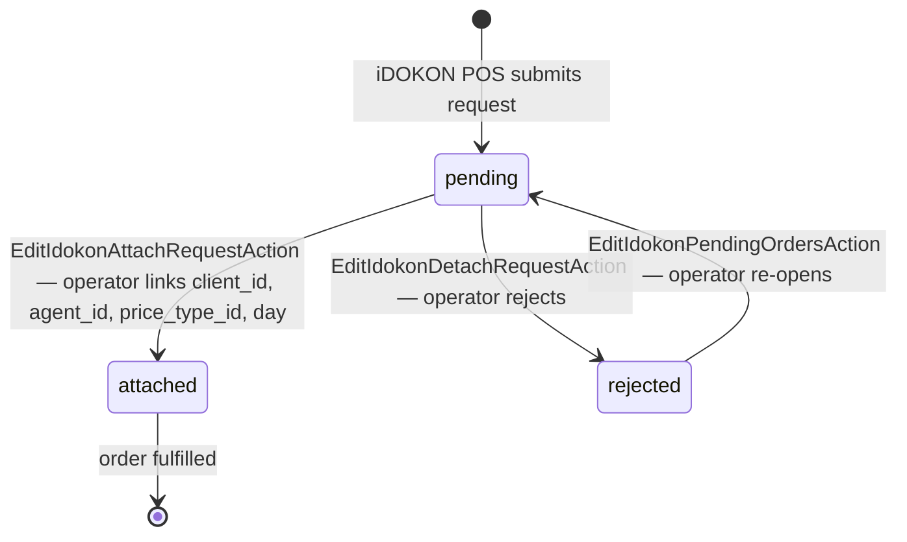

# Модуль `integration`

Хаб для исходящих + входящих интеграций с внешними системами. У каждой
интеграции свой контроллер; общая логика лежит в
`protected/components/`.

## Ключевые возможности

| Возможность | Что делает | Роль(и) владельца |
|---------|--------------|---------------|
| Экспорт заказов в 1С | Push каждого заголовка заказа + строк в 1С | system |
| Импорт каталога из 1С | Pull изменений товаров / категорий / цен из 1С | system |
| Didox e-invoice | Отправка подписанных e-инвойсов при статусе Loaded / Delivered | system |
| Faktura.uz | Государственно-обязательные e-инвойсы НДС | system |
| Импорт Smartup | Входящие заказы из Smartup ERP | system |
| TraceIQ | Входящие trace-события | system |
| Универсальный CSV / XML импорт / экспорт | Ad-hoc передача | 1 / Ops |
| UI лога интеграций | Просмотр / фильтр / повторный запуск упавших задач | 1 / Ops |
| Конфиг на арендатора | Каждый арендатор настраивает свои учётные данные | 1 |

## Контроллеры

| Контроллер | Внешняя система |
|------------|-----------------|
| `DidoxController` | Didox (EDI) |
| `FakturaController` | Faktura.uz (e-faktura, EIMZO) |
| `TraceiqController` | Trace IQ |
| `ImportController` / `ExportController` | Универсальный 1С / CSV / XML |
| `ListController`, `EditController`, `GetController` | Админ-UI задач интеграции |

## Как это работает

- **Исходящие**: задача ставится в очередь (например, `ExportInvoiceJob`),
  когда заказ достигает статуса, который триггерит EDI-отправку. Задача вызывает
  внешний API, обновляет локальный документ данными ответа
  и пишет в `IntegrationLog`.
- **Входящие**: задачи планировщика делают pull обновлений (например, прайс-каталоги
  из 1С) и upsert в локальные таблицы.

## Ключевой поток функционала — экспорт заказа

См. **Feature · Order Export to 1C / Faktura.uz** в
[FigJam · sd-main · Feature Flows](https://www.figma.com/board/MyvyaeEluqvHofH4E2qIoU).

## Обработка отказов

- Per-job retry с экспоненциальным backoff (макс 6 повторов).
- После 6 отказов отправляется алерт в `adminEmail`.
- Строка `IntegrationLog` остаётся в `ERROR` до ручного перезапуска.

## Документация на уровне протокола

- [1С / Esale](../integrations/1c-esale.md)
- [Didox](../integrations/didox.md)
- [Faktura.uz](../integrations/faktura-uz.md)
- [Smartup](../integrations/smartup.md)

## Воркфлоу

### Точки входа

| Триггер | Контроллер / Действие / Задача | Замечания |
|---|---|---|
| Web (POST) | `EditController::setting` → `SaveSettingAction` | Сохранение учётных данных на пользователя для ritm5 / smartupx / iiko / ibox |
| Web (GET) | `GetController::setting` → `GetSettingAction` | Чтение учётных данных; делегирует `GetTraceiqSettingsAction` для TraceIQ (только админ) |
| Web (POST) | `EditController::setting` → `SaveSettingAction` → `SaveTraceiqSettingsAction` | Сохранение филиал-широкого конфига TraceIQ (только админ) |
| Web (POST) | `ImportController::smartupx-orders` → `ImportOrdersAction` (smartupx) | Запуск pull заказов из Smartup оператором |
| Web (POST) | `ImportController::ritm5-orders` → `ImportOrdersAction` (ritm5) | Запуск pull заказов из Ritm 5 оператором |
| Web (POST) | `TraceiqController::export-orders` → `TraceiqExportOrdersAction` | Push выбранных ID заказов в TraceIQ |
| Web (POST) | `DidoxController::create-invoice` → `CreateInvoiceAction` | Создание e-инвойса в Didox для заказа |
| Web (GET/POST) | `TraceiqController::actionGetPurchases` | Прокси-опрос: получение поступлений из TraceIQ |
| Web (POST) | `EditController::idokon-attach-request` → `EditIdokonAttachRequestAction` | Привязка входящего запроса iDOKON к локальному клиенту |
| Web (GET) | `ListController::idokon-incoming-requests` → `ListIdokonIncomingRequestsAction` | Список ожидающих POS-регистрационных запросов iDOKON |

---

### Доменные сущности

---

### Воркфлоу 1.1 — Конфигурация учётных данных интеграции (на пользователя и филиал-широкая)

Операторы настраивают учётные данные один раз на каждого вендора. Per-user записи покрывают ritm5, smartupx, iiko и ibox; TraceIQ использует одну филиал-широкую строку и ограничен админом. Чтение настроек в рантайме делегирует тому же помощнику `Integration::getTraceiqConfig()`, который мерджит значения из БД поверх легаси `params['traceiq']` фолбэков.

---

### Воркфлоу 1.2 — Входящий pull заказов из внешнего ERP (Smartup / Ritm 5)

Оператор триггерит pull за диапазон дат против стороннего ERP. Действие загружает сохранённые учётные данные из `integrations`, вызывает внешний API, затем upsert-ит строки `Order` + `OrderDetail`, используя `XML_ID` (Ritm 5) или `OrderCode` (Smartup) как ключи идемпотентности. Авторизация и URL-эндпоинты различаются по вендорам; общая логика upsert одна и та же.

---

### Воркфлоу 1.3 — Исходящий push e-инвойса в Didox

Пользователь инициирует создание e-инвойса для доставленного заказа. `CreateInvoiceAction` строит полный документ Didox v1 из данных `orders`, `order_detail`, `order_cises` и `diler` (продавец), постит его в партнёрский API Didox и сохраняет возвращённый ID документа в `order_esf`. Подписание происходит на следующем шаге, описанном в [Didox](../integrations/didox.md).

---

### Воркфлоу 1.4 — Жизненный цикл входящего POS-регистрационного запроса (iDOKON)

POS-терминалы iDOKON отправляют запросы на регистрацию нового клиента, которые попадают в `idokon_incoming_request` со `status=pending`. Оператор просматривает список, привязывает локального `Client` + `Agent` + `PriceType`, и запрос переходит в `attached`. Если оператор отклоняет, статус становится `rejected`.

---

### Межмодульные точки соприкосновения

- Чтения: `orders.Order` (поиск по PK / XML_ID / OrderCode при импорте или экспорте)
- Чтения: `orders.OrderDetail`, `orders.BonusOrderDetail` (строки для payload-ов TraceIQ и Didox)
- Чтения: `orders.OrderCises` (коды маркировки для Didox e-инвойса)
- Записи: `orders.Order`, `orders.OrderDetail` (upsert при импорте Ritm 5 / Smartup)
- Записи: `orders.OrderCode` (ключ идемпотентности, связывающий внешний ID сделки с локальным заказом)
- Записи: `orders.OrderEsf` (ID документа Didox / Faktura после push)
- Чтения: `clients.Client`, `agents.Agent`, `warehouse.Store` (резолвятся при импорте входящих заказов)
- Чтения: `diler` (продавец TIN / банковские поля, используемые в каждом payload e-инвойса)
- API: ничего не выставляется наружу; все вызовы — клиент-серверные или сервер-внешние

### Подводные камни

- **`Integration` ограничен `BaseFilial`**: таблица `integrations` per-filial. `USER_ID` дополнительно сужает большинство строк до одного оператора. TraceIQ — исключение: у него нет `USER_ID`, и он использует `getTraceiqConfig()`, который мерджит из БД _и_ `params['traceiq']` (легаси фолбэк). После сохранения настроек TraceIQ всегда вызывайте `Integration::resetTraceiqConfigCache()`, иначе in-request кэш вернёт устаревшие данные.
- **`OrderCode` vs `XML_ID` для Smartup**: импорт Smartup изначально хранил внешний ключ сделки в `Order.XML_ID`. Это было заменено на join-таблицу `order_code`. Оба пути поиска ещё живы для обратной совместимости — см. комментарий `@deprecated` в `ImportOrdersAction` (smartupx).
- **Пароль TraceIQ — write-only**: `GetTraceiqSettingsAction` никогда не возвращает пароль в браузер — он возвращает только `password_set: true/false`. Фронт-формы должны оставлять поле пароля пустым при повторном открытии; `SaveTraceiqSettingsAction::resolveStringField()` трактует пустой входящий пароль как "сохранить существующий".
- **`baseUrl` Didox переключается в проде**: `DidoxController::init()` переключает с `stage.goodsign.biz` на `api-partners.didox.uz` только когда `ServerSettings::countryCode() === 'UZ'` _и_ хост заканчивается на `.salesdoc.io`. Dev/staging-окружения всегда бьют в stage-эндпоинт.
- **В этом модуле нет асинхронной retry-очереди**: `IntegrationLog`, упоминаемый на странице обзора модулей, не соответствует классу модели в этом каталоге. Модуль интеграции делает синхронные HTTP-вызовы и возвращает ошибки напрямую вызывающему. Retry при ошибке — ответственность UI (пользователь перезапускает). Действия `check-invoice` и `sync-incoming-invoices` Didox/Faktura опрашиваются вручную, а не cron-задачей — см. [Didox](../integrations/didox.md) и [Faktura.uz](../integrations/faktura-uz.md) для деталей уровня протокола.
- **Флаги `create_clients` / `create_products` Smartup**: при включении в сохранённых настройках `ImportOrdersAction` (smartupx) автоматически создаст строки `Client` или `Product` при первом импорте. Это может молча засеять ваш каталог записями Smartup при неправильной настройке — проверьте `category_id` и `city_id` перед включением.
