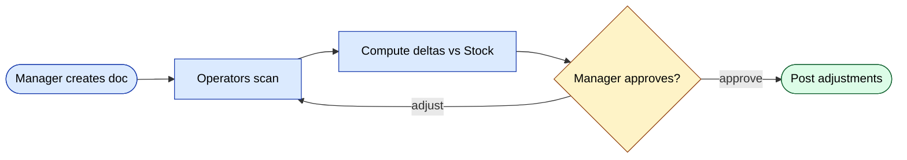
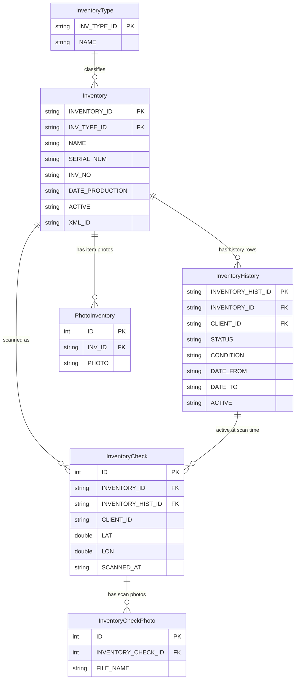
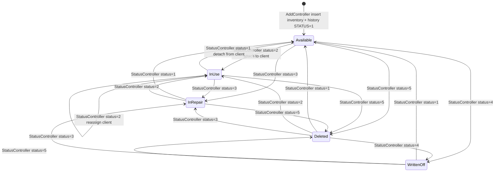
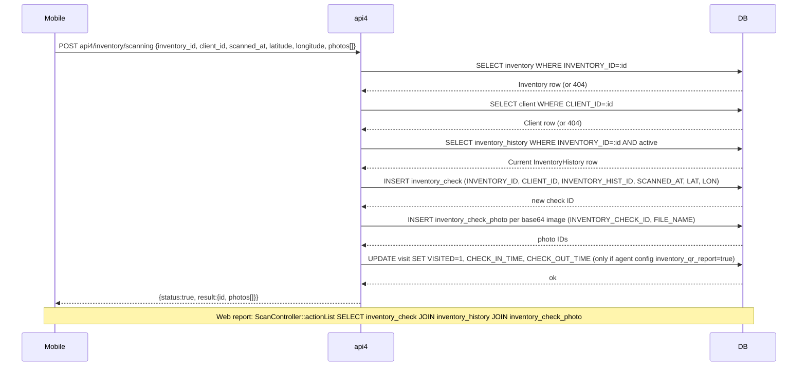

# Модуль `inventory`

Физическая инвентаризация (стоктейки) с мобильным сканированием штрих-кодов
и сверкой с системными остатками.

## Ключевые возможности

| Возможность | Что делает | Роль(и) владельца |
|---------|--------------|---------------|
| Создать документ инвентаризации | Запуск нового стоктейка; выбор `inventory_type` | 1 / 2 / 9 |
| Область по клиенту / складу | Ограничить документ конкретной точкой или складом | 1 / 9 |
| Мобильное сканирование | Операторы сканируют штрих-коды один за другим через api3 | 4 / складские сотрудники |
| Фотодоказательства | Прикрепить фото повреждённых или недостающих позиций | 4 |
| Сверка | Расчёт дельт относительно текущего `Stock` | system |
| Корректировки | При утверждении дельты заносятся обратно в остатки | 1 / 9 |
| История | История правок и утверждений на документ | system |

## Папка

```
protected/modules/inventory/
├── controllers/
│   ├── AddController.php
│   ├── EditController.php
│   ├── DeleteController.php
│   ├── ListController.php
│   ├── HistoryController.php
│   ├── PhotoController.php
│   ├── ScanController.php
│   └── StatusController.php
└── views/
```

## Воркфлоу

1. Менеджер создаёт документ инвентаризации (`AddController`).
2. Операторы сканируют товары на складе через `ScanController`
   (мобильный, api3).
3. Система вычисляет дельты относительно текущих остатков.
4. Менеджер утверждает; дельты заносятся в `stock` как корректировки.

## Ключевой поток функционала — стоктейк



## Фотографии

`PhotoController` прикрепляет фотодоказательства к строке (например, повреждённый
товар). Хранятся в `upload/inventory/<doc_id>/`.

## Права доступа

| Действие | Роли |
|--------|-------|
| Создание | 1 / 2 / 9 |
| Сканирование (мобильное) | 4 / складские сотрудники |
| Утверждение | 1 / 2 / 9 |

## Воркфлоу

### Точки входа

| Триггер | Контроллер / Действие / Задача | Замечания |
|---|---|---|
| Web (менеджер) | `AddController::actionIndex` | Создание одного элемента инвентаризации; валидирует `InventoryType` и опционально `Client` |
| Web (менеджер, пакетно) | `AddController::actionBatch` | Массовое создание элементов из импортированного списка |
| Web (менеджер) | `EditController::actionInventory` | Редактирование метаданных элемента (имя, серийный, тип) |
| Web (менеджер) | `EditController::actionHistory` | Перепривязка / переназначение элемента к другому клиенту; закрывает старую строку `InventoryHistory` |
| Web (менеджер) | `StatusController::actionEdit` | Смена статуса одного элемента; защищает разрешённые переходы через `InventoryService::CAN_CHANGE_STATUS_TO` |
| Web (менеджер, массово) | `StatusController::actionBulkEdit` | Массовая смена статуса для набора ID элементов |
| Web (менеджер) | `PhotoController::actionAdd` | Прикрепление фотодоказательства к элементу (макс. 3, макс. 5 МБ) |
| Mobile (агент) | `api4/InventoryController::actionScanning` | Запись события сканирования штрих-кода/QR для элемента в точке клиента |
| Mobile (агент) | `api4/InventoryController::actionScanningPhoto` | Загрузка фото события сканирования (`InventoryCheckPhoto`) |
| Web (отчёт) | `ScanController::actionList` | Получение лога событий сканирования (join `inventory_check` + `inventory_history` + `inventory_check_photo`) |
| Web (отчёт) | `HistoryController::actionData` | Получение полной истории назначений по всем элементам |

### Доменные сущности



### Воркфлоу 1.1 — Жизненный цикл единицы инвентаризации (создание и переходы статусов)

Менеджер регистрирует физический актив через `AddController::actionIndex`, который атомарно вставляет строку `Inventory` и начальную строку `InventoryHistory`. С этого момента элемент проходит по контролируемому набору статусов. Все переходы валидируются по `InventoryService::CAN_CHANGE_STATUS_TO`; нелегальные скачки отвергаются до любых записей в БД.



### Воркфлоу 1.2 — Событие мобильного сканирования (агент сканирует QR/штрих-код в точке клиента)

Полевой агент открывает `api4/InventoryController::actionScanning`. Эндпоинт валидирует элемент и клиента, резолвит текущую строку `InventoryHistory`, сохраняет запись `InventoryCheck` (с GPS-координатами), сохраняет любые прикреплённые фото как строки `InventoryCheckPhoto` и — если в конфиге агента включён `visiting.inventory_qr_report` — отмечает соответствующий `Visit` как посещённый. Web-контроллер `ScanController::actionList` затем join-ит `inventory_check`, `inventory_history` и `inventory_check_photo`, чтобы построить отчёт по событиям сканирования.



### Межмодульные точки соприкосновения

- Чтения: `client.Client` (валидация целевого клиента в `AddController::actionIndex`, `EditController::actionHistory`, `api4/InventoryController::actionScanning`)
- Чтения: `visiting.Visiting` (резолв списка клиентов агента в `api4/InventoryController::actionList`)
- Записи: `visiting.Visit` (отметка визита как `VISITED=1` при включённом конфиге агента `inventory_qr_report`, внутри `api4/InventoryController::actionScanning`)
- API: `api4/inventory/scanning`, `api4/inventory/scanningPhoto`, `api4/inventory/add`, `api4/inventory/edit`, `api4/inventory/list`

### Подводные камни

- `InventoryHistory` использует паттерн **soft-close**: при смене статуса предыдущая активная строка получает `ACTIVE='N'` и `DATE_TO=now` отдельным `UPDATE`, затем вставляется новая строка — нет in-place обновления колонки статуса. Запросы, которые забывают фильтр `ACTIVE='Y'`, увидят дубликаты текущих состояний.
- `StatusController::actionEdit` проверяет `InventoryService::CAN_CHANGE_STATUS_TO` для одиночных переходов, но `StatusController::actionBulkEdit` откатывается к `InventoryHistory::model()->statuses` (более старый массив instance-property, в котором нет статуса `5`). Эти две защиты не синхронизированы.
- Soft-delete (`ACTIVE='N'` в строке `Inventory`) защищён через `ServerSettings::enableInventoryDeletion()`. Если флаг выключен, статус `5` всё ещё может быть записан в `InventoryHistory`, но элемент остаётся видимым в `ListController::actionData`.
- `api3/InventoryController::actionSet` — старый мобильный эндпоинт, который создаёт `Inventory` + `InventoryHistory` без фабрики `InventoryService`; он всегда жёстко прописывает `STATUS=2` и `DILER_ID='d0_1'`. Для новых работ предпочитайте `api4`.
