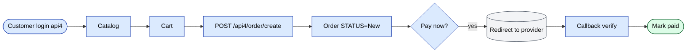

# Модуль `onlineOrder`

B2B онлайн-магазин + канал заказа через Telegram-бот. Клиенты (или
их операторы) размещают заказы без визита агента.

## Ключевые возможности

| Возможность | Что делает | Роль(и) владельца |
|---------|--------------|---------------|
| Просмотр публичного каталога | Клиент просматривает товары с фильтрами по категории / бренду / наличию | конечный клиент |
| Корзина + размещение заказа | Клиент отправляет через api4 | конечный клиент |
| Редирект на онлайн-оплату | Передача в Click / Payme / Paynet для оплаты | конечный клиент |
| Поток оплаты позже | Для клиентов с кредитом; проходит через стандартный пайплайн заказа | конечный клиент |
| История заказов | Клиент видит прошлые заказы + статусы + скачиваемые счета | конечный клиент |
| Контактная форма | Связь с командой операторов через портал | конечный клиент |
| Отчёты | Отчёты по собственному потреблению клиента | конечный клиент |
| Запланированные отчёты | Периодические дайджесты отчётов на email | конечный клиент |
| Telegram-бот | `/start`, `/catalog`, `/order`, `/orders`, `/help` | конечный клиент |
| Telegram WebApp | Встроенный SPA внутри Telegram для полного оформления заказа | конечный клиент |

## Контроллеры

| Контроллер | Назначение |
|------------|---------|
| `CatalogController` | Просмотр публичного каталога |
| `ContactController` | Контактная форма / сообщения |
| `OrderController` | Размещение заказа и история |
| `PaymentController` | Редирект на онлайн-оплату |
| `ReportController` | Собственные отчёты клиента |
| `ScheduledReportController` | Периодические отчёты на email |
| `TelegramController` | Webhook Telegram-бота |
| `WebAppController` | Хост Telegram WebApp |

## Аутентификация

Онлайн-пользователи аутентифицируются по той же таблице `User`, но
с другой `ROLE`. Сессии по-прежнему проходят через Redis db0 с
префиксом `HTTP_HOST`.

## Ключевой поток функционала — онлайн-заказ

См. **Feature · Online order + Defect/Return** в
[FigJam · sd-main · Feature Flows](https://www.figma.com/board/MyvyaeEluqvHofH4E2qIoU).

