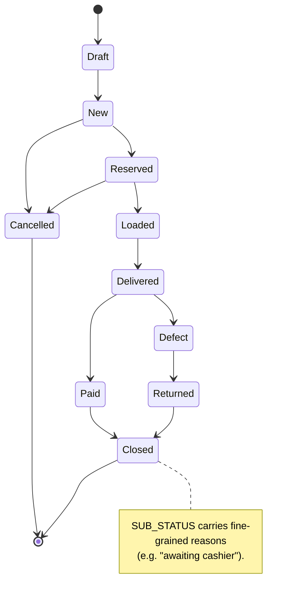
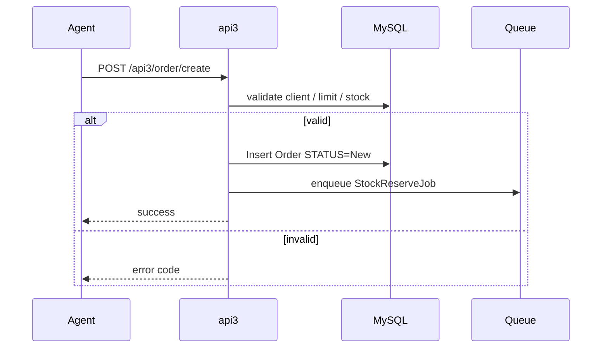
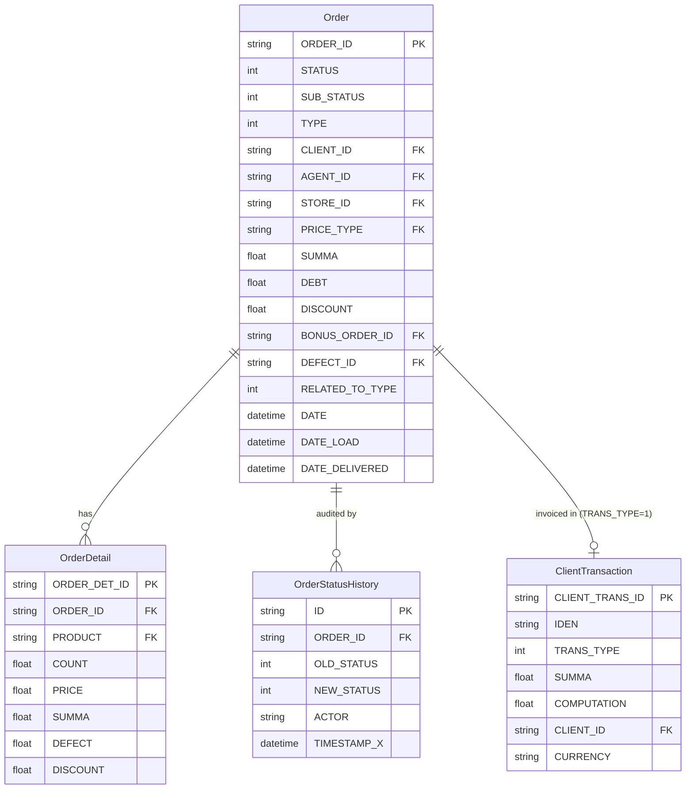
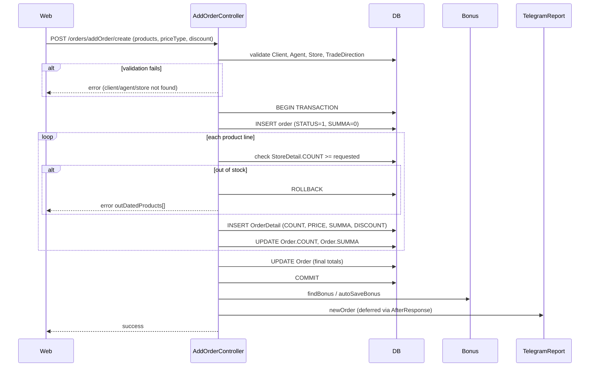
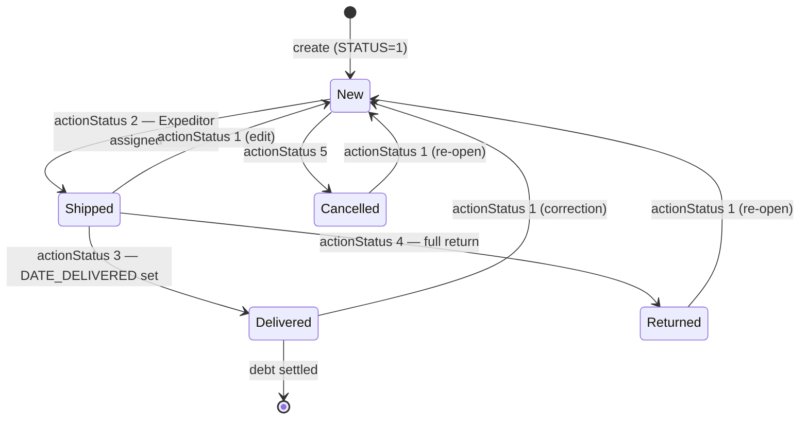
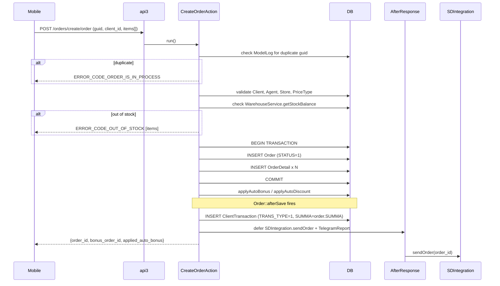
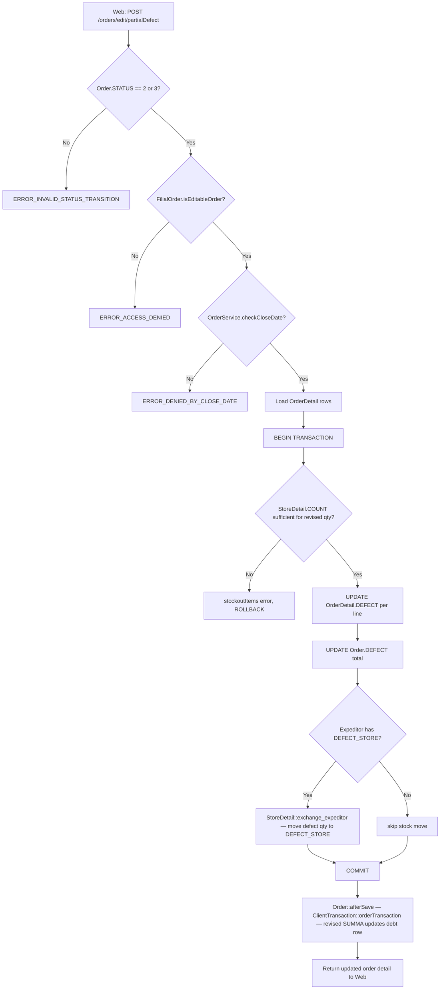

# Модуль `orders`

Сердце sd-main. Захватывает, ценит, валидирует и отслеживает заказы
на протяжении всего их жизненного цикла.

## Ключевые возможности

| Возможность | Что делает | Роль(и) владельца |
|---------|--------------|---------------|
| **Захват заказа (web)** | Оператор/менеджер строит заказ построчно в админ-UI | 1 / 2 / 3 / 5 / 9 |
| **Захват заказа (мобильный)** | Полевой агент отправляет заказы во время визита через api3 | 4 |
| **Захват заказа (онлайн / B2B)** | Самообслуживание клиента через api4 / WebApp / Telegram | конечный клиент |
| **Цены и типы цен** | Активный прайс-лист на заказ; наценка по продукту, если `enableMarkupPerProduct` | – |
| **Скидки** | Скидки на строки + скидка на заголовок; для отчётов побеждает строка | 4 / 9 |
| **Бонусы** | Промо-бонусные заказы, связанные через `BONUS_ORDER_ID` | 1 / 9 |
| **Воркфлоу утверждения** | Утверждение менеджером/администратором перед резервированием остатков (настраивается) | 1 / 2 / 9 |
| **Переходы статусов** | Draft → New → Reserved → Loaded → Delivered → Paid → Closed (+ Cancelled / Defect / Returned) | system |
| **Дефект / отказ при доставке** | Дефект на строку с фотодоказательствами; авто-возврат на склад | 10 / 9 |
| **Импорт из Excel** | Пакетное создание заказов из CSV / Excel, если `enableImportOrders` | 1 / 5 |
| **Экспорт в 1С / Faktura.uz / Didox** | Исходящий экспорт в учётную систему / EDI при смене статуса | system |
| **Push + SMS уведомления** | Изменение статуса уведомляет клиента и агента | system |
| **Шаблоны печати** | Кастомные шаблоны печати инвойсов / накладных по арендатору | 1 |
| **Аудиторский след** | Строка `OrderStatusHistory` на каждый переход с автором + временной меткой | system |

## Папка

```
protected/modules/orders/
├── controllers/
│   ├── AddOrderController.php
│   ├── ApiController.php
│   ├── CleanOrdersController.php
│   ├── CreateController.php
│   ├── ListController.php
│   ├── EditController.php
│   ├── DeleteController.php
│   ├── ApproveController.php
│   ├── DeliveryController.php
│   └── ImportController.php
├── models/
└── views/
```

## Ключевые сущности

| Сущность | Модель | Принадлежит модулю | Замечания |
|--------|-------|-----------------|-------|
| Заказ | `Order` | `orders` | Заголовок (~50 кол.) |
| Строка заказа | `OrderProduct` | `orders` | Строка по продукту с ценой, количеством |
| История статусов заказа | `OrderStatusHistory` | `orders` | Аудиторский след |
| **Дефект** | `Defect` | **`orders`** | Декларации дефекта на строку для доставленного заказа. **Не** связано с `AFacing` / `AuditResult` модуля `audit` (там фиксируются мерчандайзинговые опросы, а не дефекты доставки). |
| **Отказ** | обрабатывается inline в `Order` | **`orders`** | Полный отказ от заказа во время доставки. Отличается от дефекта на строку: отказ возвращает весь заказ на склад. |
| Бонус | `Bonus*` | `orders` | Промо-бонусные заказы, связанные через `BONUS_ORDER_ID` |

## Машина состояний

См. диаграмму **sd-main · Order state machine** в
[FigJam · sd-main · System Design](https://www.figma.com/board/tw0B3eE1bKNbvmmny8TVvx).



## Ключевой поток функционала — создание заказа

См. **Feature · Create Order (mobile / api3)** в
[FigJam · sd-main · Feature Flows](https://www.figma.com/board/MyvyaeEluqvHofH4E2qIoU).



## API-эндпоинты

| Эндпоинт | Модуль | Назначение |
|----------|--------|---------|
| `POST /api3/order/create` | api3 | Создание заказа мобильным агентом |
| `POST /api4/order/create` | api4 | B2B / онлайн создание |
| `GET /api3/order/list` | api3 | Собственные заказы агента |
| `POST /orders/approve` | orders | Утверждение в web |

См. [Справочник API v3](../api/api-v3-mobile/index.md) для полных payload-ов.

## Права доступа

| Действие | Роли |
|--------|-------|
| Создание | 1, 2, 3, 4, 5, 9 |
| Утверждение | 1, 2, 9 |
| Отмена | 1, 2 |
| Удаление | 1 (только при `enableDeleteOrders`) |

## См. также

- [`clients`](./clients.md) · [`agents`](./agents.md) ·
  [`stock`](./stock.md) · [`payment`](./payment.md)

## Воркфлоу

### Точки входа

| Триггер | Контроллер / Действие / Задача | Замечания |
|---|---|---|
| Web — оператор строит заказ | `AddOrderController::actionCreate` (строка 432) | Полное создание заказа в web с детальными строками, скидкой, бонусом |
| Web — оператор обновляет заказ | `AddOrderController::actionUpdate` (строка 744) | Тот же путь валидации, что и при создании |
| Mobile — агент отправляет заказ | `CreateController` → `CreateOrderAction::run` (строка 16) | Эндпоинт api3 `/orders/create/order` |
| Mobile — агент получает заказ | `GetController` → `GetOrderAction::run` | Эндпоинт api3 `/orders/get/order` |
| Mobile — экспедитор фиксирует платёж | `PaymentController` → `SetAction::run` (строка 5) | Эндпоинт api3 `/orders/payment/set`; пишет `ClientTransaction` |
| Web — смена статуса (одиночная или пакетная) | `EditController::actionStatus` (строка 1029) | Валидация через `VALID_STATUS_TRANSITIONS`; вызывает `Order::afterSave` |
| Web — пакетная смена статуса | `EditController::actionStatusBatch` (строка 1331) | Устанавливает `BULK_STATUS_CHANGE = true`, чтобы подавить per-order Telegram-шум |
| Web — частичная декларация дефекта | `EditController::actionPartialDefect` (строка 689) | Разрешено только при STATUS 2 или 3 |
| Web — представление списка заказов | `ListController::actionOrders` (строка 33) | Постраничный JSON для сетки заказов |
| Web — детальное представление заказа | `OrdersController::actionView` (строка 1369) | Рендерит страницу просмотра заказа |
| Web — смена под-статуса | `EditController::actionSubstatus` (строка 1754) | Точечный под-статус хранится в поле `SUB_STATUS` |
| Web — поступление от поставщика | `SupplierController::actionReceipt` (строка 5) | Гейт `operation.orders.supplier.receipt` |
| Cron / Queue — проверка кода CIS | `CheckOrderCisesJob::handle` | Валидирует CIS-коды продуктов через XTrace API |

---

### Доменные сущности



---

### Воркфлоу 1.1 — Создание заказа в web

Оператор открывает `/orders/addOrder`, заполняет клиента / товары / скидку и отправляет.
`AddOrderController::actionCreate` выполняет DB-транзакцию: сохраняет заголовок `Order` со STATUS=1 (New), затем вставляет одну строку `OrderDetail` на каждый продукт.
Правила бонусов и скидок применяются после фиксации транзакции.



---

### Воркфлоу 1.2 — Жизненный цикл заказа (переходы статусов)

Сущность `Order` перемещается между пятью числовыми статусами. Переходы валидируются через `EditController::VALID_STATUS_TRANSITIONS` (строка 21). Каждое сохранение проходит через `Order::afterSave` (строка 383), который вызывает `ClientTransaction::orderTransaction`, чтобы поддерживать книгу долгов в актуальном состоянии.



---

### Воркфлоу 1.3 — Создание мобильного заказа через api3 и накопление долга

Полевой агент отправляет заказ из мобильного приложения. `CreateOrderAction` (api3) сохраняет заказ и откладывает SDIntegration и Telegram-вызовы через `AfterResponse`. На том же хуке `Order::afterSave` `ClientTransaction::orderTransaction` вставляет строку инвойса `TRANS_TYPE=1` в `client_transaction`, создавая запись долга.



---

### Воркфлоу 1.4 — Декларация частичного дефекта и возврат на склад

Когда экспедитор доставляет заказ с повреждённым товаром, оператор вызывает `EditController::actionPartialDefect` (строка 689). Количество дефекта записывается на `OrderDetail.DEFECT`, итог `Order.DEFECT` обновляется, а остатки возвращаются на склад дефектов через `StoreDetail::exchange_expeditor`, если у экспедитора настроен `DEFECT_STORE`.



---

### Межмодульные точки соприкосновения

- Чтения: `clients.Client` (валидация CLIENT_ID, вывод CLIENT_CAT, CITY, EXPEDITOR)
- Чтения: `stock.Store` / `stock.StoreDetail` (проверки баланса остатков, выбор склада)
- Чтения: `agents.Agent` (тип VAN_SELLING определяет экспедитора и право на склад)
- Чтения: `price.PriceType` / `price.OldPrice` (цены строк по типу цен)
- Чтения: `discount.SkidkaManual` (валидация ручной скидки по продукту / агенту)
- Записи: `finans.ClientTransaction` (инвойс TRANS_TYPE=1 при смене STATUS через `Order::afterSave`)
- Записи: `finans.ClientFinans` (коррекция баланса долга через `ClientFinans::correct`)
- Записи: `bonus.BonusOrder` / `bonus.BonusOrderDetail` (авто-бонус и ретро-бонус при создании)
- Записи: `stock.StoreLog` (синхронизация DATE_LOAD при каждой смене статуса)
- API: `api3/orders/create/order` (создание мобильного заказа)
- API: `api3/orders/get/order` (получение мобильного заказа)
- API: `api3/orders/payment/set` (запись мобильного платежа)
- Внешние: `SDIntegration::sendOrder` срабатывает отложенно через `AfterResponse` после любого сохранения заказа

---

### Подводные камни

- **STATUS — целые числа, не константы.** `Order` использует голые целые числа 1–5 (и 7 для алиаса метки "edit"). В модели `Order` нет именованных констант `STATUS_*` — только в `OrderIdokon`. При чтении кода сверяйтесь с `EditController::STATUS_NAMES` (строка 29).
- **Флаг `BULK_STATUS_CHANGE`.** Пакетные вызовы статуса перед сохранением выставляют `$order->BULK_STATUS_CHANGE = true`, чтобы подавить per-order вызов `notifyInoutReporter` внутри `Order::afterSave`. Пропуск этого флага вызовёт N Telegram-сообщений при пакетных обновлениях.
- **Долг записывается в `afterSave`, а не контроллером.** `ClientTransaction::orderTransaction` запускается внутри `Order::afterSave` каждый раз при сохранении заказа, а не только при переходах статусов. Пере-сохранения, вызванные обновлениями скидки или бонуса, также пересчитывают строку долга — будьте осторожны при вызовах `$order->save()` в утилитарных скриптах.
- **`debtNewOrder` vs стандартный путь finans.** Если `Yii::app()->params['debtNewOrder']` равен true и агент — VAN_SELLING или SELLER, вместо `orderTransaction` вызывается `newOrderTransaction`. Эти два метода создают разные формы транзакций — их смешивание вызывает несоответствия при сверке.
- **Частичный дефект разрешён только при STATUS 2 или 3.** Путь полного возврата (STATUS → 4) — это отдельный переход статуса, не через `actionPartialDefect`. Не путайте `Order.DEFECT` (количество частичного дефекта) с `Order.TYPE=2` (полный возврат с полки).
- **`Create2Controller`, `Create3Controller`, `CreateOrder2Controller`, `CreateOrder3Controller` — `.obsolete`.** Активный путь создания в web — `AddOrderController`. Активный путь api3 — `CreateController` + `CreateOrderAction`.
- **`SetAction` (платёж) пишет `ClientTransaction.TRANS_TYPE=3`.** Это квитанция платежа, отличная от строки инвойса (`TRANS_TYPE=1`), которую пишет `orderTransaction`. Обе ссылаются на один и тот же `ORDER_ID` через поле `IDEN`. Модуль `payment` читает те же строки — модуль `orders` пишет только квитанцию со стороны заказа.
