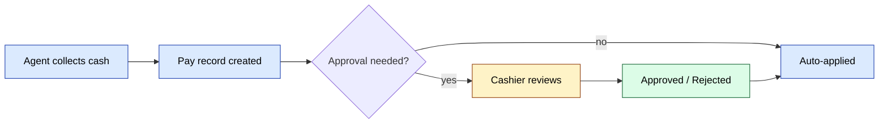

# Модули `payment` и `pay`

Два связанных модуля:

- **`pay`** — низкоуровневая регистрация платежей (записи против заказов).
- **`payment`** — воркфлоу утверждения поверх `pay`.

## Ключевые возможности

| Возможность | Что делает | Роль(и) владельца |
|---------|--------------|---------------|
| Регистрация платежа | Создание строки `Payment`, привязанной к заказу | Агент / Оператор |
| Утверждение платежа | Кассир подтверждает реальность платежа | Кассир |
| Отклонение платежа | Кассир отклоняет с указанием причины | Кассир |
| Применение к долгу | При утверждении применяется к долгу клиента + кассе | system |
| Переназначение на другой заказ | Оператор может перенаправить ошибочный платёж | 1 / 6 |
| Уведомление | Агент + клиент уведомляются об исходе | system |

## Поток утверждения

См. **Feature · Payment Collection & Approval** в
[FigJam · sd-main · Feature Flows](https://www.figma.com/board/MyvyaeEluqvHofH4E2qIoU).

`payment/ApprovalController` — экран проверки кассиром.

## Аудит воркфлоу

См. [Стандарты дизайна воркфлоу](../team/workflow-design.md) — этот
поток оценён по 12 принципам дизайна. Открытые задачи: добавить
порог автоутверждения, фиксировать причину отклонения, добавить таймер SLA.

## Права доступа

| Действие | Роли |
|--------|-------|
| Создание | 4 / 5 / 6 |
| Утверждение / отклонение | 6 (кассир) / 1 / 2 |
| Переназначение | 1 / 6 |
