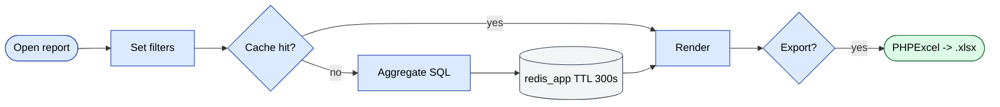

# Модуль `report`

Самый крупный модуль (80+ отчётов). Каждый отчёт — это собственный
контроллер, возвращающий HTML + Excel.

## Ключевые возможности

| Возможность | Что делает | Роль(и) владельца |
|---------|--------------|---------------|
| 80+ именованных отчётов | Продажи, долги, дефекты, KPI, аудиты, GPS, бонусы и т. д. | 1 / 2 / 8 / 9 |
| Сохранённые пресеты фильтров | Сохранение комбинаций фильтров как именованных пресетов | 1 / 9 |
| Экспорт в Excel | Стрим больших датасетов через PHPExcel с консистентными форматами чисел | 1 / 2 / 9 |
| Кэшированные агрегаты | Тяжёлые SQL кэшируются в `redis_app` 5 мин | system |
| Drill-down в подотчёт | Клик по строке → детальный отчёт по той же сущности | 1 / 9 |
| Права на каждый отчёт | Каждый отчёт контролируется RBAC | 1 |

## Контроллеры (выборочно)

`AgentController`, `AnalyzeController`, `BonusController`,
`BonusAccumulationController`, плюс десятки других для продаж, долгов,
возвратов, дефектов, аудитов, GPS, KPI и т. д.

## Создание отчёта

1. Создайте контроллер в
   `protected/modules/report/controllers/`.
2. Унаследуйте от `BaseReport`
   (`protected/components/BaseReport.php`).
3. Определите переопределения `dataProvider()`, `columns()` и `excel()`.
4. Добавьте запись в боковой панели в навигационной конфигурации отчётов.

## Экспорт в Excel

На базе `phpexcel`. Конвенции форматирования чисел
управляются через `params.excelFormat`:

```php
'excelFormat' => [
    'count'  => 1, // formatted with thin space
    'volume' => 0, // raw float
    'summa'  => 2, // currency style ("$1,234.00")
],
```

## Ключевой поток функционала — запуск отчёта

См. **Feature · Report Run & Excel Export** в
[FigJam · sd-main · Feature Flows](https://www.figma.com/board/MyvyaeEluqvHofH4E2qIoU).


