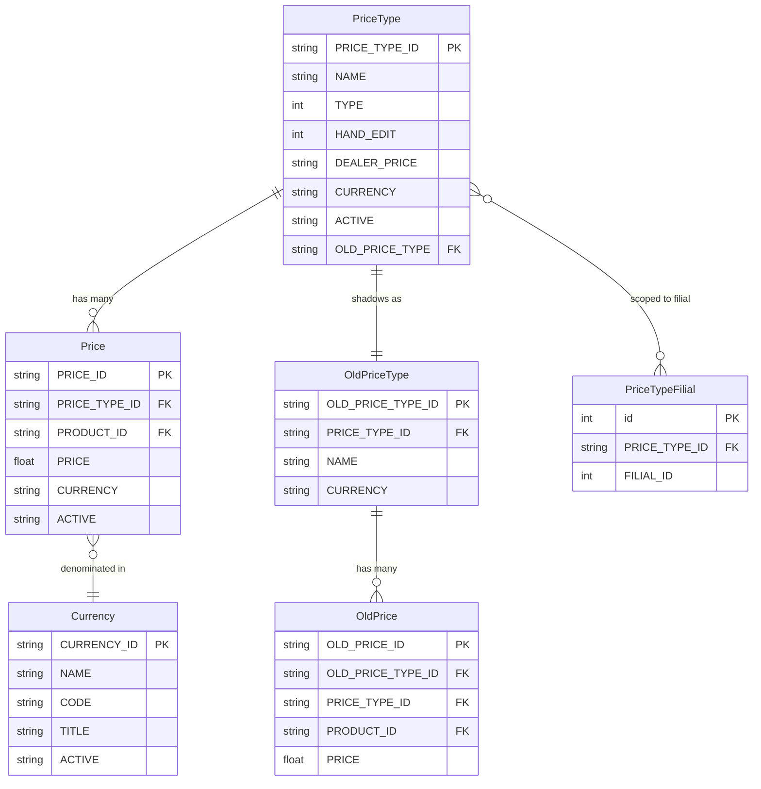
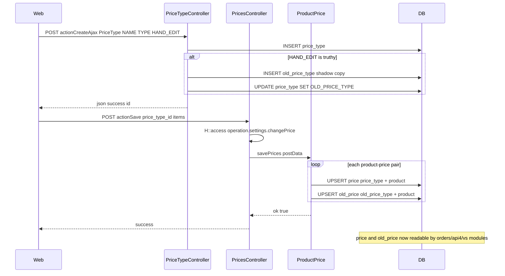
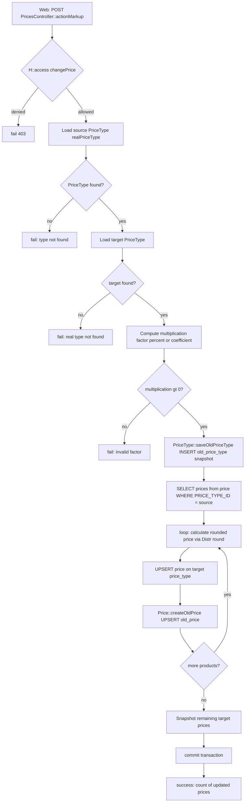
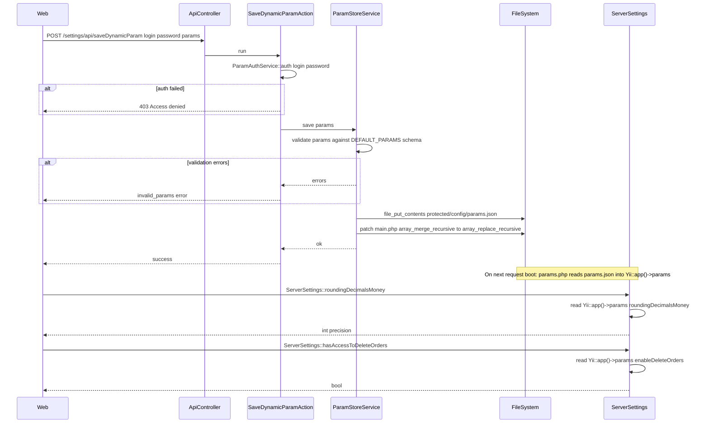

# Модули `settings`, `access`, `staff`

Админская конфигурация платформы.

## Ключевые возможности

### `settings`

| Возможность | Что делает | Роль(и) владельца |
|---------|--------------|---------------|
| Форматы чисел | Разделители тысяч, число знаков после запятой, символы валют | 1 |
| Валюты | Поддерживаемые валюты + курсы обмена | 1 / Finance |
| Шаблоны печати | Шаблоны печати инвойса / накладной / заказа | 1 |
| Шаблоны инвойсов | Форматирование инвойсов на арендатора | 1 |
| Feature-флаги | Переключение экспериментальных функций на арендатора | 1 |
| Просмотрщик системного лога | Просмотр рантайм-логов | 1 |

### `access`

| Возможность | Что делает | Роль(и) владельца |
|---------|--------------|---------------|
| Назначение ролей | Присвоение пользователей ролям | 1 / 2 |
| Сетка прав | Редактирование прав по ролям на операции | 1 |
| Видимость филиалов | Ограничение пользователей подмножеством филиалов | 1 / 2 |
| Сброс кэша | Принудительная перезагрузка иерархии authitem | 1 |

Сама иерархия ролей живёт в `protected/config/auth.php`.

### `staff`

| Возможность | Что делает | Роль(и) владельца |
|---------|--------------|---------------|
| CRUD пользователей | Создание / редактирование / деактивация внутренних сотрудников | 1 / 2 |
| Назначение ролей | Присвоение внутреннего персонала ролям вроде менеджера, супервайзера, экспедитора | 1 / 2 |
| Просмотр истории пользователя | Аудиторский след на пользователя | 1 |

`CreateController`, `EditController`, `DeleteController`,
`ListController`, `ViewController`.

## Воркфлоу

> Замечание: `access` и `staff` под-модули делят страницу сайдбара, но вне области рассмотрения здесь (Phase 2). Этот раздел покрывает только модуль `settings`.

> **Область Phase 1:** Этот раздел Воркфлоу документирует потоки конфигурации цен, параметров и настроек. Модуль settings также владеет ~50 другими контроллерами (продукты, бренды, категории, единицы, регионы, валюты, интеграции и т. д.) — они отложены в Phase 2 и не перечислены в точках входа ниже.

### Точки входа

| Триггер | Контроллер / Действие / Задача | Замечания |
|---|---|---|
| Web (admin) | `PriceTypeController::actionIndex` | Список / создание / обновление типов цен; защищено `operation.settings.priceType` |
| Web (admin) | `PriceTypeController::actionCreateAjax` | Создание новой записи `PriceType`; также бутстрапит теневую копию `OldPriceType`, когда `HAND_EDIT=1` |
| Web (admin) | `PriceTypeController::actionUpdateAjax` | Обновление существующего `PriceType`; защита only-filial через `FilialComponent::isOnlyFilial()` |
| Web (admin) | `PricesController::actionIndex` | Рендер сетки цен по продуктам для данного типа цен |
| Web (admin) | `PricesController::actionSave` | Сохранение пакета цен на один продукт; вызывает `ProductPrice::savePrices`; защищено `operation.settings.changePrice` |
| Web (admin) | `PricesController::actionMultiSave` | Массовое сохранение цен для всех дилерских типов цен, назначенных на текущий филиал |
| Web (admin) | `PricesController::actionSaveWithout` | Ручное переопределение цены на не-HAND\_EDIT тип цены; пишет строки `price` + `old_price` |
| Web (admin) | `PricesController::actionMarkup` | Вычисление и применение процентной или коэффициентной наценки по категории; защищено `operation.settings.changePrice` |
| Web (admin) | `PricesController::actionImportExcel` | Загрузка Excel-файла для массового импорта цен (`Price::ImportExcel`) |
| Web (admin) | `CurrencyController::actionIndex` | Список / создание / обновление записей валют |
| Web (admin) | `CurrencyController::actionUpdateAjax` | Обновление записи `Currency` in-place |
| Web (admin) | `ParamsController::actionIndex` | Рендер UI настройки динамических параметров |
| API (authenticated) | `ApiController` → `SaveDynamicParamAction` | POST: валидация и сохранение динамических параметров в `protected/config/params.json`; также патчит `array_merge_recursive` → `array_replace_recursive` в `main.php` |
| API (authenticated) | `ApiController` → `GetDynamicParamAction` | POST: возврат текущих динамических параметров + схемы по умолчанию |
| API (authenticated) | `ApiController` → `GetSubstatusesAction` | POST: возврат текущей конфигурации под-статусов заказа |
| Web — сохранение под-статуса | `ApiController` → `SaveDynamicParamAction` (substatus-ветка) | Сохранение под-статусов обработано ветвью внутри `SaveDynamicParamAction::run()` (строки 27–43) — нет отдельного класса действия |
| Web (admin) | `SettingsController::actionSaveSettings` | Сохранение per-user настроек колонок/фильтров datatable в `tableControl` |
| Web (admin) | `SettingsController::actionSaveHeaderOrders` | Сохранение per-user порядка колонок datatable в `tableControl` |
| Web (admin) | `SettingsController::actionTruncateCache` | TRUNCATE таблицы `cache` и редирект |

### Доменные сущности

### Воркфлоу 1.1 — Настройка типа цены и цен по продуктам

Админ определяет тип цены (например, "Розница", "Дилер"), затем устанавливает отпускную цену для каждого продукта по этому типу. Сохранённые цены сразу видимы для создания заказа и мобильного представления остатков агента.

### Воркфлоу 1.2 — Массовый пересчёт наценки

Админ применяет процентную или коэффициентную наценку к исходному типу цены, записывая вычисленные цены в целевой тип цены. Все затронутые продукты получают и строку `price`, и снапшот `old_price` для исторического сравнения.

### Воркфлоу 1.3 — Конфигурация динамических параметров

Админ (или межсерверная автоматизация) пишет валидированный JSON-блоб флагов фич уровня арендатора и числовых настроек в `params.json`. Файл мерджится в `Yii::app()->params` при загрузке и потребляется везде через хелперы `ServerSettings`.

### Межмодульные точки соприкосновения

- Чтения: `settings.PriceType` — потребляется `orders.CreateOrderController`, `orders.ImportOrderController`, `vs.CreateOrderController` (ценообразование строк заказа)
- Чтения: `settings.Price` — потребляется `api4.CreateVsReturnAction`, `api4.CreateReplaceAction`, `api4.CreateDefectAction`, `PriceService::getPrices` (поиск цен мобильного агента в остатках)
- Чтения: `settings.OldPrice` — потребляется `vs.CreateOrderController` (исторический diff цены), `clients.FinansController` (расчёт долга при доставке)
- Чтения: `settings.PriceType` + `settings.OldPriceType` — потребляется `orders.RecoveryOrderController` (ценообразование при восстановлении заказа)
- Чтения: `settings.Currency` — потребляется `PricesController::actionConfig` (блок формата), `PriceTypeController::actionCreateAjax` (назначение валюты)
- Чтения: `settings.PriceTypeFilial` — потребляется `PricesController::actionMultiSave` (фильтрация типов цен на дилерские типы текущего филиала)
- Записи: `Yii::app()->params` (через `params.json`) — потребляется `models.Order` (флаг `debtNewOrder`), `models.ServerSettings` (`roundingDecimalsMoney`, `visitDistance`, `enableDeleteOrders`, `hasNotAccessToEditPurchase` и т. д.), `components.Formatter` (округление денег/количеств по всему приложению)
- Записи: `upload/status_config.txt` — потребляется `ServerSettings::substatuses()` (метки под-статусов заказа в представлениях заказа)
- Записи: `tableControl` — потребляется `SettingsController::actionSaveSettings` / `actionSaveHeaderOrders` (per-user настройки datatable, читаемые всеми страницами datatable)

### Подводные камни

- `PricesController::actionSaveWithout` оперирует только типами цен, где `HAND_EDIT = 0`; если тип цены уже в режиме ручной правки, метод молча no-op без ответа об ошибке.
- `PricesController::actionMultiSave` фильтрует filial-scoped дилерские типы цен через сырой SQL-join на `price_type_filial`; если `FilialComponent::isOnlyFilial()` возвращает false (контекст супер-админа), фильтр пропускается, и обрабатываются все типы цен.
- `ParamStoreService::save` также патчит `protected/config/main.php` на месте (заменяя `array_merge_recursive` на `array_replace_recursive`), чтобы динамические параметры имели приоритет над статическим конфигом. Это файловая мутация на конфиге приложения и требует прав на запись в `main.php` в рантайме.
- `SaveDynamicParamAction` использует кастомную проверку учётных данных `ParamAuthService::auth` поверх стандартной session-авторизации Yii; отсутствующая или неверная учётка возвращает 403 даже залогиненному админу.
- Под-статусы хранятся как простой текстовый JSON-файл в `upload/status_config.txt` (вне `protected/`). После сохранения `ServerSettings::$_substatuses` очищается через PHP `ReflectionClass`, потому что статический кэш не сбрасывается обычным жизненным циклом запроса.
- Теневые таблицы `OldPrice` / `OldPriceType` существуют для diff-а истории цен в заказах. Каждый запуск массовой наценки сначала вызывает `PriceType::saveOldPriceType()`; пропуск или частично-завершённая транзакция наценки может оставить теневые таблицы в несогласованном состоянии при rollback в середине цикла.
- Только строки `PriceType` с `DEALER_PRICE = 1` пушатся в мобильное приложение через `api4`; не-дилерские типы цен невидимы полевым агентам.
