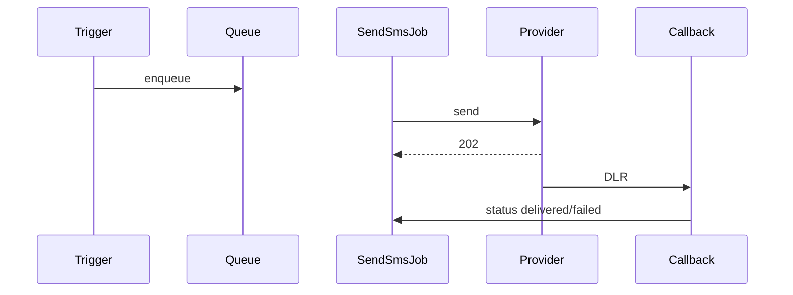

# Модуль `sms`

Исходящие SMS через настраиваемый шлюз. Шаблоны, пакеты, запланированные
сообщения, callback-и доставки.

## Контроллеры

`MessageController`, `PackageController`, `TemplateController`,
`ViewController`, `CallbackController`.

## Поток

1. Шаблон определяется в Settings → SMS → Templates.
2. Триггер-событие (например, заказ доставлен) ставит в очередь `SendSmsJob`.
3. Задача отправляет в HTTP API SMS-шлюза.
4. Шлюз вызывает `CallbackController` со статусом доставки.
5. Статус сохраняется в `SmsMessage` и отображается в отчётах.

## Ключевой поток функционала — отправка SMS

См. **Feature — SMS / Notification Dispatch** на
[доске FigJam](../architecture/diagrams.md).

