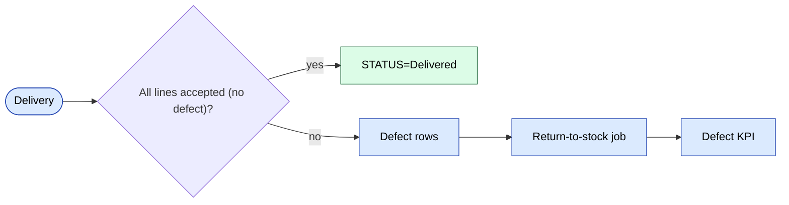

# Модуль `stock`

Операции на уровне количества поверх складского слоя: возвраты,
обмены между магазинами, списания, закупки. Дополняет
[`warehouse`](./warehouse.md) (который хранит заголовки документов).

## Ключевые возможности

| Возможность | Что делает | Роль(и) владельца |
|---------|--------------|---------------|
| Добавить возврат | Запись возврата на склад из дефекта / отказа | 1 / 9 / склад |
| Купить / закупка | Входящая закупка от поставщика | 1 / 9 |
| Обмен между магазинами | Перемещение остатков между розничными магазинами | 1 / 9 |
| Списание | Постоянное удаление (повреждение, кража) | 1 |
| Финансовый отчёт | Стоимость остатков, старение, неликвиды | 1 / 9 |
| Отчёт по магазинам | Состояние остатков по каждому магазину | 1 / 9 |
| Атомарная операция резервирования | `Stock::reserveForOrder()` выполняется в транзакции | system |

## Папка

```
protected/modules/stock/
├── controllers/
│   ├── AddReturnController.php
│   ├── BuyController.php
│   ├── ExchangeStoresController.php
│   ├── ExcretionController.php
│   ├── FinancialReportController.php
│   └── …
└── views/
```

## Сервисы остатков

Общий `StockService` (в `protected/components/`) — это **единственная
точка**, которая мутирует строки `stock`. Избегайте самописного SQL — там
прячутся ошибки конкурентного доступа.

## Резервирования

Когда заказ переходит в `Reserved`, `Stock::reserveForOrder()`
**атомарно** в одной транзакции уменьшает счётчик `available`
и увеличивает счётчик `reserved`.

## Ключевой поток функционала — дефект и возврат

См. **Feature · Online order + Defect/Return** в
[FigJam · sd-main · Feature Flows](https://www.figma.com/board/MyvyaeEluqvHofH4E2qIoU).



## Права доступа

| Действие | Роли |
|--------|-------|
| Возврат / списание | 1 / 9 |
| Закупка | 1 / 9 |
| Обмен между магазинами | 1 / 9 |
