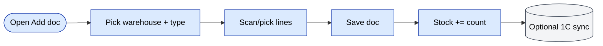
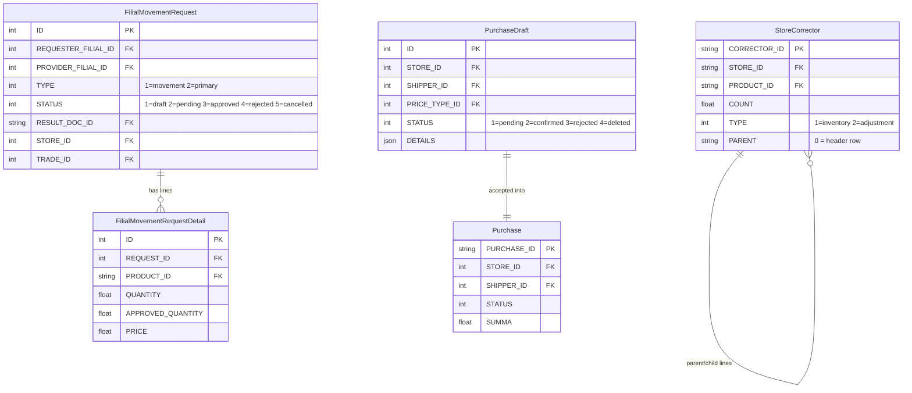
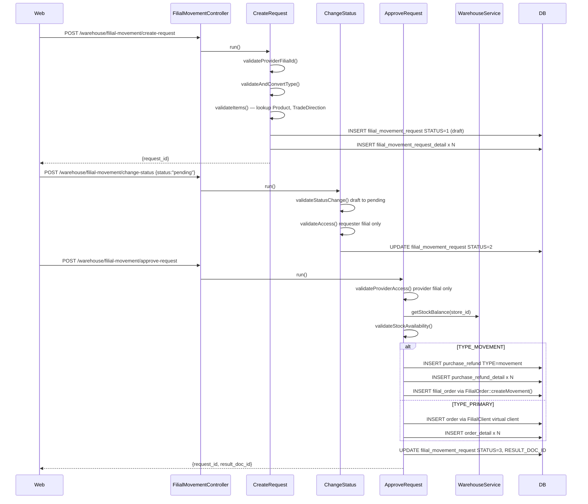
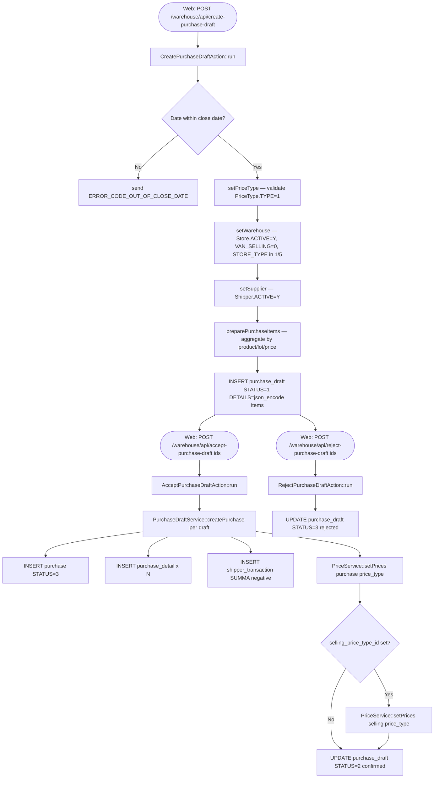
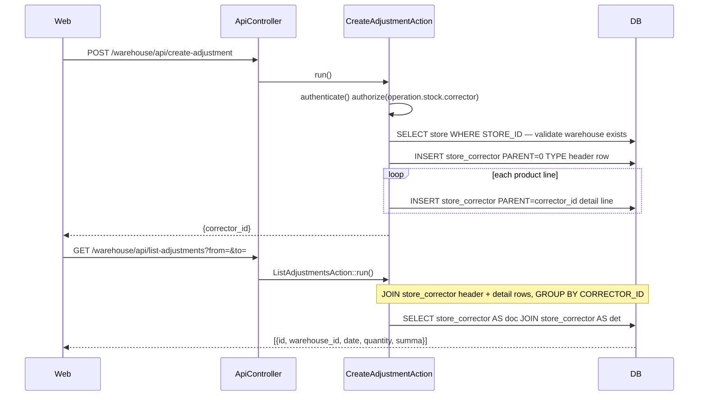

# Модуль `warehouse`

Многоскладские операции: **приёмки** (товары на вход), **перемещения**
(между складами или филиалами), **сборка / отгрузка** (для заказов)
и **межфилиальные перемещения**.

## Ключевые возможности

| Возможность | Что делает | Роль(и) владельца |
|---------|--------------|---------------|
| Приёмка товара | Добавление нового документа приёмки; остаток += количество | 1 / 2 / 9 / складские сотрудники |
| Типы приёмки | `sales` / `defect` / `reserve` (разные downstream-эффекты) | 1 / 9 |
| Перемещение остатков | Перемещение остатков между двумя складами внутри одного филиала | 1 / 9 |
| Филиальное перемещение | Перемещение остатков между филиалами (межфилиальное) | 1 |
| Сборка и упаковка | Резервирование и загрузка строк под заказ при выполнении | 1 / 9 / складские сотрудники |
| Аудиторский след | У каждого документа есть метки времени create/approve/post | system |
| Синхронизация с 1С | Опциональный исходящий XML/JSON приёмок и перемещений | system |

## Папка

```
protected/modules/warehouse/
├── controllers/
│   ├── AddController.php
│   ├── EditController.php
│   ├── ListController.php
│   ├── ViewController.php
│   ├── ExchangeController.php           # transfer
│   ├── FilialMovementController.php     # inter-filial
│   └── ApiController.php
└── views/
```

## Концепции

- **Склад (Warehouse)** — физическое или логическое место хранения остатков.
- **Документ** — юридический/операционный бумажный след движения остатков
  (приёмка / перемещение / списание / инвентаризация).
- **Строка остатков** — `(warehouse_id, product_id, lot, batch, count)`.
- **Резервирование** — количество, заблокированное `Order` в статусе `Reserved`.

## Ключевой поток функционала — приёмка товара

См. **Feature · Warehouse + Stock + Inventory** в
[FigJam · sd-main · Feature Flows](https://www.figma.com/board/MyvyaeEluqvHofH4E2qIoU).



## Права доступа

| Действие | Роли |
|--------|-------|
| Создание приёмки | 1 / 2 / 9 |
| Утверждение перемещения | 1 / 2 / 9 |
| Межфилиальное перемещение | 1 |

## См. также

- [`stock`](./stock.md) — чисто количественные операции
- [`inventory`](./inventory.md) — физические инвентаризации
- [`store`](./store.md) — операции на стороне розничного магазина

## Воркфлоу

### Точки входа

| Триггер | Контроллер / Действие / Задача | Замечания |
|---|---|---|
| Web | `AddController::actionIndex` | Создание нового `Store` (склада) — POST JSON |
| Web | `FilialMovementController` через `CreateRequest` | Запрашивающий филиал отправляет межфилиальный запрос на остатки |
| Web | `FilialMovementController` через `ApproveRequest` | Поставляющий филиал утверждает ожидающий запрос и создаёт downstream-документ |
| Web | `FilialMovementController` через `ChangeStatus` | Жизненный цикл Draft → Pending → Cancelled / Rejected |
| Web | `ApiController` через `CreatePurchaseDraftAction` | Mobile/web отправляет черновик закупки на проверку менеджером |
| Web | `ApiController` через `AcceptPurchaseDraftAction` | Менеджер принимает черновик; `PurchaseDraftService::createPurchase` конвертирует в `Purchase` |
| Web | `ApiController` через `CreateAdjustmentAction` | Кладовщик создаёт корректировку остатков (`StoreCorrector`) |

### Доменные сущности



### Воркфлоу 1.1 — Жизненный цикл межфилиального запроса на перемещение остатков

Запрашивающий филиал создаёт запрос на остатки, поставляющий филиал утверждает его, и атомарно записывается `PurchaseRefund` (type=movement) или `Order` (type=primary).



### Воркфлоу 1.2 — Проверка и приёмка черновика закупки

Черновик закупки отправляется (обычно из мобильного приложения или web) и находится в статусе=pending, пока менеджер не примет или не отклонит его. Приёмка вызывает `PurchaseDraftService::createPurchase`, который пишет канонический `Purchase` + `PurchaseDetail` + `ShipperTransaction` и обновляет цены.



### Воркфлоу 1.3 — Корректировка остатков (StoreCorrector)

Кладовщик или складской менеджер записывает ручную корректировку остатков через `CreateAdjustmentAction`. Таблица `StoreCorrector` использует структуру строк родитель/потомок: заголовочная строка имеет `PARENT='0'`, строки деталей ссылаются на неё через `CORRECTOR_ID`.



### Межмодульные точки соприкосновения

- Чтения: `models.FilialClient` (поиск виртуального клиента при утверждении primary-типа в `ApproveRequest::createPrimaryDocument`)
- Чтения: `models.PriceType`, `PriceService::getPrices` (резолв цены в `PurchaseDraftService` и `ApproveRequest`)
- Чтения: `models.TradeDirection` (валидация trade-direction в `CreateRequest`)
- Записи: `models.Order` + `models.OrderDetail` (primary-запрос филиала → новый заказ продажи в `ApproveRequest::createPrimaryDocument`)
- Записи: `models.PurchaseRefund` + `models.PurchaseRefundDetail` (запрос на филиальное перемещение → возврат остатков в `ApproveRequest::createMovementDocument`)
- Записи: `models.FilialOrder` через `FilialOrder::createMovement` (мост документа перемещения к запрашивающему филиалу)
- Записи: `models.ShipperTransaction` (запись в книге долгов поставщика в `PurchaseDraftService::createDocument`)
- API: `warehouse/api/get-stock-balance` — вызывается внутренне `ApproveRequest` через `WarehouseService::getStockBalance`

### Подводные камни

- `FilialMovementRequest::STATUS_APPROVED` — терминальный — `ChangeStatus` жёстко блокирует любую дальнейшую смену статуса. Попытка отменить или отклонить утверждённый запрос возвращает `ERROR_CODE_INVALID_STATUS`.
- `ApproveRequest::createMovementDocument` жёстко прописывает `DILER_ID = "d0_1"` и `FILIAL_ID = 1` для `PurchaseRefund`; это сломается в multi-diler развёртываниях.
- `PurchaseDraftService::createPurchase` вызывает `$purchaseModel->tgNotify()` — побочный эффект уведомления Telegram; убедитесь, что токен бота настроен, иначе вызов молча падает, но не откатывает транзакцию.
- `CreateAdjustmentAction.php` найден пустым (1 строка) в текущей ветке (`btx-51207`). Действия list и get корректно ссылаются на `StoreCorrector`, но создание может быть в работе.
- Действие `delete-purchase-draft` намеренно отключено в `ApiController` (закомментировано с пометкой "disabled by now").
- `WarehouseService::getStockBalance` не блокирует строки; возможна гонка между проверкой доступности и вставкой `PurchaseRefund` внутри `ApproveRequest`.
