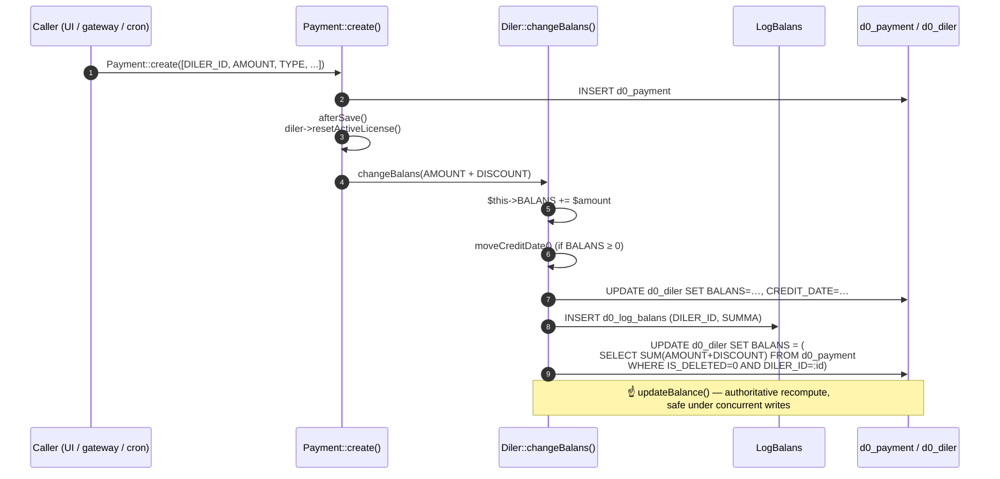
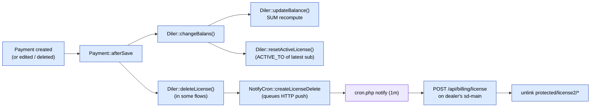

# Баланс и денежная математика

> **Внимание — типичное расхождение документации и кода.** Старые документы говорят «триггеры БД поддерживают `Diler.BALANS`». Они этого не делают. Миграция триггеров `m221114_070346_create_triggers_to_payment.php` **намеренно закомментирована** (`// $this->execute($sql); // xato ishlayapti, shunga komment qilindi` — «работает некорректно, поэтому закомментирована»). Баланс поддерживается в PHP. Эта страница — истина.

## TL;DR

| Шаг | Где | Что делает |
|-------|-------|--------------|
| 1 | `Payment::create([...])` | Вставка строки в `d0_payment` (любой вызывающий — UI, шлюз, cron) |
| 2 | `Payment::afterSave()` | Если `disabledAfterSave` **выключен** и `diler` задан: вызывает `diler->resetActiveLicense()`, затем `diler->changeBalans($amount)` |
| 3 | `Diler::changeBalans($amount)` | `$this->BALANS += $amount`, save, лог в `LogBalans`, затем вызов `updateBalance()` |
| 4 | `Diler::updateBalance()` | Авторитетный SQL-перерасчёт: `UPDATE diler SET BALANS = SUM(payment.AMOUNT + payment.DISCOUNT) WHERE diler_id = X AND IS_DELETED = 0` |

PHP-инкремент на шаге 3 — **быстрый путь**; шаг 4 — **страховочная сетка**, которая пересчитывает весь баланс из таблицы `Payment`, чтобы конкурентные записи не давали дрейфа.

## Sequence



## Четыре пути кода через `afterSave`

`Payment::afterSave` ветвится в зависимости от состояния строки:

```php
if ($this->isNewRecord) {
    $amount = $this->AMOUNT + $this->DISCOUNT;
    $this->diler->changeBalans($amount);
}
else if ($this->IS_DELETED == self::ACTIVE_DELETED) {
    $amount = $this->AMOUNT + $this->DISCOUNT;
    $this->diler->changeBalans($amount * -1);   // reverse the contribution
    $this->uncomputeDebt();
}
else {
    $amount = $this->AMOUNT - $this->OLD_AMOUNT;  // edited
    if ((float) $amount != 0) {
        $this->diler->changeBalans($amount);
        $this->uncomputeDebt();
    }
}
```

| Триггер | Ветка | Эффект |
|---------|--------|--------|
| `Payment::create([...])` | новая запись | `BALANS += AMOUNT + DISCOUNT` |
| Софт-удаление (`IS_DELETED = 1`) | ветка удаления | `BALANS -= AMOUNT + DISCOUNT`, также сворачивается соответствующий `DistrPayment` |
| Редактирование `AMOUNT` | ветка редактирования | `BALANS += new − old`, плюс соответствующее обновление `DistrPayment.AMOUNT` |
| `disabledAfterSave(true)` | bypass | ничего — используется bulk-загрузчиками, которые пересчитывают позже |

## Направление (знак) `AMOUNT` по `Payment.TYPE`

`AMOUNT` знаковый. Соглашение:

| `Payment.TYPE` | Направление | Знак AMOUNT | Источник |
|----------------|-----------|----------------|--------|
| `cash`, `cashless`, `p2p` | входящий (offline) | **+** | кассир / дашборд |
| `payme`, `click`, `paynet`, `mbank` | входящий (online) | **+** | контроллеры шлюзов |
| `license` | исходящий (потреблено) | **−** | `LicenseController::actionBuyPackages` |
| `service` | входящий (ручной взнос) | **+** | ручной ввод |
| `distribute` | сеттлемент | разный (парный) | `cron settlement` |

Строки `distribute` приходят **парами**, которые занулят друг друга по дистрибьютору + дилеру, так что суммарные итоги остаются консистентными по системе.

## После изменений баланса — обновление лицензии

После того как деньги пришли, лицензия дилера на `sd-main` инвалидируется, чтобы
следующая загрузка страницы подхватила новое состояние:



Сама `deleteLicense()` **не** обращается к `sd-main` синхронно — она
ставит в очередь строку `NotifyCron` типа `license_delete` (URL —
`Diler.DOMAIN + /api/billing/license`). Минутный cron сливает
очередь (страница Notifications в работе — см. [Cron и сеттлемент](./cron-and-settlement.md) для деталей со стороны cron).

## Авторитетный SQL-перерасчёт

Это то, что выполняет `Diler::updateBalance()` (`Diler.php:478`):

```sql
UPDATE d0_diler
   SET BALANS = (
       SELECT IF(SUM(pay.AMOUNT + pay.DISCOUNT) IS NULL, 0,
                 SUM(pay.AMOUNT + pay.DISCOUNT))
         FROM d0_payment pay
        WHERE pay.IS_DELETED = 0
          AND pay.DILER_ID   = :dilerId
   )
 WHERE ID = :dilerId;
```

Если когда-нибудь подозреваете, что `BALANS` дилера съехал, повторный запуск
`Diler::updateBalance()` (или этого SQL напрямую) **всегда безопасен** —
это чистый перерасчёт из `d0_payment`.

## Баланс дистрибьютора

`Distributor::BALANS` — **производный**, не поддерживается инкрементально:

```php
// Distributor.php:169
$this->BALANS = $this->getTranBalans(null);
```

`getTranBalans` обходит строки `DistrPayment`. Нет пути записи, который
бы мутировал `Distributor.BALANS` напрямую вне этого перерасчёта.

## Аудит-trail — `LogBalans` и `LogDistrBalans`

| Таблица | Гранулярность | Когда пишется |
|-------|-------------|--------------|
| `d0_log_balans` | Одна строка на каждый вызов `Diler.changeBalans` | каждое PHP-изменение баланса дилера |
| `d0_log_distr_balans` | Одна строка на каждый шаг сеттлемента дистрибьютора | пишется `SettlementCommand` |

Обе append-only. Используйте их для запросов «как выглядел баланс этого дилера
на дату X» — `Diler.BALANS` — текущая сумма, а
`LogBalans` — журнал.

## Кредитное окно — `CREDIT_LIMIT` / `CREDIT_DATE`

Дилеру может быть позволено иметь отрицательный баланс до
`Diler.CREDIT_LIMIT` до `Diler.CREDIT_DATE`:

```php
// Diler.php:277
public function balansWithCredit() {
    if ($this->isDateActive()) return $this->BALANS;       // grace window
    if (negative)               return $this->BALANS + $this->CREDIT_LIMIT;
    return $this->BALANS;
}

public function isInDebt() { return $this->BALANS < 0; }   // 343
```

`Diler::moveCreditDate()` сдвигает `CREDIT_DATE` вперёд на «3-е число
следующего месяца» всегда, когда `BALANS ≥ 0`.

## Конкурентность

PHP fast-path (`$this->BALANS += $amount; save()`) **не**
атомарен между процессами — два одновременных платежа могут гонять. Шаг
recompute-from-`SUM` в конце `changeBalans()` (и соответствующий
вызов `updateBalance()`) — то, что спасает корректность. Пока
оба пишущих процесса коммитят свои вставки в `d0_payment`, итоговый `UPDATE … SET
BALANS = SUM(...)` сходится.

> Не заменяйте `updateBalance()` одним только инкрементом — вы вернёте
> дрейф, ту самую причину, по которой миграцию триггеров отключили.

## А что насчёт отключённой миграции триггеров?

`m221114_070346_create_triggers_to_payment.php` определяет:

- `UpdateBalanceOfDealer(IN dealerId)` — хранимую процедуру, которая запускает
  `UPDATE d0_diler SET BALANS = SUM(...) WHERE id = dealerId`.
- `AfterInsertToPayment` / `AfterUpdateToPayment` — триггеры, вызывающие
  процедуру.

Но тело `up()` заканчивается на `// $this->execute($sql); // xato
ishlayapti, shunga komment qilindi`. `down()` так же
отключён. Поэтому **миграция — no-op** — она не оставляет триггеров в
БД.

Если когда-нибудь её включите: учтите, что триггер и PHP-путь
вместе будут выполнять SUM-перерасчёт **дважды** на каждую вставку. Это
лишняя работа, но не некорректность. Изначальное опасение было в том, что триггер
запускается внутри транзакционного контекста Yii и порождает
неконсистентные промежуточные состояния; тот, кто будет включать обратно, должен
проверить взаимодействие с уровнями изоляции транзакций.

## См. также

- [Доменная модель](./domain-model.md) — форма `Diler`, `Payment`, `Subscription`.
- [Подписка и лицензирование](./subscription-flow.md) — откуда берутся платежи `TYPE_LICENSE`.
- [Cron и сеттлемент](./cron-and-settlement.md) — откуда берутся пары `TYPE_DISTRIBUTE`.
- [Платёжные шлюзы](./payment-gateways.md) — где входят онлайн-платежи.
- [Cron и сеттлемент](./cron-and-settlement.md) — как очередь license-delete распространяется на хосты дилеров (страница Notifications в работе).
