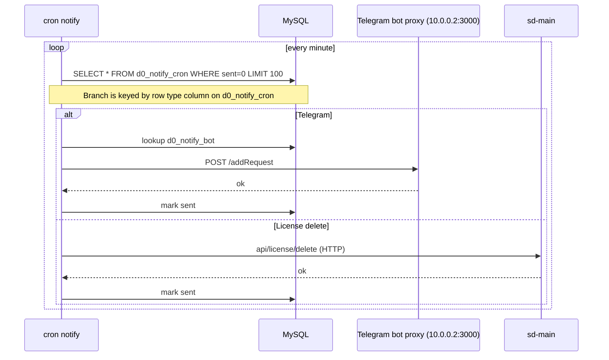

# Cron и сеттлемент

`cron.php` — точка входа консоли. Расписания живут в
`protected/commands/cronjob.txt` и в crontab хоста.

## Расписание

| Команда | Когда | Назначение |
|---------|------|---------|
| `notify` | каждую минуту | Сливает очередь `d0_notify_cron` → Telegram + действия license-delete. ID бота резолвится по строке из `d0_notify_bot`. |
| `visit` / `visitOptimized` | ежедневно 02:00 | Снимок данных визитов дилеров |
| `stat` | ежедневно 03:00 | Дневная статистика, агрегация |
| `settlement` | ежедневно 01:00 | Месячный расчёт долгов/кредитов между дистрибьютором и дилером |
| `botLicenseReminder` | ежедневно 09:00 | Уведомить дилеров на грани истечения лицензии |
| `pradata` (HTTP) | 05:30 / 05:40 / 05:50 | Внешние инстансы `salesdoc.io` забирают предрассчитанные данные через curl |
| `cleanner` | сб 22:00 | Еженедельная очистка (подписки и т. п.) |
| `reportBot send` / `countrysale` | ежечасно | Внутренние отчётные боты |
| `notifyCleanup --days=7` | ежедневно 08:00 | Подрезает отправленные строки notify |
| `log cleanup --days=7` | вс 02:45 | Подрезает `log/` |

Все команды наследуют `BaseCommand`
(`protected/components/BaseCommand.php`).

## Сеттлемент

`SettlementCommand` (ежедневно 01:00) рассчитывает месячные долги/кредиты
между дистрибьюторами и дилерами.

```mermaid
flowchart LR
  S(["01:00 cron"]) --> READ["Pull last-month payments grouped by Distributor + Diler"]
  READ --> CALC["Compute share % per agreement"]
  CALC --> DEB["Insert Payment TYPE=distribute (debit Distributor)"]
  DEB --> CRE["Insert Payment TYPE=distribute (credit Diler)"]
  CRE --> LOG["LogDistrBalans rolling balance row"]
  LOG --> NOTIF[("Telegram summary to ops")]

  class S cron
  class READ,CALC,DEB,CRE,LOG action
  class NOTIF external
  classDef action   fill:#dbeafe,stroke:#1e40af,color:#000
  classDef approval fill:#fef3c7,stroke:#92400e,color:#000
  classDef success  fill:#dcfce7,stroke:#166534,color:#000
  classDef reject   fill:#fee2e2,stroke:#991b1b,color:#000
  classDef external fill:#f3f4f6,stroke:#374151,color:#000
  classDef cron     fill:#ede9fe,stroke:#6d28d9,color:#000
```



Пара строк `Payment` зануляется через дистрибьюторов, чтобы суммарный
`BALANS` оставался консистентным — математикой занимаются триггеры БД.

## Cron уведомлений



**Особенность тенантов в cron:** sd-billing — однотенантный (одна БД), поэтому cron-
команды не должны делать fan-out по тенантам, как это сделал бы `sd-main`.

## Идемпотентность

- Строки notify имеют флаг `sent` — доставка только один раз.
- Сеттлемент ключуется по `(distributor, diler, month)`, поэтому повторный запуск
  команды (в рамках того же месяца) не порождает дубликатов.
- `pradata` jobs — pull-only — безопасно перезапускать.

## Бэкфилл

Используйте утилиты модуля `dbservice` для бэкфилла пропущенных дней. Пример:

```bash
docker compose exec web php cron.php settlement --year=2026 --month=4
```

(Подгоняйте сигнатуру action под фактические опции
`SettlementCommand` — подтвердите перед запуском в проде.)

## Обработка ошибок

`FileLogRoute` (web) / `CFileLogRoute` (console) ловит логи уровня error.
Неудачный прогон cron оставляет затронутые строки в их предыдущем
состоянии, поэтому следующий тик минуты повторяет попытку чисто.
