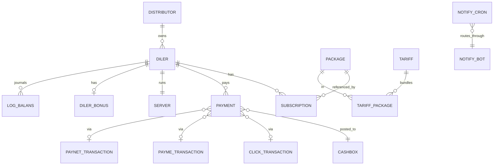

# Справочник схемы данных

Авторитетный таблично-табличный листинг схемы `d0_*` в sd-billing.
Каждый раздел здесь основан на `@property` doc-комментариях
соответствующего файла `protected/models/*.php` (или
`protected/modules/<m>/models/*.php`).

> Ищете **взгляд по форме** (Mermaid ERD)? См.
> [Доменная модель](./domain-model.md).
>
> Ищете **взгляд по поведению** (хуки afterSave, баланс,
> обновление лицензии)? См.
> [Баланс и денежная математика](./balance-and-money-math.md).
>
> Ищете workflow **миграций**? См.
> [Локальная установка → Миграции](./local-setup.md#migrations).

## Соглашения

- Таблицы используют префикс `d0_`; в моделях всегда ссылайтесь как
  `{{name}}`, чтобы Yii применял префикс.
- Регистр колонок **смешан по эпохам**:
  - `UPPER_SNAKE_CASE` на legacy-таблицах: `d0_diler`, `d0_payment`,
    `d0_subscription`, `d0_package`, `d0_user`,
    `d0_distributor`, `d0_currency`, `d0_log_balans`, `d0_cashbox`,
    `d0_consumption`, `d0_transfer`, `d0_click_transaction`,
    `d0_payme_transaction`.
  - `lower_snake_case` на новых таблицах: `d0_notify_cron`,
    `d0_notify_bot`, `d0_access_user`, `d0_access_operation`,
    `d0_access_relation`, `d0_server`, `d0_paynet_transaction`,
    `d0_dealer_blacklist`, `d0_notification_sent`, `d0_tariff`.
- Soft delete реализован флагом `IS_DELETED` (или `is_deleted`),
  никогда не hard-удаление. Всегда фильтруйте по нему в join и отчётах.
- Audit-колонки: `CREATED_BY`, `UPDATED_BY`, `CREATED_AT`,
  `UPDATED_AT` (или их lower-case эквиваленты на новых таблицах) — пишутся
  `ActiveRecordLogableBehavior`.

---

## 1. `d0_diler` — запись дилера / клиента

Модель: `Diler` (`protected/models/Diler.php`).
Самая трогаемая таблица в системе. Всё, что затрагивает дилера,
либо читает, либо пишет сюда.

| Колонка | Тип | Заметки |
|--------|------|-------|
| `ID` | `int` PK | |
| `DISTR_ID` | `int` FK → `d0_distributor.ID` | nullable — у дилера может не быть дистрибьютора |
| `COUNTRYSALE_ID` | `int` FK → `d0_countrysale.ID` | в какой sd-cs дилер закатывается |
| `BALANS` | `int` | текущий баланс — см. [баланс и денежная математика](./balance-and-money-math.md) |
| `MIN_SUMMA` | `float` | минимальный пополнение для покупки пакетов |
| `MIN_LICENSE` | `int` | минимальная стоимость покупки лицензии (anti-abuse) |
| `NAME` | `string` | отображаемое имя |
| `FIRM_NAME` | `string` | юр. лицо |
| `HOST` | `string` | поддомен sd-main (например `acme`) |
| `DOMAIN` | `string` | полный URL со схемой |
| `COUNTRY_ID` | `int` FK | |
| `CITY_ID` | `int` FK | |
| `CURRENCY_ID` | `int` FK → `d0_currency.ID` | в этой валюте номинированы деньги |
| `GROUP_ID` | `int` FK | бакет группы дилеров |
| `TARIFF_ID` | `int` FK → `d0_tariff.id` | объединяет строки `Package` |
| `DIRECTION_ID` | `int` FK | |
| `CUSTOMER_TYPE_ID` | `int` FK | |
| `ACTIVE_TO` | `date` | производное — макс `Subscription.ACTIVE_TO` |
| `STATUS` | `int` | enum ниже |
| `USER_ID` | `int` FK → `d0_user.USER_ID` | основной контакт со стороны дилера |
| `SALE_ID` | `int` FK → `d0_user.USER_ID` | торговый представитель |
| `INN` | `string` | налоговый идентификатор |
| `CONTACT` | `string` | телефон / контактный текст |
| `HAS_DISTRIBUTOR` | `int` (0/1) | shortcut для `DISTR_ID IS NOT NULL` |
| `IS_DEMO` | `int` (0/1) | флаг демо-тенанта |
| `FREE_TO` | `date` | конец free-trial |
| `ACCESS_BONUS` | `int` (0/1) | имеет право на бонусные пакеты |
| `MONTHLY` | `int` | `15` = режим «все пакеты» |
| `MIGRATION_ID` | `int` | legacy-метка миграции |
| `CREDIT_LIMIT` | `int` | насколько `BALANS` может уйти в минус |
| `CREDIT_DATE` | `date` | конец окна овердрафта |
| `AGREEMENT` | `string` | ссылка на договор |
| `COMMENT` | `string` | произвольный текст |
| `COMPETITOR_ID` | `int` FK | |
| `UPDATED_BY` / `CREATED_BY` / `UPDATED_AT` / `CREATED_AT` | audit | |

### Enum `Diler::STATUS`

| Константа | Значение | Смысл |
|----------|-------|---------|
| `STATUS_NO_ACTIVE` | `0` | онбординг / приостановлен |
| `STATUS_ACTIVE` | `10` | живой |
| `STATUS_DELETED` | `20` | софт-удалён |
| `STATUS_ARCHIVE` | `30` | архив |

### Побочные эффекты хуков

| Хук | Эффект |
|------|--------|
| `beforeSave` | форсит `STATUS`, захватывает `OLD_HOST`, чтобы after-хук смог обнаружить смену хоста |
| `afterSave` | если изменился `HOST` → `updateServer()` + `sendRequest()` (provisions/уведомляет sd-main дилера) |
| `changeBalans()` | append-only `LogBalans`, затем SUM-перерасчёт `updateBalance()` (см. [математика баланса](./balance-and-money-math.md)) |
| `deleteLicense()` | ставит в очередь `NotifyCron(license_delete, DOMAIN/api/billing/license)` — **не** ходит к дилеру синхронно |
| `resetActiveLicense()` | пересчитывает `Diler.ACTIVE_TO` из последнего неудалённого `Subscription` |

---

## 2. `d0_distributor`

Модель: `Distributor` (`protected/models/Distributor.php`).
Оптовый слой над дилерами — регион или контрактный партнёр.

| Колонка | Тип | Заметки |
|--------|------|-------|
| `ID` | `int` PK | |
| `NAME` | `string` | |
| `DIRECTION` | `string` | код направления |
| `NOT_DISTRIBUTED` | `int` (0/1) | флаг «этот дистрибьютор не берёт долю» |
| `CURRENCY_ID` | `int` FK | |
| `TYPE` | `int` | тип дистрибьютора |
| `CITY_ID` | `int` FK | |
| `COUNTRY_ID` | `int` FK | |
| `COUNTRYSALE_ID` | `int` FK | |
| `RESPONSIBLE` | `int` FK → `d0_user.USER_ID` | account manager |
| `INN` | `string` | tax id |
| `AGREEMENT` | `string` | договор |
| audit cols | | |

### Вычисляемые / непостоянные поля

Эти виртуальные поля уровня модели наполняются `getTranBalans()`:

| Поле | Источник |
|-------|--------|
| `BALANS` | `SUM(DistrPayment.AMOUNT) WHERE distr=this` (пересчитывается при каждом чтении) |
| `DEBT` | производное |
| `PREPAYMENT` | производное |

---

## 3. `d0_subscription`

Модель: `Subscription` (`protected/models/Subscription.php`).
Окно купленного пакета для дилера.

| Колонка | Тип | Заметки |
|--------|------|-------|
| `ID` | `int` PK | |
| `DILER_ID` | `int` FK → `d0_diler.ID` | |
| `DISTRIBUTOR_ID` | `int` FK → `d0_distributor.ID` | снапшот дистрибьютора дилера на момент покупки |
| `PACKAGE_ID` | `int` FK → `d0_package.ID` | |
| `SD_USER_ID` | `string` | ссылка на пользователя со стороны дилера (FK в `d0_user` на стороне sd-main дилера) |
| `SD_USER_LOGIN` | `string` | mirror логина со стороны дилера |
| `COUNT` | `int` | купленных мест |
| `START_FROM` | `date` | начало окна |
| `ACTIVE_TO` | `date` | конец окна (`START_FROM + Package.TYPE` дней) |
| `IS_DELETED` | `int` (0/1) | софт-удаление |
| `ADD_BONUS` | `int` (0/1) | бонусное место — учитывается, но не оплачивается |
| audit cols | | |

`Diler` считается «покрытым», если у любой неудалённой строки `Subscription`
`ACTIVE_TO ≥ today`.

---

## 4. `d0_package`

Модель: `Package` (`protected/models/Package.php`).
Каталог лицензий.

| Колонка | Тип | Заметки |
|--------|------|-------|
| `ID` | `int` PK | |
| `CURRENCY_ID` | `int` FK | UZS / KZT / RUB / … |
| `SUBSCRIP_TYPE` | `string` | роль, ограниченная этим пакетом — см. enum ниже |
| `NAME` | `string` | |
| `AMOUNT` | `double` | цена в `CURRENCY_ID` |
| `PACKAGE_TYPE` | `int` | `paid` / `free` / `demo` (см. модель) |
| `CLIENT_TYPE` | `int` | `private` / `public` |
| `TYPE` | `int` | продолжительность в днях: `1`, `10`, `20`, `30`, `90`, `180`, `360` |
| audit cols | | |

### Значения `SUBSCRIP_TYPE`

Перечисляет роль / поверхность, которую лицензирует пакет. Читается из
модели `Package`:

| Значение | Что закрывает |
|-------|-------|
| `admin` | sd-main админ-пользователь |
| `agent` | полевой агент |
| `merchant` | мерчандайзер |
| `seller` | продавец на стойке |
| `bot_report` | sd-main report-бот |
| `bot_order` | sd-main order-бот |
| `smpro_user` | пользователь SmPro |
| `smpro_bot` | бот SmPro |

Пересечение: `MONTHLY = 15` у дилера короткозамыкает per-type
гейтинг и выдаёт все пакеты до `Diler.ACTIVE_TO`.

---

## 5. `d0_payment`

Модель: `Payment` (`protected/models/Payment.php`).
Одна строка на каждое денежное движение.

| Колонка | Тип | Заметки |
|--------|------|-------|
| `ID` | `int` PK | |
| `CASHBOX_ID` | `int` FK → `d0_cashbox.ID` | в какую кассу записано |
| `DILER_ID` | `int` FK → `d0_diler.ID` | какого дилера это затрагивает |
| `DISTRIBUTOR_ID` | `int` FK | снимок «текущего дистрибьютора» |
| `DISTR_ID` | `int` FK | «дистрибьютор, на которого распределён платёж» — устанавливается только на строках `TYPE_DISTRIBUTE` |
| `DISTR_PAYMENT_ID` | `int` FK → `d0_distr_payment.id` | парная строка для distribute-платежей |
| `CURRENCY_ID` | `int` FK | |
| `AMOUNT` | `double` (signed) | знак задаёт направление `BALANS` (см. ниже) |
| `DISCOUNT` | `double` | прибавляется к `AMOUNT` при вычислении `BALANS` |
| `COMP` | `double` | comp account / комиссия |
| `TYPE` | `int` | enum ниже |
| `DATE` | `date` | бизнес-дата |
| `COMMENT` | `string` | |
| `IS_DELETED` | `int` (0/1) | `0 = DEFAULT_DELETED`, `1 = ACTIVE_DELETED` |
| `SUBSCRIPTION_ID` | `int` FK | устанавливается, когда `TYPE_LICENSE` привязан к конкретной подписке |
| `PAYMENT_1C` | `string` | внешняя ссылка из 1C для импорта безналичных |
| audit cols | | |

### Enum `Payment::TYPE`

| Константа | Значение | Направление | Источник |
|----------|-------|-----------|--------|
| `TYPE_CASH` | `1` | входящий | UI кассира |
| `TYPE_CASHLESS` | `2` | входящий | дашборд / импорт 1C |
| `TYPE_P2PCLICK` | `3` | входящий | дашборд P2P |
| `TYPE_LICENSE` | `10` | исходящий (потреблено) | `LicenseController::actionBuyPackages` |
| `TYPE_DISTRIBUTE` | `11` | сеттлемент (парный) | `cron settlement` |
| `TYPE_PAYMEONLINE` | `12` | входящий (шлюз Payme) | `api/payme` |
| `TYPE_CLICKONLINE` | `13` | входящий (шлюз Click) | `api/click` |
| `TYPE_SERVICE` | `14` | ручной взнос | дашборд |
| `TYPE_PAYNETONLINE` | `15` | входящий (шлюз Paynet) | `api/paynet` |
| `TYPE_MBANK` | `16` | входящий (MBANK KG) | gateway-specific |

`AMOUNT + DISCOUNT` — это то, что суммирует `Diler::updateBalance()`,
чтобы пересчитать `BALANS`.

### Побочные эффекты хуков

`Payment::afterSave` вызывает `Diler::resetActiveLicense()` и
`Diler::changeBalans($amount)` (где `$amount` зависит от
состояния new/edited/deleted). См.
[баланс и денежная математика · четыре пути кода](./balance-and-money-math.md#the-four-code-paths-through-aftersave).

---

## 6. Таблицы транзакций шлюзов

### `d0_click_transaction` — шлюз Click

Модель: `ClickTransaction`.

| Колонка | Тип |
|--------|------|
| `ID` | `int` PK |
| `TRANS_ID` | `int` Click transaction id |
| `PAYDOC_ID` | `int` Click pay-doc id |
| `AMOUNT` | `int` |
| `STATUS` | `int` enum: `ACTION_PREPARE=0`, `ACTION_COMPLETE=1`, `ACTION_CANCELLED=2` |
| `DILER_ID` | `int` FK |
| `HOST` | `string` source host |
| `PAYMENT_ID` | `int` FK → `d0_payment.ID` (устанавливается на confirm) |
| `CREATE_AT` / `UPDATE_AT` | timestamps |

### `d0_payme_transaction` — шлюз Payme

Модель: `PaymeTransaction`.

| Колонка | Тип |
|--------|------|
| `ID` | `int` PK |
| `DILER_ID` | `int` FK |
| `HOST` | `string` |
| `STATUS` | `int` enum: `STATE_CREATED=1`, `STATE_COMPLETED=2`, `STATE_CANCELLED=-1`, `STATE_CANCELLED_AFTER_COMPLETE=-2` |
| `AMOUNT` | `int` |
| `TRANS_ID` | `string` Payme transaction id |
| `TRANS_CREATE_TIME` / `TRANS_PERFORM_TIME` / `TRANS_CANCEL_TIME` | Payme timestamps |
| `PAYMENT_ID` | `int` FK |
| `REASON` | `int` Payme cancel reason code |

### `d0_paynet_transaction` — шлюз Paynet

Модель: `PaynetTransaction`.

| Колонка | Тип |
|--------|------|
| `id` | `int` PK |
| `transaction_id` | `string` Paynet id |
| `amount` | `double` |
| `host` | `string` |
| `timestamp` | `string` |
| `status` | `int` |
| `payment_id` | `int` FK |
| `created_at` / `updated_at` | timestamps |

---

## 7. `d0_server` — provisioning sd-main дилера

Модель: `Server` (`protected/models/Server.php`).

| Колонка | Тип | Заметки |
|--------|------|-------|
| `ID` | `int` PK | |
| `diler_id` | `int` FK → `d0_diler.ID` | one-to-one |
| `domain` | `string` | полный URL |
| `db_user` / `db_name` / `db_password` | креды БД дилера | |
| `db_server` | `string` | хост БД дилера |
| `web_server` | `string` | web-хост дилера |
| `web_branch` | `string` | какую ветку sd-main крутит дилер |
| `status` | `int` | `STATUS_NEW=0`, `STATUS_SENT=1`, `STATUS_OPENED=2` (lifecycle provision) |
| `status_code` | `int` | последний HTTP-статус с пинга provisioning |
| `response_body` | `string` | последнее тело ответа |

Provisioning запускается из `Diler::sendRequest()` →
`Server::createServer()`. См.
[Кросс-проектная интеграция · Provisioning нового дилера](../architecture/cross-project-integration.md#6-provisioning-a-new-dealer-end-to-end).

---

## 8. `d0_user`

Модель: `User` (`protected/models/User.php`).

| Колонка | Тип |
|--------|------|
| `USER_ID` | `int` PK |
| `NAME` | `string` |
| `ROLE` | `int` (см. enum) |
| `LOGIN` | `string` UNIQUE |
| `PASSWORD` | `string` MD5 — см. [мины безопасности](./security-landmines.md) |
| `PHONE_NUMBER` | `string` |
| `CHAT_ID` | `int` Telegram chat id |
| `ACTIVE` | `int` (0/1) |
| `IS_ADMIN` | `int` (0/1) — короткозамыкает все проверки `Access::has()` |
| `ACCESS_CASHBOX` | `int` (0/1) — обходит ограничение all-cashboxes |
| `TOKEN` | `string` — используется Bearer-авторизацией `HostController` + desktop-токеном `App` |
| `LAST_AUTH` | `datetime` |

### Enum `User::ROLE`

| Константа | Значение | Заметки |
|----------|-------|-------|
| `ROLE_ADMIN` | `3` | короткозамыкает Access-проверки |
| `ROLE_MANAGER` | `4` | |
| `ROLE_OPERATOR` | `5` | |
| `ROLE_API` | `6` | machine-аккаунты |
| `ROLE_SALE` | `7` | |
| `ROLE_MENTOR` | `8` | |
| `ROLE_KEY_ACCOUNT` | `9` | |
| `ROLE_PARTNER` | `10` | ограничен `PartnerAccessService` |

---

## 9. `d0_currency`

Модель: `Currency`.

| Колонка | Тип |
|--------|------|
| `ID` | `int` PK |
| `NAME` | `string` |
| `SHORT` | `string` (`UZS`, `KZT`, `RUB`, …) |
| `CODE` | `int` ISO numeric |
| `RATE` | `int` курс к базовой |
| audit cols | |

`Diler.CURRENCY_ID` и `Package.CURRENCY_ID` должны совпадать, чтобы вызов
покупки прошёл.

---

## 10. `d0_cashbox` (модуль cashbox)

Модели в `protected/modules/cashbox/models/`:

### `Cashbox`

| Колонка | Тип |
|--------|------|
| `ID` | `int` PK |
| `NAME` | `string` |
| `USER_ID` | `int` FK |
| `CODE` | `string` |
| `IS_DELETED` | `int` (0/1) |
| audit cols | |

`Cashbox::CASHBOX_NONE = 0` — sentinel для «нет кассы».

### `Consumption` — отток / приток в кассе

| Колонка | Тип | Заметки |
|--------|------|-------|
| `ID` | `int` PK | |
| `CASHBOX_ID` | `int` FK | |
| `CONSUM_TYPE` | `int` | `TYPE_OUTCOME=1` или `TYPE_INCOME=2` |
| `FLOW_TYPE_ID` | `int` FK → `d0_flow_type.ID` | какая бюджетная категория |
| `COMING_TYPE_ID` | `int` FK → `d0_coming_type.ID` | категория выручки |
| `PAYMENT_TYPE` | `int` | соответствует `Payment::TYPE` |
| `CURRENCY_ID` | `int` FK | |
| `NAME` | `string` | |
| `AMOUNT` | `string` | хранится как decimal-строка |
| `ADDITION` | `string` | |
| `EQUIVALENT` | `string` | значение, переведённое в базовую |
| `DATE` | `date` | |
| `USER_ID` | `int` FK | кто записал |
| `IS_PL` | `int` (0/1) | учитывать в P&L |
| `COMMENT` | `string` | |
| `IS_DELETED` | `int` (0/1) | |
| `SYNC_ID` | `string` | внешний ключ синхронизации |
| audit cols | |

### `FlowType`, `ComingType`

Справочные таблицы для категоризации бюджет/выручка. Та же форма:
`ID`, `NAME`, `CODE`, `IS_DELETED`, audit cols.

### `Transfer` — движение денег между кассами

| Колонка | Тип |
|--------|------|
| `ID` | `int` PK |
| `FROM_CASHBOX_ID` / `TO_CASHBOX_ID` | int FK |
| `FROM_CURRENCY_ID` / `TO_CURRENCY_ID` | int FK |
| `FROM_PAYMENT_TYPE` / `TO_PAYMENT_TYPE` | int |
| `FROM_AMOUNT` / `TO_AMOUNT` | string (decimal) |
| `CURRENCY` | string |
| `ADDITION` | string |
| `DATE` | date |
| `COMMENT` | string |
| `IS_DELETED` | int |
| `FROM_COMP_ID` / `TO_COMP_ID` | int |
| `CREATED_BY` / `CREATED_AT` | audit |

---

## 11. `d0_log_balans` — журнал баланса

Модель: `LogBalans`.

| Колонка | Тип | Заметки |
|--------|------|-------|
| `ID` | `int` PK | |
| `DILER_ID` | `int` FK | |
| `USER_ID` | `int` FK | кто инициировал изменение |
| `SUMMA` | `int` | знаковая дельта |
| `CREATED_AT` | datetime | |

Append-only. Одна строка на каждый вызов `Diler::changeBalans`. Используйте
для «какой был баланс дилера на дату X» — `Diler.BALANS` —
текущая сумма, а эта таблица — журнал.

`d0_log_distr_balans` — аналог для дистрибьютора (пишется
`SettlementCommand`).

---

## 12. `d0_diler_bonus`

Модель: `DilerBonus`. One-to-one с `Diler`.

| Колонка | Тип | Назначение |
|--------|------|---------|
| `ID` | `int` PK | |
| `DILER_ID` | `int` FK UNIQUE | |
| `AGENT_LIMIT`, `MERCHANT_LIMIT`, `DASTAVCHIK_LIMIT` | `int` каждое | бонусные квоты по ролям |

Используется `actionBonusPackages`, чтобы определить размер бонусного предложения дилера.

---

## 13. Таблицы очереди уведомлений

### `d0_notify_cron`

Модель: `NotifyCron`.

| Колонка | Тип | Заметки |
|--------|------|-------|
| `id` | int PK | |
| `chat_id` | string | Telegram-чат (или `0` для не-Telegram строк) |
| `bot_id` | int FK → `d0_notify_bot.id` | nullable (= дефолтный бот) |
| `text` | string | тело сообщения ИЛИ целевой URL |
| `parse_mode` | string(16) | по умолчанию `HTML` |
| `type` | string(32) | `telegram` / `license_delete` / `visit_write` |
| `status` | int | `STATUS_DEFAULT=0` (pending), `STATUS_RUN=1` (доставлено) |
| `error_response` | string | последняя причина сбоя |
| `created_by` | int | поставил в очередь |
| `created_at` | datetime | |

### `d0_notify_bot`

Модель: `NotifyBot`.

| Колонка | Тип | Заметки |
|--------|------|-------|
| `id` | int PK | |
| `name` | string(50) UNIQUE | `default`, `billing`, … |
| `token` | string(255) | токен Telegram-бота |
| `api_url` | string(255) | URL бот-прокси, передаваемый в `Telegram::queue` |
| `created_at` | datetime | |

См. [Уведомления](./notifications.md) для семантики drain очереди и
правил повторов.

---

## 14. Таблицы контроля доступа

Модели в `protected/modules/access/models/`.

### `d0_access_user` — сетка прав по пользователям

| Колонка | Тип | Заметки |
|--------|------|-------|
| `user_id` | string PK part | |
| `operations` | string PK part | ключ операции |
| `access` | int | бит-флаги: `DELETE=8 SHOW=4 UPDATE=2 CREATE=1` |

### `d0_access_operation` — каталог операций

| Колонка | Тип | Заметки |
|--------|------|-------|
| `operations` | string PK | уникальный ключ |
| `name` | string | отображаемое имя |
| `type` | string | группировка |
| `accessable` | string | comma-separated маска бит-флагов |

### `d0_access_relation` — иерархия операций

| Колонка | Тип | Заметки |
|--------|------|-------|
| `parent` | string FK → `d0_access_operation.operations` | |
| `child` | string FK → `d0_access_operation.operations` | |

`Access::has($op, $bit)` резолвится по дереву отношений. Админы
(`User.IS_ADMIN` или `ROLE_ADMIN`) короткозамыкают на allow.

---

## 15. `d0_tariff` / `d0_tariff_package`

Модели в `protected/modules/operation/models/`.

### `Tariff`

| Колонка | Тип |
|--------|------|
| `id` | int PK |
| `name` | string |
| `created_at` | datetime |

### `TariffPackage` — связь tariff ↔ package

Композит из набора строк `Package`, на которые дилер может подписаться как
на один SKU. Выбирается через `Diler.TARIFF_ID`.

---

## 16. Дополнительные таблицы операций

### `d0_dealer_blacklist`

Модель: `DealerBlacklist` (`modules/operation`).

| Колонка | Тип | Заметки |
|--------|------|-------|
| `id` | int PK | |
| `dealer_id` | int FK | |
| `reason` | string | `REASON_NOT_PAID_LICENSES = 'not_paid_licenses'`, `REASON_ANOTHER = 'another'` |
| `comment` | string | |
| `created_by` / `created_at` | audit | |
| `removed_by` / `removed_at` | un-blacklist audit | |

### `d0_notification_sent`

Модель: `NotificationSent`.

| Колонка | Тип |
|--------|------|
| `id` | int PK |
| `notification_id` | int FK |
| `dealer_id` | int FK |
| `response` | string |

Записывает, что уведомление `operation` было отправлено указанному
дилеру (идемпотентность для пакетных рассылок).

---

## 17. `d0_distr_payment` / `d0_log_distr_balans` (сеттлемент)

Пишутся исключительно `SettlementCommand`. Они отражают форму
дилерской `Payment` / `LogBalans`, но бакетизированы по дистрибьютору.

См. [Cron и сеттлемент](./cron-and-settlement.md).

---

## ERD (взгляд по форме)

Mermaid ER-диаграмма в [domain-model](./domain-model.md).
Воспроизведена здесь в уменьшенном виде, сосредоточена на самых трогаемых
таблицах (sales-time core):

---

## Процедура обновления

Эта страница основана на тегах `@property` каждой модели. Чтобы
обновить после изменения схемы:

1. Запустите миграцию, чтобы колонка появилась в `d0_<table>`.
2. Отредактируйте doc-comment соответствующего файла модели и добавьте новую
   строку `@property`.
3. Обновите раздел этой страницы для затронутой таблицы.
4. Если добавилась новая таблица, добавьте новый пронумерованный раздел.
5. Обновите Mermaid-блок [ERD доменной модели](./domain-model.md), если
   связь изменилась.

> Таблицы, ещё не перечисленные: `d0_log_distr_balans`, `d0_distr_payment`,
> `d0_distr_comp_detail`, `d0_comp_details`, `d0_dealer_inn`,
> `d0_dealer_origin`, `d0_dealer_contact`, `d0_diler_direction`,
> `d0_diler_group`, `d0_diler_package`, `d0_log_distr_balans`,
> `d0_user_country`, `d0_system_log`, `d0_active_record_log`,
> `d0_country_sale`, `d0_customer_type`. Они следуют тем же
> соглашениям; добавляйте разделы, когда трогаете их.

## См. также

- [Доменная модель](./domain-model.md) — высокоуровневый ERD + повествования по сущностям.
- [Баланс и денежная математика](./balance-and-money-math.md) — поток `Payment.afterSave` → `Diler::changeBalans`.
- [Уведомления](./notifications.md) — семантика очереди `d0_notify_cron`.
- [Авторизация и доступ](./auth-and-access.md) — таблицы `d0_access_*`.
- [Кросс-проектная интеграция](../architecture/cross-project-integration.md) — строка `Server` управляет provisioning sd-main.
