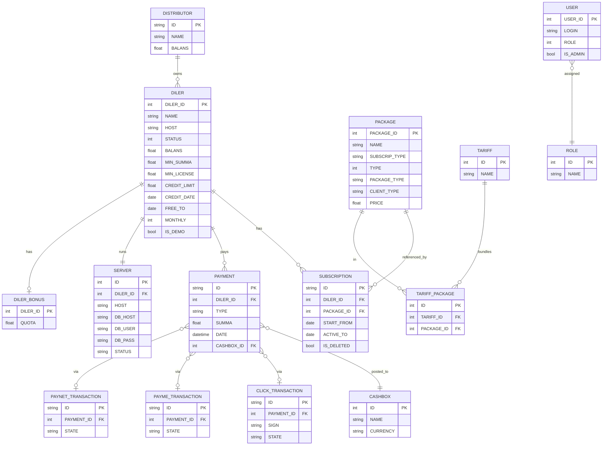

# Доменная модель sd-billing

## Основные сущности

### `Distributor`

Оптовый слой над дилерами. Отвечает за регион дилеров.
Денежные потоки: дилеры платят дистрибьюторам, дистрибьюторы получают долю
сеттлемента.

- Таблица: `d0_distributor`

### `Diler` (дилер)

Запись клиента. **Самая важная сущность** — почти каждый
отчёт и каждая команда работают с ней.

- Таблица: `d0_diler`
- Ключевые поля:
  - `STATUS` ∈ `0 NO_ACTIVE / 10 ACTIVE / 20 DELETED / 30 ARCHIVE`
  - `BALANS` — текущий баланс (положительный = кредит, отрицательный = долг)
  - `MIN_SUMMA`, `MIN_LICENSE` — пороги покупки
  - `CREDIT_LIMIT`, `CREDIT_DATE` — окно овердрафта
  - `FREE_TO` — последняя дата покрытия free-trial
  - `MONTHLY` — спец-флаг (`15 = все пакеты`)
  - `IS_DEMO` — демо-тенант
  - `HOST` — фактический hostname SD-app сервера дилера
- Хуки: `Diler::beforeSave` форсит `STATUS`, вызывает `updateServer()` и
  `sendRequest()` при изменении `HOST`.

### `Subscription`

Купленный пакет для дилера на окно дат.

- Таблица: `d0_subscription`
- Софт-удаление через `IS_DELETED`.
- Окно дат: `[START_FROM, ACTIVE_TO]`.

### `Package`

Элемент каталога лицензий / услуг.

- Таблица: `d0_package`
- `SUBSCRIP_TYPE` перечисляет роли, которые лицензирует пакет:
  `admin`, `agent`, `merchant`, `seller`, `bot_report`, `bot_order`,
  `smpro_user`, `smpro_bot`.
- `TYPE` — продолжительность в днях: `10 / 20 / 30 / 90 / 180 / 360` (и `1`
  на день).
- `PACKAGE_TYPE` ∈ `paid / free / demo`.
- `CLIENT_TYPE` ∈ `private / public`.

### `Payment`

Одна строка на каждое денежное движение.

- Таблица: `d0_payment`
- `TYPE` ∈ `cash, cashless, p2p, license, distribute, payme, click,
  service, paynet, mbank`.
- **Триггеры** БД на этой таблице поддерживают суммарные балансы (см.
  миграцию `m221114_070346_create_triggers_to_payment.php`).

### Таблицы транзакций шлюзов

У каждого платёжного шлюза своя таблица транзакций:

| Таблица / модель | Шлюз | Заметки |
|---------------|---------|-------|
| `d0_click_transaction` / `ClickTransaction` | Click | Подпись проверяется через `ClickTransaction::checkSign`. Двухфазный: prepare → confirm |
| `d0_payme_transaction` / `PaymeTransaction` | Payme | Обрабатывается `api/helpers/PaymeHelper` |
| `d0_paynet_transaction` / `PaynetTransaction` | Paynet | SOAP — `extensions/paynetuz/`, креды в `_constants.php` |

Все обращения шлюзов сводятся к строкам `Payment` онлайн-типа
(`TYPE_PAYMEONLINE / TYPE_CLICKONLINE / TYPE_PAYNETONLINE`), которые
увеличивают `BALANS` дилера. Затем `Diler::deleteLicense()` и
`Diler::refresh()` рассчитывают непогашенные подписки.

### `Server`

Фактический SD-app сервер дилера (развёртывание `sd-main`).

- Таблица: `d0_server`
- Поток статусов: `NEW → SENT → OPENED`.
- Изменение `Diler.HOST` триггерит `Diler::updateServer()`.

### `Tariff` / `TariffPackage`

Бандлы пакетов, на которые дилер может подписаться как на один SKU.

### `User` (внутренний персонал)

- Таблица: `d0_user`
- Роли: `ADMIN(3), MANAGER(4), OPERATOR(5), API(6), SALE(7),
  MENTOR(8), KEY_ACCOUNT(9), PARTNER(10)` плюс супер-флаг `IS_ADMIN`.

## Соглашения

См. `CLAUDE.md` проекта для полного списка. Основные моменты:

- Таблицы используют префикс `d0_`; в моделях ссылайтесь как `{{name}}`,
  чтобы Yii применял `tablePrefix`.
- Регистр колонок **смешан по эпохам**: legacy-таблицы (`Diler`, `Payment`,
  `Subscription`, `Package`, `User`) используют **UPPER_SNAKE_CASE**;
  новые таблицы (`d0_notify_cron`, `d0_notify_bot`, `d0_access_user`,
  `d0_server`) используют **lower_snake_case**. Не воюйте с существующими
  соглашениями.
- Русские / узбекско-латинские комментарии часты — сохраняйте их.
