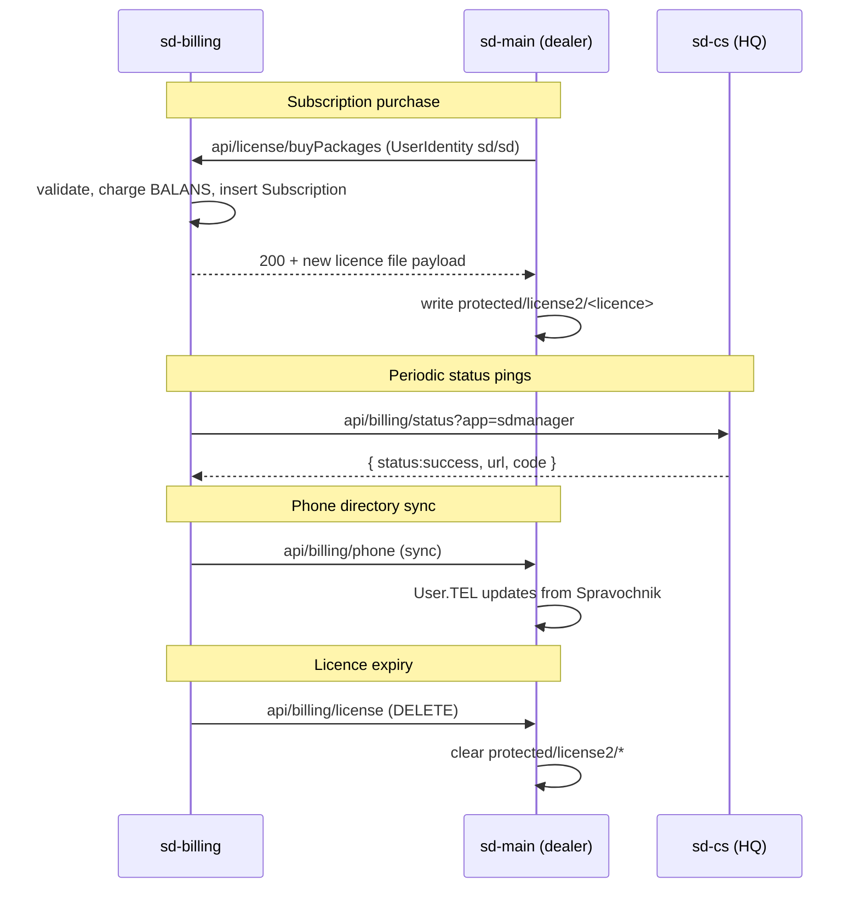

# Интеграция с sd-main и sd-cs

`sd-billing` находится выше по потоку каждого `sd-main` дилера и каждого `sd-cs` HQ.
Поверхность интеграции мала и **однонаправленна**:
sd-billing пушит дилерам; дилеры делают только read-only проверки лицензий назад.

## Endpoints, выставляемые sd-main (вызываются sd-billing)

| Endpoint | Назначение |
|----------|---------|
| `GET /api/billing/license` | Триггерит обновление файла лицензии (очищает `protected/license2/*`, чтобы новый мог приземлиться). IP-ограничен на `185.22.234.226`. |
| `POST /api/billing/phone` | Синхронизирует номера телефонов агентов и экспедиторов из мастера Spravochnik. |
| `/dashboard/billing` | Внутренний биллинговый UI внутри sd-main; читает информацию о лицензии. |

## Endpoints, выставляемые sd-cs (вызываются sd-billing)

| Endpoint | Назначение |
|----------|---------|
| `GET/POST /api/billing/status?app=sdmanager` | Liveness / capability check. Возвращает `{ status:"success", url, code, type:"countrysale" }`. |

## Endpoints, выставляемые sd-billing (вызываются sd-main)

`sd-main` дилера в основном тянет информацию о лицензии при логине.
Авторитетный API — в `sd-billing/protected/modules/api/`:

| Endpoint | Назначение |
|----------|---------|
| `POST /api/license/buyPackages` | Купить / продлить пакеты |
| `POST /api/license/exchange` | Особый «обменять один пакет на другой» |
| `GET /api/license/info` | Текущие entitlements дилера |
| `POST /api/host/heartbeat` | Дилер сообщает о живости (некоторые потоки) |

Несколько из них логинятся через `new UserIdentity("sd","sd")` — **исправлять
в рамках трека харденинга авторизации**.

## Идентификаторы

- **`Diler.HOST`** в sd-billing = hostname `sd-main` дилера.
- **`Diler.DILER_ID`** = первичный интеграционный ключ. Зеркальте его в
  конфиг `sd-main` и в строки справочника `sd-cs`.
- **Файлы лицензий** хранятся в
  `sd-main/protected/license2/<diler-id>.license` (или похожем).

## Режимы отказа

| Сценарий | Эффект |
|----------|--------|
| Push лицензии не удался | Дилер сохраняет предыдущую лицензию до её истечения. Добавьте конфиг grace-периода. |
| Пинг sd-billing → sd-cs не удался | Биллинговый дашборд показывает HQ как offline. Никакого видимого клиенту воздействия. |
| Массовый отзыв лицензий | Эквивалентен удалению `license2/*` везде. Избегайте; предпочитайте per-tenant заморозку. |

## Чек-лист по харденингу

- Заменить allowlist по IP на mutual TLS или подписанный JWT.
- Перенести файлы лицензий за пределы web-root.
- Добавить `/api/billing/healthz`, возвращающий version + последнюю применённую лицензию.
- Аудит-логировать каждое изменение лицензии (см. паттерн `IntegrationLog` в
  sd-main).
- Заменить машинные логины `UserIdentity("sd","sd")` на API-токены.

## См. также

- [sd-main billing-integration surface (legacy redirect)](/docs/billing/overview)
- [Поток подписок](./subscription-flow.md)
- [Cron и сеттлемент](./cron-and-settlement.md)
- [Мины безопасности](./security-landmines.md)
