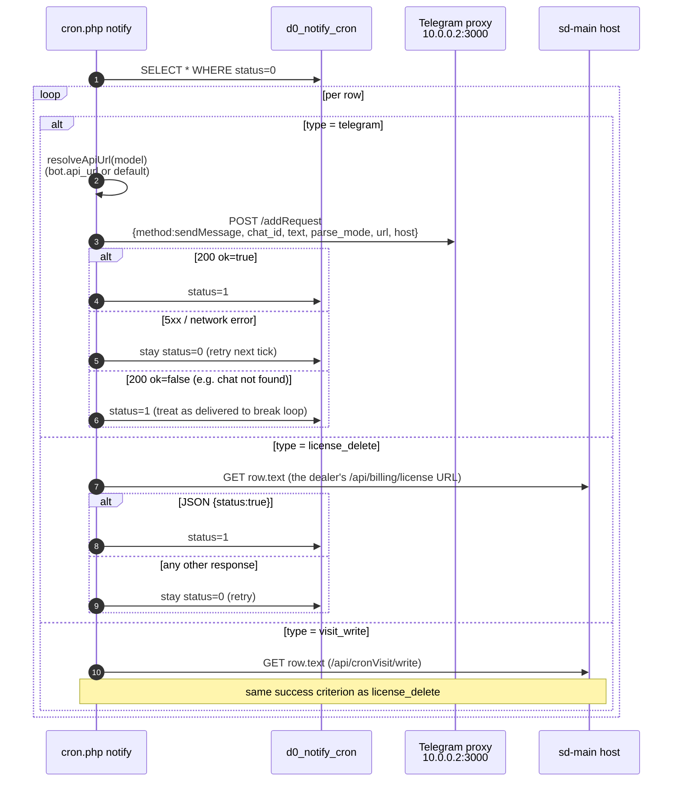

# Уведомления (Telegram + SMS)

Есть два канала доставки — **Telegram** (доминирующий) и
**SMS** — и одна общая таблица очереди, на которой едут и Telegram-сообщения,
и работы «сделай этот HTTP-вызов».

## 1. Сводка по каналам

| Канал | Код | Транспорт | Используется для |
|---------|------|-----------|----------|
| Telegram (с очередью) | `Telegram::queue` | HTTP `POST` к bot-прокси `http://10.0.0.2:3000/addRequest` | Почти все уведомления, обращённые к дилеру |
| Telegram (синхронный) | `Telegram::sendNow` | HTTP `POST` к `http://10.0.0.2:3000/sendNow` | Pages/критические алерты, требующие ответа в рамках запроса |
| SMS (UZ) | `Sms::send` / `Sms::multy` | HTTPS на `notify.eskiz.uz` | UZ-дилеры и партнёры |
| SMS (KZ) | `Sms::sendKz` | HTTPS на `api.mobizon.kz` | KZ-дилеры и партнёры |

Telegram-путь идёт через **внутренний бот-прокси** на
`10.0.0.2:3000`, не напрямую на `api.telegram.org`. Прокси
изолирует обработку rate-limit и хранение токенов ботов от sd-billing.

## 2. Общая очередь — `d0_notify_cron`

`NotifyCron` (`protected/models/NotifyCron.php`) — модель очереди и
**одновременно общая отложенная HTTP-очередь**. Колонка `type`
дискриминирует:

| Константа `type` | Значение | Что значит строка |
|-----------------|-------|--------------------|
| `NotifyCron::TYPE_TELEGRAM` | `telegram` | `text` — сообщение; `chat_id` — цель; `bot_id` выбирает бота (`d0_notify_bot`) для отправки |
| `NotifyCron::TYPE_LICENSE_DELETE` | `license_delete` | `text` содержит **URL** (например, `https://dealer.salesdoc.io/api/billing/license`), который нужно GET; ожидается JSON `{status: true}` |
| `NotifyCron::TYPE_VISIT_WRITE` | `visit_write` | То же, но для `/api/cronVisit/write` на хосте дилера |

| Колонка | Назначение |
|--------|---------|
| `id` | PK |
| `chat_id` | Telegram chat id (или `0` для не-Telegram строк) |
| `bot_id` | FK → `d0_notify_bot` (null = legacy default) |
| `text` | Тело сообщения **или** целевой URL |
| `parse_mode` | Telegram parse mode (`HTML` по умолчанию) |
| `type` | одно из значений выше |
| `status` | `0 = STATUS_DEFAULT` (pending), `1 = STATUS_RUN` (доставлено) |
| `error_response` | последняя причина сбоя (string) — хранится для отладки |
| `created_by` | id пользователя на момент постановки в очередь |
| `created_at` | timestamp |

Обработка сбоев: строка, доставка которой не удалась, остаётся со `status = 0`,
и cron следующей минуты повторяет её. **Постоянные** ошибки на стороне Telegram
(например, `chat not found`) считаются доставленными, чтобы избежать бесконечного
цикла — см. ветку `ok=false` в `NotifyCommand::sendTelegram`.

## 3. Боты — `d0_notify_bot`

Несколько Telegram-ботов могут доставлять из одной очереди. Строки в
`d0_notify_bot`:

| Колонка | Назначение |
|--------|---------|
| `id` | PK |
| `name` | `default`, `billing` и т. п. — строка, используемая `NotifyBot::findByName` |
| `token` | токен Telegram-бота |
| `api_url` | базовый URL бот-прокси, передаваемый в `Telegram::queue` |

Константы:

```php
NotifyBot::NAME_DEFAULT = 'default';
NotifyBot::NAME_BILLING = 'billing';
```

Логика разрешения в `NotifyCommand::resolveApiUrl`:

1. Если у строки есть `bot_id`, использовать `api_url` этого бота.
2. Иначе fallback на бота с именем `default`.
3. Если ни одного нет, строка падает permanent с
   `No api_url available (bot not configured)`.

## 4. API постановки в очередь

Три статических фабричных метода на `NotifyCron`:

```php
// Telegram message
NotifyCron::create(
    $chat_id,                        // int
    $text,                           // string
    $bot_id = null,                  // int from NotifyBot, or null
    $parse_mode = 'HTML',            // Telegram parse mode
    $type = NotifyCron::TYPE_TELEGRAM
);

// Delayed HTTP GET — called when a dealer's licence cache must be cleared
NotifyCron::createLicenseDelete($url);   // POSTs to dealer's /api/billing/license

// Delayed HTTP GET — called to seed daily visits
NotifyCron::createVisitWrite($url);
```

Не вызывайте `Telegram::queue` напрямую из запроса, который **не должен
блокироваться на доступности Telegram** — ставьте в очередь через `NotifyCron::create`
и пусть cron сливает.

## 5. Слив очереди — `cron.php notify`

`NotifyCommand` запускается каждую минуту (см.
[cron-and-settlement](./cron-and-settlement.md)).



Ключевые поведения:

- **Одна pending-строка → один HTTP-вызов** на тик cron. Батчинга
  нет; пропускная способность ограничена частотой тиков × параллелизмом.
- **At-least-once** доставка — прокси и endpoint`sd-main` должны быть
  **идемпотентны**. License-delete уже идемпотентен (delete-then-recreate);
  visit-write тоже должен быть идемпотентным per dealer/day.
- Connection timeout 20 с, total timeout 60 с для license-delete /
  visit-write GETs (`NotifyCommand::sendUrlGetExpectingStatusOk`).
- Сбои Telegram-прокси (network/5xx) — **transient** → строка остаётся
  со `status=0` и повторяется. **Логические** сбои Telegram
  (`ok=false`) — **permanent** → строка помечается выполненной.

## 6. Telegram бот-прокси

Компонент `Telegram` (`protected/components/Telegram.php`):

```php
const QUEUE_URL        = 'http://10.0.0.2:3000/addRequest';   // async
const SEND_NOW_URL     = 'http://10.0.0.2:3000/sendNow';      // sync

const CONNECT_TIMEOUT  = 3;     // seconds
const REQUEST_TIMEOUT  = 8;     // seconds  (queue path)
const SEND_NOW_TIMEOUT = 35;    // seconds  (sendNow path waits for Telegram reply)
const MAX_RETRIES      = 2;     // retry only on curl errno 28 (timeout)

const NOTIFY_CHAT_ID   = 122420625;   // ops alert channel
```

| Метод | Когда использовать |
|--------|-------------|
| `Telegram::queue($method, $params, $apiUrl, $stop=false, $oneAttempt=false)` | По умолчанию. Возвращается сразу, если прокси принял работу. Используйте для fire-and-forget. |
| `Telegram::sendNow($method, $params, $apiUrl, $stop=false, $oneAttempt=false)` | Используйте только когда нужен ответ от Telegram в рамках того же запроса (например, показать «message_id» обратно пользователю). Добавляет 35 с к худшему случаю latency. |

Оба call-site глотают исключения и логируют в
`log/telegram-queue-error-<ts>.txt` /
`log/telegram-sendnow-error-<ts>.txt`. Относитесь к этим файлам как к
debug-only — структурированный лог через `Logger::writeLog2` — тот, который
вы запрашиваете.

## 7. SMS — Eskiz (UZ) и Mobizon (KZ)

Компонент `Sms` (`protected/components/Sms.php`).

### 7.1 Eskiz — UZ

| Свойство | Значение |
|----------|-------|
| Base URL | `https://notify.eskiz.uz` |
| Auth | `POST /api/auth/login` возвращает 30-дневный токен, хранится в `upload/sms_token.txt` |
| Refresh | `Sms::deleteToken()` запускается ежедневно 08:00 (cron) — следующий вызов делает re-auth |
| Send single | `Sms::send($phone, $text)` → `POST /api/message/sms/send` |
| Send batch | `Sms::multy($messages, $host = null)` → `POST /api/message/sms/send-batch` |
| Sender | захардкоженный `'4546'` (никнейм пока не зарегистрирован) |
| Templates | `createTemplate()`, `templateList()` |
| Callback | Если `$host` передан в `multy`, callbacks приземляются на `https://billing.salesdoc.io/api/sms/callback?host=…` (`SmsController::actionCallback`) |

> ⚠ `EMAIL` и `PASSWORD` — **захардкоженные константы** в
> `Sms.php`. Отслеживается в [минах безопасности](./security-landmines.md);
> ротируйте, когда секреты публично утекают.

### 7.2 Mobizon — KZ

| Свойство | Значение |
|----------|-------|
| URL | `https://api.mobizon.kz/service/Message/SendSmsMessage` |
| Auth | API key в URL (`apiKey=…`) |
| Метод | `Sms::sendKz($phone, $text)` |

> ⚠ `apiKey` захардкожен в URL — та же мина.

### 7.3 Подсчёт + детектирование языка

```php
Sms::isRussian($text)                 // matches Cyrillic
Sms::countSms($text)                  // 70 chars/sms (Cyrillic), 160 chars/sms (ASCII)
```

Используйте `countSms` перед списанием с дилера за SMS-юниты.

## 8. Конкретные места постановки в очередь

Где в кодовой базе порождаются уведомления:

| Caller | Type | Назначение |
|--------|------|---------|
| `Diler::deleteLicense` | `license_delete` | Push инвалидации кэша лицензии в sd-main дилера |
| `Diler::resetVisits` (через `createVisitWrite`) | `visit_write` | Триггер дневного снимка визитов у дилера |
| `BotLicenseReminderCommand` | `telegram` | Напоминания за 7/3/1 день до истечения в Telegram дилера |
| `CleannerCommand` | `telegram` | Еженедельная сводка cleanup в ops |
| `VisitCommand`, `VisitHealthCommand` | `telegram` | Сводки по работам visit-snapshot |
| `ReportBotCommand` | `telegram` | Часовой вывод внутреннего report-бота |
| `FileLogRoute` (PHP error route) | `telegram` | Фатальная ошибка → ops chat |
| `ActiveRecordLogableBehavior` | `telegram` | Аудит-trail — отправляет в чат `-4241387119` |

## 9. SMS API surface (внутри sd-billing)

Модуль `api/sms` (`SmsController`):

| Action | Method | Назначение |
|--------|--------|---------|
| `actionPackages` | `POST` | Список SMS-пакетов, доступных дилеру для покупки |
| `actionBuySmsPackage` | `POST` | Списать `BALANS` за SMS-пакет |
| `actionBoughtSmsPackages` | `POST` | История |
| `actionCreateTemplate` | `POST` | Зарегистрировать шаблон в Eskiz |
| `actionCheckingTemplates` | `POST` | Кросс-проверка local vs. Eskiz списков шаблонов |
| `actionOne` | `POST` | Отправить одну SMS |
| `actionSend` | `POST` | Bulk send (использует `Sms::multy`) |
| `actionSendingForward` | `POST` | Forward queued sends |
| `actionCallback` | `POST` | Eskiz delivery callback (DLR) |

Auth: тот же паттерн стиля `LicenseController::TOKEN`; `Sms::isRussian`
и `countSms` используются внутри для биллинга в правильных юнитах.

## 10. Режимы отказа и runbook

| Симптом | Вероятная причина | Что проверить | Действие |
|---------|--------------|-------------|--------|
| Дилер сообщает «не вижу Telegram-алерты» | Bot-прокси упал, или неверный `api_url` в строке бота | `curl -v http://10.0.0.2:3000/sendNow` из контейнера `web` | Перезапустить прокси; проверить `d0_notify_bot.api_url` |
| Длина очереди растёт неограниченно | Cron не запущен, или каждая строка падает | `SELECT type, COUNT(*) FROM d0_notify_cron WHERE status=0 GROUP BY type;` | Tail `log/notify-command-errors-*` для типа, который вызывает |
| `sd-main` дилера держит устаревшую лицензию | Строки `license_delete` не сливаются, или хост дилера недоступен | `SELECT * FROM d0_notify_cron WHERE type='license_delete' AND status=0` | Curl URL с биллингового хоста; убедиться, что nginx дилера поднят |
| SMS-авторизация постоянно падает | Eskiz-токен истёк, файл не writeable, креды ротированы | `ls -la upload/sms_token.txt` и Eskiz dashboard | `php cron.php sms deleteToken` (или просто `rm` файл) |
| Постоянные Telegram-ошибки заливают логи | Устаревший `chat_id` (пользователь заблокировал бота) | Колонка `error_response` в строке | Пометить строку доставленной; убрать виновный `chat_id` из источника |
| Массовый алерт прострелил | Баг в caller (например, неверная подстановка шаблона) | Недавние коммиты в caller | Поставить cron на паузу (`crontab -l | sed -i …`), слить очередь руками, фикс |

## 11. Чек-лист по харденингу

- [ ] Перенести креды Eskiz / Mobizon в env-переменные.
- [ ] Добавить dead-letter таблицу для строк, достигших ретрай-капа (сейчас
      они ретраятся вечно, если только не словят логический Telegram-сбой).
- [ ] Отслеживать счётчик попыток на строку, чтобы алертить о hot retries.
- [ ] Ограничить слив очереди на тик (например, `LIMIT 500`), чтобы бэклог
      не вызвал переполнение одного тика cron на следующий.
- [ ] Подписывать тело bot-прокси `POST`, чтобы Eskiz callbacks нельзя было подделать.

## См. также

- [Cron и сеттлемент](./cron-and-settlement.md) — расписание `notify` и подобных.
- [Баланс и денежная математика](./balance-and-money-math.md) — `Diler::deleteLicense` на потоке денег.
- [Кросс-проектная интеграция](../architecture/cross-project-integration.md) — `license_delete` — это провод от sd-billing → sd-main.
- [Мины безопасности](./security-landmines.md) — захардкоженные SMS/Telegram-секреты.
