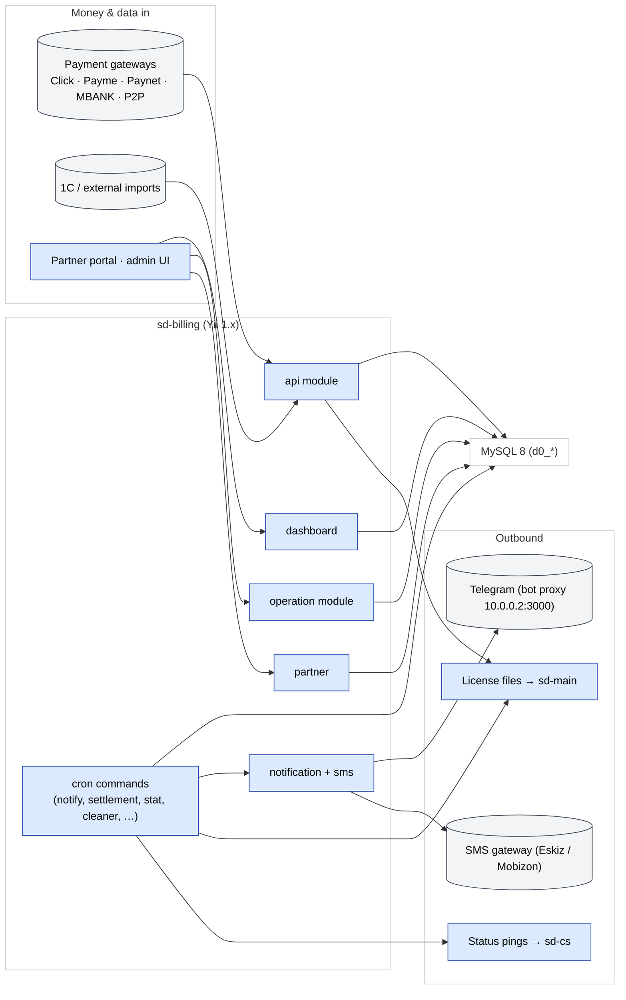

# sd-billing — подписки, лицензии, платежи

**sd-billing** — приложение **вендора платформы**, которое выставляет
счёт каждому дилеру SalesDoctor (каждому `sd-main`) и каждому HQ
(каждому `sd-cs`).

Он владеет:

- **Подписки** — какой дилер и какие пакеты может использовать и как
  долго.
- **Лицензии** — подписанный токен, который `sd-main` читает при логине,
  чтобы гейтить фичи.
- **Платежи** — деньги на входе из шлюзов (Click, Payme, Paynet, MBANK,
  P2P) и offline (нал, P2P).
- **Расчёты** — ежедневная сверка балансов дистрибьютор ↔ дилер.
- **Уведомления** — Telegram + SMS, когда срок лицензии дилера
  приближается к концу или пришли деньги.

## Технологический стек

| Слой | Технология |
|-------|------|
| Фреймворк | **Yii 1.1.15** (vendored под `framework/`) |
| Язык | PHP (php-fpm 7.x в Docker) |
| База данных | **MySQL 8**, charset `utf8mb4`, префикс таблиц `d0_` |
| Кеш / сессии | DB-backed (без Redis-компонента) |
| Cron | OS cron, запускающий `cron.php` (см. `protected/commands/cronjob.txt`) |
| Auth | Сессия + cookie (`WebUser` + `UserIdentity`) |
| Уведомления | Telegram bot proxy на `http://10.0.0.2:3000` |
| SMS | **Eskiz** (UZ), **Mobizon** (KZ) |
| Платежи | Payme, Click, Paynet, P2P, MBANK, плюс интеграция 1C |

## Модули

13 Yii-модулей под `protected/modules/`:

| Модуль | Назначение |
|--------|---------|
| `api` | Входящие интеграции (Click, Payme, Paynet, 1C, License, SMS, Host, Quest, Maintenance) |
| `dashboard` | Внутренний админ-UI — дилеры, дистрибьюторы, платежи, подписки, графики |
| `operation` | Доменный CRUD — пакеты, подписки, платежи, тарифы, blacklist, уведомления |
| `partner` | Партнёрский self-service портал (ограничен через `PartnerAccessService`) |
| `cashbox` | Кассы, типы потоков, переводы, расход |
| `report` | Экраны отчётности |
| `setting` | Настройки приложения + просмотрщик системного лога |
| `notification` | In-app уведомления |
| `sms` | SMS-шаблоны + отправка |
| `bonus` | Логика бонусов / скидок (квартальные и т.д.) |
| `access` | Сетка прав по пользователям |
| `directory` | Справочные данные |
| `dbservice` | Утилиты обслуживания БД |

## Структура репозитория

```
sd-billing/
├── index.php / cron.php        Web + console entry
├── _index.php / _constants.php Sample / template entries
├── docker/, docker-compose.yml Local + prod-like env
├── doc/                        Ad-hoc notes (security, integrations,
│                               testing plan)
├── log/, upload/, runtime/     Runtime artefacts (gitignored)
├── framework/                  Vendored Yii 1.1.15 (do not edit)
├── vendors/                    Pinned vendored libs
└── protected/                  ALL application code
    ├── config/
    │   ├── main.php            Web config
    │   ├── console.php         Cron config
    │   ├── db.php              MySQL connection (env-driven)
    │   └── auth.php            PhpAuthManager rules
    ├── components/             Cross-cutting services (Curl, Telegram,
    │                           Access, …)
    ├── helpers/                ArrayHelper, DateHelper, QueryBuilder,
    │                           Validator
    ├── behaviors/              AjaxCrudBehavior,
    │                           ActiveRecordLogableBehavior
    ├── actions/                Reusable actions (ApiAction, …)
    ├── controllers/            SiteController (login / logout / error)
    ├── models/                 Top-level AR models
    │                           (Diler, Payment, Subscription, …)
    ├── modules/                See module table above
    ├── commands/               Cron / CLI commands
    ├── migrations/             m*.php (yiic migrate)
    ├── extensions/             paynetuz, …
    └── views/                  Site views
```

## Диаграмма архитектуры



## См. также

- [Доменная модель](./domain-model.md)
- [Модули](./modules.md)
- [Платёжные шлюзы](./payment-gateways.md)
- [Поток подписки и лицензирования](./subscription-flow.md)
- [Cron и расчёты](./cron-and-settlement.md)
- [Auth и доступ](./auth-and-access.md)
- [Локальная установка](./local-setup.md)
- [Security landmines](./security-landmines.md)
- [Интеграция с sd-main и sd-cs](./integration.md)
