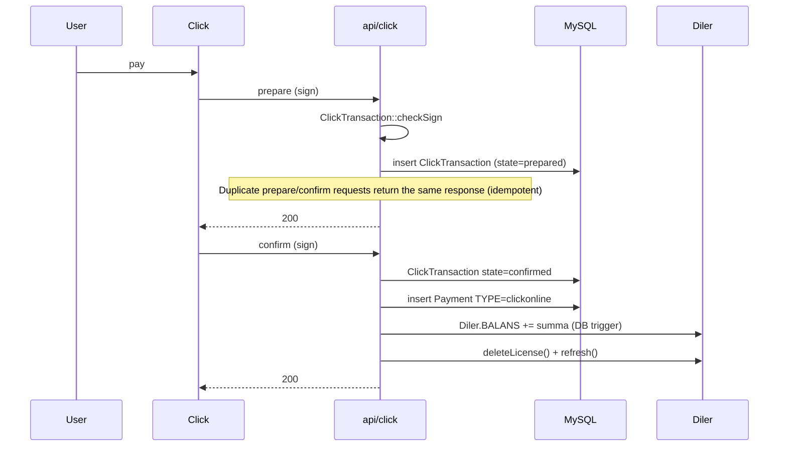
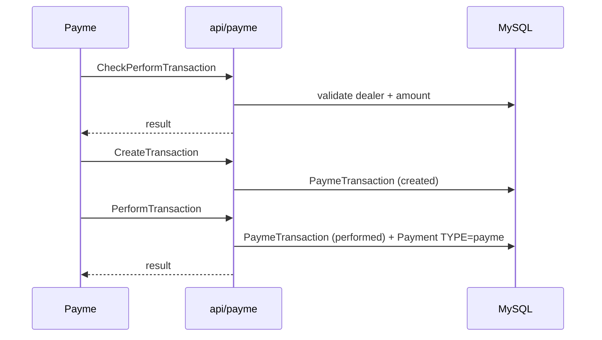

# Платёжные шлюзы

sd-billing принимает деньги из пяти онлайн + нескольких оффлайн каналов.
Каждый успешный входящий платёж в итоге пишет строку `Payment` нужного
`TYPE`, инкрементирует `Diler.BALANS` и триггерит
`Diler::deleteLicense()` / `Diler::refresh()`, чтобы рассчитать непогашенные
подписки.

## Online

| Шлюз | `Payment.TYPE` | Контроллер | Заметки |
|---------|----------------|------------|-------|
| **Click** | `TYPE_CLICKONLINE` | `api/click` | Двухфазный prepare/confirm с HMAC-подписью (`ClickTransaction::checkSign`) |
| **Payme** | `TYPE_PAYMEONLINE` | `api/payme` | JSON-RPC; HMAC auth-заголовок проверяется в `PaymeHelper` |
| **Paynet** | `TYPE_PAYNETONLINE` | `api/paynet` | SOAP через `extensions/paynetuz/`; шаблон кред в `_constants.php` |
| **MBANK** (KG) | `mbank` | gateway-specific | Сегодня stub-уровня — переподтвердить с мейнтейнером |
| **P2P** | `p2p` | ручной ввод | Оператор подтверждает входящий банк-перевод |

## Offline

| Источник | `Payment.TYPE` | Захвачено |
|--------|----------------|-------------|
| Cash | `cash` | модуль `cashbox` |
| Cashless / wire | `cashless` | `cashbox` |
| License redemption | `license` | `Diler::refresh()` потребляет кредиты |
| Distribute / settlement | `distribute` | `cron settlement` (см. [Cron](./cron-and-settlement.md)) |
| Service fee | `service` | руками |

## Канонический enum `Payment.TYPE`

Полный enum определён как константы класса на модели `Payment`
(`protected/models/Payment.php` в sd-billing). Строковые метки выше
маппятся в integer-коды; новый код ОБЯЗАН использовать константы, не голые
числа или строки:

| Константа | Строковая метка | Направление |
|----------|--------------|-----------|
| `Payment::TYPE_CASH` | `cash` | входящий (offline) |
| `Payment::TYPE_CASHLESS` | `cashless` | входящий (offline) |
| `Payment::TYPE_P2P` | `p2p` | входящий (offline) |
| `Payment::TYPE_LICENSE` | `license` | исходящий (потреблено) |
| `Payment::TYPE_DISTRIBUTE` | `distribute` | сеттлемент |
| `Payment::TYPE_SERVICE` | `service` | ручной взнос |
| `Payment::TYPE_PAYMEONLINE` | `payme` | входящий (шлюз) |
| `Payment::TYPE_CLICKONLINE` | `click` | входящий (шлюз) |
| `Payment::TYPE_PAYNETONLINE` | `paynet` | входящий (шлюз) |
| `Payment::TYPE_MBANK` | `mbank` | входящий (шлюз, KG) |

Числовые целочисленные значения намеренно не воспроизводятся здесь, чтобы
этот документ не разошёлся с моделью — читайте объявления констант
в `Payment.php` для авторитетных чисел.

## Click flow (canonical)

## Payme flow

## Paynet flow

Основан на SOAP. Провайдер шлюза стучится на SOAP-endpoint, выставленный
расширением `paynetuz`; контроллер превращает запрос в
`PaynetTransaction` и соответствующую строку `Payment`.

## Идемпотентность

Таблица транзакций каждого шлюза — ключ идемпотентности. Получение
того же `prepare` (Click) или `CreateTransaction` (Payme) дважды возвращает
тот же ответ без вставки нового `Payment`.

## Режимы отказа

| Сценарий | Поведение |
|----------|-----------|
| Bad sign | 4xx, `Payment` не создаётся |
| Дилер неактивен | 4xx, транзакция остаётся в `prepared` |
| Дублирующийся id | Тот же ответ, что и при первом вызове |
| Сетевая ошибка в середине `PerformTransaction` | Шлюз ретраит; идемпотентность держит |

## Логирование

`Logger::writeLog2($data, $is_req, $path)` пишет JSON-файлы по дню по action
в `log/<controller>/<YYYY-MM-DD>/`. **Санитизируйте входы перед
логированием** — никогда не логируйте детали карт или полные payload.

## Ручной ввод платежа

Кассиры / операторы добавляют платежи через дашборд модуля `operation`.
Использует `Payment::create([...])` напрямую — те же триггеры БД срабатывают.
