# Подписка и лицензирование

Сквозной поток от регистрации дилера до разблокировки фич в его
`sd-main`.

```mermaid
flowchart LR
  S(["Dealer signs up"]) --> P["Pay (online or offline)"]
  P --> B["Diler.BALANS += summa"]
  B --> BUY["api/license/buyPackages"]
  BUY --> CHK{"Validation passes?"}
  CHK -- "no" --> ERR(["Reject"])
  CHK -- "yes" --> SUB["Subscription rows<br/>[START_FROM, ACTIVE_TO]"]
  SUB --> NEG["Payment TYPE=license (negative)"]
  NEG --> SET["Diler.refresh() — recompute BALANS, FREE_TO, MONTHLY"]
  SET --> SRV["Diler.HOST → Server.STATUS=SENT → OPENED"]
  SRV --> NOTIF(["Telegram + SMS to dealer"])

  class S action
  class P,B,BUY,SUB,NEG,SET,SRV action
  class CHK approval
  class ERR reject
  class NOTIF success
  classDef action   fill:#dbeafe,stroke:#1e40af,color:#000
  classDef approval fill:#fef3c7,stroke:#92400e,color:#000
  classDef success  fill:#dcfce7,stroke:#166534,color:#000
  classDef reject   fill:#fee2e2,stroke:#991b1b,color:#000
  classDef external fill:#f3f4f6,stroke:#374151,color:#000
  classDef cron     fill:#ede9fe,stroke:#6d28d9,color:#000
```

Шаг `Validation` отклоняет на любой из этих независимых проверок:

| Проверка | Отклонение когда |
|-------|-------------|
| Баланс | `Diler.BALANS` < `Package.PRICE` (суммарно по запрошенным пакетам) |
| Минимальные пороги | `MIN_SUMMA` или `MIN_LICENSE` anti-abuse предел не достигнут |
| Совпадение валюты | Posted currency ≠ `Diler.CURRENCY_ID` |

## Покупка пакетов

`POST /api/license/buyPackages` — вызывается `sd-main` дилера (сессия
с фиксированным логином через `new UserIdentity("sd","sd")`).

Валидация в `LicenseController::actionBuyPackages`:

1. Дилер существует + активен.
2. Posted currency совпадает с `Diler.CURRENCY_ID`.
3. Каждый запрошенный пакет можно продать дилеру с этим
   `Diler.COUNTRY_ID`.
4. `Diler.BALANS` ≥ суммы.
5. Удовлетворены пороги `MIN_SUMMA` / `MIN_LICENSE` (anti-abuse).

При успехе:

- Вставка строк `Subscription` для каждого выбранного пакета с датой
  `START_FROM = today`, `ACTIVE_TO = today + Package.TYPE` дней.
- Вставка одной строки `Payment` с `TYPE = license` и **отрицательной**
  `SUMMA` (чтобы триггеры уменьшили `BALANS` на стоимость).
- Вызов `Diler::refresh()` для пересчёта баланса дилера, `FREE_TO` и
  сводки `MONTHLY`.
- Затрагивание `Server.STATUS`, чтобы `sd-main` дилера получил новую
  лицензию.

## Free trial

`Diler.IS_DEMO` и `Diler.FREE_TO` дают бесплатное окно с границей по дате.
Пока trial активен, `hasSystemActive(systemId)` (вызывается
`sd-main` при логине) возвращает `true` даже без подписок.

## Продление

Продление — это просто ещё один **buy** вызов с теми же пакетами. Новые
строки `Subscription` продлевают покрытие дилера от **конца последней
активной подписки** (не от сегодня), чтобы пользователи не теряли дни.

## Истечение

Ежедневный cron `botLicenseReminder` предупреждает дилеров, приближающихся к истечению:

- За 7, 3, 1 день до `ACTIVE_TO` — уведомления Telegram + SMS.
- После истечения — `Diler::refresh()` переключает файл лицензии (потребляется
  `sd-main`).

## Бонусные пакеты

Строки `Subscription` могут быть помечены `is_bonus = true` (бесплатные места).
Они учитываются при проверке лицензии, но не списывают `BALANS`.

## Режим всех пакетов (`MONTHLY=15`)

Если `Diler.MONTHLY = 15`, дилер на плане «все пакеты». Файл
лицензии гейтит по глобальному истечению, а не по `SUBSCRIP_TYPE` пакета.
