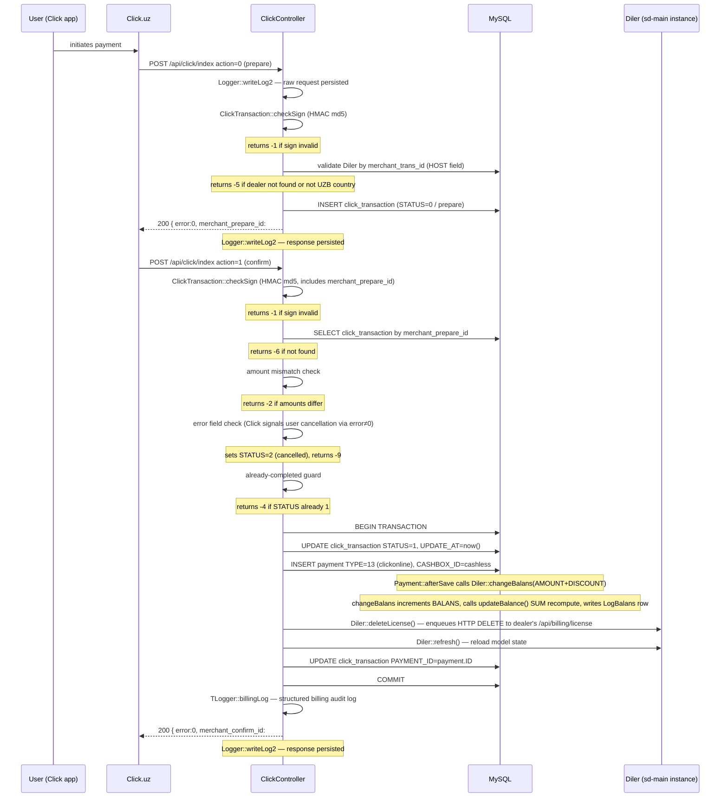

# api · Шлюз Click

## Назначение

Принимает двухфазные уведомления о платежах от шлюза Click.uz и преобразует
подтверждённый платёж в строку `Payment` типа `TYPE_CLICKONLINE` (13), что
триггерит пересчёт баланса и расчёт подписок для дилера. Обработчик
— один Yii action контроллера, который маршрутизирует по полю `action` в
теле входящего запроса — он не выставляет отдельных URL endpoints для
двух фаз.

## Кто использует

Этот endpoint вызывается исключительно платёжной системой Click.uz — не
из UI sd-billing и не оператором-человеком. RBAC-роль из модуля access
sd-billing не требуется, потому что авторизация полностью основана на HMAC-подписи.
Контроллер выполняет внутренний логин под фиксированным системным пользователем `click`
(`User.LOGIN = 'click'`) перед любой работой с моделью.

Вызов `Access::check()` не делается; провал подписи в `checkSign` возвращает
ошибку `-1` и останавливает обработку до любой записи в БД.

## Где живёт

| Артефакт | Путь |
|---|---|
| Контроллер | `protected/modules/api/controllers/ClickController.php` |
| Модель транзакции | `protected/models/ClickTransaction.php` |
| Модель платежа | `protected/models/Payment.php` |
| Модель Diler | `protected/models/Diler.php` |
| Модель Cashbox | `protected/modules/cashbox/models/Cashbox.php` |
| Логгер запросов/ответов | `protected/modules/api/components/TLogger.php`, `protected/components/Logger.php` |
| Входящий URL | `POST /api/click/index` (модуль `api`, контроллер `click`, action `index`) |

URL разрешается через стандартное правило Yii `<controller>/<action>`; собственного
правила маршрутизации специально для Click не зарегистрировано.

## Workflow

Шаги 1–6 (prepare) и 7–18 (confirm) каждый начинаются и заканчиваются вызовом
`Logger::writeLog2`, записывающим как сырой запрос, так и сырой ответ как
JSON-файлы в `log/click/YYYY-MM-DD/`.

## Правила

- `checkSign` валидирует, что `service_id` в запросе совпадает с
  захардкоженной константой `ClickTransaction::$service_id` (15603); запросы с
  несовпадающим или отсутствующим `service_id` сразу возвращают ошибку `-1`, до
  любого чтения БД.
- HMAC-строка — `md5(click_trans_id + service_id + secret_key +
  merchant_trans_id + merchant_prepare_id + amount + action + sign_time)`; для
  фазы prepare `merchant_prepare_id` равен `null` (буквальный PHP null, не
  пустая строка).
- `merchant_trans_id` маппится на `Diler.HOST` (поддомен дилера), не на
  `Diler.ID`; lookup по атрибуту `HOST` выполняется на каждый вызов.
- Дилеры с `country.CODE != 'UZB'` отклоняются с ошибкой `-5` на фазе
  prepare; Click.uz только UZ, и KZ/KG-дилеры должны использовать Paynet или
  MBANK.
- Обработчик confirm читает поле `error` из тела запроса Click; ненулевое
  значение `error` означает, что Click сам сигнализирует сбой со стороны пользователя.
  Обработчик устанавливает `STATUS = 2` (cancelled) внутри транзакции БД и возвращает
  `-9`, не `-8`.
- Неизменность суммы: поле `amount` вызова confirm должно точно совпадать с
  `ClickTransaction.AMOUNT`, установленным во время prepare; любое отклонение возвращает `-2`
  без изменения статуса транзакции.
- Идемпотентность: запрос confirm, пришедший для транзакции уже в
  `STATUS = 1` (complete), возвращает `-4` (Already paid) без вставки
  дублирующей строки `Payment`.
- Транзакция уже в `STATUS = 2` (cancelled) также возвращает `-9` на любую
  дальнейшую попытку confirm; guard срабатывает до проверки already-completed.
- `Payment::create(...)` устанавливает `CASHBOX_ID` в `Cashbox::getIDByCode("cashless")`
  — то есть кассу cashless, не cash.
- `Payment::afterSave` запускает `Diler::changeBalans(AMOUNT + DISCOUNT)` в PHP (
  in-memory инкремент с последующим `save(false)`), затем вызывает `updateBalance()`,
  который выпускает SUM-based SQL-перерасчёт, чтобы защититься от конкурентных
  запросов, приходящих в одну секунду.
- `Diler::deleteLicense()` ничего не удаляет напрямую; он ставит в очередь
  HTTP-запрос к инстансу sd-main дилера на
  `<domain>/api/billing/license` через `NotifyCron::createLicenseDelete`. Если
  domain пуст, метод тихо возвращает после установки flash-ошибки.
- DB-транзакция оборачивает только обновление `click_transaction`, вставку
  `Payment` и второе сохранение `click_transaction` (добавление `PAYMENT_ID`); вызовы
  `deleteLicense` / `refresh` происходят внутри try-блока, но являются
  нетранзакционными HTTP-операциями.
- При любом исключении во время confirm-транзакции обработчик откатывает и
  возвращает `-8` (Error in request from click).

## Источники данных

| Таблица | Зачем читается / пишется |
|---|---|
| `click_transaction` | Запись идемпотентности; создаётся на prepare, обновляется на confirm; значения `STATUS`: 0 prepare, 1 complete, 2 cancelled |
| `payment` | Вставляется при успешном confirm; `TYPE = 13` (`TYPE_CLICKONLINE`); триггерит обновление баланса через `afterSave` |
| `diler` | Поиск по `HOST`; `BALANS` обновляется через `changeBalans` + `updateBalance` |
| `log_balans` | Append-only audit-строка изменения баланса, пишется внутри `changeBalans` |
| `cashbox` | Запрашивается один раз по `CODE = 'cashless'`, чтобы разрешить `CASHBOX_ID` для нового `Payment` |
| `user` | Запрашивается один раз для аутентификации системного пользователя `LOGIN = 'click'` для Yii-сессии |

Все таблицы в единой MySQL-базе sd-billing. Второй control-plane базы
нет; разделение `cs_*` / `d0_*`, описанное в документах sd-cs, здесь не
применимо.

## Подводные камни

- **Обе фазы стучатся на один URL и action.** В отличие от Payme (которая использует именованные
  методы JSON-RPC) или Paynet (SOAP-операции), Click отправляет `action=0` (prepare)
  или `action=1` (confirm) как обычное POST-поле на `POST /api/click/index`.
  На уровне фреймворка нет различения маршрутов.

- **`merchant_prepare_id` — локальный PK, не ID Click.** Ответ prepare
  возвращает `click_transaction.ID` из sd-billing как
  `merchant_prepare_id`. Click затем эхом возвращает это значение в запросе confirm,
  и так контроллер ищет транзакцию. Путаница
  между `click_trans_id` (целое число самого Click) и `merchant_prepare_id`
  (PK в sd-billing) — самый частый источник ошибок при отладке.

- **DB-транзакция не покрывает весь путь confirm.** `deleteLicense`
  и `refresh` вызываются внутри `try`-блока, но после того как DB-коммит ещё
  не произошёл — если `deleteLicense` бросит, rollback сработает и
  строка `Payment` не будет записана. И наоборот, если финальный `$model->save()`
  (запись `PAYMENT_ID` назад) упадёт после того, как `Payment::create` уже отработал,
  транзакция откатывается, но `Payment::afterSave` уже инкрементировал
  `Diler.BALANS` в памяти через PHP (хотя SQL-based `updateBalance`
  установит правильный SUM). На практике это безопасно, потому что rollback
  предотвращает связь `PAYMENT_ID`, но сама строка `payment` выживает, если
  сохранение `click_transaction` упало. Расследуйте через TLogger billing-логи, если
  у дилера показывается кредит баланса без связанной транзакции.

- **`Logger::writeLog2` использует директорию-на-день в `log/click/`.** Каждый
  запрос порождает два файла (один `req.txt`, один `res.txt`), названных с
  timestamp с точностью до секунды. В дни высокой нагрузки возможно несколько файлов в секунду;
  коллизия на практике редкая, но не невозможная. Файлы лога —
  чистый JSON, не line-delimited — grep по `click_trans_id` для трассировки
  конкретного платежа.

## См. также

- [Платёжные шлюзы](../payment-gateways.md) — каноническая диаграмма потока, полный
  enum `Payment.TYPE`, паттерны Payme и Paynet, таблица идемпотентности и
  режимов отказа.
- [Баланс и денежная математика](../balance-and-money-math.md) — как `changeBalans`,
  `updateBalance` и `Payment::afterSave` взаимодействуют для поддержки `Diler.BALANS`.
- [Модули](../modules.md) — обзор модуля `api`; паттерны авторизации в
  контроллерах шлюзов.
- Source: `protected/modules/api/controllers/ClickController.php`
