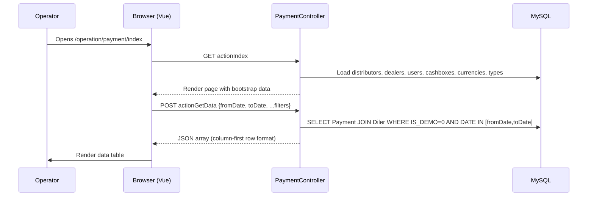

# operation · Запись платежа

## 1. Назначение

Фича Payment recording — административная точка входа в книгу учёта для
всех денег, поступающих на баланс дилера в sd-billing. Она даёт
операторам, менеджерам и key-account персоналу единый view для перечисления, добавления,
редактирования и софт-удаления строк платежей и для триггера downstream цепочки
расчёта подписок, которая ре-активирует лицензии после регистрации
платежа.

---

## 2. Кто использует

| Роль | Ключ доступа | Возможность |
|------|-----------|------------|
| Admin (`IS_ADMIN = 1`) | `operation.dealer.payment` SHOW | Полный список со всеми кассами |
| Manager (ROLE = 4) | `operation.dealer.payment` SHOW | Scoped по своим country IDs |
| Operator (ROLE = 5) | `operation.dealer.payment` SHOW/CREATE/UPDATE/DELETE | Scoped по своей кассе |
| Key-account (ROLE = 9) | `operation.dealer.payment` SHOW | Scoped по своим country IDs |
| Sale (ROLE = 7) | `operation.dealer.payment` SHOW | Scoped по своим country IDs |

Константы доступа проверяются через `Access::check('operation.dealer.payment', Access::SHOW/CREATE/UPDATE/DELETE)`.

Права на create, update и delete выдаются только тогда, когда у действующего
пользователя есть хотя бы одна касса (`count($ownCashboxes) > 0`). Пользователи, у которых
`ACCESS_CASHBOX = 1`, могут читать и действовать на всех кассах; остальные
ограничены кассами, где `Cashbox.USER_ID = User.USER_ID`.

---

## 3. Где живёт

| Item | Path |
|------|------|
| Контроллер | `protected/modules/operation/controllers/PaymentController.php` |
| Модель Payment | `protected/models/Payment.php` |
| Модель Diler (методы баланса) | `protected/models/Diler.php` |
| Index view | `protected/modules/operation/views/payment/index.php` (рендерится `actionIndex`) |
| URL | `/operation/payment/index` |

Выставленные actions:

| Action | Method | Константа доступа |
|--------|--------|-----------------|
| `actionIndex` | GET | SHOW |
| `actionGetData` | POST | SHOW |
| `actionCreateOrUpdate` | POST | CREATE или UPDATE (решается per-record) |
| `actionDelete` | POST | DELETE |

---

## 4. Workflow

### 4a. Перечисление платежей

Дефолтный диапазон дат — с первого по последний день текущего календарного месяца.
Не-админ пользователи country-scoped: `getUserCountryIds()` возвращает
country IDs действующего пользователя; админы получают пустой массив, что пропускает
фильтр `COUNTRY_ID IN (...)` целиком.

### 4b. Создание платежа (manual / admin path)

1. Оператор кликает **Add payment** в UI.
2. Браузер делает POST на `actionCreateOrUpdate` с полями: `dealer`, `currency`, `cashbox`, `type`, `amount`, `date`, `comment`, и `id = null`.
3. Контроллер валидирует владение кассой, существование дилера, существование валюты, существование кассы, совпадение валюты с дилером (`Diler.CURRENCY_ID`), членство type в `Payment::getPaymentTypes()`, и формат даты.
4. Контроллер открывает DB-транзакцию, инстанцирует `new Payment()`, ставит `AMOUNT = abs(floatval($postData["amount"]))`, `DISCOUNT = 0`, и сохраняет.
5. `Payment::beforeSave` штампует `CREATED_BY` и резолвит `DISTRIBUTOR_ID` из активного дистрибьютора дилера.
6. `Payment::afterSave` вызывает `Diler::changeBalans(AMOUNT + DISCOUNT)`, который инкрементирует `Diler.BALANS`, добавляет строку `LogBalans` и затем запускает авторитетный SUM-перерасчёт `Diler::updateBalance()` против `d0_payment`. Затем `Diler::resetActiveLicense()` обновляет `ACTIVE_TO`.
7. После успешного `save()` и коммита транзакции `Diler::deleteLicense()` ставит в очередь запрос `NotifyCron` license-delete на хост SD-app дилера (`/api/billing/license`) для немедленного расчёта подписки.
8. Браузер получает `{"success": true}` и обновляет таблицу.

### 4c. Редактирование платежа

Тот же endpoint (`actionCreateOrUpdate`) с ненулевым `id`. Контроллер
загружает существующую запись `Payment` (`findByPk`), проверяет UPDATE-доступ,
ставит новые значения полей, и сохраняет. `afterSave` детектирует non-new, non-deleted
запись и вызывает `changeBalans(NEW_AMOUNT - OLD_AMOUNT)`. Если у дилера есть
дистрибьютор и существует связанный `DistrPayment`, его `AMOUNT` патчится
тем же проходом.

### 4d. Софт-удаление платежа

1. Браузер делает POST на `actionDelete` с `{id}`.
2. Контроллер вызывает `Payment::deletePayment()`, который ставит `IS_DELETED = 1` и вызывает `save(false)` (обходит правила валидации).
3. `afterSave` детектирует `IS_DELETED = ACTIVE_DELETED`, вычитает `-(AMOUNT + DISCOUNT)` из `Diler.BALANS`, вызывает `uncomputeDebt()` для отката любой связи `CompDetails`, и, если у дилера есть дистрибьютор со связанным `DistrPayment`, вызывает `DistrPayment::deletePayment()`, чтобы зеркалить откат.

---

## 5. Правила

- `Payment.TYPE` для созданных вручную платежей ограничен типами, возвращаемыми `Payment::getPaymentTypes()`, что является `Payment::getTypes()` минус `TYPE_LICENSE (10)`, `TYPE_DISTRIBUTE (11)` и `TYPE_SERVICE (14)`. Ручные операторы не могут создавать строки license-consumption, settlement или service-fee.
- Поле `amount` всегда хранится как `abs(floatval($postData["amount"]))` — контроллер преобразует отрицательный ввод в положительный перед записью `AMOUNT`. `DISCOUNT` всегда `0` на созданных вручную платежах.
- `Diler.BALANS` поддерживается **только в PHP**: `Diler::changeBalans()` корректирует in-memory значение, пишет `save(false)`, записывает строку `LogBalans`, затем вызывает `Diler::updateBalance()`, который делает полный `SUM(AMOUNT + DISCOUNT)` пересчёт как страховочную сетку. Миграция триггеров БД `m221114_070346_create_triggers_to_payment.php` существует, но её `$this->execute($sql)` закомментирован и **не активен**.
- Валюта должна совпадать с собственной `Diler.CURRENCY_ID` дилера; несовпадения отклоняются с HTTP 200 + `{"success": false}` до любой записи в БД.
- Демо-дилеры (`Diler.IS_DEMO = 1`) исключаются из списка платежей: запрос `actionGetData` имеет жёсткое условие `WHERE dil.IS_DEMO = 0`.
- Редактируемость строки в списке гейтится per-row SQL-выражением: `TYPE NOT IN (10, 11)` (нельзя редактировать строки license-consumption или distribution) **и** касса принадлежит действующему пользователю (`Cashbox.USER_ID = :userId`) или у пользователя `ACCESS_CASHBOX = 1`. Удаляемость снимает ограничение по типу — любой тип может быть удалён, если проверка владения кассой проходит.
- `getUserCountryIds()` возвращает `[]` для админов (`Yii::app()->user->isAdmin()`), в этом случае выражение `COUNTRY_ID IN (...)` пропускается и видны все дилеры. Для не-админов возвращает `User::getCountryIds()`, и запрос scoped соответственно.
- `Diler::deleteLicense()` ставит в очередь строку `NotifyCron` (тип: license-delete), указывающую на `DOMAIN + '/api/billing/license'` дилера. Фактический HTTP-вызов делает cron-job `notify` (каждую минуту) — он **не** синхронен в request-цикле.
- `Payment::afterSave` пропускается, когда `$this->disabledAfterSave === true`; этот флаг устанавливается `saveWithoutAfterSave()`, используемым внутренне при патчинге `COMP`-полей, чтобы предотвратить рекурсию.

---

## 6. Источники данных

| Таблица | DB / connection | Зачем читается |
|-------|-----------------|----------|
| `d0_payment` | sd-billing default DB | Первичная книга — listed, created, updated, soft-deleted |
| `d0_diler` | sd-billing default DB | Lookup дилера, совпадение валюты, обновление баланса, вызов `deleteLicense` |
| `d0_distributor` | sd-billing default DB | Заполнение фильтра дистрибьютора в индексе; `beforeSave` резолвит `DISTRIBUTOR_ID` |
| `d0_cashbox` | sd-billing default DB | Per-row проверка владения кассой; собственные кассы пользователя для access-гейтинга |
| `d0_currency` | sd-billing default DB | Currency dropdown; валидирует совпадение валюты с дилером |
| `d0_user` | sd-billing default DB | User dropdown (ROLE ≠ 6 = не-API, ACTIVE = 1); country-scope lookup |
| `d0_log_balans` | sd-billing default DB | Пишется `Diler::changeBalans` на каждое изменение баланса (audit-trail) |
| `d0_comp_details` | sd-billing default DB | Read/deleted `uncomputeDebt()` при откате платежа против строки долга |
| `d0_distr_payment` | sd-billing default DB | Зеркальный update/delete, когда у дилера есть дистрибьютор и связанный `DistrPayment` |
| `d0_notify_cron` | sd-billing default DB | Пишется `Diler::deleteLicense()`, чтобы поставить в очередь async-вызов license-settlement |

Все таблицы используют префикс `d0_`. Yii placeholder `{{tableName}}` резолвится
через `tablePrefix` в DB-конфиге — модели ссылаются на таблицу как
`{{payment}}`, `{{diler}}` и т. п.

---

## 7. Подводные камни

**`deleteLicense()` асинхронен.** После сохранения платежа контроллер
вызывает `$dealer->deleteLicense()`, который пишет строку `d0_notify_cron`, а не
HTTP-вызов. Фактический license-push к SD-app дилера происходит до
одной минуты позже, когда срабатывает cron `notify`. Если cron упал,
подписки остаются нерасчитанными, хотя строка платежа и баланс уже
обновлены.

**Флаг `ACCESS_CASHBOX` обходит все фильтры владения кассой.** Пользователь
с `User.ACCESS_CASHBOX = 1` видит каждую строку платежа как и редактируемой, и
удаляемой, независимо от того, какой кассе платёж принадлежит. Это не
проверка роли — это column-level флаг на таблице `d0_user`, отличный от
`IS_ADMIN`.

**Edit заблокирован для строк `TYPE IN (10, 11)`, кто бы ни был пользователь.**
Платежи с `TYPE_LICENSE (10)` или `TYPE_DISTRIBUTE (11)` помечены как
не-редактируемые SQL-выражением `actionGetData`. Они всё ещё могут быть
софт-удалены (если проходит владение кассой). Это значит, что строки
license-consumption, созданные шлюзом, могут быть удалены владельцем кассы, но не могут быть
отредактированы.

**`DISCOUNT` всегда 0 на ручном создании; исторические строки могут отличаться.**
Контроллер всегда пишет `$model->DISCOUNT = 0`. Однако более старые строки платежей
(созданные сеттлементом, шлюзом или legacy-импортом) могут нести ненулевые
значения `DISCOUNT`. Запросы баланса должны использовать `AMOUNT + DISCOUNT`, а не
один `AMOUNT` — как `actionGetData` корректно делает с `(pay.AMOUNT +
pay.DISCOUNT) AS amount`.

---

## 8. См. также

- [Платёжные шлюзы](./payment-gateways.md) — потоки Click/Payme/Paynet, которые
  тоже создают строки `Payment` через контроллеры `api/*`.
- [Доменная модель](./domain-model.md) — схемы `Payment`, `Diler`, `Cashbox` и
  таблиц транзакций шлюзов.
- [Cron и сеттлемент](./cron-and-settlement.md) — `SettlementCommand`, который
  создаёт строки `TYPE_DISTRIBUTE (11)`, и cron `notify`, обрабатывающий
  очередь `d0_notify_cron` (включая записи license-delete, поставленные в очередь
  этой фичей).
- [Баланс и денежная математика](./balance-and-money-math.md) — почему `Diler.BALANS`
  поддерживается в PHP, какая миграция триггеров отключена, и
  страховочная сетка SUM-перерасчёта `updateBalance()`.
- Source: `protected/modules/operation/controllers/PaymentController.php`
