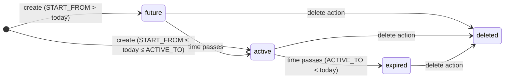

# operation · Жизненный цикл подписки

## 1. Назначение

Фича Subscription lifecycle позволяет billing-персоналу создавать, корректировать, переназначать и софт-удалять time-bounded строки лицензий (`d0_subscription`), которые определяют, какие пакеты дилер может использовать в `sd-main`. Каждая операция записи немедленно инвалидирует кэшированный файл лицензии дилера на сервере `sd-main`, поэтому изменение вступает в силу при следующем логине.

## 2. Кто использует

| Роль | Ключ доступа | Разрешённые операции |
|------|-----------|----------------------|
| Admin (`IS_ADMIN = true`) | `operation.dealer.subscription` | Все четыре операции |
| Manager, Operator, Key-account (role 4/5/9) | `operation.dealer.subscription` | Subject to их bitmask grant |

Право проверяется через `Access::check('operation.dealer.subscription', $type)`, где `$type` — одна из bitmask-констант:

| Константа | Значение | Требуется |
|----------|-------|-------------|
| `Access::SHOW` | 4 | `list`, `info` |
| `Access::CREATE` | 1 | `create` |
| `Access::UPDATE` | 2 | `update`, `exchange`, `calculate-bonus` |
| `Access::DELETE` | 8 | `delete` |

Endpoint `info` вызывает `$this->authenticate()`, а не `authorize()`, поэтому любая аутентифицированная сессия может читать метаданные пакета.

## 3. Где живёт

| Item | Path |
|------|------|
| Контроллер | `protected/modules/operation/controllers/SubscriptionController.php` |
| Action-классы | `protected/modules/operation/actions/subscription/` |
| Модель Subscription | `protected/models/Subscription.php` |
| Модель Package | `protected/models/Package.php` |
| Модель Diler (хуки лицензии) | `protected/models/Diler.php` |
| Модель Notify-cron | `protected/models/NotifyCron.php` |
| Bot-reminder cron command | `protected/commands/BotLicenseReminderCommand.php` |
| Cron runner | `cron.php` (project root) |

URL pattern (Yii routes модуля `operation`):

```
POST   /operation/subscription/list
GET    /operation/subscription/info
POST   /operation/subscription/create
DELETE /operation/subscription/delete
POST   /operation/subscription/update
PATCH  /operation/subscription/exchange
PUT    /operation/subscription/exchange
POST   /operation/subscription/calculate-bonus
```

## 4. Workflow

Состояние строки подписки фиксируется двумя полями:

- `IS_DELETED` ∈ `0` (active) / `1` (soft-deleted)
- Окно дат `[START_FROM, ACTIVE_TO]` относительно сегодня



Нет отдельной колонки `cancelled` или `suspended` — модель различает только живое (`IS_DELETED = 0`) от софт-удалённого (`IS_DELETED = 1`). «Expired» — производное read-only состояние: `ACTIVE_TO < today AND IS_DELETED = 0`.

### Поток create (`POST /operation/subscription/create`)

1. Caller делает POST `dealer_id`, `package_id`, `quantity`, `months[]` (массив строк `Y-m`) и опциональный флаг `end_of_month`.
2. `SubscriptionCreateAction` валидирует, что дилер существует, пакет существует и имеет распознанный `SUBSCRIP_TYPE`, валюты совпадают (`Diler.CURRENCY_ID == Package.CURRENCY_ID`), quantity ≥ 1 (и = 1 для типов `admin` и `bot_order`), и каждая строка месяца совпадает с форматом `Y-m`.
3. Для пакетов `bot_report` сумма берётся из tiered-таблицы через `Package::getBotPackages()`, если только не существует override `DilerPackage` для этого дилера, в этом случае используется flat `AMOUNT` пакета.
4. Внутри одной DB-транзакции вставляется по одной строке `Subscription` на каждый запрошенный месяц. `START_FROM` / `ACTIVE_TO` вычисляются `Subscription::setStartAndActiveDateByMonth()` (выравнивание на конец месяца, если `end_of_month = true`).
5. Для каждой сохранённой подписки вставляется строка `Payment` с `TYPE = 10` (license), `AMOUNT = -1 * amount`, связанная через `SUBSCRIPTION_ID`.
6. На коммите `Diler::deleteLicense()` ставит в очередь строку `notify_cron` типа `type = license_delete`, указывающую на `{dealer.DOMAIN}/api/billing/license`. Cron-команда `notify` диспетчеризует этот DELETE-запрос на `sd-main` асинхронно.

### Поток delete (`DELETE /operation/subscription/delete`)

1. Caller отправляет `dealer_id` и `ids[]` (массив subscription IDs).
2. Action верифицирует, что все ID существуют с `IS_DELETED = 0` и все принадлежат данному дилеру.
3. Внутри транзакции каждая подписка вызывает `Subscription::deleteSubscrip()`: ставит `IS_DELETED = 1`, затем вызывает `Payment::deletePayment()` на связанном платеже, что кредитует сумму обратно в `Diler.BALANS` через `Diler::changeBalans()`.
4. `Diler::deleteLicense()` вызывается после коммита, чтобы инвалидировать кэшированную лицензию.

### Поток update (изменение количества) (`POST /operation/subscription/update`)

1. Caller отправляет `dealer_id` и массив `subscriptions[]` пар `{subscription_id, quantity}`.
2. Action загружает и валидирует каждую подписку (должна быть не-удалённой и принадлежать дилеру).
3. Внутри транзакции для каждой подписки: софт-удаляет старую строку (и её платёж), затем создаёт замещающую строку с тем же `START_FROM` / `ACTIVE_TO` / `PACKAGE_ID`, но новым `COUNT`, и создаёт новый платёж на `priceOfOneLicense * newQuantity`.
4. `Diler::deleteLicense()` вызывается после коммита.

### Поток exchange (перенос между дилерами) (`PATCH /operation/subscription/exchange`)

1. Caller отправляет `subscription_ids[]`, `from_dealer_id`, `to_dealer_id`.
2. Action валидирует, что у `from_dealer` и `to_dealer` совпадает `CURRENCY_ID`; все подписки должны быть не-удалёнными и принадлежать `from_dealer`.
3. Внутри транзакции каждая подписка софт-удаляется у `from_dealer` и пересоздаётся дословно для `to_dealer` (тот же `START_FROM`, `ACTIVE_TO`, `COUNT`, `PACKAGE_ID`). Сумма платежа сохраняется точно.
4. И `from_dealer.deleteLicense()`, и `to_dealer.deleteLicense()` вызываются после коммита.

### Bot-reminder cron (`botLicenseReminder`)

Запускается через `php cron.php botLicenseReminder`. Запрашивает активных дилеров (`STATUS = 10`, `ACTIVE_TO >= CURRENT_DATE`), у которых **нет** активной подписки `bot_report` сегодня, затем POSTит на `{dealer.HOST}.salesdoc.io/api/billing/telegramLicense` на `sd-main` каждого дилера. Пишет per-dealer log-файл в `/var/www/novus/data/www/billing.salesdoc.io/upload/bot-report-reminder/`. Делает до 3 повторов на не-200 ответы. Пропускает дилеров в `COUNTRY_ID IN (7, 9, 10)` и тех, у кого city `LOCAL_CODE = 'smpro'`.

## 5. Правила

- `IS_DELETED = 0` означает живое; `IS_DELETED = 1` — софт-удалённое. Никакого hard-delete. Скоуп `Subscription::active` фильтрует `IS_DELETED = 0`.
- `Subscription::isActive()` возвращает `true`, когда `START_FROM <= today <= ACTIVE_TO AND IS_DELETED = 0`. `isActiveAndMore()` возвращает `true`, когда `today <= ACTIVE_TO` (включает строки с будущим стартом).
- `quantity` должно быть ≥ 1 для всех пакетов. Для `SUBSCRIP_TYPE = admin` и `SUBSCRIP_TYPE = bot_order` `quantity` должно быть ровно 1; попытка `quantity > 1` возвращает 400.
- Валюта должна совпадать: `Diler.CURRENCY_ID === Package.CURRENCY_ID`. Несовпадение возвращает 400 с обоими значениями валют в теле ошибки.
- `SUBSCRIP_TYPE` должен быть одним из ключей, возвращаемых `Package::getSubscripTypes()`: `admin`, `agent`, `merchant`, `dastavchik`, `supervisor`, `vansel`, `seller`, `bot_report`, `bot_order`, `smpro_user`, `smpro_bot`. Пакеты с не-перечисленными типами отклоняются.
- Сумма платежа для `bot_report` использует override `DilerPackage` (flat `Package.AMOUNT`), если строка `DilerPackage` существует для этого дилера; иначе сумма резолвится `Package::getBotPackages()`, используя quantity как range-lookup.
- `Subscription.DISTRIBUTOR_ID` устанавливается автоматически в `beforeSave` из `Diler.distr.ID`; вызывающие не передают его.
- `ADD_BONUS = 1` ставится при создании и контролирует, учитывается ли подписка в логике расчёта бонуса (`SubscriptionCalculateBonusAction` может переключать его post-create).
- `Diler::deleteLicense()` ставит в очередь строку в `d0_notify_cron` с `type = license_delete`. Он **не** вызывает `sd-main` синхронно. Фактический HTTP DELETE достигает `sd-main` только когда запускается cron-команда `notify` (`php cron.php notify`).
- `Subscription.DISTRIBUTOR_ID` обязательное по валидации модели — вставки без живой связи `Diler.distr` упадут.
- На обмене оба дилера должны делить один и тот же `CURRENCY_ID`; cross-currency переносы отклоняются с 400, перечисляя оба ID дилеров.
- `Subscription::deleteSubscrip()` вызывает `returnBalans()`, который софт-удаляет связанную строку `Payment`; это триггерит `Diler::changeBalans()` → `Diler::updateBalance()`, который пересчитывает `Diler.BALANS` как `SUM(pay.AMOUNT + pay.DISCOUNT)` по всем неудалённым платежам.

## 6. Источники данных

| Таблица | DB & connection | Зачем читается |
|-------|----------------|---------------|
| `d0_subscription` | `b_*` (billing), `db` connection | Первичная сущность; каждое действие читает/пишет её |
| `d0_package` | `b_*` (billing), `db` connection | Валидирует тип пакета, продолжительность, валюту и сумму |
| `d0_diler` | `b_*` (billing), `db` connection | Валидирует существование дилера; совпадение валюты; триггерит инвалидацию лицензии |
| `d0_payment` | `b_*` (billing), `db` connection | Связан 1:1 с каждой строкой подписки; софт-удаляется на удалении подписки |
| `d0_notify_cron` | `b_*` (billing), `db` connection | Очередь для async вызовов license-delete на `sd-main` |
| `d0_diler_package` | `b_*` (billing), `db` connection | Per-dealer override цены `bot_report` |

## 7. Подводные камни

- **License invalidation асинхронна.** `Diler::deleteLicense()` пишет только в `d0_notify_cron`. Изменение достигает `sd-main`, когда запускается `php cron.php notify`. Если cron notify завис, подписки, записанные в sd-billing, ещё не будут видны в `sd-main`.
- **Update — это delete-and-recreate, не патч поля.** `SubscriptionUpdateAction` софт-удаляет старую подписку и платёж, затем вставляет новые строки. Это значит, что старый `ID` исчезает и создаётся новый. Любая внешняя ссылка на старый ID (отчёты, ссылки) становится stale.
- **Сумма `bot_report` вычисляется из tiered quantity на момент создания, не хранится как rate.** Сумма, записанная в `d0_payment`, отражает tier, действовавший когда подписка была создана. Поздние изменения tiers не корректируют существующие платежи задним числом.
- **Нет вызова `refresh()` в модуле `operation`.** В отличие от `api/license/buyPackages` (который вызывает `Diler::refresh()`, чтобы пересчитать `ACTIVE_TO`, `FREE_TO` и `MONTHLY`), метод `SubscriptionCreateAction::refreshDealerLicense()` вызывает только `deleteLicense()`. `Diler.ACTIVE_TO` **не** пересчитывается записями модуля operation; он обновляется отдельно (например, через дашбордный `SubscripController`).
- **Log-файлы `BotLicenseReminderCommand` пишутся в абсолютный production-путь** (`/var/www/novus/data/www/billing.salesdoc.io/upload/bot-report-reminder/`). Этот путь захардкожен в команде; в локальных dev-контейнерах не существует, что заставляет вызов `mkdir` тихо создавать непредусмотренный каталог.

## 8. См. также

- [Поток подписки и лицензирования](../subscription-flow.md) — сквозной поток от регистрации дилера через платёж до разблокировки лицензии в `sd-main`; покрывает `api/license/buyPackages`, продление, бонусные пакеты и уведомления о сроке `botLicenseReminder`.
- [Доменная модель](../domain-model.md) — ERD и описания полей для `Subscription`, `Package`, `Diler`, `Payment` и связанных таблиц.
- [Баланс и денежная математика](../balance-and-money-math.md) — как поддерживается `Diler.BALANS`, почему DB-триггеры отключены, и цепочка `Payment::afterSave` → `Diler::changeBalans`.
- Source: `protected/modules/operation/controllers/SubscriptionController.php` и `protected/modules/operation/actions/subscription/`
