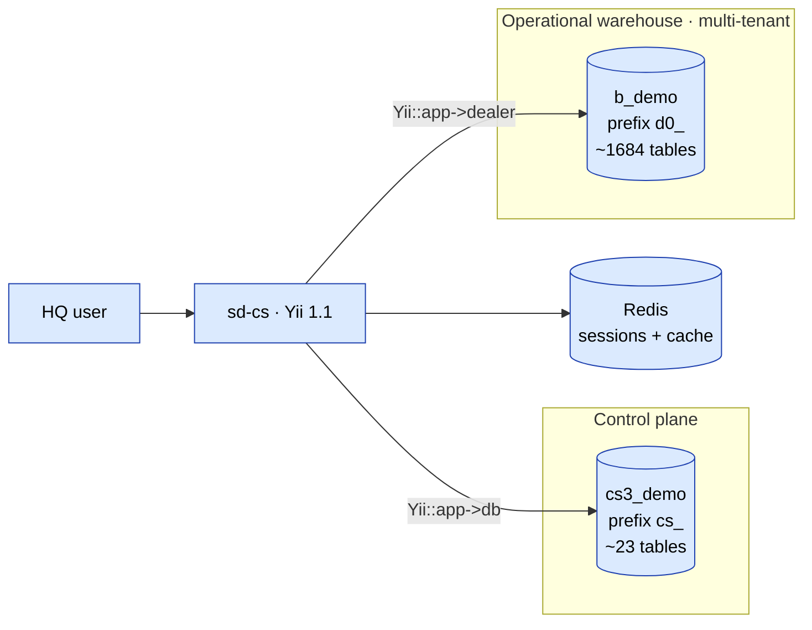
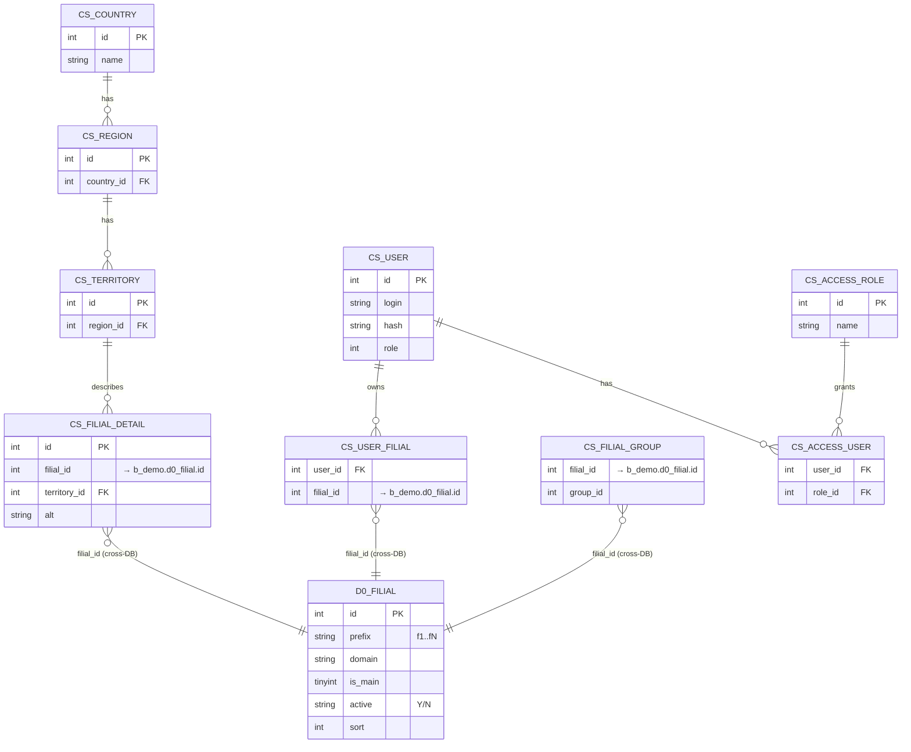
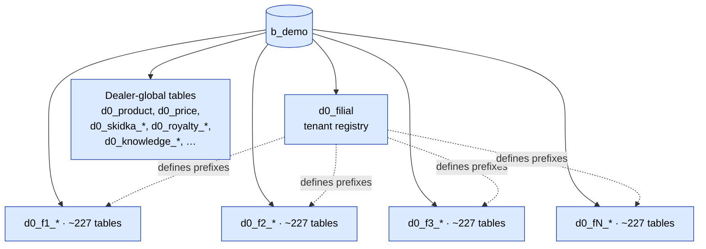
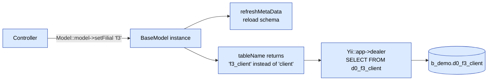
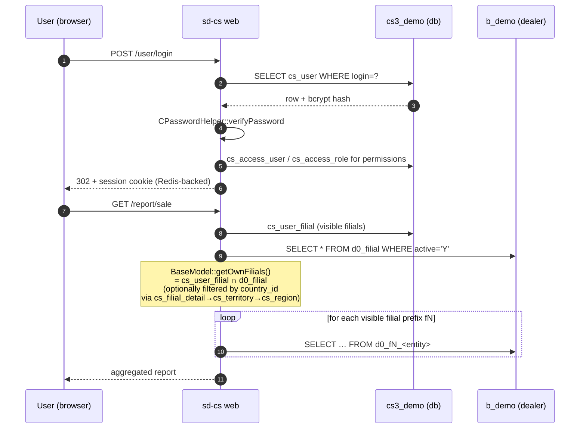
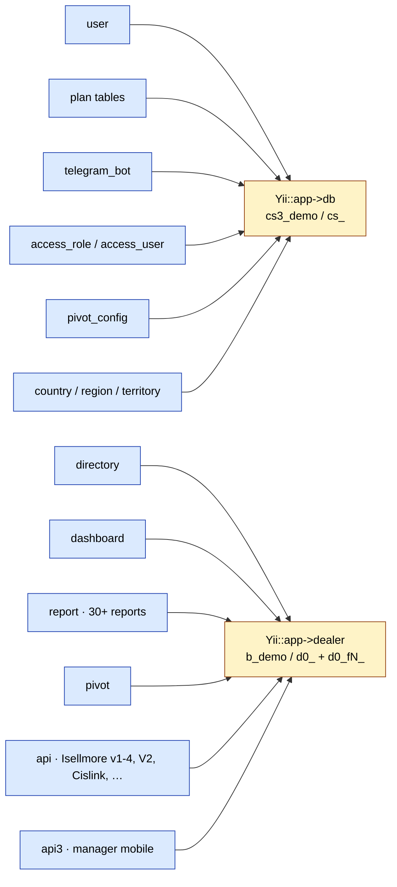

# sd-cs — Архитектура (verified by running code)

Эти диаграммы отражают **фактическое** поведение развёрнутого sd-cs:
две MySQL-схемы (control + warehouse) и схему per-tenant **филиал**
префикса внутри warehouse-БД. Проверено по
схемам `cs3_demo` / `b_demo` и кодовым путям `BaseModel` /
`V2Controller`.

> Визуальная таксономия следует стандарту
> [Diagram gallery](/docs/diagrams)
> (blue = action, amber = approval, green = success, red = reject,
> grey = external, purple = cron).

## Карта подключения двух БД

`Yii::app()->db` подключается к `cs3_demo` (control plane, 23 таблицы,
префикс `cs_`). `Yii::app()->dealer` подключается к `b_demo` (operational
warehouse, ~1 684 таблицы, префикс `d0_`). Обе сконфигурированы в
`protected/config/db.php`.

`cs3_demo` хранит auth, RBAC, geography, plans, telegram-боты, pivot-
конфиги. `b_demo` хранит все операционные данные дилеров, секционированные
по филиалам.

## Кросс-БД сцепление (filial bridge)

**Внешних ключей между двумя схемами нет** — две БД
соединены логически по `filial_id`. Канонический реестр филиалов живёт
в `b_demo.d0_filial`; `cs3_demo` обогащает каждый филиал country /
territory метаданными и per-user ACL`ами.

## Multi-tenant раскладка внутри `b_demo`

`b_demo` смешивает два рода таблиц: dealer-global (без filial-префикса)
и per-filial (`d0_fN_*`). Размер demo: 7 активных филиалов (`f1..f7`),
~227 таблиц на филиал, плюс ~50 dealer-global таблиц.

Per-filial сущности включают `client`, `agent`, `order`, `visit`,
`audit`, `cashbox`, `bonus_*`, `cars`, `catalog_*` и т. д. — каждый филиал
получает свою копию, scoped префиксом `fN_`.

## Перезапись таблицы `setFilial()`

Механизм, позволяющий одному классу модели обращаться к множеству тенантов, живёт
в `protected/components/BaseModel.php` (`tableName()`,
`getFilialTable()`, `setFilial()`). Вызов `setFilial('f3')` переписывает
table-токен с `{{client}}` на `{{f3_client}}`, который Yii
разворачивает, используя `tablePrefix='d0_'` соединения `dealer`,
давая `d0_f3_client`.

## Логин → filial scoping → запрос

Сквозной поток запроса: авторизация в `cs3_demo`; data fetch
в `b_demo`, scoped к разрешённым пользователю филиалам через
`cs_user_filial` и (опционально) `country_id`.

## Матрица модуль → подключение

Сигнал на уровне кода: ~440 вызовов `Yii::app()->dealer` против ~14
`Yii::app()->db` в `protected/`. Control-DB маленькая и
metadata-формы; dealer-DB — там, где случается работа.

## Заметки по сравнению со старым описанием

Страница [Multi-DB connection](./multi-db.md) описывает модель, в которой
sd-cs создаёт short-lived `CDbConnection` объекты на каждого дилера
(много отдельных дилерских БД). Текущее развёртывание использует **одну**
дилерскую БД (`b_demo`) с **внутренней multi-tenancy через filial
префиксы**. Диаграммы выше отражают то, что делает сегодняшний работающий
код; старая заметка оставлена для исторического контекста.
