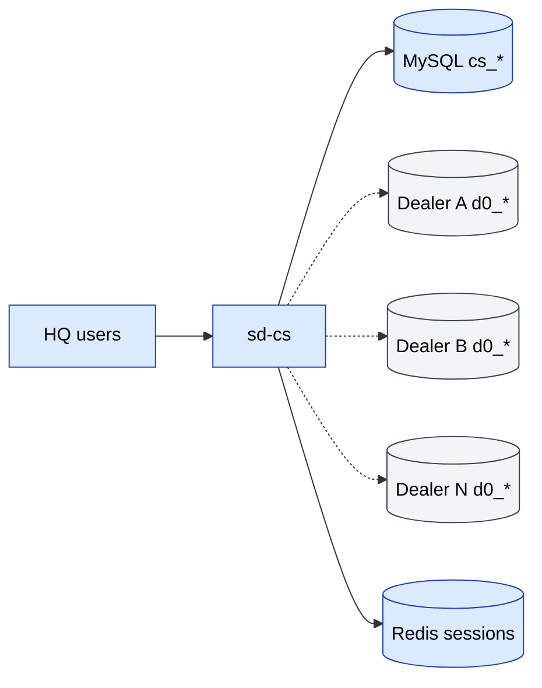

# sd-cs — Country Sales 3

**sd-cs** («Country Sales 3») — приложение **головного офиса**, которое
стоит над множеством установок `sd-main` (дилеров). Оно существует,
чтобы дать владельцу бренда единое окно для всех его дилеров.

## Что делает sd-cs

- **Консолидированные отчёты** — продажи, дебиторка, KPI, AKB (активная
  клиентская база), бонусы, дефекты, возвраты — по каждому дилеру.
- **Pivot-аналитика** — RFM, SKU, экспедитор, транзакции.
- **Справочник HQ** — мастер-записи (страновой каталог, бренды,
  сегменты).
- **Преимущественно read** — большинство операционных записей происходит
  в `sd-main`. sd-cs читает базы дилеров и пишет только в свою.

## Технологический стек

То же семейство, что и у sd-main:

| Слой | Технология |
|-------|------|
| Фреймворк | Yii 1.x |
| Язык | PHP |
| БД | MySQL — **два соединения** (своё + дилер) |
| Кеш / сессии | Redis (один компонент, `redis_cache`) |
| Тема | `themes/classic` (система тем Yii) |
| Asset manager | symlinked (`linkAssets: true`) |

## Модули

| Модуль | Назначение |
|--------|---------|
| `user` | Авторизация + доступ |
| `directory` | Справочник HQ-уровня (каталоги, бренды, сегменты) |
| `report` | 30+ консолидированных отчётов |
| `pivot` | Pivot-таблицы (RFM, SKU, sale detail, transactions, defects, …) |
| `dashboard` | KPI верхнего уровня |
| `api` | Server-to-server эндпоинты (operator, billing, telegram-report и т.д.) |
| `api3` | Эндпоинт(ы) мобильного приложения менеджера |

## Репозиторий

```
sd-cs/
├── index.php / cron.php / a.php
├── default_folders.php          one-time bootstrap
├── composer.json
├── themes/                      classic theme files
├── fonts/
├── log/
└── protected/
    ├── config/
    │   ├── main.php
    │   ├── db.php (gitignored)  TWO connections: cs_* and d0_*
    │   └── db_sample.php
    ├── components/
    ├── controllers/             SiteController, CatalogController
    ├── models/                  DbLog (extra models defined per-module)
    ├── modules/                 (api, api3, dashboard, directory, pivot, report, user)
    └── migrations/
```

## Архитектура (диаграмма)

См. **SalesDoctor — sd-cs Architecture** в
[FigJam-доске](../architecture/diagrams.md).



## См. также

- [Multi-DB соединение](./multi-db.md)
- [Модули](./modules.md)
- [Отчёты и pivot](./reports-pivots.md)
- [Локальная установка](./local-setup.md)
