# Интеграция sd-cs ↔ sd-main

Это самая критичная интеграция в платформе: каждый HQ-
отчёт зависит от того, что она работает корректно. Прочитайте сквозь, прежде
чем трогать любую сторону.

## Контекст

| | sd-cs (HQ) | sd-main (Dealer) |
|--|------------|------------------|
| Запускается | Бренд-владельцем / country sales | Каждым дилером |
| Префикс схемы БД | `cs_*` | `d0_*` |
| MySQL-хост | HQ MySQL-кластер | MySQL дилера |
| Направление чтения | читает из многих sd-main БД | none |
| Направление записи | пишет только в собственную схему `cs_*` | пишет в собственную схему `d0_*` |
| Цель | консолидировать / pivot между дилерами | вести ежедневные операции одного дилера |

Интеграция **read-only с точки зрения sd-cs**. sd-cs никогда не
пишет в таблицы `d0_*` дилера — каждая операционная запись происходит
внутри собственного sd-main дилера.

## Топология подключения

sd-cs держит **два постоянных Yii DB-компонента** параллельно
(`protected/config/db.php`):

```php
return [
    'db' => [
        'connectionString' => 'mysql:host=hq-mysql;dbname=cs_country',
        'tablePrefix' => 'cs_',
    ],
    'dealer' => [
        'class' => 'CDbConnection',
        'connectionString' => 'mysql:host=dealer1-mysql;dbname=sd_dealerA',
        'tablePrefix' => 'd0_',
    ],
];
```

- **`db`** — pinned к HQ-схеме. Дефолт для всех моделей, не
  переопределяющих `getDbConnection()`.
- **`dealer`** — **swappable** подключение. Для multi-dealer
  отчётов sd-cs конструирует новое `CDbConnection` на каждого дилера в цикле
  и переназначает `Yii::app()->dealer` на длительность этой
  итерации.

## Модели

Определяйте модель, нацеленную на dealer-DB, переопределяя
`getDbConnection`:

```php
class DealerOrder extends CActiveRecord {
    public function getDbConnection() {
        return Yii::app()->dealer;
    }
    public function tableName() { return '{{order}}'; }   // {{order}} → d0_order
}
```

Модели против `cs_*` используют дефолтное подключение `db` — переопределение
не нужно.

**Правило**: никогда не ссылайтесь на dealer-таблицы из модели, привязанной к
подключению `db`. `{{order}}` резолвится в `cs_order`, если подключение
`db`, и в `d0_order`, если оно `dealer` — вот как остаётесь в безопасности.

## Паттерн cross-dealer отчёта

Канонический цикл:

```php
$dealers = DealerRegistry::all($filters);   // dealer-list lookup in cs_*
$rows = [];

foreach ($dealers as $dealer) {
    // Construct a fresh dealer connection per iteration.
    $cn = new CDbConnection(
        $dealer['dsn'], $dealer['user'], $dealer['pass']
    );
    $cn->tablePrefix = 'd0_';
    $cn->emulatePrepare = true;
    $cn->charset = 'utf8';
    $cn->active = true;
    Yii::app()->setComponent('dealer', $cn);

    // Run the dealer-side query — narrow projection only!
    $sub = DealerOrder::model()->findAllBySql(
        "SELECT DATE(:dateCol) AS d, SUM(SUMMA) AS total
         FROM {{order}}
         WHERE STATUS IN (:paid, :delivered)
           AND DATE BETWEEN :from AND :to
         GROUP BY d",
        [
            ':dateCol'   => 'DATE',
            ':paid'      => Order::STATUS_PAID,
            ':delivered' => Order::STATUS_DELIVERED,
            ':from'      => $from,
            ':to'        => $to,
        ]
    );
    foreach ($sub as $r) {
        $rows[] = ['dealer' => $dealer['code'], 'd' => $r->d, 'total' => $r->total];
    }

    Yii::app()->dealer->active = false; // release connection — see runbook below
}

// Aggregate in PHP — cross-DB joins are NOT allowed (different hosts).
$result = $aggregator->fold($rows);
```

### Правила цикла

- **Только узкие проекции** — никогда `SELECT *`. Перенесите фильтрацию и
  группировку на сторону дилера.
- **По одному дилеру за раз** — не делайте fan-out конкурентно из одного
  PHP-процесса; вы исчерпаете connection pool HQ MySQL.
- **Bounded** — применяйте жёсткий cap (например, 200 дилеров на запрос); если
  больше, paginate или queue.
- **Кэшируйте агрегат** — с ключом `report:<name>:<filters_hash>:<dealers_hash>`.

### Performance budget

| Фаза | Цель |
|-------|--------|
| HQ DealerRegistry lookup | < 10 ms |
| Per-dealer запрос | < 200 ms median, < 1 s p99 |
| 50-dealer цикл wall-clock | < 30 s |
| Cache TTL | 5–15 min для HQ-отчётов |

## Маппинг схем

### Что sd-cs читает из `d0_*`

| Домен | Читаемые таблицы |
|--------|-------------|
| Sales | `d0_order`, `d0_order_product`, `d0_defect` |
| Customers | `d0_client`, `d0_client_category` |
| Agents | `d0_agent`, `d0_visit`, `d0_kpi_*` |
| Catalog | `d0_product`, `d0_category`, `d0_price`, `d0_price_type` |
| Stock | `d0_stock`, `d0_warehouse`, `d0_inventory` |
| Audits | `d0_audit`, `d0_audit_result` |
| GPS | `d0_gps_track` |

### Что sd-cs пишет в `cs_*`

| Домен | Записываемые таблицы |
|--------|----------------|
| HQ-каталог | `cs_brand`, `cs_segment`, `cs_country_category` |
| Планы / цели | `cs_plan`, `cs_plan_product` |
| HQ-пользователи | `cs_user`, `cs_authassignment` |
| Pivoted intermediates | `cs_pivot_<name>` (для очень больших pivots) |
| Audit log | `cs_dblog` |

## Обработка schema-drift

Разные дилеры могут крутить **разные версии sd-main**. Тактика:

1. **Capability-флаги на дилера** — на уровне registry помечать, какие
   фичи поддерживает схема каждого дилера
   (например, `has_markirovka_v2`, `kpi_new_controller`).
2. **Tolerant SELECT** — оборачивайте запросы, трогающие опциональные колонки в
   `try/catch` и относитесь к ошибкам missing-column как «фича не
   доступна».
3. **Versioned views** — для стабильных запросов поставляйте per-dealer SQL
   view (создаваемое во время онбординга), которое транслирует схему
   дилера в каноническую форму.
4. **Не агрегируйте между версиями** — когда запускаете отчёт, опирающийся
   на колонку, варьирующуюся по версиям, запускайте только per-version-cohort.

## Безопасность

- **Read-only DB-пользователи** — учётки, которые sd-cs использует для dealer-
  подключения, read-only на уровне MySQL.
- **Сетевая изоляция** — HQ и dealer-DB хосты живут в приватных VPC;
  единственный путь — через egress HQ-приложения к read-only реплике
  дилера.
- **No PII export** — dealer-запросы не должны вытягивать PII в
  хранилище `cs_*`, если только это не требуется и не подписано.
- **Audit log** — каждый кросс-БД запрос логируется в `cs_dblog` с
  id отчёта, дилером, хэшем запроса и количеством строк.

## Онбординг нового дилера

```mermaid
flowchart LR
  A(["New dealer signs contract"]) --> B["sd-billing creates Diler row"]
  B --> C["sd-billing pushes licence file"]
  C --> D["Dealer's sd-main is provisioned"]
  D --> E["Dealer DB credentials registered in HQ"]
  E --> F["DealerRegistry row inserted in cs_*"]
  F --> G["Test report against new dealer"]
  G --> H["Capability flags filled in registry"]
  H --> I(["Dealer included in default HQ reports"])

  class A action
  class B,C,D,E,F,G,H action
  class I success
  classDef action   fill:#dbeafe,stroke:#1e40af,color:#000
  classDef approval fill:#fef3c7,stroke:#92400e,color:#000
  classDef success  fill:#dcfce7,stroke:#166534,color:#000
  classDef reject   fill:#fee2e2,stroke:#991b1b,color:#000
  classDef external fill:#f3f4f6,stroke:#374151,color:#000
  classDef cron     fill:#ede9fe,stroke:#6d28d9,color:#000
```



Чек-лист предпрод:

- [ ] Read-only MySQL-пользователь создан на стороне дилера.
- [ ] HQ может разрешить MySQL-хост дилера (DNS / VPN).
- [ ] Строка DealerRegistry добавлена с DSN + capability-флагами.
- [ ] Smoke-отчёт проходит чисто за окно одного дня.
- [ ] Cache key для дилера инвалидирован.

## Режимы отказа и runbook

| Симптом | Вероятная причина | Действие |
|---------|--------------|--------|
| HQ-отчёт показывает ноль для одного дилера | Dealer-БД недостижима, или DSN неверный | Проверить dealer registry, тест-подключение, алерт dealer ops |
| Отчёт уходит в timeout | Dealer-БД медленная / отсутствует индекс | Проверить slow query log, добавить индекс или сократить окно |
| Смешанные итоги после апгрейда sd-main | Schema drift | Добавить capability-флаг, переключить запрос на versioned view |
| Cross-dealer итог off-by-one | Баг PHP-агрегации | Добавить unit-тест на fold(); сравнить с single-dealer результатом |
| Исчерпание подключений HQ MySQL | Слишком много открытых `dealer` подключений | Поставить `Yii::app()->dealer->active = false` в конце каждой итерации |

## Диаграммы

См. **sd-cs · Architecture (multi-DB)** и
**sd-cs · Cross-dealer report sequence** в
[FigJam — sd-cs (HQ)](https://www.figma.com/board/n7CzNpfgyykdCYYJiuQG7L).

## См. также

- [Обзор sd-cs](./overview.md)
- [sd-cs multi-DB connection](./multi-db.md)
- [sd-cs reports & pivots](./reports-pivots.md)
- [sd-billing ↔ sd-main + sd-cs](../sd-billing/integration.md)
