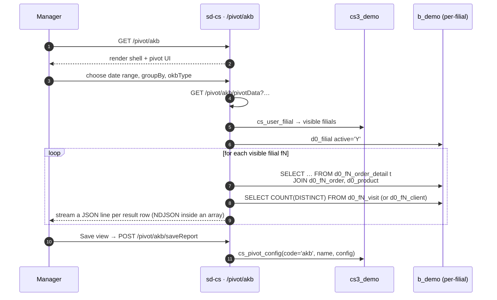

# AKB / OKB pivot

## Назначение

Отвечает на *«сколько различных клиентов реально купили у нас в этом
периоде (AKB), против того, сколько у нас всего или сколько мы посетили (OKB)?»*
AKB ÷ OKB — заголовочный KPI для покрытия sales-force; pivot-таблица
позволяет менеджеру нарезать это соотношение по продукту, бренду, агенту,
client-категории, городу или месяцу.

- **AKB** — *Active Customer Base* — различные клиенты с хотя бы
  одной order-line с положительным quantity в периоде.
- **OKB** — *Overall Customer Base* — либо активные клиенты
  (`Client.ACTIVE='Y'`), либо различные клиенты, посещённые в периоде,
  в зависимости от флага `okbType`.

## Кто использует

| Роль | Что делает здесь |
|------|-------------------|
| Country / brand manager | Отслеживает соотношение AKB/OKB по месяцам; drill по продукту или бренду |
| Field sales lead | Drill по `AGENT_ID` для сравнения покрытия агентов |
| KPI / commission team | Переиспользует сохранённые конфигурации для месячных KPI-обзоров |

Доступ гейтится ключами `pivot.akb.*` в `cs_access_role`. Пять
endpoint`ов (`getData`, `reports`, `pivotData`, `saveReport`,
`deleteReport`) перечислены в `AkbController::$allowedActions` и
обходят page-level проверку доступа.

## Где живёт

| | |
|---|---|
| URL | `/pivot/akb` |
| Контроллер | [`protected/modules/pivot/controllers/AkbController.php`](https://github.com/salesdoctor/sd-cs/blob/master/protected/modules/pivot/controllers/AkbController.php) |
| Index view | `protected/modules/pivot/views/akb/index.php` |
| Подключение | `Yii::app()->dealer` (warehouse `b_*`) |
| Saved-report code | `akb` (константа `ReportConfigCode`; строки живут в `cs3_demo.cs_pivot_config`) |

Per-filial модели, читаемые здесь: `Order`, `OrderDetail`, `Client`,
`Visiting`, `Visit` — адресуются через `setFilial($prefix)`.

Dealer-global модели, читаемые здесь: `Product` (для колонок `BRAND` и
`PRODUCT_CAT_ID`) и `UserProduct` (для per-user product blacklist).

## Workflow

1. Пользователь открывает `/pivot/akb`. Страница — тонкий шелл — pivot UI
   на стороне клиента.
2. Пользователь выбирает date range, измерение `groupBy`, поле `date`
   (DATE vs DATE_LOAD) и `okbType`.
3. Страница вызывает `GET /pivot/akb/pivotData?…`.
4. Сервер итерирует `getOwnModels()` и для каждого филиала запускает
   AKB SQL (различные клиенты с положительным quantity order-lines)
   и OKB SQL (active клиенты или visits).
5. Сервер **стримит** результаты как array literal: печатает `[`,
   затем header-строку `["id","month","akb","okb","filial","prefix"]`,
   затем по одной comma-prefixed JSON-строке на результат, затем `]`.
   Ответ — `Content-Type: application/json`, но строится
   инкрементно — клиенты должны потреблять его как один JSON-документ.
6. Pivot UI строит колонки AKB / OKB / ratio из streamed строк.
7. Пользователь может сохранить текущую pivot-конфигурацию (имя + template
   JSON) в `cs_pivot_config` через *Save report*; сохранённые шаблоны
   перезагружаются через `actionReports`.

## Правила

- **Filial-скоп** — `BaseModel::getOwnModels()` — админы видят все
  активные филиалы; остальные видят пересечение `cs_user_filial` и
  `d0_filial.active='Y'`.
- **`date` whitelisted** до одного из `order.DATE`, `order.DATE_LOAD`.
  Любое другое значение тихо приводится к `order.DATE`.
- **`groupBy` whitelisted** до одного из:
  `t.PRODUCT`, `t.PRODUCT_CAT`, `p.BRAND`, `order.AGENT_ID`,
  `order.AGENT_ID, t.PRODUCT_CAT`,
  `order.AGENT_ID, order.CLIENT_CAT`, `order.CITY_ID`,
  `order.CLIENT_CAT`. Любое другое значение тихо приводится к
  `t.PRODUCT`.
- **Специальный `groupBy='diler'`**: когда явно передан (не в
  whitelist), SQL группирует по литералу filial-префикса —
  фактически даёт по строке на филиал.
- **Date range inclusive** — `firstDate 00:00:00` до
  `lastDate 23:59:59` на выбранной колонке `date`.
- **User-product blacklist применяется**:
  `t.PRODUCT NOT IN UserProduct::findByUser(userId, 3)`.
- **Опциональный product-category filter** (`prCat`): когда присутствует,
  SQL добавляет `AND p.PRODUCT_CAT_ID IN (…)` со значениями, whitelisted
  цепочкой `intval` в PHP (каждый id обёрнут в одинарные кавычки).
- **AKB definition**: `COUNT(DISTINCT order.CLIENT_ID)` из
  `order_detail`, joined с `order`, где `order_detail.COUNT > 0`.
- **OKB definition** зависит от `okbType`:
  - `okbType=true` и группировка по агенту → `COUNT(DISTINCT
    visiting.CLIENT_ID)` per agent (joined только к active клиентам).
  - `okbType=true` иначе → `COUNT(client.CLIENT_ID)`, где
    `client.ACTIVE='Y'` (одно число, повторяемое для каждой строки).
  - `okbType=false` и группировка по агенту → `COUNT(DISTINCT
    visit.CLIENT_ID)` per agent per month из `visit`.
  - `okbType=false` иначе → `COUNT(DISTINCT visit.CLIENT_ID)` за
    весь период (одно число, повторяемое для каждой строки).
- **Saved reports** хранятся в `cs3_demo.cs_pivot_config` с ключом
  `code='akb'`. `template` — полная pivot-конфигурация как JSON.

## Источники данных

| Schema | Table | Зачем читается |
|--------|-------|---------------|
| `cs3_demo` | `cs_pivot_config` | Сохранённые pivot-views (code = `akb`) |
| `cs3_demo` | `cs_user_filial` | Filial-скоп для не-админов |
| `cs3_demo` | `cs_user_product` | Per-user product blacklist (через `UserProduct`) |
| `b_demo` | `d0_filial` | Tenant registry (active filials) |
| `b_demo` | `d0_product` | Joined для `BRAND` / `PRODUCT_CAT_ID` |
| `b_demo` | `d0_fN_order_detail` | Sales lines (AKB-числитель) |
| `b_demo` | `d0_fN_order` | Order header (date, agent, client, city) |
| `b_demo` | `d0_fN_client` | Active-флаг для OKB, когда `okbType=true` |
| `b_demo` | `d0_fN_visit`, `d0_fN_visiting` | Visit-based OKB |

## Подводные камни

- **Endpoint стримит JSON.** Ответ открывается `[`, печатает
  строки comma-prefixed и закрывается `]`. Если per-filial цикл крэшится
  посреди стрима, клиент получает invalid JSON. Смотрите web-лог.
- **Whitelist coercion тихий.** Опечатка в `groupBy` не
  возвращает ошибку — она просто проваливается до `t.PRODUCT`. Новые
  сотрудники часто тратят время, удивляясь, почему их `BRAND`
  группировка выглядит как продукты; они написали `BRAND` вместо
  `p.BRAND`.
- **`okbType` — *строка* `'true'`** в `$_GET`, не boolean.
  Контроллер сравнивает строкой — `okbType=1` не работает.
- **AKB ÷ OKB вычисляется в UI**, не на сервере. Если UI
  показывает бессмыслицу в соотношениях, сервер вернул правильные строки в
  неправильном порядке (filial / prefix mismatch).
- **`actionReports` возвращает весь saved-config payload** на каждый
  вызов. Пагинации нет — сегодня нормально (~десятки шаблонов), но
  стоит знать.

## См. также

- [Архитектура sd-cs](../architecture.md) — модель двух БД и
  механизм `setFilial()`.
- *report · OKB* (заглушка каталога, ещё не написана —
  `report/OkbController`) — single-screen report-версия OKB.
- [Style guide](./style.md) — как написана эта страница.
