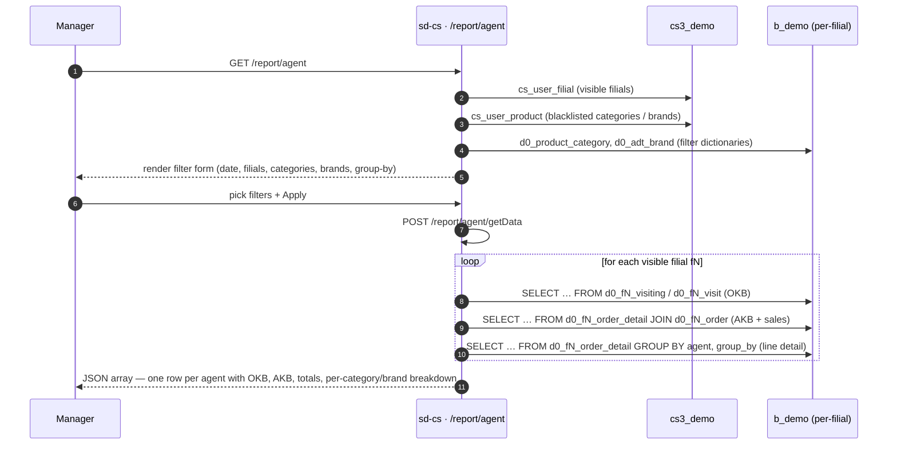

# Отчёт по агентам

## Назначение

Отвечает на вопрос *«как сработал каждый торговый агент по всем моим
филиалам — сколько клиентов он посетил (OKB), сколько покупающих клиентов
он конвертировал (AKB), и какой объём / стоимость / количество единиц
он продал, в разбивке по категории продукта или бренду?»* Этот отчёт —
основной инструмент HQ для оценки индивидуальной продуктивности агента
относительно его базового покрытия клиентов.

## Кто им пользуется

| Роль | Что они здесь делают |
|------|----------------------|
| Менеджер по стране / бренду | Сравнивает уровень проникновения AKB vs. OKB агентов по филиалам |
| Региональный супервайзер | Детализирует по филиалам, чтобы выявить отстающих агентов |
| Аналитик отдела продаж | Просматривает каталог агентов через вкладку *List* |

Доступ управляется ключом `report.agent.index` в `cs_access_role`.
Три эндпоинта (`getData`, `getAgents`, `list`) перечислены в
`AgentController::$allowedActions` и обходят проверку доступа на уровне
страницы; сама страница (`actionIndex`) защищена RBAC.

## Где это находится

| | |
|---|---|
| URL | `/report/agent` (основная таблица), `/report/agent/list` (каталог агентов) |
| Контроллер | [`protected/modules/report/controllers/AgentController.php`](https://github.com/salesdoctor/sd-cs/blob/master/protected/modules/report/controllers/AgentController.php) |
| Index view | `protected/modules/report/views/agent/index.php` |
| List view | `protected/modules/report/views/agent/list.php` |
| Соединение | `Yii::app()->dealer` (хранилище `b_*`) |
| Код сохранённого отчёта | *не используется* |

Модели по филиалам, читаемые здесь: `Order`, `OrderDetail`, `Agent`,
`Client`, `Visit`, `Visiting` — все адресуются через
`setFilial($prefix)`, разрешаясь в таблицы `d0_fN_*`.

Глобальные модели дилера, читаемые здесь: `Product` (`d0_product`),
`ProductCategory` (`d0_product_category`), `AdtBrand` (`d0_adt_brand`).

Модели control-plane, читаемые здесь: `UserFilial` (`cs_user_filial`),
`UserProduct` (`cs_user_product`).

## Воркфлоу

1. Пользователь открывает `/report/agent`.
2. Страница загружает справочники для фильтров: категории продуктов и
   бренды (оба отфильтрованы ограничениями `UserProduct` пользователя),
   а также список видимых филиалов.
3. Пользователь выбирает диапазон дат, опциональное подмножество
   филиалов, группировку (по категории или бренду) и режим OKB, затем
   нажимает *Apply* — страница выполняет POST на
   `/report/agent/getData`.
4. Сервер итерирует по каждому видимому филиалу. Для каждого филиала он
   выполняет три SQL-запроса на `Yii::app()->dealer`: запрос OKB
   (visits или visiting, в зависимости от `okb_type`), запрос AKB
   (различные покупающие клиенты из строк заказов) и запрос по строкам
   (объём, стоимость, количество единиц, сгруппированные по выбранному
   измерению).
5. Сервер объединяет три набора результатов в PHP, вычисляя
   `pre_okb` (всегда `100%`) и `pre_akb` (AKB ÷ OKB × 100).
   Агенты, которые присутствуют в OKB, но не имеют продаж, всё равно
   включаются с нулевыми колонками продаж.
6. Сервер заполняет нулевые записи для каждой категории/бренда,
   которые данный агент не продавал, обеспечивая равномерное количество
   колонок во всех строках.
7. Сервер возвращает полный массив `data` в виде JSON.

Вкладка *List* (`/report/agent/list`) — это лёгкий каталог: она вызывает
`actionGetAgents`, который запрашивает `d0_fN_agent` для каждого
видимого филиала и возвращает плоскую таблицу с типом агента, статусом
и привязкой к филиалу.

## Правила

- **Видимые филиалы** берутся из `BaseModel::getOwnModels()`. Админы
  видят все активные филиалы; не-админы видят пересечение
  `cs_user_filial` и `d0_filial.active='Y'`.
- **Фильтр по филиалу**: если `filial_id` непустой в теле POST,
  опрашиваются только филиалы, чей `id` присутствует в массиве; другие
  пропускаются.
- **Фильтр по дате применяется к `order.DATE_LOAD`** (дата загрузки,
  не дата заказа). Предикат — `BETWEEN date[0] 00:00:00 AND
  date[1] 23:59:59`.
- **Фильтр по статусу заказа** жёстко задан как `STATUS IN (2, 3)` —
  только подтверждённые и доставленные заказы.
- **Строки с нулевым количеством исключены** через `t.COUNT > 0` как в
  запросе AKB, так и в запросе по строкам.
- **Режим OKB** (параметр `okb_type`):
  - `1` → подсчитывает различных клиентов из `d0_fN_visiting`, чей
    `client.CREATE_AT ≤ date[1]` и `client.ACTIVE='Y'` (накопительная
    база активных клиентов).
  - любое другое значение → подсчитывает различных клиентов из
    `d0_fN_visit` за выбранный диапазон дат (база визитов за период).
- **Измерение группировки** (параметр `group_by`):
  - `1` → строки группируются по `product.PRODUCT_CAT_ID` (категория);
    ключ под-разбивки — `category_id`.
  - любое другое значение → группировка по `product.BRAND`; ключ
    под-разбивки — `brand_id`.
- **Чёрный список UserProduct** (тип `3` — простой массив ID
  продуктов) применяется через
  `CDbCriteria::addNotInCondition('t.PRODUCT', $ups)` в запросах по
  строкам и AKB. Справочник фильтров, показываемый в UI, также
  исключает заблокированные категории и бренды через отдельные вызовы
  `getUserRestrictions()`, чтобы фильтры оставались синхронизированы.
- **Метка типа агента** в `actionGetAgents` определяется из константы
  `AGENT_TYPES = ['Торговый представитель', 'Van-selling',
  'Продавец']` по целочисленному ключу `VAN_SELLING` (0, 1, 2).
- **Агенты без продаж, но с OKB** включаются в ответ с обнулёнными
  числовыми полями и `pre_akb = 0`.
- **Агенты с продажами, но без OKB** молча исключаются (условие
  объединения в PHP требует непустую запись и в `$all_okb`, и в
  `$all_akb`).

## Источники данных

| Схема | Таблица | Зачем читается |
|-------|---------|----------------|
| `cs3_demo` | `cs_user_filial` | ACL видимости филиалов для не-админов |
| `cs3_demo` | `cs_user_product` | Чёрный список продуктов/категорий/брендов на пользователя |
| `b_demo` | `d0_filial` | Реестр тенантов — даёт префикс и `active` |
| `b_demo` | `d0_product` | Мастер продуктов (присоединяется к строкам заказа) |
| `b_demo` | `d0_product_category` | Справочник фильтра категорий + метка группировки |
| `b_demo` | `d0_adt_brand` | Справочник фильтра брендов + метка группировки |
| `b_demo` | `d0_fN_order` | Заголовок заказа — `STATUS`, `DATE_LOAD`, `AGENT_ID`, `CLIENT_ID` |
| `b_demo` | `d0_fN_order_detail` | Строки продаж — `COUNT`, `VOLUME`, `SUMMA` |
| `b_demo` | `d0_fN_agent` | Мастер агентов — `FIO`, `XML_ID`, `TEL`, `VAN_SELLING`, `ACTIVE` |
| `b_demo` | `d0_fN_client` | Запись клиента — используется в `okb_type=1` для фильтра `ACTIVE='Y'` |
| `b_demo` | `d0_fN_visit` | Лог визитов — источник OKB при `okb_type ≠ 1` |
| `b_demo` | `d0_fN_visiting` | Лог посещений — источник OKB при `okb_type = 1` |

Справочник колонок см. в [data schemes](../data-schemes.md).

## Подводные камни

- **Агенты с продажами, но без OKB молча отбрасываются.** Цикл
  объединения (`if ($all_okb[$model['agent_id']] && $all_akb[$model['agent_id']])`)
  требует truthy-записи в обеих картах. Агент, который сделал продажи,
  но не имеет записей о визитах в выбранном периоде, просто исчезает
  из таблицы. Если пользователь говорит «агент X продал, но не
  показан», проверьте таблицы visit / visiting для этого агента и
  периода.
- **`pre_okb` всегда равен `'100%'`** (жёстко заданная строка). Он не
  отражает соотношение посещённых клиентов к общему портфелю клиентов;
  это колонка-заглушка. Не полагайтесь на неё для реальных расчётов
  покрытия.
- **Три SQL-запроса на филиал.** Для админа с 20 филиалами это 60
  запросов на один вызов `getData`. Узкие диапазоны дат и фильтры по
  ID филиалов значительно снижают нагрузку.
- **`okb_type=1` игнорирует начало диапазона дат.** Запрос visiting
  использует `CREATE_AT BETWEEN 0000-00-00 AND date[1]`, поэтому он
  всегда накапливает данные с начала времён до конечной даты. Сравнение
  с результатами `okb_type=0` за тот же период покажет разные числа
  OKB — это намеренно, но неинтуитивно.
- **`actionGetAgents` не имеет фильтра по филиалу.** Он опрашивает
  каждый видимый филиал независимо от состояния фильтров с основной
  вкладки. Полный список агентов всегда возвращается.

## См. также

- [Архитектура sd-cs](../architecture.md) — модель двух БД и
  механизм `setFilial()`.
- [report · Sale](./report-sale.md) — отчёт по продажам в разбивке по
  продуктам, использующий тот же паттерн скоупинга
  `getOwnModels()` / `UserProduct`.
- **report · Agent Visit** — сопутствующий
  отчёт, фокусирующийся на частоте визитов, а не на результатах продаж
  (`AgentVisitController`).
- [`protected/modules/report/controllers/AgentController.php`](https://github.com/salesdoctor/sd-cs/blob/master/protected/modules/report/controllers/AgentController.php) — исходный файл.
