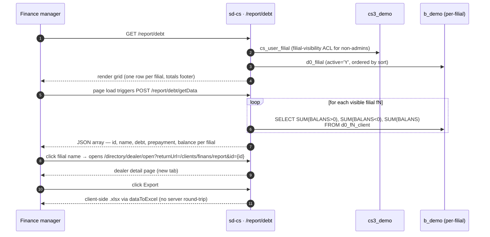

# Отчёт по дебиторке

## Назначение

Отвечает на вопрос *«по всем филиалам дилера, которые мне разрешено
видеть, сколько клиенты должны нам в совокупности, сколько предоплаты
сидит на их счетах и какова чистая разница?»* Отчёт даёт HQ
одноэкранную сводку дебиторской задолженности, сгруппированную по
филиалам, с итоговой строкой внизу.

## Кто им пользуется

| Роль | Что они здесь делают |
|------|----------------------|
| Менеджер по стране / финансам | Мониторит общую дебиторскую задолженность и предоплаты по всем филиалам |
| Региональный супервайзер | Проверяет чистый баланс по своим филиалам |

Доступ управляется ключом `report.debt.index` в `cs_access_role`
(зарегистрирован в `AccessManager` как *«По дебиторке»*). Эндпоинт
данных `getData` перечислен в `DebtController::$allowedActions` и
обходит проверку RBAC на уровне страницы; защищён только `actionIndex`.

## Где это находится

| | |
|---|---|
| URL | `/report/debt` |
| Контроллер | [`protected/modules/report/controllers/DebtController.php`](https://github.com/salesdoctor/sd-cs/blob/master/protected/modules/report/controllers/DebtController.php) |
| Index view | `themes/classic/views/report/debt/index.php` |
| Соединение | `Yii::app()->dealer` (хранилище `b_*`) |
| Код сохранённого отчёта | *не используется* (для этого отчёта нет сохранённых конфигураций) |

Модель по филиалу, читаемая здесь: `Client` (`d0_fN_client`) —
адресуется через `setFilial($prefix)`, разрешается в таблицу для
конкретного филиала.

## Воркфлоу

1. Пользователь открывает `/report/debt`; страница рендерится сразу с
   пустой таблицей и автоматически вызывает `updateData()`.
2. Vue-компонент выполняет POST `current_country_id` на
   `/report/debt/getData`.
3. Сервер вызывает `BaseModel::getOwnModels()`, итерирует каждый
   видимый филиал и выполняет один `SELECT` к `d0_fN_client` на
   филиал.
4. Сервер возвращает JSON-массив; каждый элемент содержит `id`,
   `name`, `debt`, `prepayment` и `balance` как float.
5. Таблица вычисляет общие итоги (debt, prepayment, balance) в
   computed-свойствах на стороне клиента и добавляет их как строку
   подвала.
6. Клик по названию филиала открывает страницу детализации дилера в
   новой вкладке на `/clients/finans/report`.
7. *Export* вызывает `dataToExcel()` из `main.js` — он сериализует
   in-memory строки таблицы в `.xlsx` без обращения к серверу.

## Правила

- **Видимые филиалы** берутся из `BaseModel::getOwnModels()`
  (вызывается с дефолтным `$activeOnly = true`). Админы видят все
  филиалы, где `d0_filial.active='Y'`; не-админы видят подмножество,
  перечисленное в `cs_user_filial` для их `user_id`, также
  отфильтрованное по `active='Y'`.
- **Фильтр по стране** дополнительно сужает филиалы: если
  `current_country_id` не пуст, `getOwnModels()` исключает любой
  филиал, чей `region.country_id` территории не совпадает. Филиалы
  без назначенной территории также исключаются на этом пути.
- **Разделение баланса использует CASE в SQL**: `BALANS > 0`
  считается как `prepayment`; `BALANS < 0` как `debt`; `SUM(BALANS)`
  это `balance`. Оба знака вычисляются в одном запросе на филиал.
- **Фильтр по дате отсутствует.** Отчёт всегда отражает текущий
  снимок `BALANS` в каждой строке клиента — параметра исторического
  диапазона нет.
- **Фильтр по продуктам или категории отсутствует.** Цифра долга —
  это совокупный баланс клиента, не разбитый по строкам заказа.
- **Общие итоги вычисляются на клиенте.** Computed-свойства `debt`,
  `prepayment` и `balance` в Vue-компоненте суммируют уже возвращённый
  массив; сервер не отправляет строку итогов.
- **Экспорт только на клиенте.** `dataToExcel()` в `main.js`
  конвертирует in-memory массив `data` в `.xlsx`. Он переиспользует
  то, что уже есть в таблице — второй запрос на сервер не делается.
- **Ссылка по названию филиала** ведёт на
  `/directory/dealer/open?returnUrl=/clients/finans/report&id={filial.id}`,
  открывая в новой вкладке. Если `id` falsy, обработчик клика
  возвращается рано без навигации.

## Источники данных

| Схема | Таблица | Зачем читается |
|-------|---------|----------------|
| `cs3_demo` | `cs_user_filial` | ACL видимости филиалов для не-админов |
| `cs3_demo` | `cs_territory`, `cs_region` | Фильтр по стране — связывает филиал → территория → регион → страна |
| `b_demo` | `d0_filial` | Реестр тенантов — предоставляет префикс, флаг `active` и порядок `sort` |
| `b_demo` | `d0_fN_client` | Источник `BALANS`; один запрос на филиал |

Справочник колонок см. в [data schemes](../data-schemes.md).

## Подводные камни

- **`BALANS` не вычисляется во время запроса.** Это хранимая колонка
  на `d0_fN_client`, обновляемая воркфлоу заказов и платежей. Если
  заказ или платёж записывается напрямую в БД, минуя приложение,
  баланс будет устаревшим. Всегда отслеживайте расхождения через
  историю транзакций клиента в `/clients/finans/report`, а не через
  этот отчёт.
- **N филиалов = N отдельных SQL-запросов.** UNION-запроса нет; цикл
  PHP выполняет один `SELECT` на филиал. Админ с большим количеством
  филиалов будет видеть пропорционально более медленную загрузку;
  слой кэширования отсутствует.
- **Фильтр по стране молча эксклюзивен.** Филиал, у которого нет
  настроенной территории, исключается из результатов при заданном
  `country_id` без предупреждения в UI. Если филиал исчезает из
  таблицы после смены страны, проверьте сначала `cs_filial_detail`.
- **Экспорт отражает загруженное состояние.** Если пользователь меняет
  страну после загрузки, но перед экспортом, `.xlsx` всё равно
  содержит ранее загруженные данные; нужно снова вызвать
  `updateData()` для обновления.

## См. также

- [Архитектура sd-cs](../architecture.md) — модель двух БД и
  механизм `setFilial()` / префиксов таблиц по филиалам.
- [report · Sale](./report-sale.md) — тот же паттерн цикла по
  филиалам, применённый к данным order-detail.
- [data schemes](../data-schemes.md) — справочник колонок для
  `d0_fN_client.BALANS` и связанных таблиц.
- [исходник `DebtController.php`](https://github.com/salesdoctor/sd-cs/blob/master/protected/modules/report/controllers/DebtController.php) — полный контроллер (37 строк).
