# Индексация RAG / vector DB

Сайт sd-docs подаётся в **retrieval-augmented generation (RAG) /
vector database** команды, чтобы каждый член команды мог спросить
"как работает payment approval?" или "что меняется, если добавим нового
дилера?" и получить правильный пассаж в ответ. Эта страница документирует
конвенции, которые держат ингест чистым.

## Обязательный frontmatter (на каждой странице)

Каждая страница ДОЛЖНА начинаться с frontmatter, тегирующего её для
ретривала:

```yaml
---
sidebar_position: <N>
title: <Human title>
audience: <comma-separated roles>     # e.g. "Backend engineers, QA, PM"
summary: <1–2 sentence chunk summary> # what the page covers, in plain language
topics: [<tag>, <tag>, …]             # short keywords for the embedding index
---
```

Четыре кастомных поля (`audience`, `summary`, `topics`) плюс `title` —
это **метаданные**, которые RAG-система прикрепляет к каждому чанку,
извлечённому из этой страницы. Они делают возможной фильтрацию по
аудитории ("show me only PM pages about RBAC") и повышают recall.

## Правило самодостаточности

Чанк, прочитанный изолированно, должен иметь смысл. Избегайте:

- ❌ "see above" / "as mentioned earlier" — называйте конкретный концепт
- ❌ "this module" без названия — пишите `sd-main · orders` вместо
- ❌ Местоимения в начале секции ("It runs daily…") — заменяйте
  существительным ("The settlement command runs daily…")
- ❌ Ссылка на таблицы по индексу ("the table below") — давайте
  заголовок

Чанк должен упоминать:

- **Проект** (`sd-main` / `sd-cs` / `sd-billing`) раз в секции.
- **Модуль / область** простыми словами.
- Любые **имена ролей** или **значения статусов**, которые появляются
  (не предполагайте, что читатель знает список ролей).

## Стратегия чанкинга

Пайплайн сейчас использует **section-level chunking**:

- Один чанк на `H2`-заголовок.
- Чанки меньше 1500 символов мерджатся со следующим.
- Чанки больше 4000 символов разделяются на следующем разрыве абзаца.
- Каждый чанк наследует `audience`, `topics` и `summary` страницы.

Если пишете очень длинные секции, держите **первый абзац** punchy и
самодостаточным — этот абзац — самая ретриваемая часть.

## Таблицы в чанках

Таблицы лучше переживают чанкинг, когда:

- У них есть header-строка.
- Каждая строка — полный факт (без зависимости от предыдущей строки).
- Ячейки — полные предложения, не "see X".

Избегайте широких таблиц (больше 6 колонок) — embedding-модель их
обрезает.

## Code-блоки

Помечайте каждый code-блок language-тегом (`php`, `bash`, `mermaid`,
`sql`, `yaml`). RAG-пайплайн индексирует language-tagged блоки
отдельно и сёрфит их в IDE-ассистенте.

## Mermaid-диаграммы

Inline Mermaid сохраняется через ингест как текст. Vector DB
относится к ним как к code-блокам. Всегда парьте Mermaid-блок с 1–2
предложениями summary простым языком над ним — это summary
ретривается, когда пользователь описывает диаграмму словами.

## Cross-page ссылки

Используйте абсолютные внутренние пути, начинающиеся с `/docs/`:

```md
✅  See [Order lifecycle](/docs/architecture/diagrams)
❌  See "Diagrams" (above)
```

RAG-пайплайн переписывает внутренние пути в search-result UI;
это работает только когда путь абсолютный.

## Ингест-пайплайн (high-level)

```mermaid
flowchart LR
  REPO(["sd-docs git repo"]) --> BUILD["Docusaurus build"]
  BUILD --> RAW["Markdown + frontmatter"]
  RAW --> CHUNK["Section chunker"]
  CHUNK --> EMB[("Embedding model")]
  EMB --> VDB[("Vector DB")]
  VDB --> CHAT(["Team chat / IDE assistant"])

  classDef action   fill:#dbeafe,stroke:#1e40af,color:#000
  classDef approval fill:#fef3c7,stroke:#92400e,color:#000
  classDef success  fill:#dcfce7,stroke:#166534,color:#000
  classDef reject   fill:#fee2e2,stroke:#991b1b,color:#000
  classDef external fill:#f3f4f6,stroke:#374151,color:#000
  classDef cron     fill:#ede9fe,stroke:#6d28d9,color:#000

  class REPO,BUILD,RAW,CHUNK action
  class EMB,VDB external
  class CHAT success
```



Каденция переиндексации: **на каждый merge в `main`** (CI-хук).

## Retrieval-friendly чеклист

Перед мержем новой doc-страницы:

- [ ] У frontmatter есть `audience`, `summary`, `topics`.
- [ ] Первый абзац после H1 — однопредложенный elevator pitch.
- [ ] Каждая H2-секция начинается с complete-thought абзаца.
- [ ] Нет "see above" / "as mentioned" / "below".
- [ ] Таблицы шириной до 6 колонок.
- [ ] У code-блоков есть language-теги.
- [ ] Mermaid-диаграммы спарены с prose-summary.
- [ ] Внутренние ссылки абсолютные (`/docs/...`).

## Почему это важно для новых разработчиков

Онбординг новых разработчиков (см. [Онбординг](./onboarding.md)) сильно
опирается на RAG базу знаний. Новичок печатает "как запустить
cross-dealer report" в chat-ассистенте и получает релевантный пассаж
с цитатой. Это работает только если исходная страница была
chunk-friendly.
