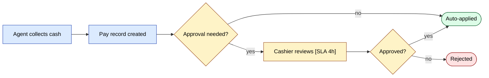
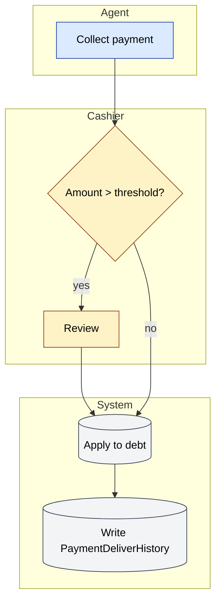

# Стандарты дизайна воркфлоу

Каждый воркфлоу SalesDoctor — order approval, payment approval, client
approval, audit, settlement, integration — следует одной дизайн-дисциплине.
Эта страница фиксирует эту дисциплину и показывает, где сегодня стоят все
наши существующие воркфлоу.

## Источник — что значит "хорошо"

Адаптировано из *Beginner's Guide to Workflow Design* от Cflow и их
trend report 2026 о AI-augmented workflow automation:

| # | Принцип | Что значит |
|---|-----------|---------------|
| 1 | **Сначала задокументировать ручной процесс** | Перед автоматизацией пройдите ручные шаги. Если не можете нарисовать — не сможете автоматизировать. |
| 2 | **Модульный дизайн** | Проектируйте так, чтобы шаги можно было добавлять / удалять / переупорядочивать без переписывания всего flow. |
| 3 | **Визуальная таксономия** | Используйте форму и цвет, чтобы маркировать особые шаги — approvals, ветви, интеграции, эскалации. |
| 4 | **Явные роли** | Каждая задача называет owner-роль (`agent`, `manager`, …). Никаких "кто-то это делает". |
| 5 | **Чёткие стадии** | У фаз human-readable имена (например, *Requester* → *Manager Approval* → *Final Approval*). |
| 6 | **Параллельные стадии** | Когда два approver могут ревьюить одновременно, моделируйте параллельно — не искусственно последовательно. |
| 7 | **Пороги и правила** | Триггеры approval срабатывают на **измеримых** критериях (`> credit_limit`, `> discount_cap`, `< stock_available`). |
| 8 | **Правила эскалации** | Определите SLA на шаг. После SLA — эскалация на роль выше. |
| 9 | **Обработка исключений** | У каждого шага есть хотя бы одна явная unhappy-path ветвь (reject, defer, retry). |
| 10 | **Governance & audit** | Каждый переход пишет audit-строку (кто, что, когда, before/after). |
| 11 | **Контроль с учётом риска** | Высокорисковым переходам (cancel, refund, mass-update) нужны более сильные контроли (4-eyes, MFA, audit). |
| 12 | **Стартовать там, где ROI доказуем** | Автоматизируйте сначала high-volume, rule-heavy, измеримые шаги. Не автоматизируйте one-off. |

## Наша стандартная спецификация воркфлоу

Используйте этот шаблон для любого нового воркфлоу. Когда предлагаете
фичу в PRD, вводящую новый flow, заполните это и слинкуйте из PRD.

```md
# Workflow: <name>

## Owner
Role(s) accountable for the flow's correctness and SLA.

## Stages
| # | Stage | Owner role | SLA | Action |

## Triggers
What event(s) start the workflow.

## Approval rules
| Criterion | Threshold | Approver |

## Escalation rules
| If stuck for | Escalate to |

## Exception paths
- Reject
- Defer / send back
- Cancel
- Manual override (with audit)

## Audit log
- Table: `<table>`
- Columns: actor, before_status, after_status, reason, timestamp

## Notifications
| Event | Channel | Recipients |

## Metrics
- Lead time
- Cycle time per stage
- Reject rate
- Escalation rate
- SLA-miss rate
```

## Визуальная таксономия (FigJam / Mermaid цветовая схема)

Применяйте консистентно по каждой диаграмме. Красьте **узел**,
не ребро.

| Цвет | Значение |
|--------|---------|
| **Синий** | Стандартный шаг (action) |
| **Янтарный** | Требуется approval |
| **Зелёный** | Успех / финальное закрытое состояние |
| **Красный** | Reject / cancel / failed final state |
| **Серый** | Внешняя система (1C, Didox, gateway, FCM) |
| **Фиолетовый** | Time-driven шаг (cron, scheduled job) |
| **Пунктирная граница** | Параллельная ветвь (два approver могут идти одновременно) |

## Аудит существующих воркфлоу SalesDoctor

Существующие flow проаудитированы против 12 принципов. ✅ = проходит,
⚠️ = частично, ❌ = пробел.

### sd-main · Жизненный цикл заказа

| Принцип | Статус | Заметки |
|-----------|--------|-------|
| 1 Manual first | ✅ | Смоделирован по legacy paper waybill flow |
| 2 Modular | ✅ | Каждый STATUS — отдельный transition; новые можно добавлять |
| 3 Visual taxonomy | ⚠️ | FigJam-диаграммы пока не используют цветовую схему |
| 4 Explicit roles | ✅ | Каждое действие имеет owner (`agent` создаёт, `cashier` подтверждает и т.д.) |
| 5 Clear stages | ✅ | `Draft → New → Reserved → Loaded → Delivered → Paid → Closed` |
| 6 Parallel stages | ❌ | Всё последовательно — discount approval и credit approval могли бы быть параллельны |
| 7 Thresholds | ⚠️ | Кредит-лимит + discount-cap проверяются, но захардкожены в коде, не декларативный конфиг |
| 8 Escalation | ❌ | Нет SLA-таймеров; заказы могут сидеть в `New` вечность |
| 9 Exception paths | ✅ | `Cancelled` / `Defect` / `Returned` |
| 10 Audit | ✅ | `OrderStatusHistory` |
| 11 Risk-tiered | ⚠️ | Cancel требует admin-роли, но без MFA |
| 12 ROI | ✅ | Высокий volume, well-defined |

**Action items**: параллельная approval-ветвь для заказов, требующих и
discount-, и credit-clearance; SLA-таймеры, перемещающие застрявшие
заказы в `Manager Review`.

### sd-main · Сбор и approval платежей

| Принцип | Статус | Заметки |
|-----------|--------|-------|
| 1 Manual first | ✅ | Прямое отображение практики кассового стола |
| 2 Modular | ✅ | Cash / non-cash / online split чистый |
| 3 Visual taxonomy | ⚠️ | – |
| 4 Explicit roles | ✅ | Agent собирает, Cashier подтверждает |
| 5 Clear stages | ✅ | `Pending → Approved → Applied` (или `Rejected`) |
| 6 Parallel stages | n/a | Один approver — уместно |
| 7 Thresholds | ❌ | Все платежи требуют approval; нет auto-approve под N |
| 8 Escalation | ❌ | Платёж может ждать днями |
| 9 Exception paths | ✅ | Reject |
| 10 Audit | ⚠️ | У `PaymentDeliver` есть approver, но нет поля reason |
| 11 Risk-tiered | ❌ | Те же контроли для ₽1 и ₽1 000 000 |
| 12 ROI | ✅ | Высокий volume |

**Action items**: ввести auto-approve threshold (например, платежи
< среднего размера одного заказа с full match); SLA → эскалация на
менеджера через 4 часа; захват причины reject.

### sd-main · Approval клиента

| Принцип | Статус | Заметки |
|-----------|--------|-------|
| 1 Manual first | ✅ | – |
| 2 Modular | ✅ | – |
| 3 Visual taxonomy | ⚠️ | – |
| 4 Explicit roles | ✅ | Agent → Manager |
| 5 Clear stages | ✅ | `Pending → Approved` (или `Rejected`) |
| 8 Escalation | ❌ | Нет SLA |
| 9 Exception paths | ⚠️ | Reject существует; "send back for fix" — нет |
| 10 Audit | ⚠️ | Только `ClientPending.CREATE_BY` — нет полной истории |

**Action items**: добавить состояние *Send back*, чтобы менеджеры могли
просить корректировку без отказа; добавить SLA + reminder.

### sd-main · Сабмит аудита

| Принцип | Статус | Заметки |
|-----------|--------|-------|
| 5 Clear stages | ⚠️ | Нет формальной стадии `Pending review` — submitted = final |
| 7 Thresholds | ❌ | Нет правила "below 60% facing → flag for re-audit" |
| 8 Escalation | ❌ | – |

**Action items**: добавить стадию *Pending Supervisor Review*;
rule-based флаги по compliance score.

### sd-billing · Жизненный цикл подписки

| Принцип | Статус | Заметки |
|-----------|--------|-------|
| 1 Manual first | ✅ | – |
| 7 Thresholds | ✅ | `MIN_SUMMA`, `MIN_LICENSE`, currency match |
| 8 Escalation | ⚠️ | Reminder-ы стреляют только на -7/-3/-1 дней |
| 10 Audit | ⚠️ | `IntegrationLog` только для licence push |
| 11 Risk-tiered | ⚠️ | Manual licence override существует, но без audit-строки |

**Action items**: захватывать каждое manual licence change в выделенную
audit-таблицу; добавить reminder на день 0 (день истечения); добавить
требование 4-eyes для free-period extensions свыше N дней.

### sd-billing · Платёжный gateway round-trip (Click / Payme / Paynet)

| Принцип | Статус | Заметки |
|-----------|--------|-------|
| 1 Manual first | n/a | Gateway-defined |
| 7 Thresholds | ✅ | Sign verification |
| 9 Exception paths | ✅ | Идемпотентно; per-state error responses |
| 10 Audit | ✅ | Per-day per-action JSON в `log/` (sanitise!) |
| 11 Risk-tiered | ⚠️ | Все gateway трактуются одинаково — Paynet (SOAP) — высший риск |
| 12 ROI | ✅ | Самый высокий volume |

**Action items**: усилить Paynet sign verification + добавить per-gateway
circuit breaker.

### sd-cs · Cross-dealer отчёт

| Принцип | Статус | Заметки |
|-----------|--------|-------|
| 5 Clear stages | ✅ | List dealers → swap connection → query → aggregate → cache |
| 9 Exception paths | ⚠️ | Сейчас отказ одного дилера валит весь отчёт |
| 10 Audit | ❌ | Нет лога, какие дилеры опрошены с какими параметрами |
| 12 ROI | ✅ | – |

**Action items**: graceful degradation, когда один дилер лежит (skip
+ flag); audit-строка на запуск отчёта; ключ кеша документирует список
дилеров и хеш фильтра.

## Процесс предложения нового воркфлоу

1. Заполните шаблон **Workflow specification** (выше).
2. Прогоните через **12 принципов** — отметьте каждый ❌ или ⚠️.
3. Нарисуйте на **Mermaid** с цветовой таксономией.
4. Добавьте таблицу SLA + escalation.
5. Перечислите **audit-колонки**, которые понадобятся.
6. **Получите review sign-off — по одному от каждого:**
   - **Product** — комментарий к PRD (найдите PM проекта в team-каталоге;
     если не уверены, постите в `#sd-product`).
   - **Engineering** — комментарий к PR (auto-pinged через GitHub
     `CODEOWNERS`; если нет — упомяните tech lead проекта из
     [Onboarding · К кому обращаться](./onboarding.md#к-кому-обращаться)).
   - **QA** — комментарий к PR или тикету тест-плана (постите в
     `#qa`, если не знаете, кто owner).
   Три sign-off могут идти параллельно; все три обязательны
   до merge. Реакция 👍 на PR + письменный approval в review-табе
   считается за sign-off.
7. После отгрузки инструментируйте **метрики** и ревьюйте ежемесячно
   в канале workflow-health (`#sd-workflows`).

## Mermaid styling cookbook

Copy-pasteable справка для применения визуальной таксономии выше к
Mermaid-диаграммам. Только workflow-диаграммы — не применяйте к блокам
`erDiagram`, `classDiagram` или `sequenceDiagram`.

### Словарь форм

Одна форма на роль узла. Выбирайте по тому, что узел *делает*, а не как
выглядит.

```
A(["Start / End"])           %% terminator — entry or final state
B["Action"]                  %% standard step — agent does X
C{"Decision?"}               %% branch — must have a measurable predicate
D[("External system")]       %% 1C, Didox, Click, Payme, FCM, …
E(["02:00 cron"])            %% time-driven step (cron, scheduled job)
```

### Цветовые классы

Кладите этот блок в конец каждого workflow `flowchart`. Hex-коды
1:1 мапятся на таблицу цветовой таксономии выше.

```
classDef action   fill:#dbeafe,stroke:#1e40af,color:#000
classDef approval fill:#fef3c7,stroke:#92400e,color:#000
classDef success  fill:#dcfce7,stroke:#166534,color:#000
classDef reject   fill:#fee2e2,stroke:#991b1b,color:#000
classDef external fill:#f3f4f6,stroke:#374151,color:#000
classDef cron     fill:#ede9fe,stroke:#6d28d9,color:#000
```

Назначайте через `class NodeId className` (один или несколько ID,
через запятую):

```
class A,B action
class C approval
```

### Before / after — flow approval платежа

Простейший воркфлоу на сайте, из
[`docs/modules/payment.md`](../modules/payment.md). Та же семантика —
формы апгрейднуты, классы назначены, ничего не переименовано.

**Before:**

```
flowchart LR
  A[Agent collects cash] --> B[Pay record created]
  B --> C{Approval needed?}
  C -- yes --> D[Cashier reviews]
  D --> E[Approved / Rejected]
  C -- no --> F[Auto-applied]
  E --> F
```

**After:**



After-версия разделяет неявный узел "Approved / Rejected" на явную
reject-ветвь (принцип #9) и инлайнит SLA-подсказку (принцип #8).

### Фоны subgraph — только белый

Группы воркфлоу (subgraph / swimlane) ДОЛЖНЫ использовать однородную
белую заливку с soft grey strokes. Не тонируйте группы по
team / project / stage — идентичность группы принадлежит **label**, а не
заливке. Цветные тона воюют с цветовыми кодами *узлов*
(палитра classDef из cookbook) и делают диаграммы труднее для чтения.

```
style SubgraphID fill:#ffffff,stroke:#cccccc
```

Применяйте этот `style`-line для каждого subgraph в каждом workflow и
архитектурном flowchart. (У ER-диаграмм, sequence-диаграмм и
state-диаграмм нет subgraph — пропускаем.)

### Рецепт swimlane

Используйте `subgraph` на роль для любого flow, пересекающего границы
ролей. Гайдлайн BPMN: 3–7 lane максимум, lane именуют **роли**, не
людей, named-role lanes (`"Cashier"`), не размытые
(`"Operations team"`). Каждый lane соответствует принципу #4 (явные
роли), и порядок lanes должен соответствовать порядку стадий из
принципа #5.



Если есть параллельные ветви (принцип #6), label-ьте оба ребра из
fork-узла ролью, которая их берёт, и сходитесь на явном join-узле.

### Аннотации SLA и audit

Инлайньте SLA-подсказки в текст узла через `[SLA <duration>]`; пишите
audit-сайдэффекты строкой `Note over`. Эти крючки делают принципы #8
(escalation) и #10 (audit) видимыми в самой диаграмме.

```
D["Cashier reviews [SLA 4h]"]
S2[("Write PaymentDeliverHistory")]

%% In sequenceDiagrams:
Note over System: writes OrderStatusHistory(actor, before, after, reason, ts)
```

Каждый transition, мутирующий business-state, должен показывать или
ссылаться на свою audit-строку. Если audit-таблицы ещё нет, это пробел
для тикета до прохода стилизации — см. ниже.

### Антипаттерны

- Decision-ромб без измеримого предиката. `{"Valid?"}` — плохо;
  `{"BALANS ≥ Package.PRICE?"}` — хорошо (принцип #7).
- Показан только happy-path. Каждому воркфлоу нужна как минимум одна
  явная reject / error / cancel ветвь (принцип #9).
- Больше 7 swimlane в одной диаграмме. Разделите на две связанные
  диаграммы по hand-off узлу.
- Применение цветовой таксономии к блокам `erDiagram`, `classDiagram` или
  `sequenceDiagram`. Таксономия — workflow-only.
- Mermaid-only-experts диаграммы. Если non-engineer reviewer не может
  прочитать с первого раза — упрощайте.
- Размытые role-lane (`"Operations"`, `"Team"`). Lane называет роль из
  таблицы access-rights, иначе не идёт (принцип #4).

### Перед стилевыми изменениями

Стилевой проход меняет цвета, формы и назначение классов — никогда
семантику. Если у диаграммы неправильные узлы, отсутствующие ветви
или устаревшая роль, заведите issue и фиксите это в отдельном изменении.
Смешивание двух делает review невозможным и тихо уводит модель от
работающей системы.

## Полезные ссылки

- [Cflow — Beginner's Guide to Workflow Design](https://www.cflowapps.com/workflow/workflow-design/)
- [Cflow — Approval Flows](https://www.cflowapps.com/approval-flows/)
- [Cflow — 7 Things to Do in Workflow Design](https://www.cflowapps.com/workflow-automation-design-best-practices/)
- [Cflow — AI Workflow Automation Trends 2026](https://www.cflowapps.com/ai-workflow-automation-trends/)

Источники:
- [The Beginner's Guide to Workflow Design (Cflow)](https://www.cflowapps.com/workflow/workflow-design/)
- [Cflow — 7 Workflow Design Best Practices](https://www.cflowapps.com/workflow-automation-design-best-practices/)
- [Cflow — AI Workflow Automation Trends 2026](https://www.cflowapps.com/ai-workflow-automation-trends/)
