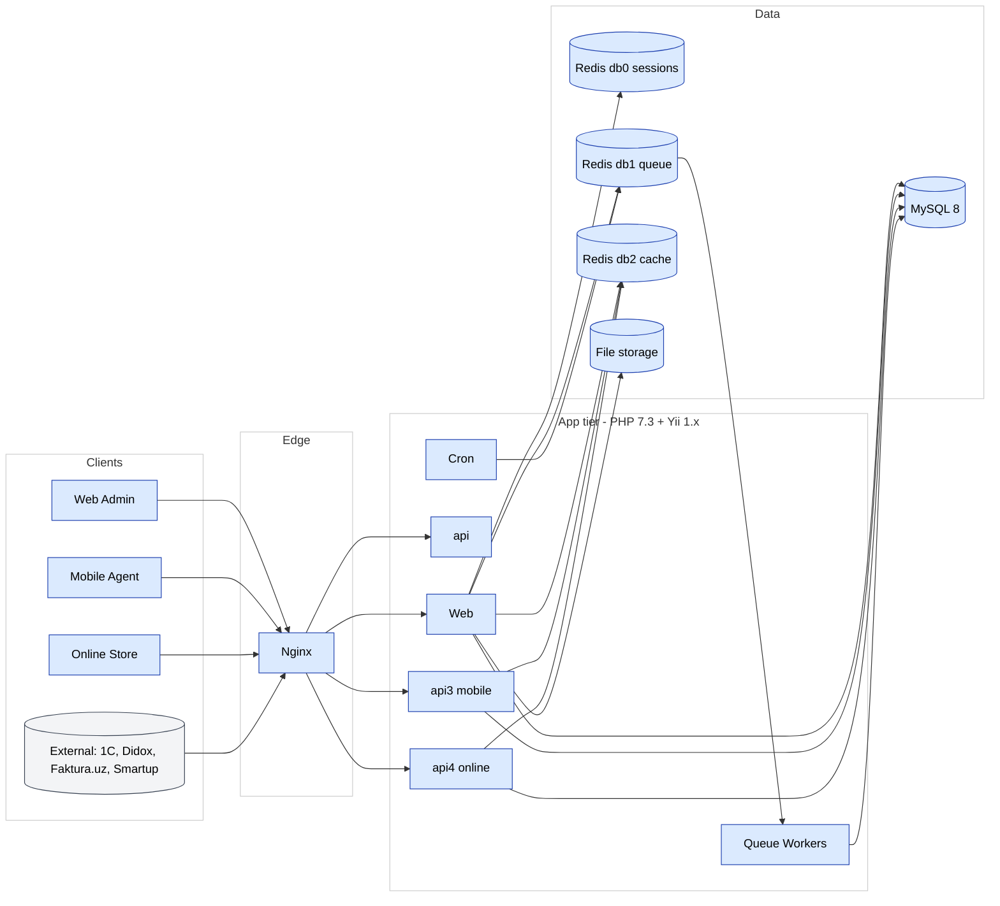

# Arxitektura umumiy ko'rinishi

SalesDoctor — bu mobil va integratsiyalar uchun **REST API** ga ega
klassik **server-rendered PHP web ilova**. U Nginx orqasidagi kichik
to'plam stateless ilova konteynerlari sifatida deploy qilinadi va MySQL
hamda Redis bilan tayyorlanadi.

## Yuqori darajadagi diagramma

Kanonik diagramma FigJam da yashaydi —
[Diagrammalar sahifasi](./diagrams.md) ga qarang. Lokal renderlangan
Mermaid versiyasi:

## Qatlamlar

### Edge

Bitta **Nginx** TLS terminator, vhost router (har bir tenant subdomeni uchun
bitta vhost) va statik asset serveri vazifasini bajaradi.
[`nginx.conf`](../project/structure.md) repo ildizida va
[DevOps dagi Nginx](../devops/nginx.md) ga qarang.

### Ilova

PHP 7.3 + Yii 1.x. Bir xil kod bazasi quyidagilarga xizmat qiladi:

- **Web admin** (server-rendered Yii view lari, jQuery, ba'zi Angular va Vue
  islandlari)
- **API v1, v2, v3, v4** `protected/modules/api*` ostida
- **Navbat ishchilari** — Redis db1 dan tortib olinadigan `BaseJob`
  pastki sinflarini ishga tushiradi
- **Cron** yozuvlari rejalashtirilgan ishlarni ishga tushiradi

Ilova konteynerlari **stateless**. Holatga ega bo'lgan har qanday narsa
MySQL, Redis yoki fayl tizimi mountiga boradi.

### Ma'lumotlar

- **MySQL 8** — har bir tenant uchun bitta mantiqiy ma'lumotlar bazasi
  (mijoz boshiga DB multi-tenancy). `protected/config/main.php` DB ni
  `HTTP_HOST` orqali tanlaydi.
  [Multi-tenancy](./multi-tenancy.md) ga qarang.
- **Redis 7** — uchta mantiqiy ma'lumotlar bazasi:
  - **db0** sessiyalar (`CCacheHttpSession`)
  - **db1** navbat (`Queue` komponenti)
  - **db2** ilova keshi (`TenantContext` orqali `ScopedCache`)
- **Fayl saqlash** — yuklangan fotolar, eksportlar, generatsiyalangan
  hujjatlar. Konteynerlarga umumiy hajm sifatida o'rnatilgan.

## Ko'ndalang komponentlar

| Komponent | Maqsadi | Joylashuv |
|-----------|---------|----------|
| `TenantContext` | So'rov host idan DB + filialni hal qiladi | `protected/components/TenantContext.php` |
| `DbAuthManager` | `authitem`, `authitemchild`, `authassignment` ustidagi keshlangan RBAC | `protected/components/DbAuthManager.php` |
| `WebUser` | Auto-login va filial scoping bilan Yii foydalanuvchi komponenti | `protected/components/WebUser.php` |
| `BaseJob` | Barcha navbat ishlari uchun bazaviy klass | `protected/components/BaseJob.php` |
| `Queue` | Redis asosidagi dispatcher | `protected/components/Queue.php` (yoki framework komponenti) |
| `ScopedCache` | Tenant- va filial-scope qilingan Redis kesh wrapperi | `protected/components/ScopedCache.php` |

## Nega bunday stack

Tarixiy qarorlar uchun [ADR 0001 — Yii 1 da qolish](../adr/yii1-stay.md) va
[ADR 0002 — Mijoz boshiga DB](../adr/multi-tenant-db-per-customer.md)
ga qarang.
