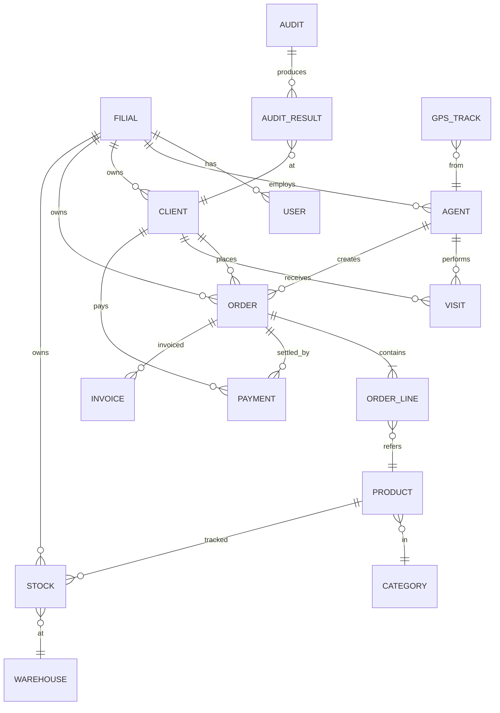

# Entity-relationship diagrammasi

Kanonik ERD — bu FigJam diagrammasi — kirish uchun [Diagrams sahifasi](../architecture/diagrams.md) ni oching. Mahalliy ravishda render qilingan Mermaid versiyasi quyida.



FigJam versiyasini eksport qilganingizda, uni `static/diagrams/erd.png` ga tashlang va havola qiling:

```markdown

```
