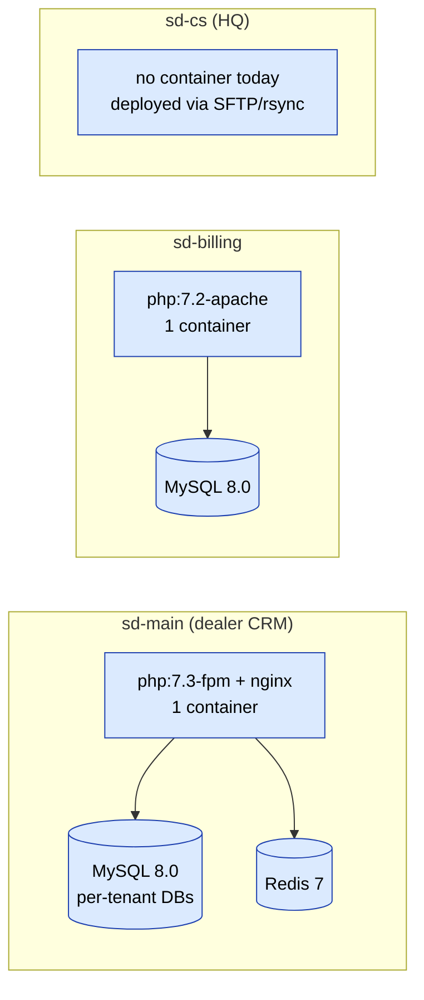

# Deployment

## Topologiya umumiy ko'rinishi

Uchta SalesDoctor loyihasi **mustaqil** deploy qilinadi. Har birining
o'z konteyner image, o'z ma'lumotlar bazasi va o'z reliz tezligi bor.
Umumiy registry yo'q, umumiy pipeline yo'q va ularni muvofiqlashtiruvchi
orchestrator yo'q.



E'tibor bering, ikki CRM-ga yaqin loyiha turli PHP runtime laridan
foydalanadi (sd-main da 7.3-fpm, sd-billing da 7.2-apache) va turli web
serverlardan. Ularni vendor ni umumiy qiladigan alohida mahsulot deb
qarang.

## sd-main

Mos yozuvlar loyihasi. Production deploylarining ko'pi ushbu repoga
tegadi.

### Build

Repo ning `Dockerfile` i ham nginx, ham php-fpm ni ishga tushiruvchi
bitta konteyner ishlab chiqaradi:

- Asosiy image: `php:7.3-fpm`
- Qo'shadi: nginx, GD (freetype/jpeg bilan), bcmath, pdo_mysql, mbstring,
  pcntl, sysv*, tidy, xsl, zip va `Dockerfile:29-49` da sanab o'tilgan
  qolganlari.
- `nginx.conf` ni `/etc/nginx/sites-available/default` ga ko'chiradi.
- `EXPOSE 80`. `docker-compose.yml` da host `8080` ga xaritalangan.
- `CMD service nginx start && php-fpm` — ikkala xizmat ham bitta
  konteynerda yashaydi. **Entrypoint skripti yo'q.** Migratsiyalar
  yuklashda ishga tushirilmaydi.

```bash
docker build -t registry.example.com/sd-main:$(git rev-parse --short HEAD) .
docker push registry.example.com/sd-main:<tag>
```

Bu yerda registry faqat hujjatlash uchun ko'rsatilgan — repo registry URL
ni jo'natmaydi. O'zingiznikini almashtiring.

### Konfiguratsiya

sd-main **env-driven emas**. Konfiguratsiya
`protected/config/main_local.php` da yashaydi, u gitignored. Commit
qilingan `main.php` production-shaklidagi sukut qiymatlarni tashiydi;
`main_local.php` DB hisobga olish ma'lumotlari, Redis xost nomlari va
shu kabilarni o'zgartiradi:

```php
// protected/config/main_local.php
return [
    'components' => [
        'db' => [
            'connectionString' => 'mysql:host=db;dbname=sd_main',
            'username' => '...',
            'password' => '...',
        ],
        'redis_session' => ['hostname' => 'redis'],
        'queueRedis'    => ['hostname' => 'redis'],
        'redis_app'     => ['hostname' => 'redis'],
    ],
];
```

Fayl mavjud bo'lganda `main.php`
`array_replace_recursive($config, require 'main_local.php')` ni
chaqiradi. Shunday qilib, hostni provisioning qilish atrof-muhit
o'zgaruvchilarini sozlash emas, balki `main_local.php` yozishni
anglatadi.

### Ma'lumotlar bazasi migratsiyalari

Yii 1 ning `yiic migrate` yagona vositadir. Hozirda kanonik
migratsiyalar katalogida commit qilingan migratsiya fayllari yo'q,
shuning uchun ko'p sxema ishi tartibsiz qo'llanilgan xom SQL orqali
amalga oshadi; yangi o'zgarishlar bundan buyon `yiic` orqali qo'shilishi
kerak.

```bash
docker compose exec web php protected/yiic migrate up
```

Migratsiyalar `main.php` dagi **sukut bo'yicha** DB ga yo'naltirilgan.
Multi-DB fan-out uchun quyidagi [Multi-tenant fan-out](#multi-tenant-fan-out)
va [Migratsiyalar](../data/migrations.md) ga qarang.

### Rollout

Avtomatlashtirilgan rollout yo'q. Qo'lda retsept:

```bash
ssh prod 'cd /srv/sd-main && \
  docker compose pull web && \
  docker compose exec web php protected/yiic migrate up && \
  docker compose up -d web'
```

Nginx va php-fpm konteynerni baham ko'rgani uchun, `compose up -d web`
qayta yuklash jarayondagi so'rovlarni tashlaydi. Sokin oynada ishga
tushiring.

### Healthcheck

**Ilova healthcheck endpointi yo'q.** `protected/` ning hech qaerida
`actionHealth`, `actionPing` yoki `/healthz` yo'nalishi yo'q.
`docker-compose.yml` `web` xizmatida `healthcheck` blokini e'lon qilmaydi.
Stack dagi yagona healthcheck implicit (MySQL `:3306` ni ochgan).

Agar sd-main ni yuk muvozanatlashtiruvchi bilan front qilsangiz, uni
`/site/index` kabi ma'lum arzon yo'nalishga yo'naltiring va HTML
kontentni muvaffaqiyat signali sifatida qabul qiling, yoki
[Nginx](./nginx.md) da tasvirlanganidek nginx ga
`location = /healthz { return 200; }` stanzasini qo'shing.

### Rollback

Oldingi image tag i bilan `docker compose pull web`, keyin
`docker compose up -d web`. Sxema rollback i avtomatlashtirilmagan —
migratsiyalarni **forward-compatible** (qo'shimcha ustunlar, koddan
foydalanadigan reliz bilan bir xil relizda drop yo'q) qilib yozing.

### Smoke testlar

`infra/smoke.sh` yo'q. Deploy dan keyin qo'lda uring:

```
GET /                      → 200 (HTML login sahifasi)
GET /api3/config/index     → 200 JSON bilan
GET /api2/auth/login       → 401 JSON bilan (auth talab qilinadi, marshrutlashning ishlashini bildiradi)
```

## sd-billing

### Build

`docker/Dockerfile` sd-main dan boshqa stack ishlab chiqaradi:

- Asosiy image: `php:7.2-apache` (Apache, nginx emas; PHP 7.2, 7.3 emas).
- Stretch EOL bo'lgani uchun `sources.list` ni `archive.debian.org` ga
  patch qiladi — busiz build muvaffaqiyatsiz bo'ladi.
- `pdo_mysql`, `zip` ni o'rnatadi, `mod_rewrite` va `mod_headers` ni
  yoqadi.
- Repo ni `/var/www` ga ko'chiradi, keyin `_index.php` →
  `index.php` va `_constants.php` → `constants.php` ni **qayta nomlaydi**.
  Commit qilingan `_constants.php` placeholder Paynet hisobga olish
  ma'lumotlarini tashiydi — build qilishdan oldin yozib qo'ying yoki
  build context vaqtida o'rnini bosing.
- `EXPOSE 80`. `docker-compose.yml` da host `3000` ga xaritalangan.
- `ENTRYPOINT ["/entrypoint.sh"]` — pastda qarang.

### Konfiguratsiya

sd-billing **env-driven**. `protected/config/_db.php` `getenv()` orqali
`MYSQL_HOST`, `MYSQL_PORT`, `MYSQL_DATABASE`, `MYSQL_USER`,
`MYSQL_PASSWORD` ni o'qiydi. Bularni orchestrator (yoki compose fayl)
da o'rnating.

### Ma'lumotlar bazasi migratsiyalari

`docker/entrypoint.sh` konteyner boshlanishida
`yiic migrate --interactive=0` ni ishga tushiradi, lekin faqat sxema
boot qilinmagan bo'lsa (u `d0_tariff` ni grep qiladi va mavjud bo'lsa
o'tkazib yuboradi). 55 migratsiya `protected/migrations/` da yashaydi.

Shuningdek, `docker/seed_mock_data.php` ni ishga tushiradigan dev-only
`ENABLE_MOCK_SEED=1` switch i bor. Production da hech qachon o'rnatmang.

### Rollout, healthcheck, rollback

sd-main bilan bir xil shakl: avtomatlashtirish yo'q, healthcheck
endpointi yo'q, rollback skripti yo'q. Compose fayl **MySQL** xizmatida
`healthcheck` ni e'lon qiladi (`mysqladmin ping`), bu
`depends_on.mysql.condition: service_healthy` orqali `web` startini
boshqaradi. Web konteynerining o'zi tekshirilmagan.

Dasturchiga yo'naltirilgan sozlash uchun [sd-billing local
setup](../sd-billing/local-setup.md) ga qarang.

## sd-cs

sd-cs da **Dockerfile yo'q, docker-compose yo'q va migratsiyalar yo'q**
(`protected/migrations/empty.sql` yagona fayl). Bu legacy HQ konsoli;
deploylar fayl darajasidagi (PHP hostiga SFTP / rsync) va konteynerga
asoslangan pipeline doirasidan tashqarida. Bu yerdagi har qanday
o'zgarishni qo'lda, nazorat qilingan reliz deb qarang.

## Multi-tenant fan-out

sd-main har bir tenant uchun **bitta MySQL ma'lumotlar bazasi** ni
ishga tushiradi (`sd_<tenant>`). Sxemani o'zgartiradigan reliz har bir
tenant DB ga tegishi kerak. Built-in fan-out vositasi yo'q; operator
loop ni ishga tushiradi:

```bash
for db in $(mysql -uroot -p$ROOT -Nsre 'SHOW DATABASES LIKE "sd\\_%"'); do
  echo "Migrating $db..."
  docker compose exec -e DB_NAME=$db web php protected/yiic migrate up
done
```

Xuddi shu tenant bo'yicha loop pattern har qanday cron-scoped ma'lumot
tuzatishga qo'llanadi — `TenantRegistry::all()` va
`TenantContext::switchTo()` uchun [Fonda ishlar va
rejalashtirish](../architecture/jobs-and-scheduling.md) ga qarang.

## Buzilish rejimlari

- **Deploy roll o'rtasida muvaffaqiyatsiz** — nginx va php-fpm
  konteynerni baham ko'radi, shuning uchun muvaffaqiyatsiz
  `compose up -d web` yangi konteyner sog'lom bo'lguncha oldingi
  konteynerni ishlayotgan holda qoldiradi. Canary oynasi yo'q; eski va
  yangi hech qachon bir vaqtda jonli emas.
- **Migratsiya tenantlar bo'ylab yarmida muvaffaqiyatsiz** — yuqoridagi
  loop birinchi nol bo'lmagan exitda to'xtaydi. U muvaffaqiyatsiz
  bo'lgan tenant qisman migratsiya qilingan holatda; qolganlari
  tegmaydi. Muvaffaqiyatsiz tenant tuzatilgandan so'ng qo'lda davom
  ettiring.
- **Yangi xostda `main_local.php` yo'q** — sd-main commit qilingan
  `main.php` sukut qiymatlariga qaytadi, ular qattiq kodlangan
  kreditlar bilan `host=db, dbname=sd_main` ga yo'naltirilgan.
  Provisioning qismi sifatida `main_local.php` ni jo'nating yoki
  sukut qiymatni qabul qiling.
- **Redis yetib bo'lmaydi** — sessiyalar (`CCacheHttpSession`) va
  navbat ham ishlamaydi. Ilova sirti faqat anonim foydalanuvchilarga
  pasayadi; jarayondagi ishlar to'planib qoladi. Yumshoq fallback yo'q —
  Redis ni tuzating, keyin navbat replay larining shovqinini kuting.

## Shuningdek qarang

- [Docker Compose](./docker-compose.md) — production overlay shakli.
- [Nginx](./nginx.md) — vhost, healthcheck, rate limiting.
- [Migratsiyalar](../data/migrations.md) — `yiic migrate` mexanikasi.
- [Multi-tenancy](../architecture/multi-tenancy.md) — tenant DB tartibi.
- [sd-billing local setup](../sd-billing/local-setup.md) — env wiring tafsiloti.
