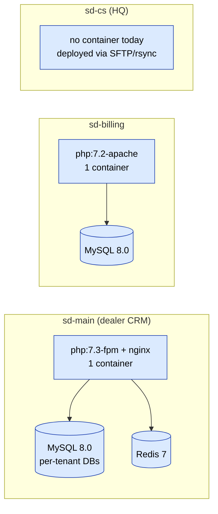
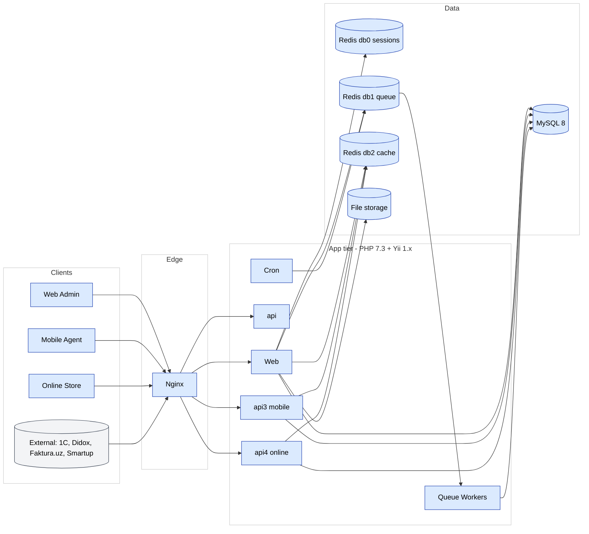
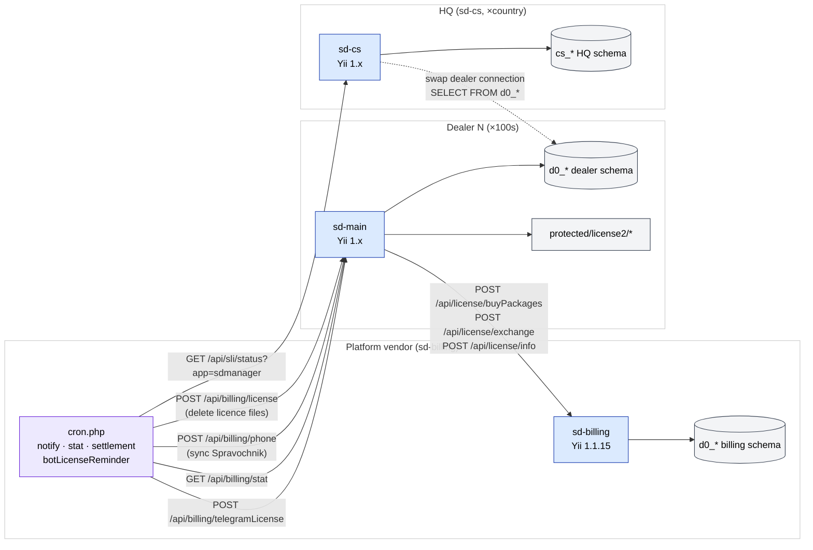
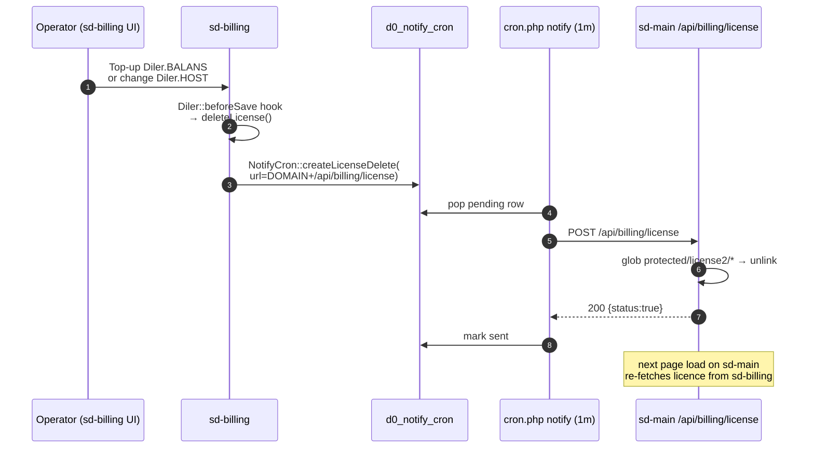
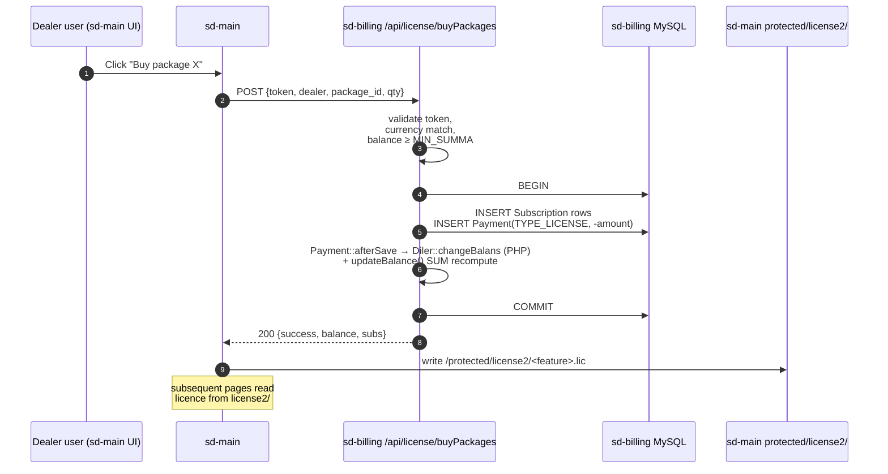
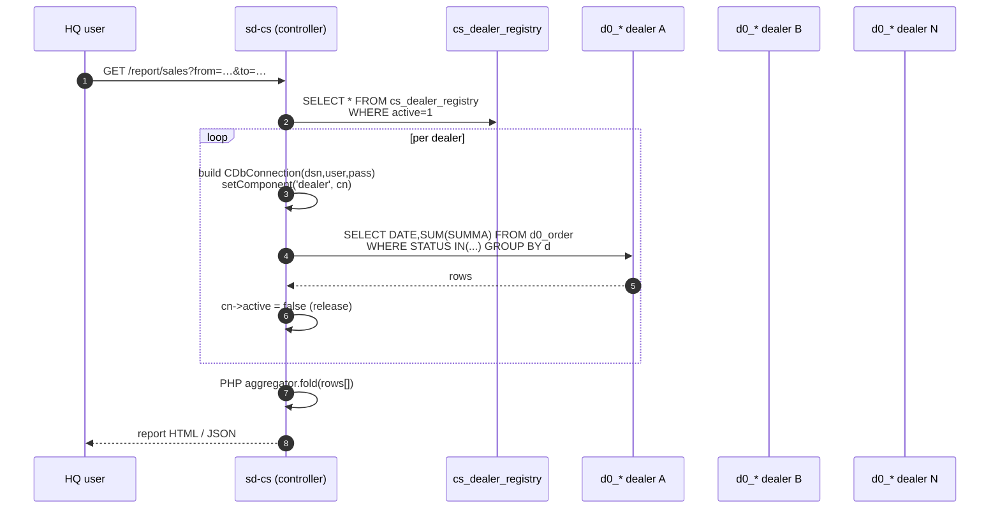

# sd-main · Tizim dizayni — diagramma galereyasi

sd-main ning qatlam darajasidagi arxitekturasi — HTTP, ilova qatlami,
MySQL, Redis (3 DB), navbat, cron, fayl saqlash.

Ushbu guruhdagi 7 ta diagrammaning hammasi ichki ko'rinishda chizilgan.

## Indeks

| # | Sarlavha | Tur | Manba sahifa |
|---|-------|------|-------------|
| 01 | [Topologiya umumiy ko'rinishi](#d-01) | `flowchart` | [devops/deployment](/docs/devops/deployment) |
| 02 | [Yuqori darajadagi diagramma](#d-02) | `flowchart` | [architecture/overview](/docs/architecture/overview) |
| 03 | [1. Topologiya](#d-03) | `flowchart` | [architecture/cross-project-integration](/docs/architecture/cross-project-integration) |
| 04 | [2.3 Ketma-ketlik — litsenziya yuborish (eng keng tarqalgan)](#d-04) | `sequence` | [architecture/cross-project-integration](/docs/architecture/cross-project-integration) |
| 05 | [3.2 buyPackages — kanonik yo'l](#d-05) | `sequence` | [architecture/cross-project-integration](/docs/architecture/cross-project-integration) |
| 06 | [4.4 Ketma-ketlik — dilerlararo hisobot](#d-06) | `sequence` | [architecture/cross-project-integration](/docs/architecture/cross-project-integration) |
| 07 | [6. Yangi dilerni provisioning qilish (boshidan oxirigacha)](#d-07) | `flowchart` | [architecture/cross-project-integration](/docs/architecture/cross-project-integration) |

## 01. Topologiya umumiy ko'rinishi {#d-01}

- **Turi**: `flowchart`
- **Manba sahifa**: [devops/deployment](/docs/devops/deployment)
- **Boshlovchi bo'lim**: Topologiya umumiy ko'rinishi

## 02. Yuqori darajadagi diagramma {#d-02}

- **Turi**: `flowchart`
- **Manba sahifa**: [architecture/overview](/docs/architecture/overview)
- **Boshlovchi bo'lim**: Yuqori darajadagi diagramma

## 03. 1. Topologiya {#d-03}

- **Turi**: `flowchart`
- **Manba sahifa**: [architecture/cross-project-integration](/docs/architecture/cross-project-integration)
- **Boshlovchi bo'lim**: 1. Topologiya

## 04. 2.3 Ketma-ketlik — litsenziya yuborish (eng keng tarqalgan) {#d-04}

- **Turi**: `sequence`
- **Manba sahifa**: [architecture/cross-project-integration](/docs/architecture/cross-project-integration)
- **Boshlovchi bo'lim**: 2.3 Ketma-ketlik — litsenziya yuborish (eng keng tarqalgan)

## 05. 3.2 buyPackages — kanonik yo'l {#d-05}

- **Turi**: `sequence`
- **Manba sahifa**: [architecture/cross-project-integration](/docs/architecture/cross-project-integration)
- **Boshlovchi bo'lim**: 3.2 buyPackages — kanonik yo'l

## 06. 4.4 Ketma-ketlik — dilerlararo hisobot {#d-06}

- **Turi**: `sequence`
- **Manba sahifa**: [architecture/cross-project-integration](/docs/architecture/cross-project-integration)
- **Boshlovchi bo'lim**: 4.4 Ketma-ketlik — dilerlararo hisobot

## 07. 6. Yangi dilerni provisioning qilish (boshidan oxirigacha) {#d-07}

- **Turi**: `flowchart`
- **Manba sahifa**: [architecture/cross-project-integration](/docs/architecture/cross-project-integration)
- **Boshlovchi bo'lim**: 6. Yangi dilerni provisioning qilish (boshidan oxirigacha)

```mermaid
flowchart LR
  A(["Contract signed"]) --> B["sd-billing creates Diler row"]
  B --> C["Diler::sendRequest()<br/>creates Server (status=SENT)"]
  C --> D["Server.createServer<br/>provisions dealer MySQL + sd-main host"]
  D --> E["Server.status=OPENED"]
  E --> F["sd-billing pushes initial licence<br/>POST /api/billing/license"]
  F --> G["Dealer registry row inserted in cs_*<br/>(DSN, capability flags)"]
  G --> H["sd-cs runs smoke report"]
  H --> I(["Dealer live, included in HQ rollups"])

  classDef action  fill:#dbeafe,stroke:#1e40af,color:#000
  classDef success fill:#dcfce7,stroke:#166534,color:#000
  class A,B,C,D,E,F,G,H action
  class I success
```

