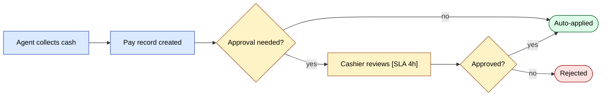
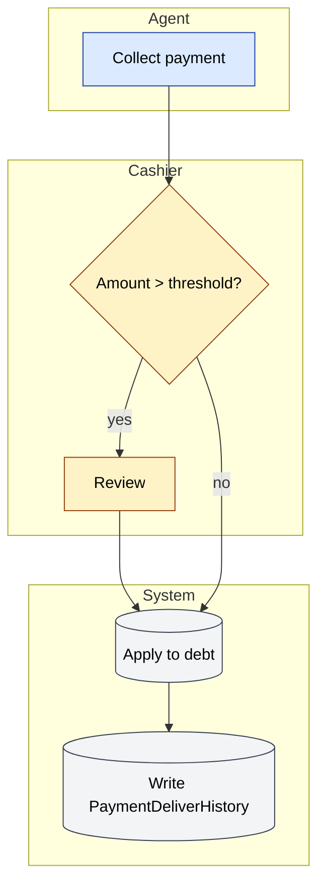

# Jarayon ish jarayonlari — diagramma galereyasi

Ilova xususiyat oqimlari bo'lmagan operatsion-jarayon diagrammalari.

Ushbu guruhdagi 3 ta diagrammaning hammasi ichki ko'rinishda chizilgan.

## Indeks

| # | Sarlavha | Tur | Manba sahifa |
|---|-------|------|-------------|
| 01 | [Oldin / keyin — to'lovni tasdiqlash oqimi](#d-01) | `flowchart` | [team/workflow-design](/docs/team/workflow-design) |
| 02 | [Swimlane retsepti](#d-02) | `flowchart` | [team/workflow-design](/docs/team/workflow-design) |
| 03 | [Ingestion pipeline (yuqori daraja)](#d-03) | `flowchart` | [team/rag-indexing](/docs/team/rag-indexing) |

## 01. Oldin / keyin — to'lovni tasdiqlash oqimi {#d-01}

- **Turi**: `flowchart`
- **Manba sahifa**: [team/workflow-design](/docs/team/workflow-design)
- **Boshlovchi bo'lim**: Oldin / keyin — to'lovni tasdiqlash oqimi

## 02. Swimlane retsepti {#d-02}

- **Turi**: `flowchart`
- **Manba sahifa**: [team/workflow-design](/docs/team/workflow-design)
- **Boshlovchi bo'lim**: Swimlane retsepti

## 03. Ingestion pipeline (yuqori daraja) {#d-03}

- **Turi**: `flowchart`
- **Manba sahifa**: [team/rag-indexing](/docs/team/rag-indexing)
- **Boshlovchi bo'lim**: Ingestion pipeline (yuqori daraja)

