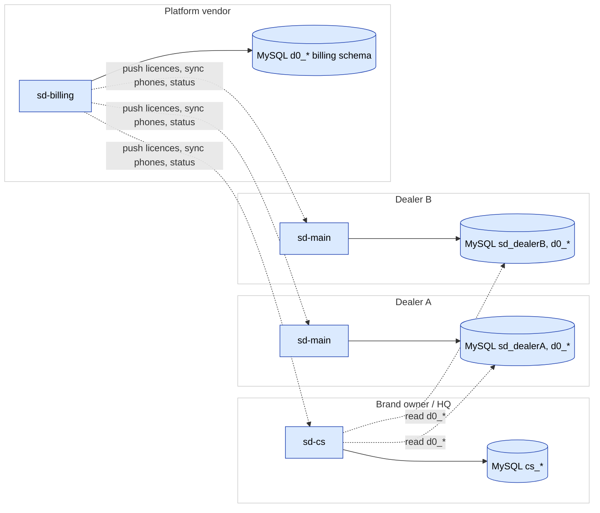
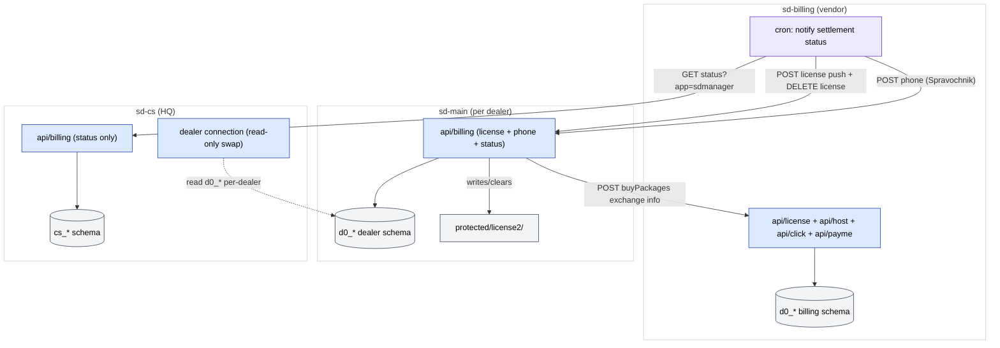

# SalesDoctor ekotizimi

SalesDoctor platformasini birgalikda tashkil etuvchi **uchta sherik loyiha**
mavjud — ular `~/projects/salesdoctor/` ostida joylashgan:

```
sd-cs   ─►   sd-main   ─►   sd-billing
HQ            Diler CRM       Obunalar / litsenziyalar
```

| Loyiha | Roli | Auditoriya |
|---------|------|----------|
| **[`sd-cs`](#sd-cs)** | Bosh ofis / "Country Sales 3" | Ko'p dilerlarni konsolidatsiya qiluvchi brend egasi |
| **[`sd-main`](#sd-main)** | Diler CRM | Har bir dilerning kundalik operatsion tizimi |
| **[`sd-billing`](#sd-billing)** | Obunalar, litsenziyalash, to'lovlar | Diler hisoblarini boshqaruvchi platforma vendori |

Yuqoridagi strelkalar **iste'molchidan ishlab chiqaruvchiga** yo'naltirilgan
— ya'ni har bir strelka "o'qiydi" degan ma'noni anglatadi, "yuboradi" emas.
Ish vaqtidagi ma'lumotlar oqimi yo'nalishi litsenziya yuborish / status ping
larida strelkaga teskari bo'ladi, shuning uchun quyidagi Mermaid diagrammasi
ikkala munosabatni ham aniq ko'rsatadi:

- **`sd-cs`** HQ da joylashgan. U konsolidatsiyalangan hisobotlar yaratish
  uchun ko'plab `sd-main` ma'lumotlar bazalariga **o'qish** ulanishlarini ochadi.
- **`sd-main`** dilerning kundalik operatsiyalarining yozuv tizimi
  hisoblanadi. Har bir dilerning o'z `sd-main` instansi bor va o'z MySQL
  sxemasi (prefiks `d0_`) bilan ishlaydi.
- **`sd-billing`** har bir `sd-main` va `sd-cs` ning yuqorisida turadi. U
  litsenziya fayllarini yuboradi, telefon ma'lumotnomalarini sinxronlaydi,
  statusni so'roqlaydi va dilerga obuna uchun hisob-kitob yuboradi.
  `sd-main` va `sd-cs` Billing dan faqat litsenziya tekshiruvi uchun o'qiydi.

[FigJam doskasidagi](./architecture/diagrams.md) **Ekotizim** diagrammasiga
qarang.



## Loyihalararo integratsiya xaritasi

Uchta loyihani bir-biriga ulaydigan aniq endpoint lar, DB ulanishlar,
litsenziya fayli yo'llari va cron orqali yuborishlar. Bu "ular qanday
gaplashadi?" ko'rinishi — har qanday loyihalararo chegarani o'zgartirayotganda
shu yerdan boshlang.



Har bir endpoint bo'yicha batafsil protokol uchun
[sd-billing integratsiyasi](./sd-billing/integration.md) va
[sd-cs ↔ sd-main integratsiyasi](./sd-cs/sd-main-integration.md) ga qarang.

## Loyiha bo'yicha asosiy xususiyatlar katalogi

Har bir loyihaning asosiy imkoniyat sohalari. Buni manfaatdor tomonlar uchun
30 soniyalik kirish sifatida ishlating; chuqurroq ma'lumot uchun modul
sahifalariga o'ting.

```mermaid
flowchart TB
  subgraph SDMain["sd-main · Dealer CRM"]
    direction TB
    M_ORD["Orders (web + mobile + B2B online)"]
    M_AGT["Agents · routes · KPI · vehicles"]
    M_CLI["Clients · contracts · segments · debt"]
    M_WHS["Warehouse · stock · inventory · transfers"]
    M_PAY["Payments · cashier approval · cashbox"]
    M_AUD["Audits · facing · photo reports"]
    M_GPS["GPS tracking · geofence · trip playback"]
    M_INT["Integrations 1C · Didox · Faktura.uz · Smartup"]
    M_RPT["80+ reports · Excel export · pivots"]
    M_OO["B2B online store · Telegram bot · WebApp"]
  end

  subgraph SDCs["sd-cs · HQ Country Sales"]
    direction TB
    CS_RPT["Consolidated reports across all dealers"]
    CS_PIV["Pivots · RFM · SKU · expeditor"]
    CS_DIR["HQ directory · brands · segments · plans"]
    CS_MDB["Multi-DB read of dealer DBs (read-only)"]
  end

  subgraph SDBilling["sd-billing · Subscriptions and licensing"]
    direction TB
    B_SUB["Subscriptions · packages · tariffs · bonus"]
    B_LIC["Licence files · feature gating per system"]
    B_PAY["Click · Payme · Paynet · MBANK · P2P · cash"]
    B_SET["Daily settlement distributor / dealer"]
    B_NOT["Telegram + SMS notifications · expiry reminders"]
    B_PRT["Partner portal · self-service"]
  end

  classDef action fill:#dbeafe,stroke:#1e40af,color:#000
  class M_ORD,M_AGT,M_CLI,M_WHS,M_PAY,M_AUD,M_GPS,M_INT,M_RPT,M_OO action
  class CS_RPT,CS_PIV,CS_DIR,CS_MDB action
  class B_SUB,B_LIC,B_PAY,B_SET,B_NOT,B_PRT action

  style SDMain fill:#ffffff,stroke:#cccccc
  style SDCs fill:#ffffff,stroke:#cccccc
  style SDBilling fill:#ffffff,stroke:#cccccc
```



## sd-cs {#sd-cs}

**Country Sales 3** ilovasi — Yii 1.x, ikkita MySQL ulanish (o'zining
`cs_*` sxemasi + har bir dilerning `d0_*` DB siga almashtiriladigan
`dealer` ulanish), konsolidatsiyalangan hisobotlar va pivotlarga
yo'naltirilgan.

[sd-cs bo'limi](./sd-cs/overview.md) ga qarang.

## sd-main {#sd-main}

Diler CRM — saytning katta qismi sd-main haqida. Quyidagilarga qarang:
[Arxitektura](./architecture/overview.md),
[Modullar ma'lumotnomasi](./modules/overview.md) va
[API ma'lumotnomasi](./api/overview.md).

## sd-billing {#sd-billing}

Platforma vendorining obuna hisob-kitob tizimi — Yii 1.1.15, MySQL,
Docker, distribyutorlar, dilerlar, paketlar, obunalar, to'lovlar (Click /
Payme / Paynet / MBANK / P2P), settlement, dunning ni qamrab oluvchi
13 modul. [sd-billing bo'limi](./sd-billing/overview.md) ga qarang.

## Boshqa papkalar

`sd-components/` (Vue + Vuetify UI kutubxonasi) va `manager-ai/` (bo'sh
AI yordamchisi karkasi) uchta asosiy loyiha yonida joylashgan. Ular
sherik mahsulotlar emas — ularni ichki kutubxonalar / kelajakdagi ish
sifatida qarang. [sd-components yozuvlari](./sd-cs/sd-components.md) ga
qarang.
