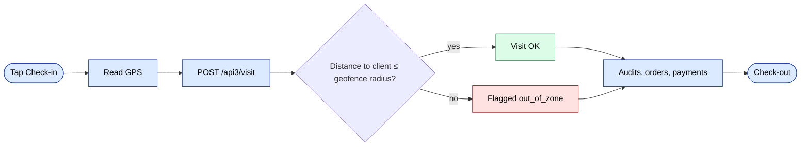
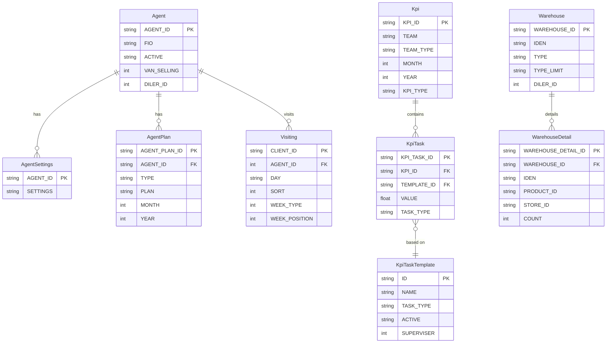
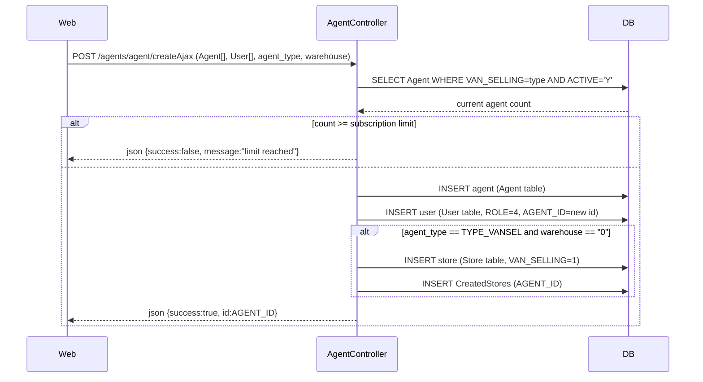
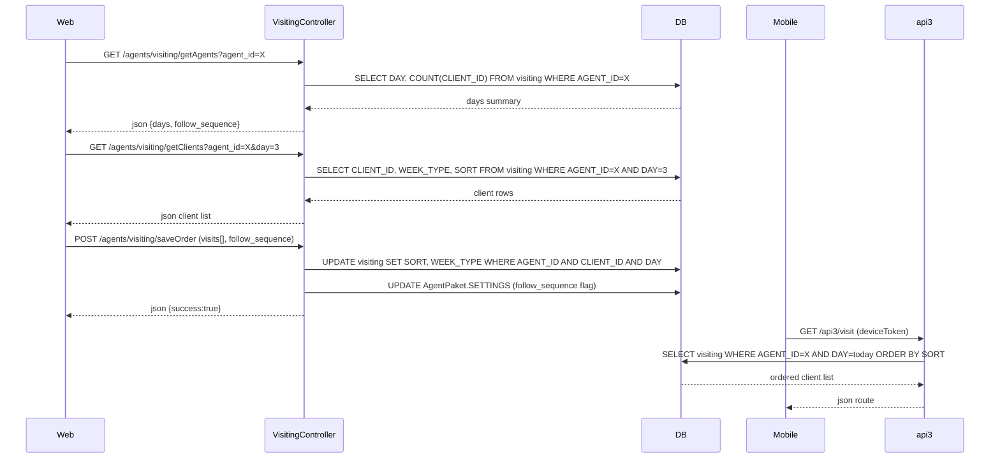
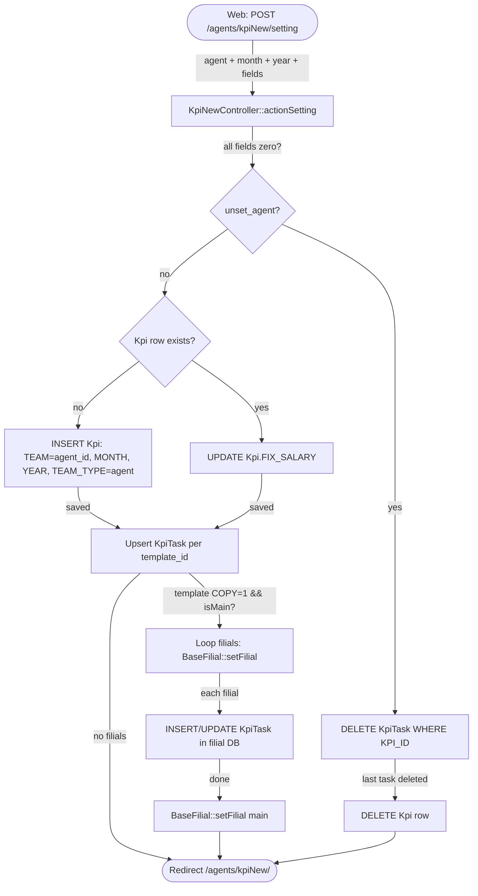
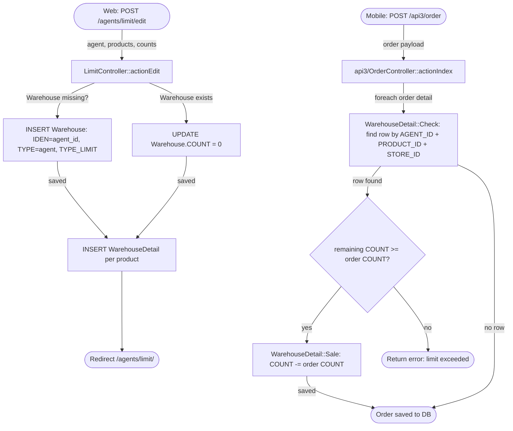

# `agents` moduli

Savdo agentlari (dala kuchi) plus ularning rejalari, KPI'lari, transport vositalari va cheklovlari. Web admin dala kuchi qanday tashkil etilganligini boshqaradi; agentlarning o'zlari mobil ilovadan api3 orqali ishlaydi.

## Asosiy xususiyatlar

| Xususiyat | Nima qiladi | Egasi rol(lar) |
|---------|--------------|---------------|
| Agent CRUD | Agentlarni yaratish / tahrirlash / o'chirish | 1 / 2 / 9 |
| Agent sozlamalari | Agent bo'yicha togglar (naqd yig'ish, chegirma chegaralari va boshqalar) | 1 / 9 |
| Oylik reja | Davr bo'yicha maqsadli hajm / soni | 1 / 9 |
| KPI v1 / v2 | Agent bo'yicha reja-haqiqat hisobotlari | 8 / 9 |
| Kredit chegarasi | Agent buyurtmada qabul qilishi mumkin bo'lgan maksimal qarz | 1 / 9 |
| Chegirma chegarasi | Agent qo'llashi mumkin bo'lgan maksimal chegirma | 1 / 9 |
| Transport tayinlash | Har bir agent `Car` ga bog'lanadi | 1 / 9 |
| Paket / to'plamlar | Agentlar sotishi mumkin bo'lgan oldindan belgilangan mahsulot to'plamlari | 1 / 9 |
| Marshrut tayinlash | Hafta kunlari marshrutlari mijozlarga moslashtirilgan | 8 / 9 |

## Papka

```
protected/modules/agents/
├── controllers/
│   ├── AgentController.php
│   ├── CarController.php
│   ├── KpiController.php
│   ├── KpiNewController.php   # v2 — prefer for new screens
│   └── LimitController.php
└── views/
```

## Asosiy entitylar

| Entity | Model |
|--------|-------|
| Agent | `Agent` |
| Agent sozlamalari | `AgentSettings` |
| Agent rejasi | `AgentPlan` |
| Agent paketi | `AgentPaket` |
| Avtomobil | `Car` |
| KPI | turli `Kpi*` modellari |

## Rejalar va KPI

Agent rejalari oylik boshqariladi. `KpiController` haqiqiy va reja raqamlarini hisobot qiladi; `KpiNewController` qayta yozilgani — yangi loyihalar uni afzal ko'rishi kerak.

## Cheklovlar

`LimitController` kredit va chegirma chegaralarini majburiy qiladi. Cheklovlar **buyurtma yaratishda** va **tasdiqlashda** tekshiriladi. Har qanday chegaradan oshgan agent buyurtmani menejer-tasdiqlash holatiga majburlaydi.

## Mobil (api3)

Agent mobil ilovasi api3 ni chaqiradi:

- [`POST /api3/login/index`](../api/api-v3-mobile.md#login)
- [`POST /api3/visit/index`](../api/api-v3-mobile.md#visits)
- `GET /api3/agent/route` — bugungi mijozlar
- `GET /api3/kpi/index` — agentning o'z KPI plitkasi

## Asosiy xususiyat oqimi — Tashrif va GPS

[FigJam · sd-main · Feature Flows](https://www.figma.com/board/MyvyaeEluqvHofH4E2qIoU) ichida **Feature · Visit & GPS geofence** ga qarang.



## Ruxsatlar

| Amal | Rollar |
|--------|-------|
| Yaratish / tahrirlash | 1 / 2 / 9 |
| KPI ko'rish | 1 / 2 / 8 / 9 (4 uchun faqat o'ziniki) |
| Cheklov belgilash | 1 / 2 / 9 |

## Workflow'lar

### Kirish nuqtalari

| Trigger | Controller / Action / Job | Izohlar |
|---|---|---|
| Web (admin) | `AgentController::actionCreateAjax` | `Agent` + bog'langan `User` (rol 4) yaratadi; obuna chegaralarini majburiy qiladi |
| Web (admin) | `AgentController::actionUpdateAjax` | Agent profilini va `User` ma'lumotlarini yangilaydi |
| Web (admin) | `LimitController::actionEdit` | Mahsulot bo'yicha miqdor cheklovlarini `Warehouse` / `WarehouseDetail` ga saqlaydi |
| Web (admin) | `LimitController::actionChangeType` | Cheklovning `TYPE_LIMIT` ni almashtiradi (kunlik / oylik / 30-kunlik) |
| Web (admin) | `VisitingController::actionSaveOrder` | Agent uchun hafta kunlari marshrut tartibini `Visiting` ga saqlaydi |
| Web (admin) | `KpiNewController::actionSetting` | Davr uchun `Kpi` + `KpiTask` yozuvlarini yaratadi yoki yangilaydi |
| Web (admin) | `KpiNewController::actionTemplate` | `KpiTaskTemplate` ni yaratadi yoki yangilaydi (filiallarga ixtiyoriy ravishda nusxalanadi) |
| Mobil (api3) | `api3/KpiController::actionIndex` | Mobil ilovaga shu oygi KPI plitka ma'lumotlarini qaytaradi |
| Mobil (api3) | `api3/VisitController` | `Visiting` qatorlari orqali bugungi mijoz marshrutini qaytaradi |

---

### Soha entitylari



---

### Workflow 1.1 — Obuna tekshiruvi bilan agent yaratish

Admin yangi agent yaratganda, `AgentController::actionCreateAjax` `Agent` va uning bog'langan `User` hisobini saqlashdan oldin tenant obunasining agent turi (dala, van-selling yoki sotuvchi) bo'yicha chegarasini tekshiradi. Van-selling agentlari ham bu nuqtada maxsus ombor yaratadi yoki biriktiradi.



---

### Workflow 1.2 — Hafta kunlari marshrut tayinlash

Admin `VisitingController` orqali agentning hafta kunlari marshrutiga mijozlarni tayinlaydi. Kontroller mavjud `Visiting` qatorlarini kun bo'yicha guruhlangan holda o'qiydi, drag-and-drop bilan qayta tartiblashga ruxsat beradi va `SORT` va `WEEK_TYPE` qiymatlarini ma'lumotlar bazasiga qaytaradi. Mobil ilova keyinchalik `api3/VisitController` orqali bugungi mijozlarni o'qiydi.



---

### Workflow 1.3 — KPI v2 oylik reja tayinlash

Har oy admin agentlarni, davrni (oy/yil) va `KpiTaskTemplate` bo'yicha maqsadli qiymatlarni tanlaydi. `KpiNewController::actionSetting` har bir agent-davr uchun bitta `Kpi` qatori yaratadi (yoki mavjudini qayta ishlatadi) va child `KpiTask` qatorlarini upsert qiladi. Agar hisobda filiallar bo'lsa va shablon filiallar aro nusxalash uchun belgilangan bo'lsa, kontroller har bir filial prefiksini takrorlaydi va asosiy ma'lumotlar bazasiga qaytishdan oldin mirror yozuvni saqlaydi.



---

### Workflow 1.4 — Buyurtma vaqtida mahsulot-miqdor cheklovini majburiy qilish

Admin `LimitController` orqali ma'lum bir davrda agent har bir mahsulotning qancha birligini sotishi mumkinligini belgilaydi. Cheklov turi (kunlik `"1"`, oylik `"2"`, yoki rolling-30-kunlik `"3"`) `Warehouse.TYPE_LIMIT` da saqlanadi. Mobil ilova buyurtmani sinxronlaganda, `api3/OrderController` `WarehouseDetail::Sale` ni ishga tushiradi, u esa mos keluvchi `(AGENT_ID, PRODUCT_ID, STORE_ID)` qatori uchun qolgan miqdorni kamaytiradi. Agar miqdor manfiy bo'lib qolsa, savdo bloklanadi.



---

### Modullar aro tutash nuqtalari

- O'qiydi: `planning.Planning` (`api3/KpiController::version2` da iste'mol qilinadigan agent oylik jami)
- O'qiydi: `orders.Order` / `orders.OrderDetail` (KPI hisoblashda haqiqat va reja taqqoslash)
- Yozadi: `warehouse.Warehouse` / `warehouse.WarehouseDetail` (`LimitController` tomonidan yoziladigan cheklov chelaklari)
- Yozadi: `users.User` (`AgentController` da har bir `Agent` saqlash bilan birga rol-4 user yozuvi yaratiladi/yangilanadi)
- API'lar: `api3/kpi/index` — agentning o'z oylik KPI plitkasi
- API'lar: `api3/visit/*` — `Visiting` qatorlaridan qurilgan bugungi tartiblangan mijoz marshruti

---

### Tuzoqlar

- `AgentController::actionIndex` darhol `/staff/view/agent` ga yo'naltiradi; agent ro'yxati bu yerda emas, balki `staff` moduli tomonidan render qilinadi.
- `KpiNewController` jamoani oddiy vergul bilan ajratilgan satr sifatida `Kpi.TEAM` da saqlaydi, foreign-key join jadvali emas, shuning uchun paket o'chirishlar satr-mos kelish mantiqini talab qiladi.
- `Warehouse.TYPE_LIMIT` qiymatlari `"1"`, `"2"`, `"3"` enum himoyasisiz ko'rsatish yorliqlariga ("За день", "За месяц", "За 30 дней") aylantiriladi; noma'lum qiymatni uzatish uni xatosiz jim saqlaydi.
- `AgentPaket.SETTINGS` katta JSON blob (qoidalar bo'yicha 100 000 belgigacha) — u marshrut `follow_sequence` konfiguratsiyasini va boshqa ilova darajasidagi togglar saqlaydi; bir nechta ekrandan tahrirlashlar to'liq blobni o'qib-o'zgartirib-yozmasangiz, bir-birini bosib o'tadi.
- `KpiTaskTemplate` `ACTIVE = "N"` ni belgilash bilan soft-delete qiladi (`KpiNewController::actionDelete`); qattiq-o'chirish kodi izohga olingan, shuning uchun yetim `KpiTask` qatorlari to'planishi mumkin.
