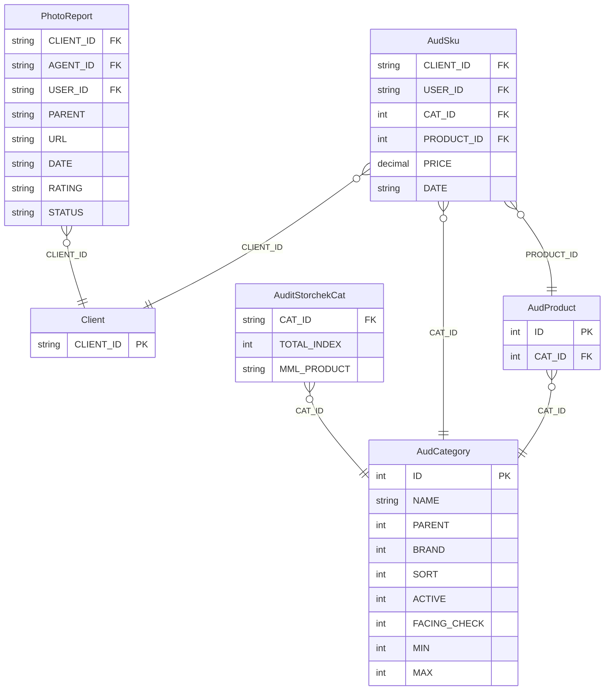
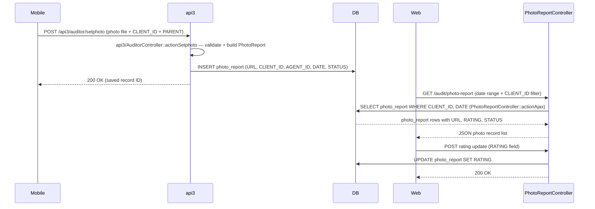
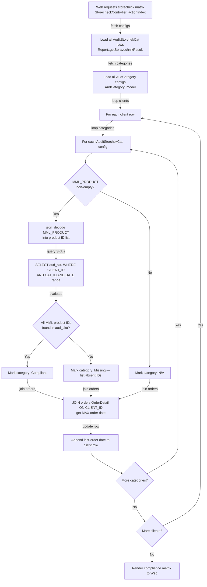

# `audit` va `adt` modullari

Merchandayzing va savdo marketing. Agentlar va maxsus auditorlar mijoz do'konlarida strukturalashtirilgan tekshiruvlarni o'tkazadi.

| Modul | Maqsad |
|--------|---------|
| `audit` | Standart auditlar, so'rovnomalar, foto-hisobotlar, facing |
| `adt` | Kengaytirilgan audit toolkit (sozlanadigan so'rovnomalar, brend / segment) |

## Asosiy xususiyatlar

| Xususiyat | Nima qiladi | Egasi rol(lar) |
|---------|--------------|---------------|
| Audit shaklini belgilash | So'rovnoma yaratish: savollar, variantlar, facing qilinadigan mahsulotlar | 1 / 9 |
| Do'konlar / segmentlarga tayinlash | Auditni ma'lum mijozlarga yo'naltirish | 1 / 9 |
| Auditni o'tkazish (mobil) | Agent so'rovnomaga javob beradi, facingni belgilaydi, foto oladi | Agent |
| Foto-hisobot | Faqat foto auditi (to'liq so'rovnomadan engilroq) | Agent |
| SKU bo'yicha facing | Har bir SKU uchun javon joylashuvini kuzatish | Agent |
| Muvofiqlik bahosi | So'rovnoma javoblaridan do'kon bo'yicha avto-baholash | tizim |
| Nazoratchi ko'rib chiqishi | Dashboard kam-muvofiqlikdagi do'konlarni ko'rsatadi | Nazoratchi / Menejer |
| ADT — xususiyatlar / brendlar / segmentlar | Audit ma'lumotlari bo'yicha ko'p o'lchovli analitika | 1 / 9 |
| ADT — sozlanadigan hisobotlar | Audit ma'lumotlari ustidagi parametrlangan hisobot kutubxonasi | 1 / 9 |

## Audit moduli kontrollerlari

`AuditController`, `AuditorController`, `AuditsController`,
`DashboardController`, `FacingController`, `PhotoReportController`,
`PollController`, `PollResultController`.

## Audit ma'lumotlar modeli

| Entity | Model |
|--------|-------|
| Audit | `Audit` |
| Audit natijasi | `AuditResult` |
| So'rovnoma savoli | `AuditPollQuestion` |
| So'rovnoma varianti | `AuditPollVariant` |
| So'rovnoma natijasi | `AuditPollResult`, `AuditPollResultData` |
| Facing | `AFacing` |
| Foto-hisobot | `PhotoReport` |

## ADT (kengaytirilgan)

`adt` sozlanadigan so'rovnomalarni (`AdtPoll`, `AdtPollQuestion`,
`AdtPollResult`), xususiyat o'lchamlarini (`AdtProperty1`, `AdtProperty2`),
brend va segment guruhlanishini, va parametrlangan hisobotlarni (`AdtReports`) qo'llab-quvvatlaydi.

Mobil ilovaning "audit" yorlig'i bu modellarga proksilanadigan api3 endpointlarini chaqiradi.

## Asosiy xususiyat oqimi — Yuborish

[FigJam · sd-main · Feature Flows](https://www.figma.com/board/MyvyaeEluqvHofH4E2qIoU) ichida **Feature · Audit submission** ga qarang.

```mermaid
flowchart LR
  V(["At client"]) --> Q["Answer poll"]
  Q --> F["Mark facing"]
  F --> P["Photos"]
  P --> SUB["POST /api3/auditor/index"]
  SUB --> AR["AuditResult rows"]
  AR --> RV["Supervisor review"]
  RV --> KPI(["Compliance KPI"])

  classDef action   fill:#dbeafe,stroke:#1e40af,color:#000
  classDef approval fill:#fef3c7,stroke:#92400e,color:#000
  classDef success  fill:#dcfce7,stroke:#166534,color:#000
  classDef reject   fill:#fee2e2,stroke:#991b1b,color:#000
  classDef external fill:#f3f4f6,stroke:#374151,color:#000
  classDef cron     fill:#ede9fe,stroke:#6d28d9,color:#000

  class V,Q,F,P,SUB,AR action
  class RV approval
  class KPI success
```

## Ruxsatlar

| Amal | Rollar |
|--------|-------|
| Auditni sozlash | 1 / 9 |
| Auditni o'tkazish | 4 (agent) / maxsus auditorlar |
| Ko'rib chiqish | 8 / 9 |

## Workflow'lar

### Kirish nuqtalari

| Trigger | Controller / Action / Job | Izohlar |
|---|---|---|
| Web — rejalashtirilgan tashriflar ro'yxati | `AuditController::actionPlannedVisits` | JSON: rejalashtirilgan, lekin hali tugatilmagan tashriflar |
| Web — tashrif buyurilmaganlar ro'yxati | `AuditController::actionNotVisited` | JSON: yozilgan natijasiz rejalashtirilgan tashriflar |
| Web — tashrif tarixi gridi | `AuditController::actionVisits` | JSON: tugatilgan tashrif yozuvlari |
| Web — rad etish sabablari | `AuditController::actionAjaxRejects` | JSON: sabab bilan rad etilgan tashriflar |
| Web — foto-hisobot (zamonaviy) | `AuditController::actionPhotoReport` | JSON: mijoz/agent bo'yicha foto yozuvlari |
| Web — auditor CRUD indeksi | `AuditorController::actionIndex` | Auditor boshqaruv gridini render qiladi |
| Web — auditor yaratish | `AuditorController::actionCreateAjax` | `Auditor` + juftlangan `User` (rol 11) yaratadi |
| Web — auditor yangilash | `AuditorController::actionUpdateAjax` | `Auditor` yozuvini yangilaydi |
| Web — tashrif xulosasi gridi | `AuditsController::actionIndex` | Birlashtirilgan tashrif gridi |
| Web — tashrif tafsiloti | `AuditsController::actionViewDetail` | Yagona tashrif tahlili |
| Web — kunlik dashboard | `DashboardController::actionDaily` | Auditor bo'yicha tashrif sonlari va birlashmalar |
| Web — javon-ulush hisoboti | `FacingController::actionIndex` | Brend/kategoriya bo'yicha javon-ulush % |
| Web — foto-hisobot ko'rinishi | `PhotoReportController::actionIndex` | Zamonaviy foto-hisobot sahifasi |
| Web — foto-hisobot JSON (mijoz/agent bo'yicha) | `PhotoReportController::actionAjax` | JSON: mijoz/agent bo'yicha filtrlangan foto yozuvlari |
| Web — foto-hisobot JSON (foydalanuvchi bo'yicha) | `PhotoReportController::actionAjax2` | JSON: USER_ID bo'yicha filtrlangan foto yozuvlari |
| Web — foto URL ro'yxati | `PhotoReportController::actionAjax3` | JSON: xom foto URL'lari |
| Web — so'rovnoma boshqaruvi | `PollController::actionIndex` | So'rovnoma/savol/variant CRUD |
| Web — so'rovnoma natijalari birlashtirilgan | `PollResultController::actionIndex` | Birlashtirilgan so'rovnoma natijasi gridi |
| Web — so'rovnoma natijasi tafsiloti | `PollResultController::actionDetail` | Har bir savol bo'yicha tahlil |
| Web — narx hisoboti | `PriceController::actionIndex` | Narx min/max/o'rtacha hisoboti |
| Web — narx JSON | `PriceController::actionAjaxPrice` | JSON: mijoz/mahsulot bo'yicha narx ma'lumotlari |
| Web — narx mijoz tafsiloti | `PriceController::actionDetailClients` | Mijoz bo'yicha narx batafsil ko'rinishi |
| Web — sozlamalar konfiguratsiyasi | `SettingsController::actionIndex` | `AudBrands`/`AudCategory`/`AudProduct`/`AudPlaceType` CRUD |
| Web — storecheck matritsasi | `StorecheckController::actionIndex` | Mijoz/kategoriya bo'yicha MML muvofiqlik matritsasi |
| Web — storecheck sozlamalarini saqlash | `StorecheckController::actionSetting` | Kategoriya bo'yicha MML mahsulotlar ro'yxatini `audit_storchek_cat` ga saqlaydi |
| Web — SKU mavjudligi hisoboti | `SkuController::actionIndex` | Mijoz/kategoriya bo'yicha SKU mavjudligi hisoboti |
| Mobil POST | `api3/AuditorController::actionSetphoto` | Mijoz tashrifi davomida yangi `PhotoReport` yozuvini yozadi |

### Soha entitylari

### Workflow 1.1 — Foto-hisobotni qabul qilish va ko'rib chiqish

Mobil auditor `api3` endpointi orqali tashrif davomida mijoz javon holatining fotolarini yuklaydi; web ko'rib chiquvchi keyinchalik foto-hisobot gridini yuklaydi va har bir fotoni baholaydi. Audit modulining web kontrollerlari faqat o'qish tomonida — ular hech qachon `photo_report` ga to'g'ridan-to'g'ri yozmaydi.

### Workflow 1.2 — Storecheck (MML) muvofiqlik tekshiruvi

Admin `StorecheckController::actionSetting` orqali kategoriya bo'yicha minimal must-have mahsulotlar ro'yxatini (MML) sozlaydi, bu ro'yxat `audit_storchek_cat.MML_PRODUCT` da JSON massiv sifatida saqlanadi. Storecheck hisoboti yuklanganda, `StorecheckController::actionIndex` har bir mijozni har bir kategoriyaning MML'iga nisbatan baholaydi va muvofiqlik natijasi yonida oxirgi-buyurtma sanasini ko'rsatish uchun `orders.OrderDetail` ni birlashtiradi.

### Modullar aro tutash nuqtalari

- O'qiydi: `clients.Client` (foto-hisobot, SKU va facing so'rovlarida CLIENT_ID qidiruvi), `agents.Agent` / `staff.User` (auditor identifikatori uchun USER_ID va AGENT_ID birlashishlar), `orders.OrderDetail` (`StorecheckController::actionIndex` da oxirgi-buyurtma sanasi JOIN).
- Yozadi: `photo_report` `api3/AuditorController::actionSetphoto` dan. Audit modulining o'z kontrollerlaridan yozish YO'Q — audit moduli ma'lumotlar jadvallari ustida faqat o'qish; faqat `SettingsController` `AudBrands`/`AudCategory`/`AudProduct`/`AudPlaceType` ga yozadi, va `StorecheckController::actionSetting` `audit_storchek_cat` ga yozadi.
- API'lar: `POST /api3/auditor/setphoto` → `photo_report` insert. (`api3/AuditorController` dagi `actionAudit`, `actionAuditResult` va `actionPollResult` endpointlari `adt` modulining ma'lumot oqimiga tegishli — bu yerda qamrovdan tashqari.)

### Tuzoqlar

- Audit modulining web hisobotlari `aud_sku`, `aud_facing` va `poll_result` ni o'qiydi, lekin zamonaviy mobil (`api3`) yozish yo'li `AdtAuditResult` / `AdtPollResult` (`adt` modulida) ga yozadi. `aud_sku` / `aud_facing` ning haqiqiy yozuvchisi **api3 AuditorController emas** — to'liq end-to-end pipelinega ishonishdan oldin tekshiring.
- `AuditStorchekCat.MML_PRODUCT` mahsulot ID'larining JSON massivi sifatida saqlanadi (varchar/text ustun). U `StorecheckController::actionIndex` da `json_decode` orqali inline dekodlanadi — tipiklangan accessor orqali emas. Bu yerdagi sxema o'zgarishlari muvofiqlik hisobotini jim ravishda buzadi.
- `Auditor` qatorlari rol 11 ning `User` qatori bilan 1:1 juftlanadi (`AuditorController::actionCreateAjax` da yaratiladi). Faqat `Auditor` yozuvini, juftlangan `User` ni o'chirmasdan, deaktiv qilish eski loginni qoldiradi.
- Bu modulga hech qanday fonda ishlovchi joblar tegmaydi — barcha ma'lumotlar so'rovga asoslangan.
