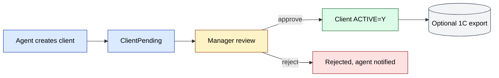
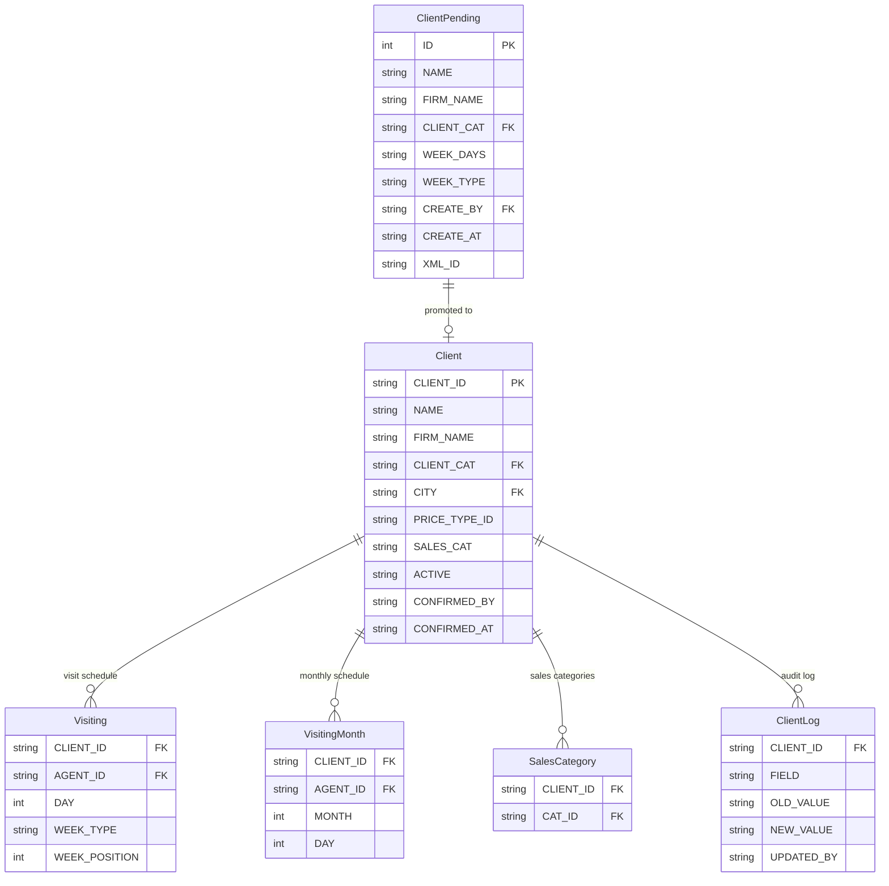
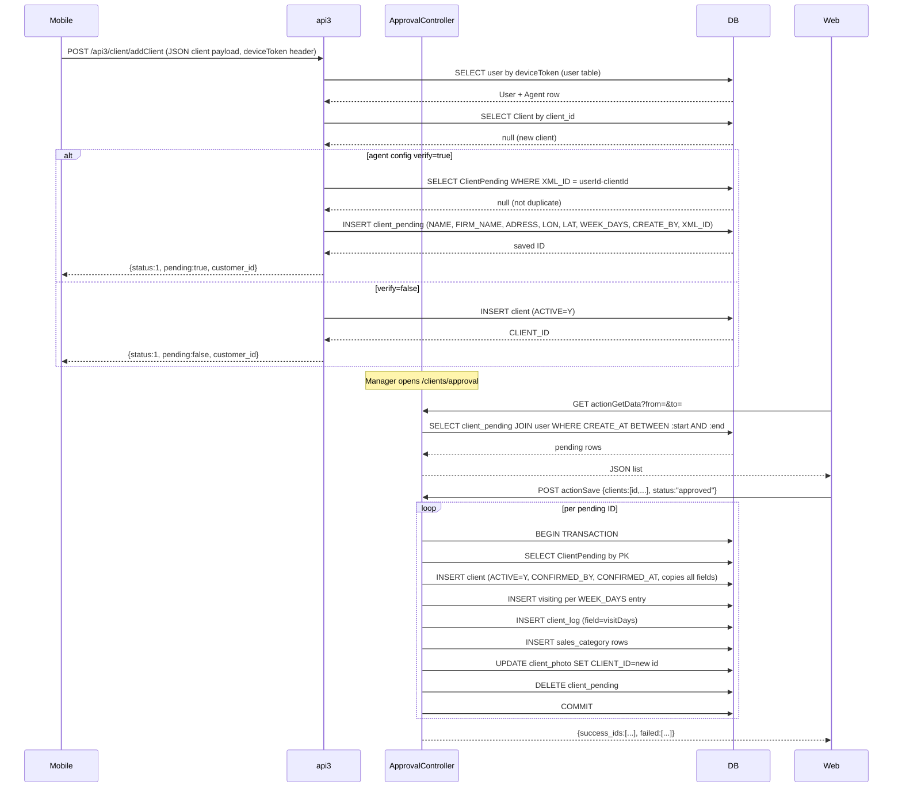
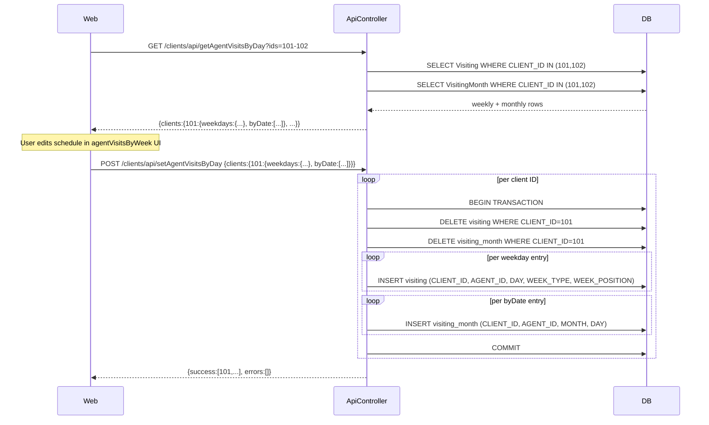
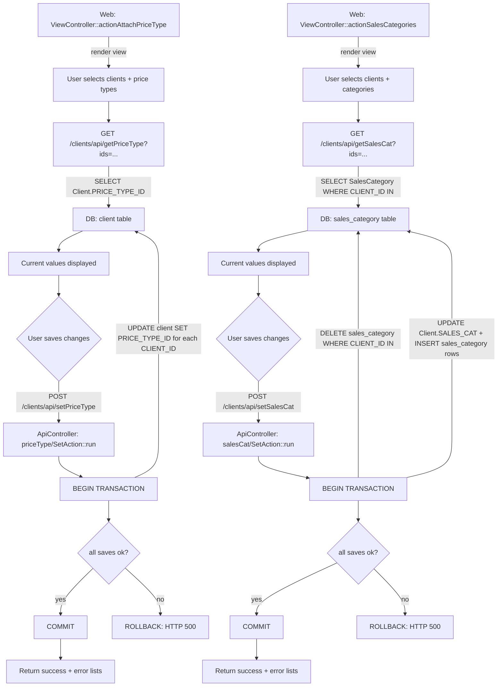

# `clients` moduli

sd-main da **mijozlar bazasi** ni boshqaradi: B2B do'konlari, chakana sotuvchilar, HoReCa, shuningdek qo'shimcha soha obyektlari — shartnomalar, segmentlar, qarz, geo joylashuv va marshrut a'zoligi.

## Asosiy xususiyatlar

| Xususiyat | Nima qiladi | Egasi rol(lar) |
|---------|--------------|---------------|
| Mijoz CRUD | Mijoz yozuvlarini yaratish / tahrirlash / arxivlash | 1 / 2 / 5 / 9 |
| Dalada yaratilgan mijozlar (mobil) | Agent tashrif vaqtida yangi mijoz yuboradi; yozuv *Pending* ga tushadi | 4 |
| Mijozni tasdiqlash | Menejer kutilayotgan yozuvlarni ko'rib chiqadi; tasdiqlash / tahrirlash / rad etish | 1 / 2 / 9 |
| Kategoriyalar va segmentlar | Mijozlarni savdo segmenti bo'yicha tartiblash; narx turi va chegirmaga ta'sir qiladi | 1 / 9 |
| Shartnomalar | Mijoz bo'yicha ixtiyoriy tijoriy shartnomalar (shartlar, to'lov kunlari) | 1 / 9 |
| Geo koordinatalari | Har bir mijozda `LAT` / `LNG`; `gps` tomonidan geofencing uchun ishlatiladi | 1 / 4 |
| Marshrut a'zoligi | Mijozlar agentlarga tayinlangan marshrutlarga guruhlanadi | 8 / 9 |
| Qarz tasviri | Hisobotlarda ko'rsatiladigan hisoblangan qarzlar yoshi | 6 / 9 |
| Paket import | Migratsiya uchun CSV / Excel import | 1 |
| 1C / Faktura.uz round-trip | Tashqi EDI uchun `XML_ID` + `INN` | tizim |

## Papka

```
protected/modules/clients/
├── controllers/
│   ├── ClientController.php
│   ├── ApiController.php
│   ├── ApprovalController.php
│   ├── AgentRouteController.php
│   ├── ComputationController.php
│   └── …
└── views/
```

## Asosiy entitylar

| Entity | Model | Izohlar |
|--------|-------|-------|
| Mijoz | `Client` | Aktiv do'konlar/mijozlar |
| Kutilayotgan mijoz | `ClientPending` | Dalada yaratilgan, tasdiqlash kutilmoqda |
| Mijoz kategoriyasi | `ClientCategory` | Narxlash darajasi / segmentatsiya |
| Shartnoma | `ContractClient` | Tijoriy shartnoma |
| Marshrut | `Route`, `RouteClient` | Agent marshrutlari |
| Qarz tasviri | `ClientDebt` | Hisoblangan yoshi |

## Tasdiqlash workflow'i

[FigJam · sd-main · Feature Flows](https://www.figma.com/board/MyvyaeEluqvHofH4E2qIoU) ichida **Feature · Client Approval** ga qarang.



## API

| Endpoint | Maqsad |
|----------|---------|
| `GET /api3/client/list` | Marshrut mijozlarini mobilga sinxronlash |
| `POST /api3/client/create` | Dalada yaratilgan mijozlar (kutilayotgan) |
| `GET /api4/client/list` | B2B portal ro'yxati |

## Ruxsatlar

| Amal | Rollar |
|--------|-------|
| Yaratish | 1 / 2 / 4 (faqat kutilayotgan) / 5 |
| Tasdiqlash | 1 / 2 / 9 |
| Tahrirlash | 1 / 2 / 5 / 9 |
| Arxivlash | 1 / 2 |

## Shuningdek qarang

- [`agents`](./agents.md) (marshrut tayinlash)
- [`gps`](./gps.md) (geofencing)
- [`orders`](./orders.md) (mijozlar — xaridorlar)

## Workflow'lar

### Kirish nuqtalari

| Trigger | Controller / Action / Job | Izohlar |
|---|---|---|
| Web | `ApprovalController::actionIndex` | Menejer kutilayotgan mijozni ko'rib chiqish ro'yxatini ochadi |
| Web | `ApprovalController::actionGetData` | Sana oralig'i uchun `client_pending` qatorlarini oladi |
| Web | `ApprovalController::actionSave` | Kutilayotgan mijozlarni paket bilan tasdiqlaydi, `Client` yozuvlarini yaratadi |
| Web | `ApprovalController::actionDelete` | Kutilayotgan mijozlarni rad etadi (o'chiradi) |
| Web | `ViewController::actionAgentVisitsByWeek` | Agentni biriktirish / uzish jadvali UI |
| Web | `ViewController::actionAttachPriceType` | Mijozlarga narx turini tayinlash UI |
| Web | `ViewController::actionSalesCategories` | Savdo kategoriyasini tayinlash UI |
| Web API | `ApiController::getAgentVisitsByDay` | Tanlangan mijozlar uchun `Visiting` + `VisitingMonth` ni o'qiydi |
| Web API | `ApiController::setAgentVisitsByDay` | Tranzaksiyada `Visiting` + `VisitingMonth` yozuvlarini almashtiradi |
| Web API | `ApiController::getPriceType` | Tanlangan mijozlar uchun `Client.PRICE_TYPE_ID` ni o'qiydi |
| Web API | `ApiController::setPriceType` | Tanlangan mijozlar uchun `Client.PRICE_TYPE_ID` ni yozadi |
| Web API | `ApiController::getSalesCat` | Tanlangan mijozlar uchun `SalesCategory` qatorlarini o'qiydi |
| Web API | `ApiController::setSalesCat` | Tanlangan mijozlar uchun `SalesCategory` qatorlarini almashtiradi |
| Mobil (`api3`) | `api3/ClientController::actionAddClient` | Agent yangi mijoz yuboradi; `verify=true` bo'lganda `ClientPending` sifatida saqlanadi |
| Mobil (`api3`) | `api3/ClientController::actionPending` | Agent o'z kutilayotgan yuborishlarini so'raydi |

### Soha entitylari



### Workflow 1.1 — Dalada yaratilgan mijoz tasdiqlash kutmoqda

Agent mobilda yangi mijoz yaratadi. Agar distribyutor konfiguratsiyasida `client.verify = true` bo'lsa, yozuv menejer web back-office dan tasdiqlamaguncha yoki rad etmaguncha `ClientPending` da ushlab turiladi.



### Workflow 1.2 — Agent tashrif jadvali biriktirish / uzish

Menejer agent-mijoz tashrif slotlarini tayinlaydi yoki olib tashlaydi (haftalik hafta kuni bo'yicha yoki oylik sana bo'yicha). Operatsiya to'liq almashtirish: mijoz uchun mavjud `Visiting` va `VisitingMonth` qatorlari tranzaksiya ichida o'chiriladi va keyin qayta-qo'shiladi.



### Workflow 1.3 — Narx turi va savdo kategoriyasini tayinlash

Menejer bir yoki bir nechta mijozga narx turlari yoki savdo kategoriyalarini paket bilan tayinlaydi. Ikkala operatsiya `ApiController` action'lari orqali bir xil shaklda ishlaydi: joriy qiymatlarni olish, UI da tahrirlash, so'ngra bitta tranzaksion yozish bilan saqlash.



### Modullar aro tutash nuqtalari

- O'qiydi: `agents.Agent` (tasdiqlashda User dan AGENT_ID ni olish; tashrif jadvalini agent bo'yicha filtrlash)
- O'qiydi: `agents.Visiting` / `VisitingMonth` (`AgentRouteController::actionGetClients` da jadvalni ko'rsatish)
- Yozadi: `agents.Visiting` / `VisitingMonth` (har bir `setAgentVisitsByDay` chaqiruvida almashtiriladi)
- Yozadi: `clients.SalesCategory` (har bir `setSalesCat` chaqiruvida almashtiriladi; tasdiqlash vaqtida ham yoziladi)
- Yozadi: `clients.ClientLog` (`ApprovalController::actionSave` davomida `visitDays` maydoni uchun audit yozuvi)
- API'lar: `api3/client/addClient` (mobil mijoz yaratish → `ClientPending`)
- API'lar: `api3/client/pending` (mobil agent o'z kutilayotgan yuborishlarini so'raydi)
- API'lar: `api4/client/sales-category-list` (B2B portal savdo kategoriyalarini o'qiydi)

### Tuzoqlar

- `ApprovalController::actionSave` `ClientPending` dan `Client` ga maydon qiymatlarini qattiq kodlangan atribut ro'yxatidan foydalanib nusxalaydi. Kelajakda qo'shilgan har qanday yangi `ClientPending` ustuni bu metoddagi `$attributes` massiviga ham qo'shilishi kerak, aks holda u tasdiqlashda jim tushib qoladi.
- `agentVisitsByDay/SetAction` to'liq o'chirib qayta-kiritish qiladi. Mijoz uchun bo'sh `weekdays` va bo'sh `byDate` bilan chaqirish hech qanday tasdiqlash so'ramasdan barcha tashrif tayinlovlarini olib tashlaydi.
- `Client.PRICE_TYPE_ID` va `Client.SALES_CAT` normallashtirilgan `sales_category` jadvaliga qo'shimcha `client` qatorida vergul bilan ajratilgan satrlar sifatida saqlanadi. Agar `sales_category` jadvali `Client.SALES_CAT` ni yangilamasdan yozilsa, ikkalasi sinxrondan chiqishi mumkin. `salesCat/SetAction` ikkalasini ham yangilaydi; to'g'ridan-to'g'ri DB tahrirlari yangilamasligi mumkin.
- `api3/ClientController::actionAddClient` yo'li `$_REQUEST['u'] === 'merch'` asosida ikki kod versiyasiga (`addClientVersion1` / `addClientVersion2`) bo'linadi. Faqat 1-versiya `ClientPending` ga yozadi; merch varianti (`addClientVersion2`) o'z oqimiga ega.
- `ApprovalController::actionDelete` `operation.clients.approval.delete` ruxsatini talab qiladi, bu tasdiqlash ruxsatidan (`operation.clients.approval`) farq qiladi. Tasdiqlash ruxsatiga ega bo'lib, o'chirishga ega bo'lmagan noto'g'ri sozlangan rollar yozuvlarni rad eta olmaydi.
