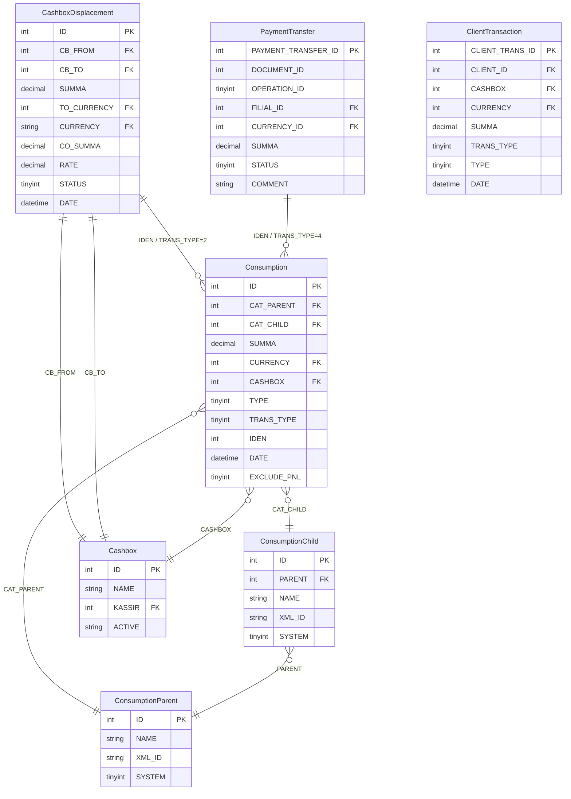
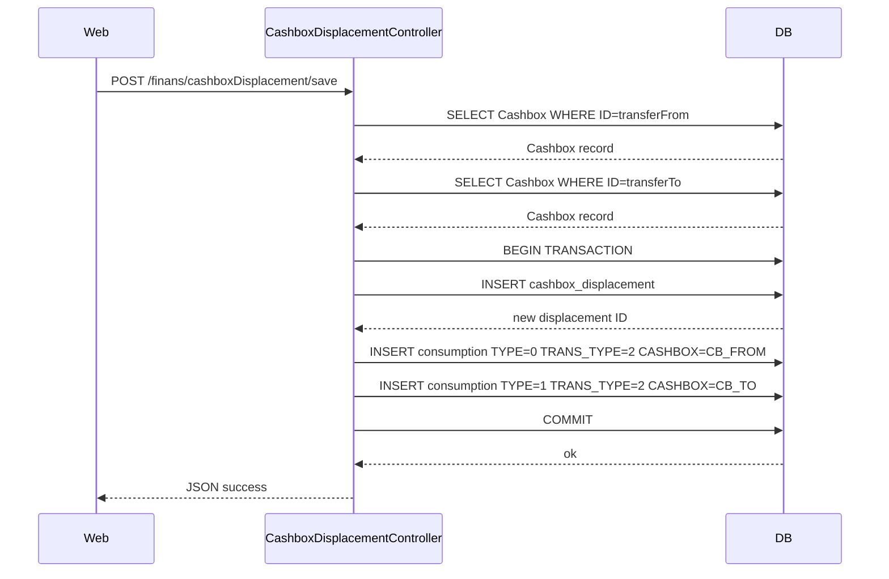
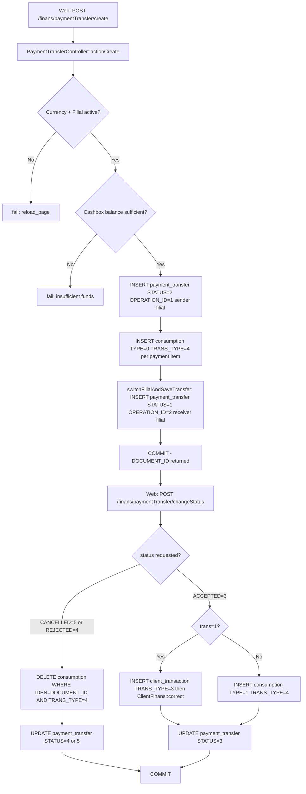
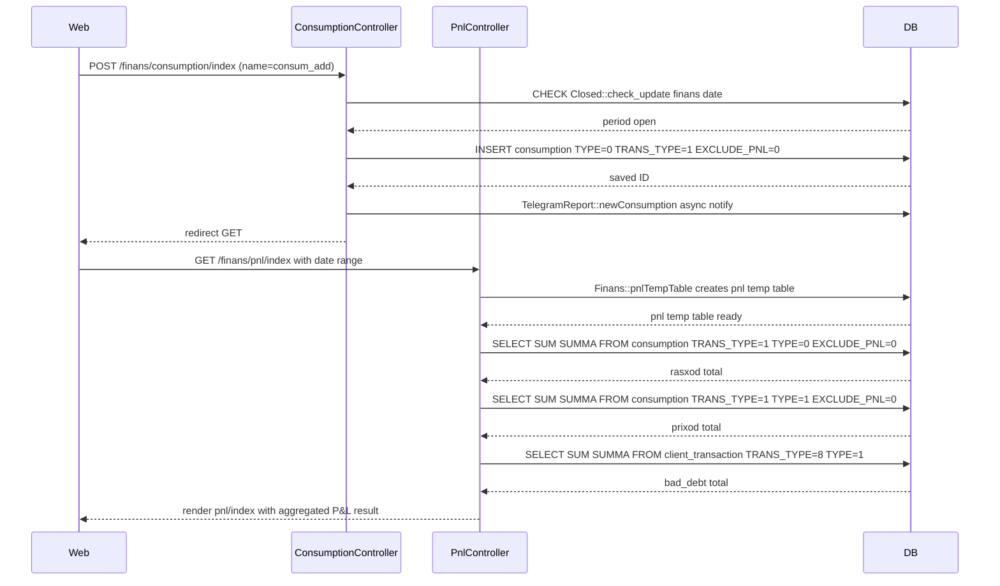

# `finans` moduli

sd-main uchun moliyaviy buxgalteriya qatlami. Biznesning pul tomonini birlashtiradi: P&L, agent P&L, kassa harakatlari, xarajatlar.

## Asosiy xususiyatlar

| Xususiyat | Nima qiladi | Egasi rol(lar) |
|---------|--------------|---------------|
| Davr bo'yicha P&L | Davr bo'yicha daromad / xarajat / marja | 1 / 9 / Moliya |
| Pivot P&L | Slice-and-dice P&L | 1 / 9 / Moliya |
| Agent P&L | Agent bo'yicha foydalilik | 1 / 8 / 9 |
| Kassa siljishi | Kassalar o'rtasida pulni ko'chirish (masalan, agent → asosiy) | 6 / Moliya |
| To'lovni ko'chirish | To'lovni boshqa kassa / buyurtmaga qayta tayinlash | 1 / 6 |
| Sarf / xarajatni kuzatish | Byudjetga nisbatan operatsion xarajatlar | 1 / Moliya |

## Papka

```
protected/modules/finans/
└── controllers/
    ├── PnlController.php
    ├── PivotPnlController.php
    ├── AgentPnlController.php
    ├── CashboxDisplacementController.php
    ├── PaymentTransferController.php
    └── ConsumptionController.php
```

## Shuningdek qarang

- [`pay`](./payment.md) — to'lovni qayd etish
- [`payment`](./payment.md) — to'lovni tasdiqlash workflow'i

## Workflow'lar

### Kirish nuqtalari

| Trigger | Controller / Action / Job | Izohlar |
|---|---|---|
| Web — agent P&L gridi | `AgentPnlController::actionIndex` | Agent bo'yicha P&L ko'rinishi, filial-bo'ylab PnL'dan ajratilgan |
| Web | `CashboxDisplacementController::actionIndex` | Kassa-siljish ro'yxati ko'rinishini render qiladi |
| Web (GET) | `CashboxDisplacementController::actionGetDisplacement` | Filtrlangan siljish yozuvlarini JSON sifatida qaytaradi |
| Web (POST) | `CashboxDisplacementController::actionSave` | Yangi kassa siljishi + juftlangan Consumption qatorlarini yaratadi |
| Web (GET) | `CashboxDisplacementController::actionCancelDisplacement` | `STATUS=2` ni belgilaydi, juftlangan Consumption qatorlarini o'chiradi |
| Web (POST) | `PaymentTransferController::actionCreate` | Filiallar aro to'lov o'tkazmasi hujjati + debet Consumption yaratadi |
| Web (POST) | `PaymentTransferController::actionChangeStatus` | PaymentTransfer statusini oldinga suradi; ACCEPTED bo'lganda ClientTransaction yoki Consumption yozadi |
| Web — pivot P&L gridi | `PivotPnlController::actionIndex` | Cross-tab P&L pivot ko'rinishi |
| Web (POST) | `ConsumptionController::actionIndex` (POST tarmog'i) | Consumption xarajat qatorini qo'shadi, tahrirlaydi yoki o'chiradi |
| Web (POST) | `ConsumptionController::actionCredit` (POST tarmog'i) | Kredit (daromad) Consumption qatorini qo'shadi, tahrirlaydi yoki o'chiradi |
| Web | `PnlController::actionIndex` | `Finans::pnlTempTable` orqali `pnl` vaqtinchalik jadvalini quradi, P&L ko'rinishiga birlashtiradi |

---

### Soha entitylari



---

### Workflow 1.1 — Kassa siljishi (kassalar o'rtasida ichki ko'chirish)

Kassir yoki moliya menejeri bir filial ichida bir kassadan boshqasiga mablag'larni ko'chiradi. Kontroller `cashbox_displacement` yozuvini va ikkita juftlangan `consumption` qatorini yozadi — manba kassadan debet (TYPE=0) va manzil kassaga kredit (TYPE=1) — bularning hammasi bitta DB tranzaksiyasida. Bekor qilish ikkala consumption qatorini o'chiradi va siljishni STATUS=2 deb belgilaydi.



---

### Workflow 1.2 — Filiallar aro to'lov o'tkazmasi (yuborish → qabul qilish hayot davri)

Yuboruvchi filial boshqa filialga to'lov o'tkazmasini boshlaydi. Hujjat statuslar bo'ylab harakatlanadi (PENDING=2 → ACCEPTED=3 yoki REJECTED=4 / CANCELLED=5). Yaratishda yuboruvchining kassa balansi `consumption` (TRANS_TYPE=4, TYPE=0) orqali debet qilinadi. Qabul qiluvchi tomonidan qabul qilinganda mablag'lar `ClientTransaction` (TRANS_TYPE=3, agar `trans=1` bo'lsa) yoki `consumption` (TYPE=1, TRANS_TYPE=4) sifatida kredit qilinadi. Rad etish yoki bekor qilish debet consumption qatorlarini o'chiradi.



---

### Workflow 1.3 — Xarajat / daromad qaydi va P&L ga kiritish

Moliya xodimlari operatsion xarajatlarni (TYPE=0) yoki kassa daromadini (TYPE=1) `ConsumptionController` orqali to'g'ridan-to'g'ri qayd etadi. Har bir qator fond (`ConsumptionParent`) va kategoriya (`ConsumptionChild`) bilan teglanadi. `PnlController::actionIndex` `Finans::pnlTempTable` savdo ma'lumotlaridan `pnl` vaqtinchalik jadvalini to'ldirgandan keyin operatsion xarajatlar va boshqa daromadlarni P&L jamilariga qo'shish uchun `consumption` ni WHERE `TRANS_TYPE=1 AND EXCLUDE_PNL=0` ni o'qiydi.



---

### Modullar aro tutash nuqtalari

- O'qiydi: `pay.ClientTransaction` (TRANS_TYPE IN(3,4,5) — `CashboxDisplacementController::getCashboxBalance` va `PaymentTransferController::getCashboxBalance` da kassa balansini hisoblash uchun ishlatiladi)
- Yozadi: `pay.ClientTransaction` (`PaymentTransferController::savePaymentAsTransaction` orqali to'lov o'tkazmasi `trans=1` bayrog'i bilan qabul qilinganda INSERT TRANS_TYPE=3, TYPE=1)
- Yozadi: `pay.ClientFinans` (o'tkazma qabul qilingach ClientTransaction yozilgandan keyin `ClientFinans::correct` chaqiriladi)
- O'qiydi: `settings.Closed` (`ConsumptionController` da har qanday xarajat yozuvidan oldin `Closed::model()->check_update('finans', date)` orqali davr-qulfi tekshiruvi)
- O'qiydi: `warehouse.LotDistribution` / `orders.Order` (`ServerSettings::enableLotManagement()` true bo'lganda `Finans::pnlTempTable` tomonidan ishlatiladi)

---

### Tuzoqlar

- `CashboxDisplacement` va `PaymentTransfer` ikkalasi ham `BaseFilial` ni kengaytiradi, shuning uchun ularning jadval nomlari runtimeda filial-prefiksli. `PaymentTransferController::actionChangeStatus` dagi filiallar aro so'rovlar qabul qiluvchining `payment_transfer` jadvalini so'rashdan oldin `BaseFilial::setFilial($prefix)` orqali aktiv filial kontekstini almashtiradi — qaytib o'zgartirmaslik sessiya filial kontekstini buzishi mumkin.
- `Consumption.TRANS_TYPE` P&L uchun load-bearing: faqat `TRANS_TYPE=1` qatorlari `PnlController` ga oqadi. Siljish (`TRANS_TYPE=2`) va to'lov-o'tkazma (`TRANS_TYPE=4`) tomonidan yozilgan qatorlar P&L birlashtirishidan jim ravishda chiqarib tashlanadi.
- `Consumption.EXCLUDE_PNL=1` qo'lda override bo'lib, `TRANS_TYPE=1` bo'lsa ham qatorni P&L'dan olib tashlaydi. U `ConsumptionController` da add va edit yo'llarining ikkalasida ham belgilanishi mumkin.
- `PaymentTransferController::actionChangeStatus` bir xil HTTP so'rovida ham yuboruvchi, ham qabul qiluvchi filial DB kontekstlariga yozadi. DB tranzaksiyasi (`$safeTrans`) faqat joriy filial ulanishini qamrab oladi; `switchFilialAndSaveTransfer` dagi remote-filial insert tranzaksiyadan tashqarida va muvaffaqiyatsizlikda rollback qilinmaydi.
- `ConsumptionController::actionCredit` (kassa daromadi, TYPE=1) `TelegramReport::newConsumption` ni **chaqirmaydi**; faqat xarajat yozuvlari (`actionIndex` da TYPE=0) Telegram bildirishnomasini ishga tushiradi.
- P&L hisoblash `ServerSettings::enableLotManagement()` orqali bloklangan ikki kod yo'liga ega. Yoqilganda, `Finans::pnlTempTable` `LotDistribution` asosidagi SQL'ni ishlatadi; o'chirilganda, eski `Finans::pnlSql` ga qaytadi. Ikkalasi ham bir xil `pnl` vaqtinchalik jadvalini to'ldiradi, ammo bir xil ma'lumotlarda **turli P&L raqamlarini** ishlab chiqaradi. Tarixiy taqqoslashlarga ishonishdan oldin maqsadli instans qaysi rejimda ishlayotganini tekshiring.
- `PaymentTransferController::actionChangeStatus` `allowedStatus` ni ikki marta ishlatadi — birini yuboruvchining filial kontekstida (~229–231 qatorlar), birini `BaseFilial::setFilial` dan keyin qabul qiluvchining filialida (~293–297 qatorlar). STATUS yangilanishi va orasidagi Consumption o'chirishlari (~237–247 qatorlar) ikkinchi himoyadan **oldin** bajariladi, shuning uchun qabul qiluvchi tomonidagi tekshiruv muvaffaqiyatsiz bo'lsa, qisman mutatsiya qolishi mumkin. Ikki yarmini atomik bo'lmagan deb hisoblang.
