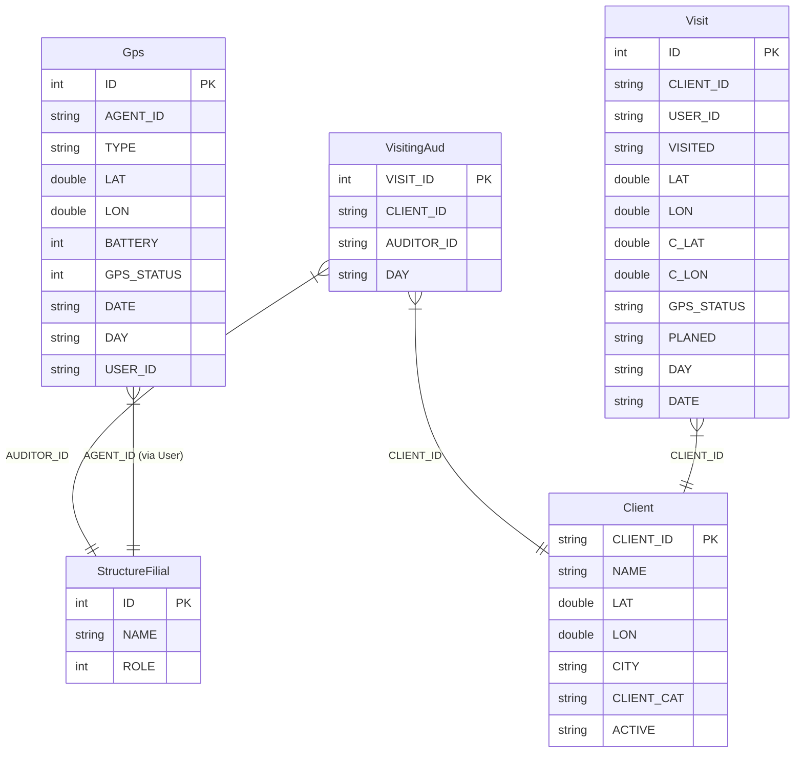
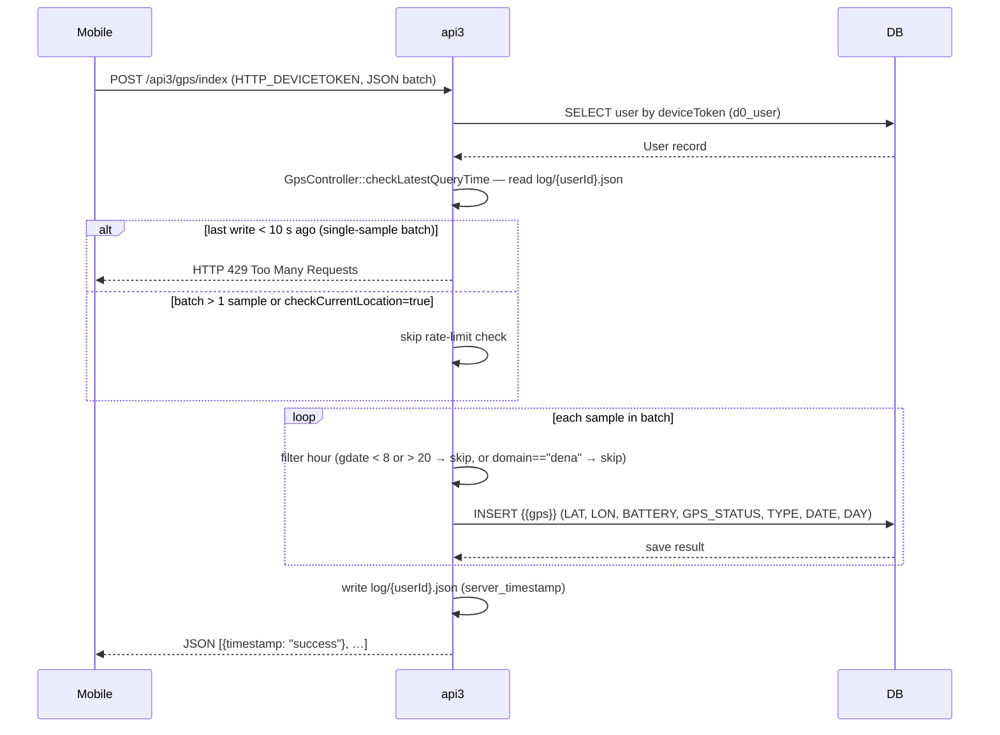
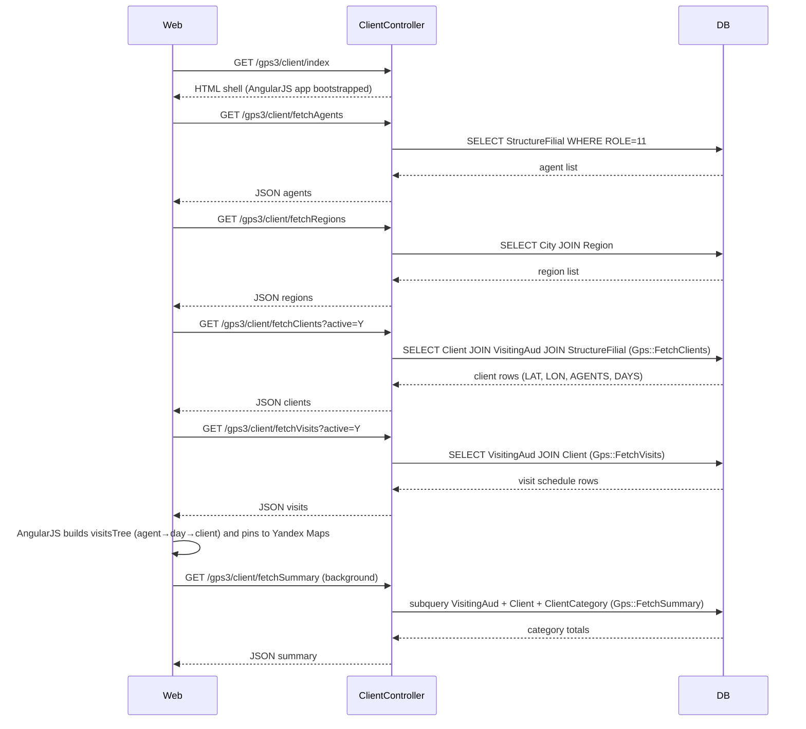
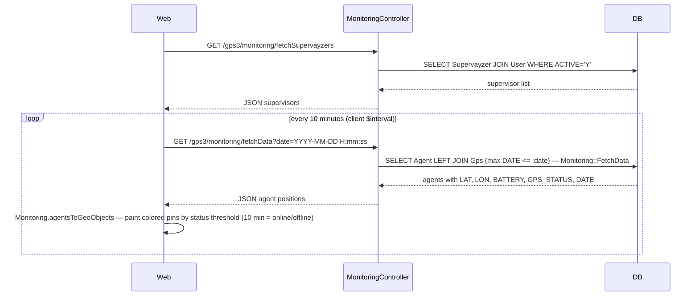
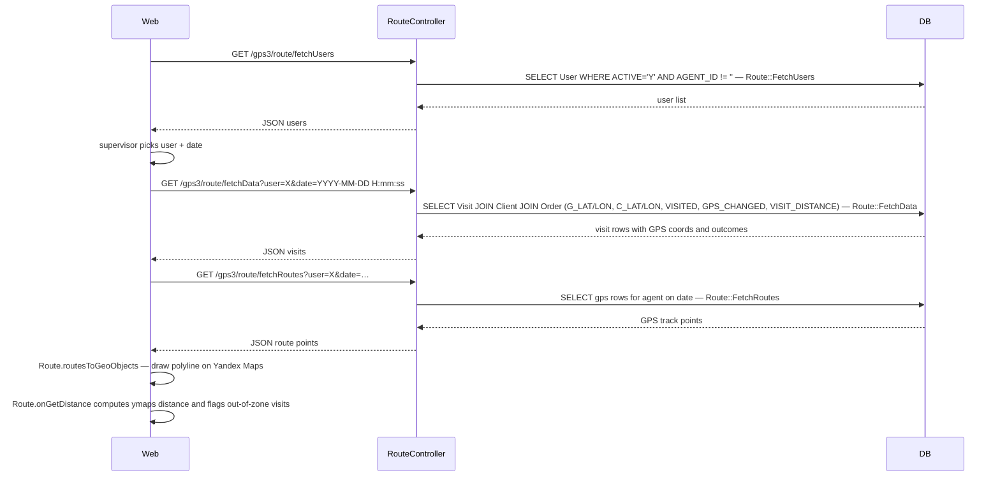

# `gps`, `gps2`, `gps3` modullari

GPS kuzatuv. Uch avlod mavjud; yangi rivojlanish eng so'nggisini (`gps3`) maqsad qilishi kerak.

| Modul | Holati | Izohlar |
|--------|--------|-------|
| `gps` | Texnik xizmat | Birinchi avlod; eski mijozlar tomonidan ishlatiladi |
| `gps2` | Muzlatilgan | Eski |
| `gps3` | **Joriy** | Yangi xususiyatlar bu yerga kiradi |

## Asosiy xususiyatlar

| Xususiyat | Nima qiladi | Egasi rol(lar) |
|---------|--------------|---------------|
| Jonli monitoring | Filialdagi barcha agentlarning real vaqtda xaritasi | 8 / 9 |
| Sayohat takrorlash | Agentning kunini xaritada qayta ijro etish | 8 / 9 |
| Tashrif bo'yicha geofence | Agentning check-in mijozning radiusi ichida ekanligini tasdiqlash | tizim |
| Mobildan GPS qabul qilish | Mobil ilova har ~30 soniyada namunalarni post qiladi | tizim |
| Tashqi provayderdan qabul qilish | Umumiy JSON / Wialon-uslubidagi endpointlar | tizim |
| Zonadan tashqari bayrog'i | Radiusdan tashqaridagi tashriflar ko'rib chiqish uchun belgilanadi | 8 / 9 |
| KPI: GPS qoplami | Reja tashriflarining necha % da haqiqiy GPS check-in bo'lgan | 8 / 9 |

## Imkoniyatlar

- Xaritada jonli agent kuzatuvi (`MonitoringController`)
- Tashrif bo'yicha geofence tasdiqlash (`OrdersGpsController`)
- Sayohat takrorlash (`TrackingController`)
- Mobil mijozlardan fonda qabul qilish (`BackendController`,
  `GetController`)
- Nazoratchilar uchun dashboard (`FrontendController`)

## Angular moduli

`ng-modules/gps/` da zamonaviy xarita UI joylashgan — Yii ko'rinishiga yuklangan mustaqil Angular moduli. Uni alohida quring va `dist/` ni `ng-modules/gps/` ga nusxa qiling.

## Asosiy xususiyat oqimi — Tashrif va GPS

[FigJam · sd-main · Feature Flows](https://www.figma.com/board/MyvyaeEluqvHofH4E2qIoU) ichida **Feature · Visit & GPS geofence** ga qarang.

## Workflow'lar

### Kirish nuqtalari

| Trigger | Controller / Action / Job | Izohlar |
|---|---|---|
| Mobil HTTP POST `POST /api3/gps/index` | `GpsController::actionIndex` | Mobil ilovadan GPS namunalari paketi; `HTTP_DEVICETOKEN` sarlavhasi orqali autentifikatsiya |
| Mobil HTTP POST `POST /api3/gps/offline` | `GpsController::actionOffline` | Offline-bufer drenaj endpointi (stub — DB yozish hali yo'q) |
| Web sahifa yuklash `GET /gps3/client/index` | `ClientController::actionIndex` | AngularJS "Xaritadagi mijozlar" SPA shellini render qiladi |
| Web AJAX `GET /gps3/client/fetchClients` | `ClientController::actionFetchClients` | Yandex Maps pinlari uchun LAT/LON bilan mijozlar JSON ro'yxati |
| Web AJAX `GET /gps3/client/fetchVisits` | `ClientController::actionFetchVisits` | Yon panel daraxti uchun agent × hafta kuni tashrif jadvali |
| Web AJAX `GET /gps3/client/fetchSummary` | `ClientController::actionFetchSummary` | Statistika paneli uchun kategoriya bo'yicha tashrif jamilari |
| Web AJAX `GET /gps3/client/fetchAgents` | `ClientController::actionFetchAgents` | Merchandayzerlarning ochiluvchi ro'yxati (ROLE = 11) |
| Web AJAX `GET /gps3/client/fetchRegions` | `ClientController::actionFetchRegions` | Shaharlar/regionlar ochiluvchi ro'yxati |
| Web AJAX `GET /gps3/client/fetchCategories` | `ClientController::actionFetchCategories` | Mijoz kategoriyalari ochiluvchi ro'yxati |
| Web bosma `GET /gps3/client/print` | `ClientController::actionPrint` | Koordinatlari bor mijozlarning bosma ro'yxati |
| Web AJAX `GET /gps3/monitoring/fetchData` | `MonitoringController::actionFetchData` (gps2) | Jonli xarita uchun agent oxirgi-ma'lum pozitsiyalari; kontroller `gps2` modulida joylashgan |
| Web AJAX `GET /gps3/monitoring/fetchSupervayzers` | `MonitoringController::actionFetchSupervayzers` (gps2) | Monitoring ko'rinishi uchun nazoratchi filtri ro'yxati |
| Web AJAX `GET /gps3/route/fetchData` | `RouteController::actionFetchData` (gps2) | Sayohat takrorlash xaritasi uchun GPS koordinatalari bilan agent tashriflari ro'yxati |
| Web AJAX `GET /gps3/route/fetchRoutes` | `RouteController::actionFetchRoutes` (gps2) | Marshrut polyline uchun tartiblangan GPS yo'l |
| Web AJAX `GET /gps3/route/fetchReport` | `RouteController::actionFetchReport` (gps2) | Kunlik tashrif xulosasi jadvali |
| Web AJAX `GET /gps3/route/fetchUsers` | `RouteController::actionFetchUsers` (gps2) | Marshrut ko'rinishi uchun foydalanuvchi tanlash |
| Angular UI | `ng-modules/gps/` AngularJS ilovasi (kontrollerlar: `Client`, `Monitoring`, `Route`) | Aktiv brauzer tomondagi UI; `Gps3Module::registerAssets` da asset registratsiyasi orqali Yii ko'rinishi shelliga yuklanadi |

---

### Soha entitylari

---

### Workflow 1.1 — Mobil GPS namunasini qabul qilish

Mobil ilova GPS namunalarining JSON paketini `api3/gps/index` ga post qiladi. Har bir namuna qurilma tokeni bilan autentifikatsiya qilinadi, har 10 soniyada bitta yozish bilan stavka cheklanadi va faqat ish soatlarida (08:00–20:00) `{{gps}}` ga saqlanadi.

---

### Workflow 1.2 — Mijozlar xaritasini yuklash va filtrlash

Nazoratchi `/gps3/client/index` ni ochganda, AngularJS `Client` kontrolleri ma'lumotnoma ma'lumotlarini va keyin to'liq mijoz + tashrif jadvalini olish bilan bootstrap qiladi; keyingi filtr o'zgarishlari faqat ta'sirlangan endpointlarni qayta so'raydi.

---

### Workflow 1.3 — Jonli agent monitoringi

Nazoratchi monitoring yorlig'ini ochadi; AngularJS `Monitoring` kontrolleri agentning oxirgi-ma'lum pozitsiyalarini `gps2` ning `MonitoringController` orqali so'raydi, so'ng xaritani jonli saqlash uchun 10-daqiqalik intervalda timestamp'ni avtomatik oldinga suradi.

---

### Workflow 1.4 — Sayohat takrorlash (marshrut ko'rinishi)

Nazoratchi agent va sanani tanlaydi; AngularJS `Route` kontrolleri barcha tashrif checkpointlari va GPS yo'l polyline'ini yuklaydi, shuning uchun nazoratchi agentning kunini qayta-ijro qilishi, geofence masofalarini tasdiqlashi va buyurtma/rad etish natijalarini ko'rib chiqishi mumkin.

---

### Modullar aro tutash nuqtalari

- O'qiydi: `application.Gps` (`{{gps}}` jadvali) — qabul qilish uchun `api3/GpsController` va monitoring so'rovlari uchun `gps2/Monitoring::FetchData` tomonidan ishlatiladigan ulashilgan AR modeli
- O'qiydi: `application.VisitingAud` (`{{visiting_aud}}`) — `gps3/Gps::FetchClients`, `FetchVisits`, `FetchSummary` tomonidan iste'mol qilinadigan tashrif jadvali
- O'qiydi: `application.Visit` (`{{visit}}`) — `gps2/Route::FetchData` va `FetchRoutes` tomonidan iste'mol qilinadigan tashrif bo'yicha GPS checkpoint qatorlari
- O'qiydi: `application.Client` (`{{client}}`) — `Route::FetchData` da tashrif GPS bilan tekshiriladigan mijoz koordinatlari (LAT/LON)
- O'qiydi: `application.ServerSettings::visitDistance` — sozlanadigan geofence radiusi (standart ~100 m), marshrut ma'lumotlari SQL'iga `VISIT_DISTANCE` sifatida kiritilgan
- Yozadi: `application.Gps` (`{{gps}}`) — har bir kiruvchi mobil namunada `api3/GpsController::actionIndex` tomonidan yoziladi
- API'lar: `api3/gps/index` — yagona mobil qabul qilish endpointi; `api3/gps/offline` — offline-drenaj stub

---

### Tuzoqlar

- **MonitoringController va RouteController gps3 da emas.** AngularJS `config.js` `/gps3/monitoring/*` va `/gps3/route/*` ni marshrutlaydi, lekin bu PHP kontrollerlari `gps2` modulida joylashgan. Yii ning URL marshrutlanishi bu yo'llarni `gps2` ga moslashtirayotgan bo'lishi kerak; yangi monitoring/route action'lar `gps3/` da emas, `protected/modules/gps2/controllers/` da qo'shilishi kerak.
- **Stavka cheklash fayl asosida.** `GpsController::checkLatestQueryTime` foydalanuvchi bo'yicha JSON fayllarni `webroot/log/gps/{userId}.json` ga yozadi. Bu papka yoziladigan bo'lishi kerak va avtomatik tozalanmaydi; katta o'rnatishlarda disk ishlatilishi cheklanmagan o'sadi.
- **Ish soatlari filtri namunalarni jim ravishda tashlab yuboradi.** Qurilma timestampi 08:00–20:00 dan tashqarida bo'lgan har qanday GPS namunasi `"success"` deb tan olinadi, lekin DB ga hech qachon yozilmaydi. Bu ataylab, lekin mobil mijozga ko'rinmaydi — yo'qolgan trekni debug qilish API javobini emas, server loglarini tekshirishni talab qiladi.
- **`actionOffline` stub.** U ishchi papkaga xom matnli faylni (`Gps_Offline-<time>.txt`) yozadi va hech qanday ma'lumot qaytarmaydi — bu funksional offline buferi emas.
- **`GPS_CHANGED` bayrog'i geofence hukmiga ta'sir qiladi.** Agar mijozning LAT/LON tashrif bilan bir xil kunda tahrirlangan bo'lsa (`ClientLog` LON/LAT o'zgarishini qayd etsa), `Route::FetchData` `GPS_CHANGED=1` ni belgilaydi va `onGetDistance` hisoblangan masofadan qat'iy nazar tashrifni "noma'lum" deb hisobot qiladi. Nazoratchilar koordinata tuzatishlari bir xil kunlik hukmlarni bekor qilishini bilishlari kerak.
- **Eski gps/gps2 modullari.** `gps` yoki `gps2` ga yangi xususiyatlar qo'shmang. Ikkalasi ham mavjud mijozlar uchun jonli qoladi; ularda buzuvchi o'zgarishlar yuqori xavfli.
