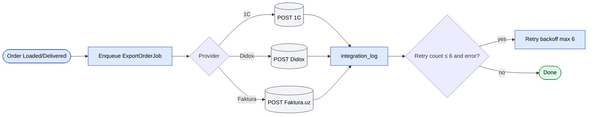
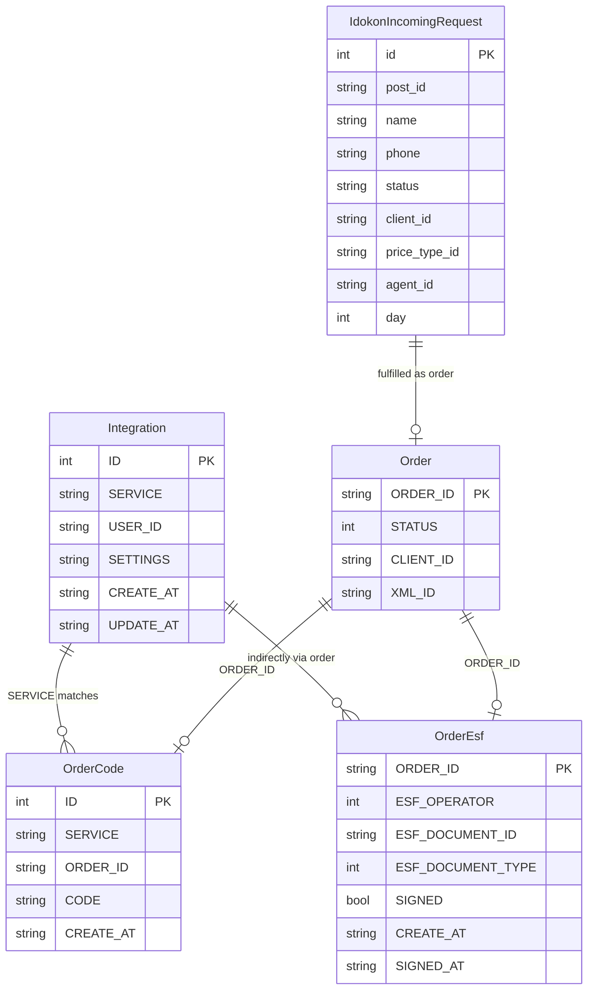
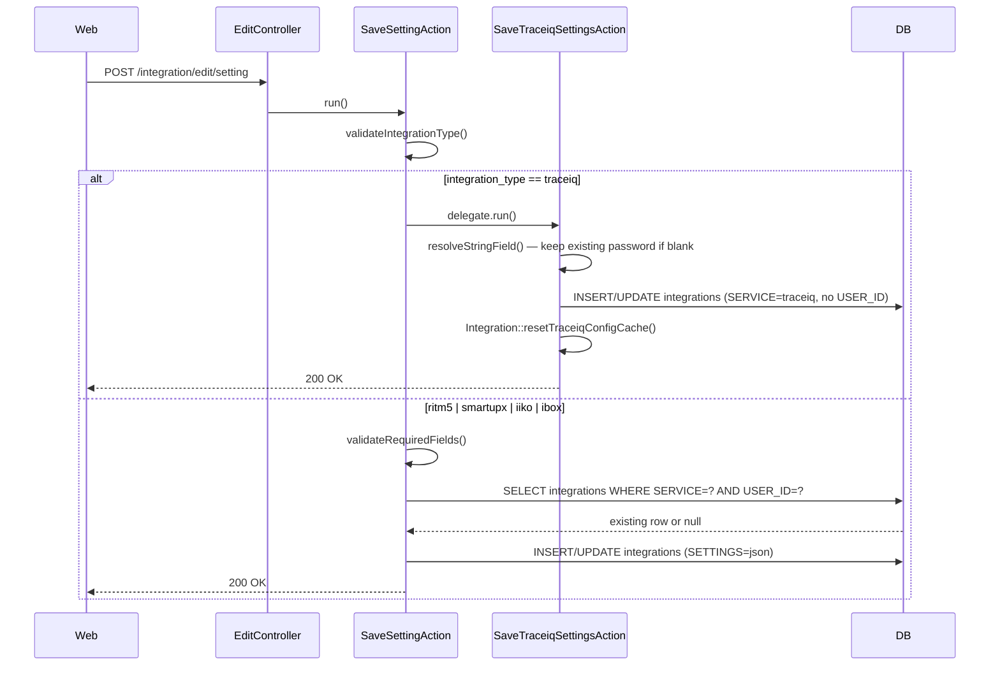
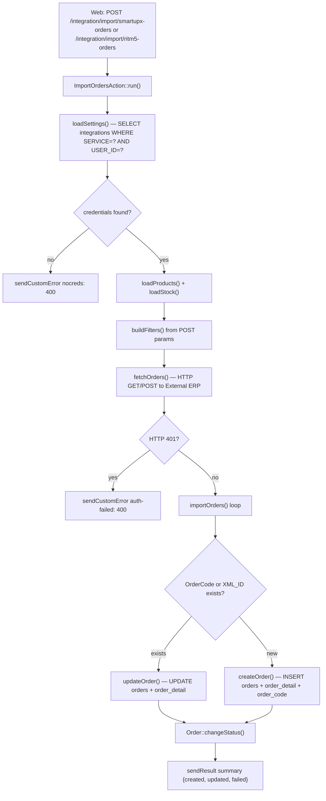
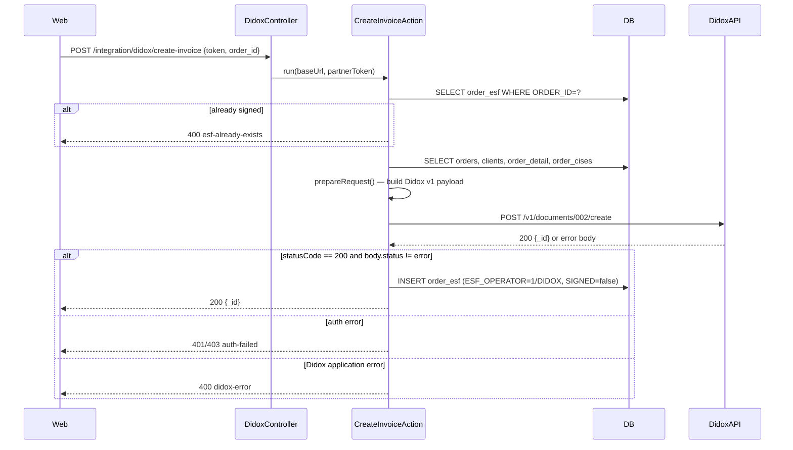
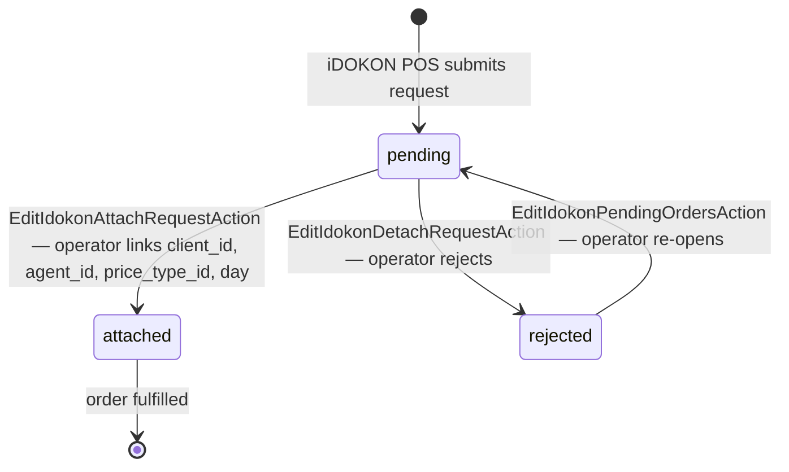

# `integration` moduli

Tashqi tizimlar bilan tashqi + ichki integratsiyalar markazi. Har bir integratsiyaning o'z kontrolleri bor; ulashilgan mantiq `protected/components/` da joylashgan.

## Asosiy xususiyatlar

| Xususiyat | Nima qiladi | Egasi rol(lar) |
|---------|--------------|---------------|
| 1C buyurtma eksporti | Har bir buyurtma sarlavhasi + satrlarni 1C ga yuborish | tizim |
| 1C katalog importi | 1C dan mahsulot / kategoriya / narx o'zgarishlarini olish | tizim |
| Didox e-faktura | Buyurtma Loaded / Delivered bo'lganda imzolangan e-fakturalarni yuborish | tizim |
| Faktura.uz | Davlat tomonidan majbur QQS e-fakturalari | tizim |
| Smartup importi | Smartup ERP'dan ichki buyurtmalar | tizim |
| TraceIQ | Ichki trace voqealari | tizim |
| Umumiy CSV / XML import / eksport | Ad-hoc o'tkazma | 1 / Ops |
| Integratsiya log UI | Muvaffaqiyatsiz job'larni ko'rish / filtrlash / qayta ishga tushirish | 1 / Ops |
| Tenant bo'yicha konfiguratsiya | Har bir tenant o'z ma'lumotlarini sozlaydi | 1 |

## Kontrollerlar

| Kontroller | Tashqi tizim |
|------------|-----------------|
| `DidoxController` | Didox (EDI) |
| `FakturaController` | Faktura.uz (e-faktura, EIMZO) |
| `TraceiqController` | Trace IQ |
| `ImportController` / `ExportController` | Umumiy 1C / CSV / XML |
| `ListController`, `EditController`, `GetController` | Integratsiya job'lari uchun admin UI |

## Qanday ishlaydi

- **Tashqi (Outbound)**: buyurtma EDI yuborishni qo'zg'atadigan statusga yetganda job navbatga qo'yiladi (masalan, `ExportInvoiceJob`). Job tashqi API'ni chaqiradi, mahalliy hujjatni javob ma'lumotlari bilan yangilaydi va `IntegrationLog` ga yozadi.
- **Ichki (Inbound)**: rejalashtirilgan poll job'lar yangilanishlarni oladi (masalan, 1C dan narx kataloglari) va mahalliy jadvallarga upsert qiladi.

## Asosiy xususiyat oqimi — Buyurtma eksporti

[FigJam · sd-main · Feature Flows](https://www.figma.com/board/MyvyaeEluqvHofH4E2qIoU) ichida **Feature · Order Export to 1C / Faktura.uz** ga qarang.

## Xatoliklarni boshqarish

- Eksponensial backoff bilan job bo'yicha qayta urinish (maks 6 qayta urinish).
- 6 ta muvaffaqiyatsizlikdan keyin `adminEmail` ga ogohlantirish yuboriladi.
- `IntegrationLog` qatori qo'lda qayta-ishga tushirilgunga qadar `ERROR` da qoladi.

## Batafsil protokol-darajasidagi hujjatlar

- [1C / Esale](../integrations/1c-esale.md)
- [Didox](../integrations/didox.md)
- [Faktura.uz](../integrations/faktura-uz.md)
- [Smartup](../integrations/smartup.md)

## Workflow'lar

### Kirish nuqtalari

| Trigger | Controller / Action / Job | Izohlar |
|---|---|---|
| Web (POST) | `EditController::setting` → `SaveSettingAction` | ritm5 / smartupx / iiko / ibox uchun foydalanuvchi bo'yicha ma'lumotlarni saqlash |
| Web (GET) | `GetController::setting` → `GetSettingAction` | Ma'lumotlarni o'qish; TraceIQ uchun `GetTraceiqSettingsAction` ga delegatsiya qiladi (faqat admin) |
| Web (POST) | `EditController::setting` → `SaveSettingAction` → `SaveTraceiqSettingsAction` | Filial-bo'yicha TraceIQ konfiguratsiyasini saqlash (faqat admin) |
| Web (POST) | `ImportController::smartupx-orders` → `ImportOrdersAction` (smartupx) | Operator tomonidan qo'zg'atilgan Smartup'dan buyurtmalarni olish |
| Web (POST) | `ImportController::ritm5-orders` → `ImportOrdersAction` (ritm5) | Operator tomonidan qo'zg'atilgan Ritm 5'dan buyurtmalarni olish |
| Web (POST) | `TraceiqController::export-orders` → `TraceiqExportOrdersAction` | Tanlangan buyurtma ID'larini TraceIQ ga yuborish |
| Web (POST) | `DidoxController::create-invoice` → `CreateInvoiceAction` | Buyurtma uchun Didox da e-faktura yaratish |
| Web (GET/POST) | `TraceiqController::actionGetPurchases` | Proksi poll: TraceIQ dan kelishlarni olish |
| Web (POST) | `EditController::idokon-attach-request` → `EditIdokonAttachRequestAction` | iDOKON kiruvchi so'rovini mahalliy mijozga biriktirish |
| Web (GET) | `ListController::idokon-incoming-requests` → `ListIdokonIncomingRequestsAction` | Kutilayotgan iDOKON POS ro'yxatdan o'tish so'rovlarini ro'yxatlash |

---

### Soha entitylari

---

### Workflow 1.1 — Integratsiya ma'lumotlarini sozlash (foydalanuvchi bo'yicha va filial bo'yicha)

Operatorlar har bir vendor uchun ma'lumotlarni bir marta sozlaydi. Foydalanuvchi bo'yicha yozuvlar ritm5, smartupx, iiko va ibox ni qamrab oladi; TraceIQ yagona filial-bo'yicha qatorni ishlatadi va admin bilan cheklangan. Runtime'da sozlamalarni o'qish bir xil `Integration::getTraceiqConfig()` yordamchi'siga delegatsiya qiladi, u DB qiymatlarini eski `params['traceiq']` zaxiralari ustida birlashtiradi.

---

### Workflow 1.2 — Tashqi ERP'dan ichki buyurtma olish (Smartup / Ritm 5)

Operator uchinchi tomon ERP'ga qarshi sana oralig'i pull'ini ishga tushiradi. Action `integrations` dan saqlangan ma'lumotlarni yuklaydi, tashqi API'ni chaqiradi, so'ng `XML_ID` (Ritm 5) yoki `OrderCode` (Smartup) ni idempotensiya kalitlari sifatida ishlatib `Order` + `OrderDetail` qatorlarini upsert qiladi. Vendor bo'yicha autentifikatsiya va endpoint URL'lari farq qiladi; umumiy upsert mantig'i bir xil.

---

### Workflow 1.3 — Didox ga tashqi e-faktura yuborish

Foydalanuvchi yetkazib berilgan buyurtma uchun e-faktura yaratishni boshlaydi. `CreateInvoiceAction` `orders`, `order_detail`, `order_cises` va `diler` (sotuvchi) ma'lumotlaridan to'liq Didox v1 hujjat payloadini quradi, uni Didox partner API'ga post qiladi va qaytarilgan hujjat ID'sini `order_esf` da saqlaydi. Imzolash keyingi qadamda sodir bo'ladi, [Didox](../integrations/didox.md) da yoritilgan.

---

### Workflow 1.4 — Ichki POS ro'yxatdan o'tish so'rovi hayot davri (iDOKON)

iDOKON POS terminallari yangi-mijoz ro'yxatdan o'tish so'rovlarini yuboradi, ular `idokon_incoming_request` ga `status=pending` bilan tushadi. Operator ro'yxatni ko'rib chiqadi, mahalliy `Client` + `Agent` + `PriceType` ni biriktiradi va so'rov `attached` ga o'tadi. Agar operator uni rad etsa, status `rejected` bo'ladi.

---

### Modullar aro tutash nuqtalari

- O'qiydi: `orders.Order` (import yoki eksport qilishda PK / XML_ID / OrderCode bo'yicha topish)
- O'qiydi: `orders.OrderDetail`, `orders.BonusOrderDetail` (TraceIQ va Didox payloadlari uchun satr elementlari)
- O'qiydi: `orders.OrderCises` (Didox e-fakturasi uchun belgilash kodlari)
- Yozadi: `orders.Order`, `orders.OrderDetail` (Ritm 5 / Smartup importi davomida upsert)
- Yozadi: `orders.OrderCode` (tashqi deal ID ni mahalliy buyurtmaga bog'laydigan idempotensiya kaliti)
- Yozadi: `orders.OrderEsf` (push'dan keyingi Didox / Faktura hujjat ID)
- O'qiydi: `clients.Client`, `agents.Agent`, `warehouse.Store` (ichki buyurtma importi davomida aniqlanadi)
- O'qiydi: `diler` (har bir e-faktura payloadida ishlatiladigan sotuvchi STIR / bank maydonlari)
- API'lar: hech qanday tashqi taqdim etilmagan; barcha chaqiruvlar mijoz-server yoki server-tashqi

### Tuzoqlar

- **`Integration` `BaseFilial` ga ko'lamlangan**: `integrations` jadvali filial bo'yicha. `USER_ID` ko'pchilik qatorlarni bitta operatorga torroq qiladi. TraceIQ istisno — uning `USER_ID` yo'q va `getTraceiqConfig()` ni ishlatadi, u DB _va_ `params['traceiq']` (eski zaxira) dan birlashtiradi. TraceIQ sozlamalarini saqlagandan keyin har doim `Integration::resetTraceiqConfigCache()` ni chaqiring, aks holda so'rov ichidagi keshda eski ma'lumotlar qaytadi.
- **Smartup uchun `OrderCode` va `XML_ID`**: Smartup importi dastlab tashqi deal kalitini `Order.XML_ID` da saqlardi. Bu `order_code` join jadvali bilan almashtirildi. Ikkala qidiruv yo'li ham orqaga moslik uchun jonli — `ImportOrdersAction` (smartupx) dagi `@deprecated` izohga qarang.
- **TraceIQ paroli faqat-yozish**: `GetTraceiqSettingsAction` parolni hech qachon brauzerga qaytarmaydi — u faqat `password_set: true/false` ni qaytaradi. Frontend formalari qayta-ochishda parol maydonini bo'sh qoldirishi kerak; `SaveTraceiqSettingsAction::resolveStringField()` bo'sh kiruvchi parolni "mavjudni saqla" deb hisoblaydi.
- **Didox `baseUrl` produksiyada o'zgaradi**: `DidoxController::init()` `stage.goodsign.biz` dan `api-partners.didox.uz` ga faqat `ServerSettings::countryCode() === 'UZ'` _va_ host `.salesdoc.io` bilan tugashi sharti bilan o'tadi. Dev/staging muhitlari har doim stage endpointiga uradi.
- **Bu modulda async qayta urinish navbati yo'q**: modul umumiy ko'rinishi sahifasida tilga olingan `IntegrationLog` bu papkadagi model sinfiga to'g'ri kelmaydi. Integratsiya moduli sinxron HTTP chaqiruvlarini amalga oshiradi va xatolarni to'g'ridan-to'g'ri chaqiruvchiga qaytaradi. Muvaffaqiyatsizlikda qayta urinish UI ga (foydalanuvchi qayta-ishga tushiradi) tegishli. Didox/Faktura `check-invoice` va `sync-incoming-invoices` action'lari cron job orqali emas, qo'lda poll qilinadi — protokol-darajasidagi tafsilot uchun [Didox](../integrations/didox.md) va [Faktura.uz](../integrations/faktura-uz.md) ga qarang.
- **Smartup `create_clients` / `create_products` bayroqlari**: saqlangan sozlamalarda yoqilganida, `ImportOrdersAction` (smartupx) birinchi importda `Client` yoki `Product` qatorlarini avto-yaratadi. Bu noto'g'ri sozlanganida sizning katalogingizni Smartup yozuvlari bilan jim ravishda urug'lashi mumkin — yoqishdan oldin `category_id` va `city_id` ni tasdiqlang.
